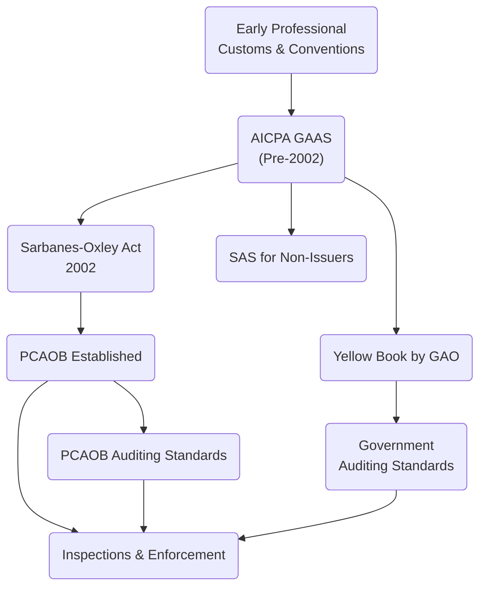

## 1.2 Evolution of Auditing Standards (AICPA, PCAOB, GAO)

Auditing standards serve as the foundation for conducting independent, high-quality audits. Over time, these standards have evolved to address emerging complexities in financial reporting, regulatory reforms, and changes in technology and market practices. In the United States, the three main bodies responsible for setting and guiding auditing standards are the American Institute of Certified Public Accountants (AICPA), the Public Company Accounting Oversight Board (PCAOB), and the Government Accountability Office (GAO). Their collective influence shapes the modern audit landscape, ensuring public trust and transparency for businesses, government entities, and not-for-profit organizations.

This section provides a comprehensive overview of how auditing standards have evolved, with a special focus on the roles of the AICPA, PCAOB, and GAO. We will also briefly explore the impact of international auditing norms (e.g., International Standards on Auditing) and how they compare or align with U.S.-based standards.

---

## 1.2.1 Early Roots of Auditing Standards

In the early days of auditing, auditing practices were largely developed through professional customs and guidelines agreed upon by practitioners. These informal conventions helped establish basic principles for examining financial records, verifying transactions, and ensuring the reliability of financial statements. As businesses grew more complex, the need for formal frameworks and standardized guidelines became increasingly evident, setting the stage for official auditing standards in the United States.

---

## 1.2.2 The AICPA’s Role and Generally Accepted Auditing Standards (GAAS)

The American Institute of Certified Public Accountants (AICPA) has been instrumental in crafting the bedrock of modern auditing standards in the U.S. Historically, the AICPA was responsible for developing what became known as Generally Accepted Auditing Standards (GAAS). These standards outlined the fundamental requirements for planning an audit, gathering sufficient evidence, and issuing an appropriate audit opinion.

### 1.2.2.1 Statements on Auditing Standards (SAS)
• The AICPA publishes Statements on Auditing Standards (SAS), which elaborate on GAAS requirements and guide CPAs in applying these standards effectively.  
• SAS interpret or clarify various auditing topics, including risk assessment, internal control assessment, audit documentation, and the evaluation of audit evidence.  
• While the PCAOB now oversees audits of public companies (issuers), the AICPA continues to issue SAS primarily for audits of non-issuers (i.e., private companies, not-for-profit organizations that do not fall under the PCAOB’s jurisdiction).  

### 1.2.2.2 The AICPA’s Code of Professional Conduct
• Beyond technical guidance, the AICPA also maintains the Code of Professional Conduct, which sets ethical principles such as independence, objectivity, integrity, and professional skepticism.  
• This code underpins the everyday work of CPAs, ensuring that their conduct and decision-making uphold the profession’s reputation and protect public interests.  

---

## 1.2.3 The Formation of the PCAOB

In response to high-profile corporate scandals (e.g., Enron and WorldCom) in the early 2000s, the U.S. Congress enacted the Sarbanes-Oxley Act of 2002 (SOX). SOX significantly restructured the oversight of public company audits by establishing the Public Company Accounting Oversight Board (PCAOB), a nonprofit corporation overseen by the Securities and Exchange Commission (SEC).

### 1.2.3.1 PCAOB’s Authority and Mission
• The PCAOB’s primary mission is to protect investors and further the public interest by overseeing the audits of public companies and broker-dealers.  
• It has the authority to set auditing and related professional practice standards for registered public accounting firms that audit issuers in the U.S. capital markets.  
• The PCAOB conducts regular inspections of registered audit firms to ensure compliance with its standards and can impose disciplinary measures for violations.  

### 1.2.3.2 PCAOB Auditing Standards
• PCAOB auditing standards build upon, but also differ in certain respects from, the older AICPA standards—particularly to account for the unique complexities and higher stakes of auditing public companies.  
• These standards were initially adapted from the AICPA’s GAAS but now evolve through PCAOB rulemaking and comment processes, ensuring ongoing refinements.  
• Key areas of PCAOB standards often emphasize risk assessment, internal controls (including integrated audits), auditor independence, and the importance of professional skepticism.  

---

## 1.2.4 GAO and Government Auditing Standards (Yellow Book)

The Government Accountability Office (GAO) plays a pivotal role in setting auditing standards for government entities at the federal, state, and local levels, as well as for not-for-profit organizations receiving federal funds. The GAO issues Government Auditing Standards (often referred to as the “Yellow Book”), which govern the unique auditing requirements for governmental programs and public-sector accountability.

### 1.2.4.1 Scope and Purpose of the Yellow Book
• The Yellow Book outlines the ethical principles, general standards, and fieldwork and reporting standards for audits of government organizations, programs, and activities.  
• It is designed to help auditors provide unbiased, transparent, and high-quality evaluations of government operations, promoting efficiency and accountability in the use of public resources.  

### 1.2.4.2 Differences from GAAS and PCAOB Standards
• While many underlying concepts are the same (e.g., independence and objectivity), Government Auditing Standards include additional considerations, such as compliance with laws, regulations, and provisions of government contracts or grant agreements.  
• Auditors adhering to the Yellow Book may need to expand their scope to evaluate program effectiveness, economy, and efficiency—tasks not typically central to audits of private or public companies.  

---

## 1.2.5 International Influences: ISA and Convergence

Although the CPA Exam primarily focuses on U.S. auditing standards, the rise of global capital markets has led to increased attention on International Standards on Auditing (ISAs), issued by the International Auditing and Assurance Standards Board (IAASB). While the AICPA has made efforts to converge certain aspects of its standards with ISAs, the PCAOB maintains its own separate rules tailored to public company audits in the U.S.

• Many nations adopt or closely align with ISAs, creating a certain level of cross-border consistency.  
• U.S. standards are highly influenced by U.S. legislative and regulatory frameworks, including the SEC, PCAOB, and the overarching environment established by the Sarbanes-Oxley Act.

---

## 1.2.6 From Checklists to Risk-Based Audits

The profession has transitioned from a heavily checklist-driven model to a more risk-based auditing approach. Rather than mechanically following a prescriptive checklist of procedures, modern auditors tailor their strategies to specific client environments, focusing on high-risk areas that are prone to material misstatement or fraud.

### 1.2.6.1 Drivers of Risk-Based Auditing
• Regulatory pressures related to scandal prevention and investor protection have increased the emphasis on uncovering fraud and material misstatements.  
• Technological advances, such as data analytics and automation, enable auditors to analyze vast amounts of information, focusing their efforts on identifying anomalies and high-risk areas.  
• Evolving standard-setting bodies have incorporated risk-based auditing principles into updated auditing standards, thereby shaping contemporary audit practice.  

### 1.2.6.2 Benefits of Risk-Based Auditing
• Greater efficiency, as procedures are aligned with the highest priority risks.  
• Enhanced effectiveness in detecting material misstatements and fraud.  
• Improved allocation of engagement resources and expertise to areas that truly warrant auditor attention.

---

## 1.2.7 Visual Overview of the Evolution of U.S. Auditing Standards

Below is a simple Mermaid diagram illustrating the key milestones and interactions among standard-setting bodies:

• A (Early Professional Customs & Conventions) → B (AICPA GAAS) – The initial foundation of standards came from professional practices.  
• B (AICPA GAAS) → C (Sarbanes-Oxley Act 2002) → D (PCAOB Established) – Major shift for audits of public companies.  
• B (AICPA GAAS) → E (Yellow Book by GAO) – Parallel track for government audits.  
• D (PCAOB) → F (PCAOB Auditing Standards) and E (GAO) → G (Government Auditing Standards) – Distinct sets of standards for public and government audits, respectively.  
• H (SAS for Non-Issuers) and I (Inspections & Enforcement) – Ongoing oversight and updates.

---

## 1.2.8 Key Takeaways and Future Developments

• The AICPA traditionally sets standards for audits of private companies (non-issuers) through its SAS and GAAS framework.  
• The PCAOB, formed under the Sarbanes-Oxley Act, governs audits of public companies (issuers) and enforces compliance through inspections and potential disciplinary actions.  
• The GAO issues the Yellow Book, focusing on audits of government entities and programs, emphasizing accountability, compliance, and performance.  
• International convergence efforts reflect the increasingly global nature of business and finance, although U.S. auditing standards maintain unique elements driven by domestic regulations.  
• The modern trend moves toward risk-based audits, leveraging technology and focusing resources on areas most likely to contain material misstatements or fraud.

Looking ahead, expect continued evolution as technology dynamically reshapes the audit process and as standard-setters react to emerging issues such as cryptocurrency, sustainability reporting (e.g., ESG audits), and data privacy requirements.

---

## 1.2.9 Glossary of Key Terms

• **AICPA:** The national professional organization of CPAs in the United States, historically responsible for developing GAAS and issuing SAS for private company audits.  
• **PCAOB:** Created by the Sarbanes-Oxley Act and overseen by the SEC. Sets and enforces standards for auditing public companies in the U.S.  
• **GAO:** Government Accountability Office, an independent agency issuing “Yellow Book” standards for government and not-for-profit audits.  
• **GAAS (Generally Accepted Auditing Standards):** The foundational auditing standards historically set by the AICPA.  
• **SAS (Statements on Auditing Standards):** Official interpretive publications that provide detailed guidance on applying GAAS to specific audit areas.  
• **ISA (International Standards on Auditing):** Issued by the IAASB under IFAC; some U.S. standards are converging with ISAs, but U.S. rules remain distinct in key areas.  

---

## Additional References for Further Exploration

• [PCAOB Website](https://pcaobus.org) – Stay updated on emerging PCAOB standards and inspection reports.  
• [GAO Government Auditing Standards (“Yellow Book”)](https://www.gao.gov/yellowbook) – Access the latest revision and guidance on government audits.  
• “Wiley CPAexcel Exam Review Study Guide – Auditing” – Offers a holistic discussion of the AICPA, PCAOB, and GAO audit requirements.  
• [AICPA Insight: Evolution of US Auditing Standards](https://www.aicpa.org/) – Historical context and articles on auditing standards changes.  
• “Government Auditing Standards – 2018 Revision” – Official GAO publication available on the GAO website.

---

## Quiz on the Evolution of Auditing Standards: AICPA, PCAOB, and GAO



### Which organization historically developed GAAS for private company audits in the United States?

- [x] The AICPA
- [ ] The PCAOB
- [ ] The GAO
- [ ] The FASB

> **Explanation:** The American Institute of Certified Public Accountants (AICPA) was historically responsible for developing Generally Accepted Auditing Standards (GAAS) for audits of non-issuers (private companies).

### Under the Sarbanes-Oxley Act of 2002, the Public Company Accounting Oversight Board (PCAOB) was established primarily to:

- [x] Oversee the audits of public companies and registered audit firms.
- [ ] Conduct the audits of all public companies directly.
- [ ] Set tax policy in conjunction with the IRS.
- [ ] Replace the AICPA in all aspects of audit standard-setting.

> **Explanation:** The Sarbanes-Oxley Act created the PCAOB to oversee public company audits, register auditors, inspect auditing firms, and enforce compliance with its standards.  

### Which document sets the standards and requirements for audits of government programs, agencies, and grants?

- [ ] GAAS
- [ ] PCAOB AS
- [x] The Yellow Book
- [ ] IRS Publ. 17

> **Explanation:** The Yellow Book, issued by the Government Accountability Office (GAO), governs audits of governmental and not-for-profit organizations that receive government funds.

### Which key scandal(s) prompted the enactment of the Sarbanes-Oxley Act and the formation of the PCAOB?

- [x] Corporate fraud at companies such as Enron and WorldCom
- [ ] The 1929 Stock Market Crash
- [ ] Cybersecurity breaches in technology companies
- [ ] Widespread bank failures during the Financial Crisis of 2008

> **Explanation:** In the early 2000s, high-profile frauds at Enron, WorldCom, and others spurred the enactment of the Sarbanes-Oxley Act, which led to the establishment of the PCAOB.

### Which body of standards primarily focuses on ensuring accountability and transparency in government entities?

- [x] Government Auditing Standards (Yellow Book)
- [ ] IFRS Standards
- [x] AICPA SAS
- [ ] FASB ASC

> **Explanation:** Government Auditing Standards (the Yellow Book) issued by the GAO focus on audits of federal, state, and local governmental entities as well as not-for-profits receiving government funding. AICPA SAS apply to non-issuers, but remain separate from the Yellow Book.

### Risk-based auditing differs from a checklist-based approach by:

- [x] Concentrating resources on identified high-risk areas.
- [ ] Following a fixed sequence of pre-determined tasks.
- [ ] Ignoring financial statements entirely.
- [ ] Preventing all instances of fraud completely.

> **Explanation:** A risk-based audit tailors procedures to specific areas of higher risk of material misstatement or fraud, as opposed to applying a standard checklist to every audit engagement.

### What is one way that the PCAOB differs from the AICPA?

- [x] The PCAOB enforces public company audit standards and conducts inspections of registered firms.
- [ ] The PCAOB oversees private companies and sets IFRS rules.
- [x] The AICPA writes tax regulations for the IRS.
- [ ] They do not differ; both cover public and private entities.

> **Explanation:** The PCAOB focuses on establishing and enforcing auditing standards for public companies (issuers), including conducting inspections and disciplinary actions. The AICPA historically focuses on non-issuers and issues SAS for private company audits.

### Which of the following is a significant driver of risk-based auditing?

- [x] The need to efficiently identify areas prone to material misstatements or fraud.
- [ ] The desire to perform every possible audit procedure on every account.
- [ ] Reduced use of technology in modern audits.
- [ ] Avoiding discussions with management during the planning stage.

> **Explanation:** Risk-based auditing aims to maximize efficiency by targeting areas with the highest risk of misstatement or fraud, often leveraging advanced data analytics and a deeper understanding of the client’s environment.

### According to GAAS, what must auditors ensure when performing an audit of a private company?

- [x] They obtain sufficient, appropriate evidence to form a reasonable basis for an opinion.
- [ ] They eliminate all fraud through 100% testing of every transaction.
- [ ] They only rely on management’s representations without further corroboration.
- [ ] They conduct an integrated audit of internal control over financial reporting in all cases.

> **Explanation:** One of the core principles under GAAS is that the auditor must obtain sufficient and appropriate evidence to provide reasonable assurance that the financial statements are free of material misstatement.

### The Government Accountability Office (GAO) primarily sets standards for:

- [x] Federal, state, and local government audits and related programs.
- [ ] Public and broker-dealer audits.
- [ ] IFRS implementation in Europe.
- [ ] Tax policy for the IRS.

> **Explanation:** The GAO issues the Yellow Book, focusing on auditing government agencies and entities receiving government funds.



---

## For Additional Practice and Deeper Preparation

**[Auditing & Attestation CPA Mock Exams (AUD): Comprehensive Prep](https://www.udemy.com/course/aud-cpa-mock-exams/?referralCode=D064EF7BD4A84FC6403D)**  
• Tackle full-length mock exams designed to mirror real AUD questions—from risk assessment and ethics to internal control and substantive procedures.  
• Refine your exam-day strategies with detailed, step-by-step solutions for every scenario.  
• Explore in-depth rationales that reinforce understanding of higher-level concepts, giving you a decisive edge on test day.  
• Boost confidence and reduce exam anxiety by building mastery of the wide-ranging AUD blueprint.

_Disclaimer: This course is not endorsed by or affiliated with the AICPA, NASBA, or any official CPA Examination authority. All content is created solely for educational and preparatory purposes._
