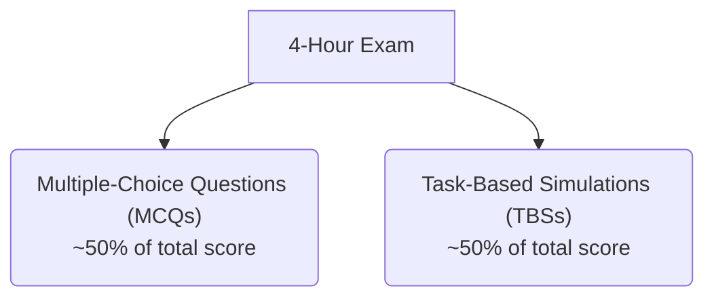

## 1.3 CPA Exam Overview: AUD Section Content and Format

The Auditing and Attestation (AUD) section of the Uniform CPA Examination places you in the shoes of an external auditor, testing both your theoretical knowledge of auditing standards and your ability to apply that knowledge in practical, real-world scenarios. Mastery of this section requires a deep understanding of ethical principles, risk assessment methodologies, internal control evaluations, key audit procedures, and reporting frameworks. In this chapter, we provide a thorough breakdown of the AUD Exam’s structure, content areas, question formats, time allocation, and scoring model.

---

### The Focus of the AUD Section

While auditing involves a breadth of technical and conceptual knowledge, the AUD section distills core competencies every aspiring CPA must demonstrate:

• Ethics and Professional Responsibilities  
• Understanding of Risk Assessment and Internal Controls  
• Performing Audit Procedures and Gathering Sufficient Appropriate Evidence  
• Forming Conclusions and Preparing Audit Reports  

In essence, AUD tests your capacity to think like an auditor—spotting potential areas of material misstatement, adapting your audit approach based on assessed risks, and concluding with professional skepticism and sound judgment.

---

### Core Areas of Knowledge

The content tested in the AUD section reflects the entire lifecycle of an audit engagement, from planning and executing to final shipment of the audit report. Below is a generalized overview:

1. Ethics, Professional Responsibilities, and General Principles  
   • AICPA Code of Professional Conduct and independence requirements.  
   • Professional judgment, skepticism, and responsibilities to the public and profession.  
2. Assessing Risk and Developing a Planned Response  
   • Understanding the client’s business environment, industry, and internal controls.  
   • Evaluating inherent risks and fraud risks, including the fraud triangle concept.  
3. Performing Further Procedures and Obtaining Evidence  
   • Tests of controls, substantive testing of account balances and transactions.  
   • Use of data analytics, sampling techniques, and other substantive procedures.  
4. Forming Conclusions and Reporting  
   • Audit report categories: unmodified/unqualified, qualified, adverse, or disclaimer.  
   • Reporting on other engagements (reviews, compilations, preparations, etc.).  

---

### Exam Structure and Format

The AUD section is a four-hour exam typically composed of:

• Multiple-Choice Questions (MCQs): A series of objective questions evaluating recall, comprehension, application, and occasionally basic analysis skills.  
• Task-Based Simulations (TBSs): Scenario-driven questions that require higher-order thinking, such as reviewing an internal control matrix or preparing an audit memo. TBSs test application, analysis, and problem-solving in a format simulating real-world audit tasks.

Below is a visual representation of the relative weighting and flow of the AUD Exam:

• Time Allotment: Although the exam is sectioned into testlets, you have 4 hours in total. You can manage this time across MCQs and TBSs in whichever way suits your test-taking strategy.  

• Order of Testlets: Typically, you will see blocks (testlets) of MCQs followed by TBSs. Once you progress from one testlet to the next, you cannot go back.

---

### Content Weighting

The American Institute of Certified Public Accountants (AICPA) periodically publishes the CPA Exam Blueprint, which outlines the precise content weighting for each area. Per the most recent guidelines, the AUD section content weighting is approximately:

- Ethics, Professional Responsibilities, and General Principles: 15–25%  
- Assessing Risk and Developing a Planned Response: 25–35%  
- Performing Further Procedures and Obtaining Evidence: 30–40%  
- Forming Conclusions and Reporting: 10–20%  

These ranges highlight critical areas for exam preparation. For instance, heavy emphasis on “Performing Further Procedures” suggests that practical application of audit procedures merits extra attention in your study plan.

---

### Scoring and Skill Levels

• Scoring: Your total AUD score is computed as an even split between MCQs and TBSs. Thus, it is crucial to perform well on both question types to pass this section.  
• Skill Levels: Beyond recall (memorizing auditing standards), the AUD section tests application (applying those standards in different scenarios) and analysis (detecting relationships, drawing inferences, and arriving at professional judgments).  

To excel, you should:

1. Understand definitions, rules, and standards.  
2. Know how to apply professional guidance in typical auditing situations.  
3. Demonstrate analytical thinking—assessing situation-based questions that mirror genuine audit decision points.

---

### Periodic Updates to the CPA Exam

Because the auditing profession evolves to reflect new standards and technologies, the AICPA regularly updates the exam blueprint. The following emerging trends are often integrated into the AUD curriculum:

• Data Analytics: Tools and techniques for analyzing large datasets, uncovering anomalies, and informing risk assessments.  
• Cybersecurity Risks: Awareness of IT general controls and the auditor’s responsibilities in safeguarding sensitive data.  
• Sustainability/ESG Reporting: Growing emphasis on Environmental, Social, and Governance (ESG) disclosures and assurance.  

Staying current through AICPA’s official releases and recognized continuing education providers helps ensure that your study materials match the latest blueprint requirements.

---

### Exam Preparation Strategies

1. Know the Blueprint: Regularly consult the official [AICPA CPA Exam Overview](https://www.aicpa.org/becomeacpa/cpaexam) and [NASBA Candidate Bulletin](https://nasba.org/exams/the-cpa-exam/candidate-bulletin/) to confirm any changes to the exam topics.  
2. Use Structured Review Materials: Becker, Gleim, and Wiley CPA Review courses offer practice questions and simulations that mirror the exam format.  
3. Target Weak Areas: If you struggle with evaluating internal controls, for example, spend extra time analyzing control frameworks like COSO to bolster your understanding.  
4. Practice Simulations: TBSs can be challenging due to their multi-layered scenarios. Develop comfort with analyzing case studies, extracting relevant data, and drafting valid conclusions.  
5. Engage with Peer Communities: Online boards—such as the [Reddit CPA Candidates forum](https://www.reddit.com/r/CPA/)—can be a source of peer support, study tips, and motivational advice.

---

### Practical Examples and Illustrations

Below are a few scenarios that highlight the kinds of tasks AUD candidates must handle:

• MCQ Example: “An auditor is assessing whether sales are recorded in the correct period. Which primary assertion is most relevant?” – This tests your knowledge of the cutoff assertion.  
• TBS Example: You are given an internal control description for revenue transactions and told that recent changes to credit policy might result in increased receivable risk. You must identify potential control weaknesses and recommend appropriate audit procedures.  

Being familiar with these question styles ensures you can approach the actual exam both efficiently and effectively.

---

### Conclusion and Forward Strategy

The AUD section of the CPA Exam demands a balance of conceptual knowledge, practical auditing skill, and keen analytical capabilities. By carefully examining the exam’s structure, MCQ and TBS formats, and the periodically updated content areas, you set the stage for a focused, productive study plan. Leveraging high-quality review courses, staying informed on professional standards, and actively engaging in peer discussions can greatly accelerate your readiness and confidence.

---

## Assess Your Knowledge: AUD Exam Structure & Content Quiz



### Which of the following BEST describes the primary purpose of the AUD section in the CPA Exam?
- [ ] Testing advanced managerial accounting concepts.
- [ ] Assessing tax computation and related regulations.
- [x] Evaluating the candidate’s knowledge and skills in the auditing profession.
- [ ] Measuring a candidate’s emotional intelligence during engagement planning.

> **Explanation:** The AUD section is designed to measure your proficiency in auditing and attestation, from ethics and planning to evidence-gathering and reporting.

### Which statement is MOST accurate about task-based simulations (TBSs)?
- [x] TBSs present real-world scenarios where you apply auditing concepts.
- [ ] TBSs exclusively test remembering and reciting auditing standards.
- [ ] TBSs focus on essay writing to demonstrate analytical thinking.
- [ ] TBSs are optional practice components not included in the final score.

> **Explanation:** TBSs emulate real-life audit tasks, requiring application of concepts and problem-solving skills. They account for approximately 50% of your AUD section score.

### Approximately how much of the AUD section addresses “Performing Further Procedures and Obtaining Evidence”?
- [ ] 5–10%
- [ ] 10–20%
- [x] 30–40%
- [ ] 40–50%

> **Explanation:** According to the AICPA CPA Exam Blueprint, 30–40% of the AUD content weighting is allocated to performing audit procedures and gathering evidence.

### Why is periodically checking the AICPA’s CPA Exam Blueprint important for candidates?
- [ ] It provides a list of required reading materials not found elsewhere.
- [x] It reflects the most current professional standards and emerging auditing topics.
- [ ] It eliminates the need for formal CPA review courses.
- [ ] It sets the minimum multiple-choice question requirements for each testlet.

> **Explanation:** The CPA Exam Blueprint is updated periodically to incorporate new standards, technology, and best practices, ensuring the exam remains relevant to modern audit environments.

### What is the BEST reason for practicing with TBS-style questions?
- [x] They mimic complex, multi-layered scenarios that require analytical problem-solving.
- [ ] They are an antiquated method for memorizing auditing standards.
- [x] They help develop the ability to extract relevant data from lengthy exhibits.
- [ ] They only deal with theoretical content and no real-world applications.

> **Explanation:** Task-based simulations challenge your ability to apply audit concepts to practical situations, interpret documents, and craft appropriate responses. They test both your analytical thinking and understanding of standards.

### During the AUD section, which assertion is MOST relevant if an auditor is verifying that expenses are recorded in the correct period?
- [x] Cutoff
- [ ] Existence
- [ ] Completeness
- [ ] Accuracy

> **Explanation:** The cutoff assertion ensures that transactions are recorded in the correct accounting period, making it crucial for both revenue and expense recognition.

### Which skill levels are assessed under the AUD section?
- [x] Remembering and understanding
- [x] Application and analysis
- [ ] Speaking and listening skills
- [ ] None of the above

> **Explanation:** The AUD exam tests not only your ability to recall standards and principles but also your capacity to apply them in scenarios and analyze complex audit-related challenges.

### What is a key difference between MCQs and TBSs in the AUD exam?
- [x] MCQs mostly test recall and comprehension, while TBSs focus more on application and analysis.
- [ ] MCQs are open-ended, and TBSs are purely multiple-choice.
- [ ] TBSs always have a single, numeric answer.
- [ ] MCQs must be answered last in every testlet.

> **Explanation:** Multiple-choice questions test your foundational knowledge, while TBSs require you to apply that knowledge in case-based problems, demonstrating higher-level thinking.

### Which of the following best describes “data analytics” in the context of the AUD exam?
- [x] The use of specialized software to analyze large datasets for anomalies and trends.
- [ ] A strategy to study for MCQ-based exams without reading the full explanations.
- [ ] An advanced function reserved only for IT auditors and not part of the AUD exam.
- [ ] A new exam question type that replaces TBSs.

> **Explanation:** Data analytics involves using software and technology for sophisticated examination of financial data to guide audit decisions, a concept increasingly emphasized in modern auditing practice.

### The 4-hour time limit for the AUD section:
- [x] Requires candidates to carefully manage their pace across MCQs and TBSs.
- [ ] Is only a recommendation; candidates can take longer if needed.
- [ ] Applies only to multiple-choice questions.
- [ ] Always includes a 1-hour break that doesn’t count toward the total time.

> **Explanation:** You have 4 hours to complete the entire AUD exam (both MCQs and TBSs). Effective time management is essential to answer all questions without rushing.



---

## For Additional Practice and Deeper Preparation

**[Auditing & Attestation CPA Mock Exams (AUD): Comprehensive Prep](https://www.udemy.com/course/aud-cpa-mock-exams/?referralCode=D064EF7BD4A84FC6403D)**  
• Tackle full-length mock exams designed to mirror real AUD questions—from risk assessment and ethics to internal control and substantive procedures.  
• Refine your exam-day strategies with detailed, step-by-step solutions for every scenario.  
• Explore in-depth rationales that reinforce understanding of higher-level concepts, giving you a decisive edge on test day.  
• Boost confidence and reduce exam anxiety by building mastery of the wide-ranging AUD blueprint.

_Disclaimer: This course is not endorsed by or affiliated with the AICPA, NASBA, or any official CPA Examination authority. All content is created solely for educational and preparatory purposes._
