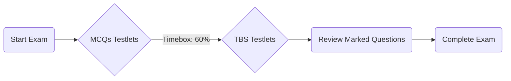

## 1.4 Key Exam Strategies and Study Techniques

Proper preparation for the Auditing and Attestation (AUD) section of the CPA Exam requires a systematic approach to studying. In this chapter, we will explore strategies to help you maximize your time, remain focused, and deepen your knowledge of critical auditing concepts. By mastering proven study techniques, leveraging flashcards and mnemonics, and practicing under exam-like conditions, you can significantly improve your chances of successfully passing the AUD exam.

---

## 1. Time Management

Time management is crucial during the CPA Exam. You will face multiple-choice questions (MCQs) and task-based simulations (TBSs) across five testlets in the AUD section. It is easy to spend too much time on complex questions and lose time for easier ones. Here are key tips:

1. Allocate Time Per Testlet:
   • Plan a time budget for reading MCQs or TBSs, ensuring that you finish each testlet within your chosen target.
   • If you find yourself stuck on a challenging question, mark it for review and move on; come back later if time permits.

2. The 60/40 or 50/50 Approach:
   • Many students split the total exam time, allocating approximately 60% of the time to MCQ testlets and 40% for TBSs (or 50/50).  
   • Adapt these percentages based on your strengths. If TBSs are tougher for you, give them more time.

3. Quick Review Tactics:
   • For MCQs, avoid second-guessing yourself excessively. Read carefully, choose the best possible answer, and move forward.

Below is a visual process flow to highlight a recommended approach to exam pacing:

In this diagram:
• “MCQs Testlets” represent your initial focus.  
• “TBS Testlets” indicate the transition to simulation questions.  
• “Review Marked Questions” suggests using any remaining time to finalize uncertain responses.  

---

## 2. Reading Comprehension

The AUD exam often requires a deep understanding of question stems, scenarios, and provided documentation. Reading carefully can reveal subtle clues regarding GAAS (Generally Accepted Auditing Standards), materiality thresholds, or required audit procedures. With TBSs, you may have to review various attachments (trial balances, memos, client letters) before formulating an answer. 

• Highlight Key Points:  
  Make notes or highlight crucial details in the question, such as specific accounts, transaction dates, or financial statement assertions involved.

• Leverage the Authoritative Literature:  
  Use the authoritative literature if your review course or exam software permits. Searching for relevant AU-C or PCAOB sections can clarify specific requirements.

---

## 3. Practice With Simulations

Task-based simulations (TBSs) are often the most challenging part of the Auditing and Attestation section. They mimic real-world tasks like preparing an audit plan or drafting a management letter. To boost your proficiency:

• Work Through Practice Simulations:  
  – Use a reputable CPA review program that offers full-length simulations mirroring the exam format.  
  – Familiarize yourself with different types of tasks, such as research-based TBSs requiring quick and accurate reference to authoritative literature.

• Organize Your Approach:  
  – Read the main scenario thoroughly.  
  – Open and review all attachments, including memos, client communications, or trial balances.  
  – Identify which pieces of data relate to the instructions or question requirements.

• Cross-Referencing:  
  – Note relevant authoritative sections for quick reference (e.g., AU-C 315 for understanding entity and environment, AU-C 260 for communication with those charged with governance, etc.).

---

## 4. Learn the Language of Auditing

The auditing field has a unique vocabulary. The exam expects familiarity with terms encountered in auditing standards, textbooks, and practice. Examples:

• “Vouching” vs. “Tracing”:  
  – Vouching typically moves from the financial statements back to source documents to test for existence or occurrence.  
  – Tracing moves from source documents forward to the financial statements to test for completeness.

• “Correlation,” “Assertions,” “Reasonable Assurance,” “Analytical Procedures,” and more:  
  – Understanding these terms and their practical applications can be the difference between choosing a correct or incorrect answer on a nuanced MCQ.

---

## 5. Flashcards and Mnemonics

When memorizing long lists or standard procedures, mnemonics and flashcards are great learning aids. Examples:

• Mnemonic for the Components of Internal Control (Using COSO Framework):  
  – CRIME = Control Activities, Risk Assessment, Information and Communication, Monitoring, and Control Environment.

• Mnemonic for Standard UNMODIFIED Audit Report Elements:  
  – Some students remember a phrase or acronym that guides them through all required paragraphs and statements within a report.

Create flashcards for:
• Audit Reports and their key sections.  
• Steps in the risk assessment process.  
• Professional standards references (AU-C 200, AU-C 240, etc.).  

---

## 6. Continuous Review

Regular, ongoing study cements knowledge for the long term:

1. Create a Study Plan:  
   – Allocate time for each major topic from planning, risk assessment, internal control, to evidence gathering.  
   – Revisit topics systematically (e.g., weekly or biweekly).

2. Self-Quizzing:  
   – Actively recall information from memory without looking at notes.  
   – Answer practice questions daily, adjusting difficulty and topic coverage.

3. Use Question Banks:  
   – Engage with thousands of MCQs and TBSs.  
   – Track performance metrics to identify weaknesses.

4. Engage with Other Learners:  
   – Form or join a study group.  
   – Teaching or explaining concepts to peers greatly improves retention.

---

## 7. Professional Literature Simulation Tools

In many review courses and on the real AUD exam, you will have access to an online database of auditing standards:

• AU-C (AICPA) and AS (PCAOB) references.  
• SEC regulations for issuer audits.  
• GAO “Yellow Book” for governmental engagements (if needed).  

Practicing with these tools is essential for TBS tasks that require citing authoritative references. Skilled navigation can earn you valuable points and reduce errors.

---

## 8. Glossary of Key Terms

A quick reference of essential terms:

• Testlet:  
  A segment of the exam containing either MCQs or TBSs. Typically, there are five testlets in the AUD exam.  

• Mnemonics:  
  Memory aids for retaining and recalling structured information.  

• Authoritative Literature:  
  References (e.g., AU-C sections, PCAOB Standards) used for detailed research tasks on the exam.  

• Self-Quizzing:  
  An active recall method where you test your understanding without referring to notes or textbooks.  

---

## 9. Additional Resources and References

To reinforce your studies and further explore key auditing topics, consider these resources:

• Official & Exam Prep Resources:  
  – [AICPA Sample Tests](https://www.aicpa.org/becomeacpa/cpaexam/forcandidates/tutorialsandsamletests.html)  
  – TBS practice modules from commercial CPA review providers (e.g., UWorld Roger CPA Review, Becker).  

• Recommended Reading and Study Techniques:  
  – “Make It Stick: The Science of Successful Learning” by Peter C. Brown, Henry L. Roediger III, and Mark A. McDaniel. This book offers proven research-based methods to enhance retention and recall.  
  – [Surgent CPA Review](https://www.surgentcpareview.com/) courses on practical exam strategies and time management.  

---

## 10. Putting It All Together

A well-rounded approach to the AUD exam combines:
1. Effective time management, ensuring each testlet receives appropriate attention.  
2. Thorough reading comprehension, especially for TBSs with multiple documents.  
3. Consistent practice with simulations, leveraging authoritative literature.  
4. Mastery of key audit terms, using flashcards and mnemonics.  
5. Continuous review of concept areas, reinforcing knowledge through self-quizzing and question banks.

These strategies form the cornerstone of a successful CPA candidate’s study plan, helping you navigate even the most challenging questions and complex simulations with confidence.

---

## Top Techniques for CPA Exam Success Quiz



### Which of the following is the BEST strategy for managing time on the AUD exam?

- [ ] Spending all available time on MCQs before moving to TBSs
- [x] Allocating specific time blocks for each testlet, moving on when time is up
- [ ] Devoting most of the time to TBSs only and guessing on MCQs
- [ ] Picking questions at random to answer first

> **Explanation:** By creating a time budget for each testlet, you ensure you don’t run out of time on any single section. Mark any challenging questions for review later.

### What is a primary benefit of using flashcards during AUD exam preparation?

- [x] They help retain and recall specific auditing terms and processes.
- [ ] They allow for extended reading passages.
- [ ] They are used only for TBS practice.
- [ ] They replace the need for practice simulations.

> **Explanation:** Flashcards are effective for memorizing key terms, mnemonics, and lists needed for the exam, enhancing retention through repeated review.

### Which of the following statements is TRUE about task-based simulations (TBSs) in the AUD exam?

- [x] They mimic real-world tasks, such as drafting documents or researching authoritative literature.
- [ ] They are shorter than MCQs and require less reading.
- [ ] They never reference multiple documents or attachments.
- [ ] They are optional if you score high on MCQs.

> **Explanation:** TBSs aim to replicate practical auditing scenarios, often requiring candidates to interpret several documents and leverage authoritative standards.

### What is a good strategy for reading comprehension on TBSs?

- [x] Thoroughly review each attached document and highlight relevant data.
- [ ] Skim the attachments without taking notes.
- [ ] Start by answering questions without reading the scenario.
- [ ] Ignore any references to authoritative standards.

> **Explanation:** Carefully reading and annotating attachments ensures you understand the scenario fully, making it easier to respond accurately.

### How does practicing with authoritative literature tools help in the exam?

- [x] It enhances familiarity with searching and referencing official auditing standards.
- [ ] It replaces study of core auditing concepts.
- [x] It reduces errors and saves time during TBS research tasks.
- [ ] It is generally discouraged due to exam restrictions.

> **Explanation:** CPA candidates who practice navigation in authoritative literature can respond more efficiently to research-based questions, referencing correct standards.

### Which statement about “Self-Quizzing” is CORRECT?

- [x] It improves memory by recalling factual knowledge without peeking at notes.
- [ ] It is only useful in a closed-book situation.
- [ ] It works best when done once before the exam date.
- [ ] It replaces the need to take practice exams entirely.

> **Explanation:** Self-quizzing is an active recall technique that strengthens memory, complementing ongoing study and practice exam sessions.

### Why is it crucial to learn audit terminology such as “vouching” and “tracing”?

- [x] Distinguishing between audit procedures ensures accurate application in both MCQs and TBSs.
- [ ] These terms are no longer used in modern auditing standards.
- [x] Incorrect usage can lead to misunderstanding important concepts in questions.
- [ ] Terminology is only needed for advanced forensic audits.

> **Explanation:** Vouching and tracing are essential procedures with distinct purposes. Accurately applying them is often tested in the exam.

### What aspect of time management can help you address unanswered questions?

- [x] Marking uncertain questions and revisiting them if time remains
- [ ] Using all your time on the simplest questions
- [ ] Skipping the TBSs to focus on MCQs
- [ ] Leaving any difficult question unanswered

> **Explanation:** Marking challenging questions allows you to address them later without sacrificing time needed for the rest of the testlet.

### Which mnemonic might be used to remember components of internal control according to COSO?

- [x] CRIME (Control Activities, Risk Assessment, Information and Communication, Monitoring, Control Environment)
- [ ] RACE (Reporting, Assessment, Control, Environment)
- [ ] FROG (Framework, Reporting, Objectives, Guidance)
- [ ] ROAR (Risks, Objectives, Accountability, Resources)

> **Explanation:** CRIME is a common mnemonic for the five components of the COSO framework for internal control.

### True or False: A balanced schedule including practice TBSs, regular MCQs, and systematic review leads to heightened exam success.

- [x] True
- [ ] False

> **Explanation:** Integrating regular MCQ practice, TBS simulations, and continuous review is a well-documented study strategy that has helped many candidates pass the AUD exam.



---

## For Additional Practice and Deeper Preparation

**[Auditing & Attestation CPA Mock Exams (AUD): Comprehensive Prep](https://www.udemy.com/course/aud-cpa-mock-exams/?referralCode=D064EF7BD4A84FC6403D)**  
• Tackle full-length mock exams designed to mirror real AUD questions—from risk assessment and ethics to internal control and substantive procedures.  
• Refine your exam-day strategies with detailed, step-by-step solutions for every scenario.  
• Explore in-depth rationales that reinforce understanding of higher-level concepts, giving you a decisive edge on test day.  
• Boost confidence and reduce exam anxiety by building mastery of the wide-ranging AUD blueprint.

_Disclaimer: This course is not endorsed by or affiliated with the AICPA, NASBA, or any official CPA Examination authority. All content is created solely for educational and preparatory purposes._
