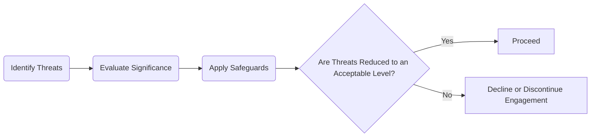

## 2.1 AICPA Code of Professional Conduct

The American Institute of Certified Public Accountants (AICPA) Code of Professional Conduct forms the ethical cornerstone for Certified Public Accountants (CPAs) practicing in the United States. Its requirements guide professional behavior and decision-making, ensuring that CPAs uphold the public trust. Whether serving individuals or large corporations, CPAs are expected to act with integrity, uphold independence, and prioritize the public interest—even when personal or client desires conflict with these core responsibilities.

This section explores the key elements of the AICPA Code of Professional Conduct, including the Principles, Rules of Conduct, Interpretations, and the Conceptual Framework Approach. Understanding these components and their practical applications is crucial to fulfilling professional obligations and maintaining the trust that underpins the accounting profession.

---

## Overview of the AICPA Code

### Principles of the AICPA Code of Professional Conduct
The Principles function as the aspirational components of the Code—broad guidelines reflecting the profession’s values and ideals. While they are not enforceable in the same way as the Rules, they define the spirit with which CPAs should carry out their responsibilities. The primary Principles include:

1. Responsibilities: CPAs must exercise sensitive professional and moral judgment in all activities.  
2. The Public Interest: CPAs are expected to act in a manner that serves the public interest and demonstrates a commitment to professionalism.  
3. Integrity: Honesty and candor must guide every professional relationship and service.  
4. Objectivity and Independence: CPAs should remain free from conflicts of interest and maintain impartiality in their judgments.  
5. Due Care: Competence and diligence in the performance of professional responsibilities are essential.  
6. Scope and Nature of Services: CPAs must practice within an ethical framework that limits their range of services to those that can be fulfilled with competence and objectivity.

### Rules of Conduct
In contrast to the Principles, the Rules are enforceable statutes within the Code. They address specific areas of practice where CPAs must comply meticulously. Key Rules include:

• Independence (Rule 101): CPAs must be independent in fact and appearance when performing attest services.  
• Integrity and Objectivity (Rule 102): Requires CPAs to remain free from conflicts of interest, uphold objectivity, and avoid any form of misrepresentation.  
• Confidentiality (Rule 301): Prohibits disclosing confidential client information without explicit permission or legal obligations.  
• Contingent Fees and Commissions (Rule 302, Rule 503): Restrict CPAs from fees or commissions that may compromise their independence.  
• Acts Discreditable (Rule 501): Enforces ethical conduct, prohibiting actions detrimental to the profession.  

Violations of these Rules can lead to serious disciplinary actions, including suspension or revocation of the CPA license and/or removal from AICPA membership.

### Interpretations of the Code
Interpretations provide detailed discussions on how the Rules apply in specific situations, reflecting the profession’s evolving landscape. They address:
• Emerging technological contexts (e.g., data analytics, cloud accounting).  
• Global engagements, cross-border ethics, and multi-jurisdictional issues.  
• New forms of practice such as virtual services or advisory roles in nontraditional markets.

Interpretations are continuously updated to ensure CPAs have relevant guidance on how to apply core ethical principles in new and complex scenarios.

---

## The Conceptual Framework Approach

When the Code’s authoritative guidance doesn’t address a particular situation, CPAs use the Conceptual Framework Approach. This systematic process identifies threats and then applies safeguards to mitigate those threats. Below is a short diagram illustrating how the approach works:

### Steps in the Conceptual Framework Approach

1. Identify Threats: Determine any potential threats—such as self-interest, self-review, advocacy, familiarity, undue influence, or management participation threats—that could compromise independence or objectivity.  
2. Evaluate Significance: Assess whether these threats are significant enough to compromise professional judgment or the public interest.  
3. Apply Safeguards: If threats are deemed significant, implement adequate safeguards, such as additional professional oversight, enhanced disclosures, or consultation with third-party experts.  
4. Conclude on Engagement: If the safeguards effectively reduce threats to an acceptable level, the CPA may continue. If not, ethical obligations dictate that the CPA withdraw or modify the scope of services.

### Examples of Safeguards
Implementing safeguards is critical to managing ethical conflicts. Common safeguards include:

• Establishing quality control procedures at the firm level.  
• Rotating senior auditors on recurring engagements.  
• Peer reviews or external reviews of firm procedures.  
• Seeking advice from an independent legal counsel or professional body when evaluating conflicts.  

---

## Types of Ethical Threats

Threats to independence and objectivity can arise from multiple sources. Understanding them allows CPAs to proactively address potential issues:

1. Self-Interest Threat: Occurs when a CPA stands to benefit personally from a financial or other interest in a client.  
2. Self-Review Threat: Exists when a CPA audits work that they were involved in preparing.  
3. Advocacy Threat: Arises when a CPA promotes a client’s position to the extent that objectivity or independence becomes compromised.  
4. Familiarity Threat: Develops when a close relationship with a client or its employees impairs objectivity.  
5. Undue Influence Threat: Results from pressure exerted by a client or another third party to achieve certain outcomes.  
6. Management Participation Threat: Occurs when CPAs find themselves taking on management responsibilities for a client.

---

## Importance of Serving the Public Interest

The AICPA Code of Professional Conduct underscores that serving the public interest is paramount—a CPA’s duty transcends client and personal wants. Fostering transparency, fairness, and accuracy in financial reporting is central to maintaining public trust. When these broader responsibilities come into conflict with client desires, the Code empowers and obligates CPAs to act in a manner that protects the public.

### Practical Case Study: Balancing Client Pressure and Ethical Responsibility

Imagine a CPA performing an audit for a manufacturing client. The CFO insists on recognizing revenue prematurely to meet quarterly targets. Despite intense pressure, the CPA must reference the authoritative guidance in the Code, identify the potential self-interest threat (wanting to retain the client’s fees), and apply safeguards—discussing the issue with the CFO, consulting firm policy, or if necessary, withdrawing from the engagement. By doing so, the CPA preserves professional integrity and protects the public interest.

---

## Consequences of Non-Compliance

Violating the AICPA Code can result in severe repercussions, including:

• Disciplinary actions by state boards of accountancy (e.g., suspension or revocation of license).  
• Sanctions by the AICPA (e.g., expulsion from membership).  
• Legal liabilities, such as lawsuits or fines.  

Given these potential outcomes, adherence to both the letter and spirit of the Code is critical. Periodic ethics continuing professional education (CPE) courses help CPAs stay current with ongoing updates and reinforce the Code’s principles.

---

## Emerging Ethical Considerations

As the business environment evolves, so does the Code. Topics such as data privacy, cybersecurity, and blockchain-based transactions pose fresh challenges. CPAs must:

• Consider data protection regulations (e.g., GDPR) when handling client information.  
• Evaluate new conflicts in decentralized finance (DeFi) and crypto assets.  
• Stay informed about global collaboration, especially where foreign regulations differ significantly from the AICPA Code.

---

## Additional Resources and References

• Official References & Institutions  
  – [AICPA Code of Professional Conduct](https://www.aicpa.org/research/standards/codeofconduct.html)  
  – [AICPA Ethics & Independence](https://us.aicpa.org/interestareas/professionalethics)  

• Further Reading  
  – “Ethics and the CPAs” by Catherine Allen for practical case studies.  
  – Online Course: “Ethical Decision-Making in Accounting” available on edX (various universities).  

By studying these materials, CPAs can deepen their understanding of ethical standards, visualize real-world applications, and explore emerging considerations in today’s rapidly changing financial environment.

---

## Mastering the AICPA Code of Professional Conduct: Evaluating Ethical Principles and Best Practices



### Under the AICPA Code of Professional Conduct, which of the following is an example of a Principle rather than a Rule?
- [ ] Independence  
- [x] The Public Interest  
- [ ] Contingent Fees  
- [ ] Confidential Client Information  

> **Explanation:** “The Public Interest” is a Principle, representing an aspirational guideline. Independence, Contingent Fees, and Confidential Client Information are governed by enforceable Rules.

### Which Rule primarily addresses the CPA’s duty to avoid conflicts of interest and remain impartial?  
- [ ] Rule 503 (Commissions and Referral Fees)  
- [x] Rule 102 (Integrity and Objectivity)  
- [ ] Rule 301 (Confidential Client Information)  
- [ ] Rule 101 (Independence)  

> **Explanation:** Rule 102 dictates that CPAs must remain objective and avoid any conflicts of interest, safeguarding the public trust.

### Which of the following lists best describes the main threat categories under the Conceptual Framework Approach?  
- [ ] Social media, cybersecurity, peer bias, and litigation threats  
- [x] Self-interest, self-review, advocacy, familiarity, undue influence, and management participation  
- [ ] Business risk, operational risk, financing risk, and compliance risk  
- [ ] Internal control, external control, detection risk, and inherent risk  

> **Explanation:** Self-interest, self-review, advocacy, familiarity, undue influence, and management participation are recognized categories of threats to independence and objectivity under the Conceptual Framework.

### If threats to independence cannot be sufficiently mitigated by safeguards, the conceptual framework indicates that a CPA must:
- [ ] Document the attempts and proceed with the engagement  
- [x] Decline or discontinue the engagement  
- [ ] Seek a client waiver  
- [ ] Perform a separate, additional audit  

> **Explanation:** When safeguards cannot reduce threats to an acceptable level, ethical obligations dictate the CPA must withdraw or avoid the engagement.

### Which of the following scenarios best illustrates a familiarity threat?
- [x] A CPA has worked with the same client for many years and formed a close friendship with key management  
- [ ] A CPA owns a significant portion of the client’s company stock  
- [x] A CPA is defending their client in a legal battle against a government agency  
- [ ] A CPA has discovered an error made by another CPA in the prior year’s audit  

> **Explanation:** A familiarity threat arises when personal relationships lead to a reduced sense of professional skepticism. Owning stock is a self-interest threat; advocating in legal battles is an advocacy threat; finding another CPA’s error can create a self-review threat.

### Which of the following is the central focus of the Principle of Due Care?
- [x] Maintaining professional competence and appropriate levels of service  
- [ ] Establishing realistic fixed-fee structures  
- [ ] Fostering a close personal relationship with the client  
- [ ] Avoiding social media presence  

> **Explanation:** Due Care directs CPAs to continually update their skills and perform services diligently and competently.

### What is a safeguard that may help reduce threats to an acceptable level under the Conceptual Framework?
- [x] Peer reviews of the CPA firm’s audit methodology  
- [ ] Offering substantial discounts to clients if they follow CPA advice  
- [ ] Maintaining a strict hierarchy within the client’s accounting department  
- [ ] Performing an engagement without engagement letters  

> **Explanation:** Peer reviews can provide impartial oversight, reducing threats to an acceptable level. Discounts, strict hierarchies, or skipping engagement letters do not necessarily mitigate ethical risks.

### Which statement about the AICPA Code’s disciplinary actions is correct?
- [x] CPAs may face suspension or expulsion from AICPA membership for violations  
- [ ] The Code allows CPAs to opt out of sanctions by paying a fine  
- [ ] License suspension is solely at the discretion of the client’s board of directors  
- [ ] The Code contains no enforceable sanctions  

> **Explanation:** The AICPA can impose suspension or expulsion, and state boards of accountancy can suspend a license, demonstrating the Code’s enforceability.

### When the AICPA Code of Professional Conduct is silent on a particular issue, what is the recommended course of action?
- [x] Use the Conceptual Framework Approach to identify and address the threats  
- [ ] Obtain a client-signed waiver to proceed  
- [ ] Default to the lowest-cost solution  
- [ ] Abandon the Code entirely  

> **Explanation:** The Code instructs CPAs to follow the Conceptual Framework Approach whenever explicit guidance is unavailable.

### True or False: A CPA may ignore the AICPA Code if they believe a client’s request to be “minor and harmless”.
- [x] False  
- [ ] True  

> **Explanation:** CPAs must adhere to the Code regardless of a request’s perceived impact. Even small lapses can erode public trust and violate professional obligations.



---

## For Additional Practice and Deeper Preparation

**[Auditing & Attestation CPA Mock Exams (AUD): Comprehensive Prep](https://www.udemy.com/course/aud-cpa-mock-exams/?referralCode=D064EF7BD4A84FC6403D)**  
• Tackle full-length mock exams designed to mirror real AUD questions—from risk assessment and ethics to internal control and substantive procedures.  
• Refine your exam-day strategies with detailed, step-by-step solutions for every scenario.  
• Explore in-depth rationales that reinforce understanding of higher-level concepts, giving you a decisive edge on test day.  
• Boost confidence and reduce exam anxiety by building mastery of the wide-ranging AUD blueprint.

_Disclaimer: This course is not endorsed by or affiliated with the AICPA, NASBA, or any official CPA Examination authority. All content is created solely for educational and preparatory purposes._
