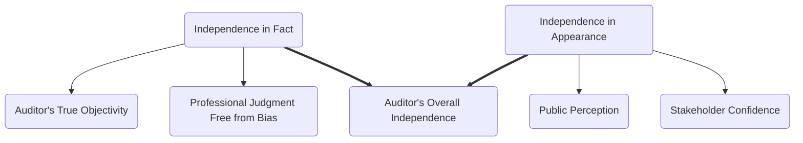

## 2.2 Independence Requirements (AICPA, PCAOB, SEC, GAO, DOL)

Auditor independence stands as one of the cornerstones of a credible and trustworthy audit. The ability of the auditor to remain both actually and visibly objective ensures stakeholder confidence in the financial statements. Because different entities operate under distinct regulatory frameworks, independence requirements vary according to the auditor’s jurisdiction and the nature of the engagement. This section sheds light on the independence rules set forth by the American Institute of Certified Public Accountants (AICPA), Public Company Accounting Oversight Board (PCAOB), Securities and Exchange Commission (SEC), Government Accountability Office (GAO), and Department of Labor (DOL). We will explore why these requirements exist, how they are implemented, common pitfalls, and practical strategies for meeting these obligations.

---

### 2.2.1 Foundations of Auditor Independence

Auditor independence comprises two key facets:

1. **Independence in Fact**: The auditor’s actual objectivity, free from personal interest or emotional ties that could bias professional judgment.  
2. **Independence in Appearance**: The impression left with third parties—shareholders, regulators, clients, and the public—that the auditor is unbiased and maintains professional integrity.

Both attributes are equally important. Even the slightest suggestion that an auditor has a conflict of interest or is unduly influenced by a client can undermine public trust.

#### Diagram: Two Facets of Auditor Independence

Figure 1: Independence is manifested internally as actual objectivity and externally as public perception.

---

### 2.2.2 AICPA Independence Standards

The AICPA’s independence requirements primarily apply to auditors engaged in **non-issuer** (private company) audits and attestation engagements. Key provisions of the AICPA’s **Code of Professional Conduct** (ET Section 1.200.001) include:

1. **No Direct Financial Interest**: Auditors must not hold stocks or similar ownership interests in the entity they audit.  
2. **No Material Indirect Financial Interest**: Examples include financial relationships through close family members or certain investment vehicles that may be perceived as diminishing objectivity.  
3. **Prohibition on Management of Client Affairs**: CPAs cannot assume management responsibilities (e.g., performing managerial duties, making decisions for clients, or acting in a capacity that undermines independence).  
4. **Prohibition on Contingent Fees**: Fees contingent on the outcome of the audit or performance metrics are strictly disallowed since they create incentives misaligned with unbiased audit results.

#### A Practical Example  
A CPA firm auditing a small family-owned manufacturing company must ensure that no partner in the firm, or their immediate families, hold any stakes in the client’s business. Even a minor ownership interest could violate the principle of independence in fact and appearance.

---

### 2.2.3 PCAOB and SEC Independence Rules

Publicly traded companies present a heightened need for rigorous independence standards, driven by the potential market impact of their audited financial statements. The PCAOB and SEC collaborate to define independence for audits of **issuer** (publicly traded) entities.

#### 2.2.3.1 Prohibited Services

Under SEC and PCAOB guidelines, external auditors of public companies are restricted from providing certain non-audit services to their audit clients, including but not limited to:

- **Bookkeeping or other accounting services**  
- **Financial information systems design and implementation**  
- **Appraisal or valuation services**  
- **Actuarial services**  
- **Internal audit outsourcing services**  
- **Management or human resource functions**  
- **Legal and expert services unrelated to the audit**  

These prohibitions aim to avoid conflicts where the auditor ends up auditing work they themselves performed, thereby threatening their objectivity.

#### 2.2.3.2 Lead Partner Rotation

To further protect objectivity, the Sarbanes-Oxley Act of 2002 requires **lead partner rotation** on public company audits at least every five years. The objective is to prevent overly cozy relationships between the audit partner and the client’s senior leadership.

#### 2.2.3.3 Contingent Fees

Similar to AICPA rules, PCAOB and SEC standards disallow contingent fees. An auditor’s compensation cannot be tied directly to the financial results or outcomes of an audit.

---

### 2.2.4 GAO Independence Standards

The **Government Accountability Office (GAO)** issues **Government Auditing Standards** (often called the “Yellow Book”), which apply to:

- Audits of government entities at the federal, state, or local level.  
- Audits or attestation engagements involving organizations that receive federal assistance.  

Public sector audits demand heightened diligence in independence, as taxpayer money and public trust are at stake. The Yellow Book has stringent guidelines that echo AICPA rules but go further:

- **Prohibition on management roles:** Auditors must avoid performing any management functions for audited entities.  
- **Segregation of Audit and Non-Audit Services:** The GAO explicitly states that even minor consulting engagements can threaten independence if they extend into management decision-making functions.

#### A Real-World Scenario  
A state agency hires a CPA firm to audit the use of federal grant funds for a healthcare initiative. If the CPA firm also provides consulting on operational efficiencies for the same healthcare program, that second engagement could compromise auditor independence unless carefully structured to ensure compliance with GAO standards.

---

### 2.2.5 DOL Independence Rules for Employee Benefit Plan Audits

The **Department of Labor (DOL)** enforces independence requirements specifically for CPAs auditing **employee benefit plans** subject to the Employee Retirement Income Security Act (ERISA). Key points include:

1. **Financial Interests in Plan Sponsor**: The DOL disallows CPAs from auditing a benefit plan if they have direct financial relationships with the plan sponsor.  
2. **Prohibited Service Arrangements**: Similar to PCAOB/SEC restrictions, CPAs cannot provide certain non-audit services that impair independence, such as bookkeeping or other management functions for the plan or plan sponsor.  
3. **Attention to Related Parties**: The independence rules also apply to immediate family members, partner relationships, or potential mutual financial interests.

#### Table: DOL Independence vs. AICPA/PCAOB

| Aspect                       | DOL Requirements                      | AICPA/PCAOB Requirements                          |
|------------------------------|---------------------------------------|---------------------------------------------------|
| Financial Interests in Plan  | Strictly prohibited                   | Prohibited for plan (client) or sponsor          |
| Non-Audit Service Prohibitions | Prohibits management services       | Prohibits certain non-audit services for issuers |
| Documentation Requirements   | Must document compliance in audit workpapers | Must document approach in audit documentation |

Table 1: Comparison of DOL independence rules with AICPA/PCAOB.

---

### 2.2.6 Common Prohibitions and Practical Safeguards

Regardless of the regulatory body, certain activities are generally believed to impair independence:

- **Management Functions**: Making decisions for the client, overseeing client employees, or taking on roles that properly belong to client management.  
- **Direct or Material Indirect Financial Interests**: Ownership stakes or vested financial interests in the client.  
- **Contingent Fees**: Basing an auditor’s compensation on a specific outcome of the audit engagement.

#### Practical Safeguards

1. **Annual Independence Questionnaire**: Firms require all personnel to complete periodic surveys declaring any financial interest or relationship that may compromise independence.  
2. **System of Records**: Maintain a record of client relationships, monitoring partner rotation for public companies and ensuring compliance with relevant rules.  
3. **Segmenting Non-Audit Services**: If a firm engages with a client on multiple fronts, best practices include forming separate teams and implementing “firewalls” to limit shared information, ensuring no one ends up auditing their own work.  
4. **Tone at the Top**: Maintaining a culture of integrity within the firm is indispensable. Engaging all personnel in continuous independence training highlights the gravity of independence rules.

---

### 2.2.7 Monitoring Independence

Auditors must continually monitor independence throughout the engagement. From initial client acceptance to final delivery of the audit report, independence can be threatened by changes in staff assignments, new engagements with the same client, or evolving partnerships within the firm. Key steps in monitoring include:

- **Engagement Acceptance and Continuance**: Evaluate the potential conflicts of interest and independence threats before bidding or accepting the engagement.  
- **Periodic Review**: Require staff to disclose changes in their financial interests, relationships, or roles.  
- **Regulatory Updates**: Stay alert to amendments in AICPA, SEC, PCAOB, GAO, and DOL guidance, implementing timely changes in firm policy.

---

### 2.2.8 Common Pitfalls and Best Practices

1. **Underestimating Familiarity Threat**: Long-standing relationships can create an unintentional bias. Implement mandatory partner rotation and second partner reviews for high-risk engagements.  
2. **Failure to Document**: Even if the firm is fully compliant, inadequate documentation can raise questions. Thorough recordkeeping proves that policies were followed.  
3. **Non-Audit Services Overreach**: Steer clear of extensive consulting services for audit clients, especially if such consulting may require the CPA to assume a management function.  
4. **Operating Without Firewalls**: For larger firms, lack of proper controls between departments can lead to independence breaches. Create distinct teams for audit and non-audit engagements to ensure lines of responsibility remain clear.

---

### 2.2.9 Additional References and Resources

For further insights into independence requirements:

- **PCAOB Independence Rules**  
  (https://pcaobus.org/oversight/standards/ethics-and-independence)

- **SEC Regulations**:  
  Regulation S-X, Regulation S-K  
  (https://www.sec.gov/)

- **GAO Government Auditing Standards**  
  (https://www.gao.gov/yellowbook)

- **DOL Interpretive Bulletins**  
  (https://www.dol.gov/agencies/ebsa)

- **Further Reading**  
  - “SEC and PCAOB Independence Guidance: A Comprehensive Overview” (AICPA Store)  
  - Articles on independence in the [Journal of Accountancy](https://www.journalofaccountancy.com/)

---

### 2.2.10 Conclusion

Independence is a defining characteristic of any credible audit. By following the standards of the AICPA, PCAOB, SEC, GAO, and DOL, auditors preserve the trust of stakeholders and the integrity of financial reporting. Auditors who remain vigilant about compliance, thoroughly document their processes, and foster a cultural commitment to objectivity perform a vital service that upholds the cornerstone of public confidence in the development and presentation of financial information.

---

## Mastering Independence Requirements: AICPA, PCAOB, SEC, GAO, DOL



### Which of the following best describes “independence in appearance”?

- [ ] The auditor has no financial interest in the client.  
- [ ] The auditor is free from any personal bias in fact.  
- [ ] A situation where the auditor’s fees are not contingent on audit results.  
- [x] The perception that an auditor is fully objective, even if not proven otherwise.  

> **Explanation:** Independence in appearance concerns how third parties perceive the auditor’s objectivity, irrespective of actual facts.

### Under PCAOB and SEC rules, which of the following services is typically prohibited for an auditor of a public company?

- [ ] Tax compliance services.  
- [x] Bookkeeping services.  
- [ ] Reviewing contingent liabilities.  
- [ ] Conducting risk assessment procedures.  

> **Explanation:** Bookkeeping, as a non-audit service, is barred because it places the auditor in the position of auditing their own work, undermining independence.

### What is a key independence rule under the Sarbanes-Oxley Act of 2002?

- [ ] Mandatory rotation of the entire audit firm every two years.  
- [x] Lead engagement partners must rotate after five years.  
- [ ] Prohibition of publicly traded clients.  
- [ ] Mandatory use of government auditors for public companies.  

> **Explanation:** SOX stipulates that lead partners on public company audits rotate at least every five years to mitigate familiarity threats.

### Which of the following is a common pitfall that could threaten an auditor’s independence?

- [x] Performing management duties for the client.  
- [ ] Reviewing control risk assessments with management.  
- [ ] Discussing audit findings with the board of directors.  
- [ ] Preparing a management letter discussing internal control weaknesses.  

> **Explanation:** Acting in a managerial capacity for a client impairs the auditor’s independence in both fact and appearance.

### According to DOL independence rules, what is a major focus for audits of employee benefit plans?

- [x] Restrictions on auditors having direct financial interests in plan sponsors.  
- [ ] Mandatory five-year partner rotation intervals.  
- [x] Prohibition on contingent fees for EBP audits.  
- [ ] Equal auditing rights for employees under the plan.  

> **Explanation:** The DOL closely monitors potential financial ties to plan sponsors and disallows contingent fees as both degrade independence.

### When auditors conduct governmental audits under GAO’s Yellow Book, which of the following is true?

- [ ] Lower standards of documentation apply due to smaller governmental budgets.  
- [ ] Non-audit services are encouraged for cost efficiencies.  
- [x] Stringent rules against consulting activities that involve management decisions.  
- [ ] Government entities do not require external audits.  

> **Explanation:** GAO standards set rigorous rules preventing the auditor from performing or appearing to perform management duties, reinforcing independence.

### Partner rotation under SEC rules generally aims to:

- [x] Reduce the familiarity threat by periodically changing the engagement partner.  
- [ ] Lower audit costs for the client.  
- [x] Provide more technical expertise by continuously introducing new audit partners.  
- [ ] Remove the independence requirements entirely.  

> **Explanation:** The partner rotation requirement prevents auditors from becoming unduly aligned with client management and strengthens objectivity.

### Which of the following practices helps ensure compliance with independence standards?

- [x] Maintaining a recordkeeping system to monitor partner-client assignments.  
- [ ] Using solely verbal confirmations of independence.  
- [ ] Allowing staff to decide individually if they need to disclose conflicts.  
- [ ] Accepting contingent fees with board approval.  

> **Explanation:** Firms that keep thorough records and track staff assignments are better positioned to remain independent and prove compliance.

### What is one reason the SEC prohibits certain non-audit services for audit clients?

- [ ] Auditors need more time to focus on routine accounting tasks.  
- [x] Such services can lead to auditors reviewing and auditing their own work.  
- [ ] To reduce the complexity of the financial statements.  
- [ ] Because non-audit services are generally too costly for public entities.  

> **Explanation:** If auditors provide certain services (like bookkeeping or system implementation), they become involved in creating accounting records that they later evaluate, thereby jeopardizing objectivity.

### Independence in fact is achieved when:

- [x] The auditor is genuinely unbiased and professional judgment is unaffected by personal interests.  
- [ ] The public perceives the auditor as being unbiased.  
- [ ] The external stakeholders are assured that the audit fees are nominal.  
- [ ] The auditor has a longstanding relationship with the client.  

> **Explanation:** Independence in fact requires that the auditor remain entirely objective, free from conflicts, thus upholding professional skepticism and judgment.



---

## For Additional Practice and Deeper Preparation

**[Auditing & Attestation CPA Mock Exams (AUD): Comprehensive Prep](https://www.udemy.com/course/aud-cpa-mock-exams/?referralCode=D064EF7BD4A84FC6403D)**  
• Tackle full-length mock exams designed to mirror real AUD questions—from risk assessment and ethics to internal control and substantive procedures.  
• Refine your exam-day strategies with detailed, step-by-step solutions for every scenario.  
• Explore in-depth rationales that reinforce understanding of higher-level concepts, giving you a decisive edge on test day.  
• Boost confidence and reduce exam anxiety by building mastery of the wide-ranging AUD blueprint.

_Disclaimer: This course is not endorsed by or affiliated with the AICPA, NASBA, or any official CPA Examination authority. All content is created solely for educational and preparatory purposes._
