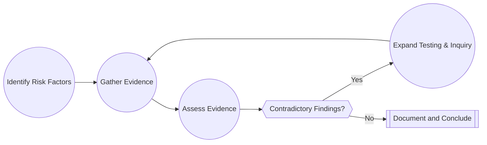

## 2.3 Professional Skepticism and Judgment

Professional skepticism is at the core of the auditing process. It underpins the auditor’s responsibility to maintain a **questioning mindset** in the face of varying degrees of risk and uncertainty. Auditors must continually assess whether material misstatements—caused by either fraud or error—could be present within the financial statements they examine. Professional judgment, in turn, involves using relevant experience, knowledge of the client’s industry, and ethical standards to make well-informed decisions during all phases of the audit.

This section provides an in-depth view of professional skepticism and judgment, detailing key attributes you need to deploy in practice, common biases that could hinder objective thinking, and how to document your judgments. By honing these skills, you establish credibility, promote public trust, and maintain the integrity of the audit profession.

---

## 1. Introduction to Professional Skepticism

Professional skepticism is an essential attitude that embodies the auditor’s obligation to remain alert to conditions that could indicate possible misstatements. Though skepticism is often described as “trust but verify,” an auditor must be vigilant to the possibility of oversight, manipulation, or collusion—no matter how strong client relationships may be.

### 1.1 Importance of Professional Skepticism
• Enhances the **quality** of audit work.  
• Serves as a key **deterrent** to fraud and misconduct.  
• Fulfills **public interest** by demanding fairness and accuracy in financial reporting.

### 1.2 Regulatory References
• [AICPA Professional Standards: AU-C Section 200](https://www.aicpa.org/research/standards/auditattest/clarifiedsas.html) – Outlines the objectives and concepts crucial for maintaining skepticism throughout an audit.  
• PCAOB Auditing Standards – Emphasize professional skepticism, notably in risk assessment and gathering audit evidence.  

---

## 2. Key Attributes of Professional Skepticism

Auditors demonstrating professional skepticism typically embody the following attributes:

1. **Objectivity**  
   - Freedom from personal bias or other conflicts. Objective auditors evaluate evidence independently, seeking to remain unaffected by personal relationships or preconceived notions.  

2. **Persistence**  
   - A willingness to probe deeply into potential anomalies. When an auditor encounters unusual transactions or contradictory evidence, they must dig further rather than accept superficial explanations.  

3. **Critical Assessment of Evidence**  
   - A consistent, methodical review of documentary evidence, external confirmations, management explanations, and other sources. Auditors evaluate the validity, reliability, and sufficiency of all obtained evidence.

### 2.1 Visualizing Professional Skepticism

Below is a simple Mermaid diagram illustrating the iterative nature of professional skepticism. The auditor continuously evaluates evidence, identifies potential contradictions, and refines the audit approach:

**Diagram Explanation**:  
1. The auditor begins by (A) identifying potential risk factors.  
2. (B) Evidence is gathered using various audit techniques—inspection, confirmation, inquiry, etc.  
3. (C) The auditor assesses whether the evidence is reliable and complete.  
4. (D) If the auditor detects contradictory findings, further testing is required. If no contradictions are found, final (F) documentation and conclusions are made.  

---

## 3. Professional Judgment

Professional judgment in auditing involves applying relevant experience and ethical frameworks to reach informed conclusions. It is essential during all phases of the engagement—especially when determining materiality thresholds, selecting procedures, and interpreting test results.

### 3.1 Role of Professional Judgment
• Determines the **nature, timing, and extent** of audit procedures.  
• Guides the identification and response to **significant risks**.  
• Influences how to interpret and respond to audit findings, such as potential fraud indicators or unusual journal entries.  

### 3.2 Elements of Sound Judgment
1. **Knowledge and Experience**  
   - Professional expertise drawn from training, prior engagements, and continuous learning.  
2. **Ethical Framework and Standards**  
   - An understanding of governing standards—AICPA, PCAOB, GAO, or other regulatory requirements—to align decisions with industry best practices.  
3. **Documentation and Transparency**  
   - Recording the rationale behind each decision ensures consistency, clarity, and accountability.

---

## 4. Judgment Traps and Biases

While professional skepticism and judgment are fundamental, auditors must remain wary of mental shortcuts and biases. These **judgment traps** can inadvertently skew an auditor’s perspective, leading to inaccurate conclusions or flawed decisions.

### 4.1 Common Biases

1. **Overconfidence Bias**  
   - Believing too strongly in personal judgment or expertise, possibly underestimating risk or ignoring contradictory evidence.  

2. **Anchoring Bias**  
   - Relying too heavily on initial information (e.g., prior year’s figures) and failing to adjust expectations when new information emerges.  

3. **Confirmation Bias**  
   - Selectively seeking or interpreting evidence in a manner that validates one’s existing beliefs, rather than challenging assumptions.  

4. **Availability Bias**  
   - Over-reliance on easily recalled or recent information, ignoring relevant but less prominent data.  

### 4.2 Example of Bias in Practice
Suppose an auditor reviews an entity’s accounts receivable aging schedule. If, in prior years, no significant misstatements existed, the auditor may be inclined to trust the current results on minimal testing (anchoring bias). However, implementing professional skepticism requires the auditor to challenge assumptions, especially if there are **industry downturns** or new customer segments with higher credit risks.

---

## 5. Documentation of Judgment

A robust audit file reflects not only the steps taken but why certain decisions were made. **Documentation** should chronicle significant matters, professional judgments, and how the auditor arrived at the conclusions:

1. **Reasoning**: Articulate each step leading from initial observation to final decision.  
2. **Alternatives Considered**: Note every major alternative course of action or explanation.  
3. **Final Conclusion**: State the basis for the chosen conclusion, supported by professional standards or firm guidance.

**Well-documented judgment** is essential to defending audit decisions in peer reviews, inspections by regulators, and potential legal challenges.

---

## 6. Practical Strategies to Strengthen Skepticism and Judgment

Below are methods to reinforce your skeptical mindset and refine your judgment:

- **Cross-Reference Evidence**: Compare internal documentation with external verifications (e.g., supplier or customer confirmations).  
- **In-depth Inquiries**: Conduct structured inquiries with multiple personnel levels, including mid-level managers and operational staff.  
- **Challenge Management Assertions**: Investigate areas prone to high estimates or subjectivity (e.g., fair-value measurements).  
- **Engage in Peer Discussions**: Collaborate and challenge each other’s viewpoints within the audit team.  
- **Continuous Learning**: Stay current on auditing standards, industry changes, and relevant academic research on cognitive biases.  

---

## 7. Real-World Illustrative Examples

1. **Revenue Recognition**  
   - A manufacturing client experiences sudden spikes in sales at quarter-end. Auditors must confirm shipping documents, cross-check with cut-off procedures, and consider the possibility of channel stuffing. Exercising **persistence** here might reveal customer returns or side deals—evidence of improper revenue recognition.  

2. **Estimation of Allowances**  
   - An electronics retailer sets aside an allowance for obsolete inventory. Management estimates are subjective, and auditors should carefully evaluate historical track records, industry benchmarks, and future technology trends. Using **critical assessment** helps verify the reasonableness of management's estimate against real market conditions.  

3. **Complex Financial Instruments**  
   - Auditors often rely on the work of specialists in valuing derivatives or complex hedging transactions. Setting a skeptical tone ensures the auditor thoroughly questions the specialist’s methodologies, inputs, and sensitivity analyses.  

---

## 8. Glossary of Terms

• **Critical Thinking**: Methodical evaluation of evidence and arguments, identifying any potential weaknesses or gaps.  
• **Judgment Biases**: Mental errors that can influence decisions, such as overconfidence or confirming preexisting beliefs.  
• **Contradictory Evidence**: Information that conflicts with expectations, suggesting misstatements or risks.

---

## 9. References and Further Reading

• [AICPA Professional Standards: AU-C Section 200](https://www.aicpa.org/research/standards/auditattest/clarifiedsas.html)  
• *Professional Skepticism: The Essential Mindset* (AICPA Whitepaper)  
• PCAOB Auditing Standards, particularly AS 1015: Due Professional Care in the Performance of Work  
• “Auditor Judgment and Decision-Making,” *Auditing: A Journal of Practice & Theory* — Explores various cognitive biases and strategies for mitigation.  

---

## 10. Conclusion

Professional skepticism and judgment are cornerstone qualities for any external auditor. By recognizing judgment traps, biases, and the importance of thorough documentation, practitioners can uphold ethical standards and maintain public trust. With continuous learning, peer collaboration, and an unwavering dedication to examining evidence critically and objectively, auditors reinforce the pillars of the profession and contribute to the reliability of financial reporting worldwide.

---

## Strengthen Your Understanding with a Quick Quiz

Below is a quiz designed to help you review and reinforce core concepts related to professional skepticism and judgment.



### When an auditor maintains a questioning mindset and considers the possibility of fraud at all times, they are demonstrating which key principle?  
- [x] Professional skepticism  
- [ ] Variance analysis  
- [ ] Performance materiality definition  
- [ ] Unqualified opinion issuance  

> **Explanation:** Professional skepticism involves remaining alert to the possibility of fraud or error and questioning evidence rather than merely accepting it as factual.

### Which of the following best describes overconfidence bias in auditing?  
- [ ] The tendency to perform more procedures than necessary  
- [x] The tendency to overestimate the accuracy of one’s own judgments  
- [ ] The tendency to question all evidence, even reliable sources  
- [ ] The tendency to rely solely on past data without conducting further analysis  

> **Explanation:** Overconfidence bias leads auditors to place undue faith in personal judgments and underestimate the risk of misstatement.

### Which statement about recordkeeping of professional judgment is most accurate?  
- [ ] Documentation is optional if the audit opinion is unmodified  
- [ ] Documentation should only contain raw data  
- [x] Documentation must reflect the auditor’s reasoning, alternatives considered, and final conclusions  
- [ ] Documentation should be accessible only to firm partners  

> **Explanation:** Regulators and standards require the documentation of critical decisions, including the rationale and alternatives evaluated, to ensure transparency and accountability.

### Which of the following biases can cause auditors to focus only on evidence that corroborates their initial expectations?  
- [ ] Overconfidence bias  
- [ ] Anchoring bias  
- [x] Confirmation bias  
- [ ] Availability bias  

> **Explanation:** Confirmation bias is characterized by a propensity to seek out or interpret evidence that confirms existing beliefs, potentially overlooking contradictory data.

### How would you best describe the purpose of the iterative approach to evidence assessment in auditing?  
- [x] To continuously refine risk evaluation and testing procedures until reasonable assurance is achieved  
- [ ] To finish the audit as quickly as possible  
- [ ] To reduce the scope of the audit  
- [ ] To automate all analytical procedures  

> **Explanation:** Auditing is a dynamic process; as auditors gather new information, they re-evaluate risks and adjust their approaches accordingly.

### Which key factor might trigger further testing or inquiry during an audit?  
- [ ] Absence of any transactions  
- [x] Contradictory evidence found  
- [ ] Low inherent risk  
- [ ] Management’s confidence in its system of controls  

> **Explanation:** Contradictory evidence is a clear sign to the auditor that further procedures are warranted to resolve discrepancies and potential misstatements.

### Which of the following best demonstrates professional judgment?  
- [x] Integrating experience, ethical standards, and regulatory guidance to form well-reasoned conclusions  
- [ ] Accepting all client explanations without question  
- [x] Ignoring contradictions if an initial sample size is too small  
- [ ] Basing conclusions solely on prior year’s results  

> **Explanation:** Professional judgment is the intersection of expertise, ethical behavior, and adherence to auditing standards. It involves critical thinking and the willingness to challenge assumptions.

### What is a practical way to reduce confirmation bias?  
- [ ] Only read the final figures prepared by management  
- [ ] Avoid discussing findings with peers  
- [x] Seek contrary evidence regardless of initial belief  
- [ ] Rely primarily on prior experience without adjustment  

> **Explanation:** Actively searching for contradictory data prevents an auditor from locking onto only confirming information, reducing confirmation bias.

### Overconfidence bias is most likely to lead to which of the following audit outcomes?  
- [x] Insufficient questioning of management’s estimates  
- [ ] Excessive fieldwork and additional testing  
- [ ] Over-reliance on external confirmations  
- [ ] Lower reliance on prior-year work papers  

> **Explanation:** Overconfidence in the auditor’s belief about the accuracy of management’s estimates can diminish the rigor of testing and even lead to undetected material misstatements.

### Is documentation of professional skepticism and judgment crucial in an audit?  
- [x] True  
- [ ] False  

> **Explanation:** Documentation of skepticism and judgment is essential to demonstrate compliance with auditing standards, support conclusions, and facilitate reviews by regulators and peers.



---

## For Additional Practice and Deeper Preparation

**[Auditing & Attestation CPA Mock Exams (AUD): Comprehensive Prep](https://www.udemy.com/course/aud-cpa-mock-exams/?referralCode=D064EF7BD4A84FC6403D)**  
• Tackle full-length mock exams designed to mirror real AUD questions—from risk assessment and ethics to internal control and substantive procedures.  
• Refine your exam-day strategies with detailed, step-by-step solutions for every scenario.  
• Explore in-depth rationales that reinforce understanding of higher-level concepts, giving you a decisive edge on test day.  
• Boost confidence and reduce exam anxiety by building mastery of the wide-ranging AUD blueprint.

_Disclaimer: This course is not endorsed by or affiliated with the AICPA, NASBA, or any official CPA Examination authority. All content is created solely for educational and preparatory purposes._
