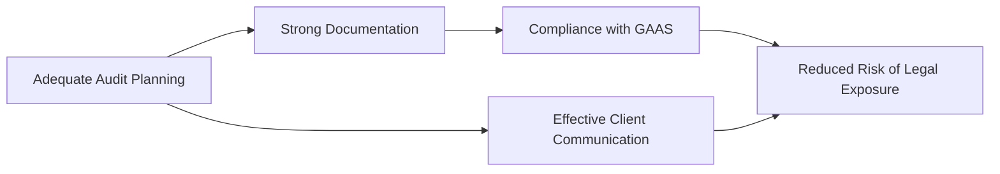

## 2.4 Legal Liability and Malpractice Considerations

In the course of fulfilling their professional duties, auditors face a range of legal liabilities under both common law and statutory law. Lawsuits may be initiated by clients, investors, or other third parties who relied on the auditor’s opinion and suffered financial harm due to alleged negligence or wrongdoing. This subsection provides a comprehensive look at the nature of legal liability, the role of professional standards such as GAAS (Generally Accepted Auditing Standards), and practical steps to mitigate risks.

Auditors must maintain awareness of their legal responsibilities, the potential for litigation, and how best to manage exposures. By emphasizing due professional care, implementing robust internal quality-control procedures, and observing ethical standards, practitioners can significantly reduce the likelihood of lawsuits and malpractice claims.

---

### 1. Overview of Legal Liability

Legal liability arises when an auditor breaches a duty under recognized standards, causing another party to suffer damages. Liability claims often revolve around whether the auditor met the standard of due professional care, complied with GAAS, and provided a fair and accurate audit opinion.

Generally, liability is divided into two broad categories:

1. **Common Law Liability**: Based on judicial precedents and state laws, encompassing negligence, gross negligence, and fraud claims.  
2. **Statutory Liability**: Derived from federal and state legislation, such as the Securities Act of 1933 and the Securities Exchange Act of 1934, which govern reporting requirements for public companies.

---

### 2. Common Law Liability

Under common law, an auditor can be held liable to both clients and third parties:

• **For Clients**: Liability arises if the auditor fails to exercise the required standard of care or breaches contract terms, causing a direct financial loss.  
• **For Third Parties**: Depending on state laws, liability may extend to known or intended beneficiaries (e.g., lenders or shareholders). Some jurisdictions require “privity” or a near-privity relationship, while others use a broader standard allowing a wider pool of potential claimants.

#### 2.1 Negligence and Gross Negligence

• **Negligence**: Failure to exercise due professional care, often interpreted as what a "reasonable auditor" would do in a similar situation.  
• **Gross Negligence**: A significant departure from professional standards, indicating a reckless disregard for the consequences of the audit procedures or omissions.

#### 2.2 Privity or Near-Privity Doctrines

Under the privity doctrine, only parties in a direct contractual relationship can sue for negligence. However, certain courts and jurisdictions have expanded liability to include:

• **Foreseen Users**: If the auditor could reasonably foresee that a specific third party would rely on the audited financial statements.  
• **Foreseeable Users**: A broader category encompassing any party who might rely on the financial statements in the normal course of business.

---

### 3. Statutory Liability

Auditors attest to the accuracy of financial statements for public companies registered with the Securities and Exchange Commission (SEC). Statutory laws, particularly the Securities Act of 1933 and the Securities Exchange Act of 1934, impose liabilities on auditors for misleading or misstated financial information:

1. **Securities Act of 1933**  
   • Focuses on initial public offerings (IPOs) and registration statements.  
   • Auditors may face liability if the prospectus contains misstated or omitted material information that investors relied upon.

2. **Securities Exchange Act of 1934**  
   • Governs ongoing public company disclosures, including annual (Form 10-K) and quarterly (Form 10-Q) reports.  
   • Imposes liability for fraudulent or misleading statements.  
   • Plaintiffs typically need to prove both reliance on the audited financial reports and damages suffered as a result of misstatements.

#### 3.1 Sarbanes-Oxley Act (SOX) Considerations

Enacted in response to corporate scandals (e.g., Enron and WorldCom), SOX imposes more stringent requirements for auditors, executives, and boards of directors, thereby increasing the potential for penalties. Key provisions affecting auditors include:

• Public Company Accounting Oversight Board (PCAOB) inspection of audit firms.  
• Increased scrutiny of internal controls over financial reporting.  
• Potential criminal liability for willful wrongdoing, document falsification, or destruction.  

---

### 4. Criminal Liability

Although criminal proceedings against auditors are relatively rare, they can arise under both federal and state laws, including:

• **Sarbanes-Oxley Act**: Provides criminal penalties for auditors who knowingly fail to retain working papers or who falsify, alter, or destroy records with the intent to impede investigations.  
• **Securities Fraud Statutes**: Fraudulent activities designed to mislead or conceal material facts from investors can result in criminal charges.

---

### 5. Malpractice Insurance

Given the risk landscape, most audit firms carry **professional liability (malpractice) insurance** to cover potential claims arising from errors, omissions, or negligence. However, even comprehensive coverage has limitations:

• **Policy Limits**: Coverage up to a certain dollar amount.  
• **Exclusions**: Intentional wrongdoing or fraudulent activities typically are not covered.  
• **Reputation Risks**: Even if the claim is paid, reputational harm for the audit firm can linger.

---

### 6. Key Factors in Determining Case Outcomes

When legal disputes arise, courts or arbitration panels typically assess:

1. **Compliance with GAAS**: Did the auditor follow Generally Accepted Auditing Standards and the relevant professional guidelines?  
2. **Materiality**: Was there a material misstatement of the financial statements?  
3. **Loss Causation**: Did the plaintiff suffer actual financial harm as a direct result of the alleged negligence or misrepresentation?  
4. **Reliance**: For third parties, did they reasonably rely on the auditor’s report when making financial decisions?  

A central question is whether the auditor acted as a "reasonable auditor" would under similar circumstances. If the auditor’s workpapers and documentation justify the scope and quality of the audit procedures, defenses to liability are stronger.

---

### 7. Defenses to Auditor Liability

Auditors can employ various defenses to challenge negligence or malpractice claims:

1. **Lack of Duty**: Demonstrating there was no obligation to the particular plaintiff, such as in states strictly requiring privity or near-privity.  
2. **Due Professional Care**: Showing full compliance with GAAS and other professional standards.  
3. **No Damages**: Arguing that the plaintiff’s losses were not caused by the auditor’s actions or that there were no actual losses.  
4. **Contributory or Comparative Negligence**: Showing the plaintiff or others were partially responsible for the losses.

---

### 8. Best Practices to Mitigate Liability

Auditors can minimize the risk of legal claims and malpractice suits through:

1. **Robust Quality Control**: Strong internal policies, consistent training, and peer review processes.  
2. **Adherence to Standards**: Aligning audit practices to GAAS, PCAOB Standards, and AICPA Standards.  
3. **Thorough Documentation**: Detailed audit files that clearly support conclusions and demonstrate the procedures performed.  
4. **Continuous Professional Education**: Staying updated on changes in accounting standards, auditing rules, and industry-specific requirements.  
5. **Communication with Clients**: Early and clear communication about limitations, scope, and issues uncovered during the audit.  

Below is a visual representation of key factors that can lead to or mitigate legal liability:

In this diagram, effective audit planning, documentation, and client communication all feed into compliance with GAAS (or PCAOB standards), which in turn reduces the auditor’s legal exposure.

---

### 9. Practical Examples and Case Studies

• **Case of Client Material Misstatement**: A manufacturing company intentionally overstated inventory to secure a loan. The auditor’s procedures were inadequate and failed to verify inventory levels. The bank sued the auditor for losses incurred. If the court found that a "reasonable auditor" would have performed additional tests, the auditor may be held liable for negligence.

• **Case of a Third-Party Claim (Foreseen User)**: An investment firm relied on the audited financial statements of a technology startup to invest significant funds. Subsequent discovery showed that important liabilities were omitted. If the investment firm can prove reliance and show that they were within the class of users the auditor could reasonably foresee, they may recover losses from the auditor.

---

### 10. Conclusion

Understanding the legal framework governing auditor liability is crucial. CPAs must be vigilant in applying professional standards, documenting every step of the audit, and maintaining open communication with clients. By doing so, they fortify their defense against negligence or malpractice claims. Moreover, staying informed about changing regulations, such as the Sarbanes-Oxley Act, and carrying malpractice insurance helps auditors reduce legal and financial risks.

---

### References and Additional Resources

• **Official References**  
  - [SEC Division of Enforcement](https://www.sec.gov/enforce) – Guides and updates on enforcement actions, providing insight into common pitfalls.  
  - **Sarbanes-Oxley Act** – Essential reading on auditor oversight and increased legal exposure.

• **Additional Resources**  
  - Haft, Robert J. *Auditors’ Responsibilities and The Law*. Thomson Reuters.  
  - “Litigation and the Accounting Profession.” *The CPA Journal*.  
  - AICPA website (www.aicpa.org) for ongoing updates on professional standards.

---

## Mastering Auditor Liability and Malpractice Quiz



### Which of the following best describes auditor liability under common law?

- [x] It arises from judicial precedents involving negligence, gross negligence, or fraud.  
- [ ] It applies only when the auditor and client have an expressly written engagement letter.  
- [ ] It is completely prohibited by the Sarbanes-Oxley Act.  
- [ ] None of the above.

> **Explanation:** Under common law, auditors may be subject to legal actions claiming negligence, gross negligence, or fraud. These precedents often shape the auditor’s duty of care to clients and, in some cases, third parties.

### Which of the following is a key factor in determining legal liability for auditors?

- [x] Whether the auditor followed GAAS.  
- [ ] Whether the financial statements were prepared by a CPA firm.  
- [ ] Whether the financial statements were intended for internal management use only.  
- [ ] The age of the partnership or corporation being audited.

> **Explanation:** Courts typically look at whether the auditor complied with professional standards such as GAAS when evaluating potential negligence or malpractice.

### Under what condition can a third party (who is not the client) sue the auditor for alleged negligence in certain jurisdictions?

- [x] The auditor knew or should have known that the third party would rely on the financial statements.  
- [ ] There must be a formal privity of contract between the third party and the auditor.  
- [ ] The engagements must involve government agencies only.  
- [ ] Third-party lawsuits are not permitted in any jurisdiction.

> **Explanation:** Some states allow third-party suits if the user was in the auditor’s reasonable contemplation, typically referred to as “foreseen users.”

### What is a major feature of the Sarbanes-Oxley Act in relation to auditor liability?

- [x] It created the PCAOB, which inspects audit firms and enforces standards.  
- [ ] It bars any lawsuits against auditors by third parties.  
- [ ] It reduces penalties for corporate fraud.  
- [ ] It applies only to private companies.

> **Explanation:** One notable aspect of SOX is the establishment of the PCAOB, which oversees auditors of public companies, potentially increasing auditor liability for non-compliance.

### Which of the following best describes gross negligence?

- [x] A severe departure from due care indicating reckless disregard for auditing standards.  
- [ ] An unintentional oversight during inventory testing.  
- [x] A type of routine error in documentation.  
- [ ] None of the above.

> **Explanation:** Gross negligence involves a significant failure to exercise due care, often viewed as reckless or willful disregard for standards.

### In many malpractice cases, which element is critical for the plaintiff to prove?

- [x] That the misconduct or negligence caused financial harm.  
- [ ] That the CPA held every possible professional certification.  
- [ ] That the CPA had more than ten years of auditing experience.  
- [ ] That statutory law absolves all claims.

> **Explanation:** A key component of successful suits against auditors is the demonstration of both wrongdoing and actual financial harm (damages).

### What is one defense auditors may use in a negligence lawsuit?

- [x] The plaintiff’s losses were not caused by the auditor’s work.  
- [ ] The plaintiff has an active CPA license.  
- [x] The auditor claimed indefinite liability.  
- [ ] The client is too small to warrant a strict audit.

> **Explanation:** If an auditor can show that the client’s or third party’s losses were due to other factors (e.g., market downturn), not the audit, it reduces or eliminates liability.

### Which of the following is typically excluded from malpractice insurance coverage?

- [x] Fraudulent or intentional wrongdoing.  
- [ ] Routine errors in financial statement disclosures.  
- [ ] Ordinary negligence.  
- [ ] Updates to audit documentation after the engagement ends.

> **Explanation:** Malpractice policies generally do not cover intentional or fraudulent acts, thereby reinforcing the importance of ethical behavior among audit professionals.

### The Securities Act of 1933 primarily addresses which aspect of corporate reporting?

- [x] Initial public offerings and registration statements.  
- [ ] Annual reports (Form 10-K) for existing public companies.  
- [ ] Proxy statements issued for annual shareholder meetings.  
- [ ] Internal management reports used for operational decisions.

> **Explanation:** The Securities Act of 1933 focuses on the disclosure requirements for securities offered to the public, placing liability on auditors for any misstatements in those filings.

### True or False: Criminal liability for auditors can never arise under the Sarbanes-Oxley Act.

- [ ] True  
- [x] False

> **Explanation:** Sarbanes-Oxley includes provisions that allow for criminal penalties if an auditor is found guilty of willful wrongdoing, such as document falsification.



---

## For Additional Practice and Deeper Preparation

**[Auditing & Attestation CPA Mock Exams (AUD): Comprehensive Prep](https://www.udemy.com/course/aud-cpa-mock-exams/?referralCode=D064EF7BD4A84FC6403D)**  
• Tackle full-length mock exams designed to mirror real AUD questions—from risk assessment and ethics to internal control and substantive procedures.  
• Refine your exam-day strategies with detailed, step-by-step solutions for every scenario.  
• Explore in-depth rationales that reinforce understanding of higher-level concepts, giving you a decisive edge on test day.  
• Boost confidence and reduce exam anxiety by building mastery of the wide-ranging AUD blueprint.

_Disclaimer: This course is not endorsed by or affiliated with the AICPA, NASBA, or any official CPA Examination authority. All content is created solely for educational and preparatory purposes._
