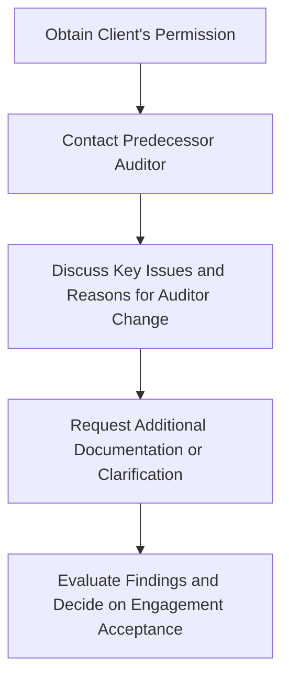

## 3.2 Communication with Predecessor Auditors and Management

Effective communication with predecessor auditors and current management is essential to gain a well-rounded understanding of a prospective client’s audit environment. This process not only helps to identify matters that might affect audit acceptance but also sheds light on the level of transparency within the organization. As part of due diligence, the successor auditor should obtain approval from the client to reach out to the predecessor auditor before finalizing the acceptance of the engagement. The nature, depth, and outcomes of these discussions can significantly influence the decision to proceed with the engagement.

In this section, we dive into why these communications are so important, examine the process from initial request to final assessment, and offer practical examples and best practices to guide auditors in navigating these crucial discussions.

---

## Importance of Predecessor Auditor Inquiries

### Gaining Historical Insights
The predecessor auditor is a valuable resource for understanding the client’s previous financial reporting environment. Through open dialogue, the successor auditor can learn of:
• Any significant disagreements over accounting principles or audit procedures in prior audits.  
• Issues related to the integrity or reliability of the client’s management.  
• Outstanding fees, disputes, or other unresolved matters that led to the change in auditor.

### Identifying Potential Red Flags
When prospective clients refuse to authorize the successor auditor to speak with the predecessor, or if the predecessor fails to respond, these instances may signal:
• Management’s lack of transparency.  
• Potential for undisclosed legal or regulatory concerns.  
• Difficult issues encountered during prior audits that may resurface.  

If any of these red flags appear, it is essential for the successor auditor to determine whether they pose serious risks to the engagement’s integrity.

---

## Communication Flow and Best Practices

The process for contacting the predecessor auditor typically unfolds through several key steps:

1. **Obtain Client’s Permission**  
   The successor auditor requests written or explicit authorization from the prospective client to communicate with the predecessor. Failure to obtain permission is a serious impediment, often advising the successor auditor that the client may be withholding critical information.

2. **Contact the Predecessor Auditor**  
   Once permission is granted, the successor auditor should send a formal letter or request to the predecessor, outlining the areas of interest. Professional courtesy dictates that the inquiry remains specific and respectful to the predecessor auditor’s engagement knowledge.

3. **Discuss Key Issues and Reasons for Auditor Change**  
   Engage in open dialogue about possible conflicts, disputes, or difficulties during previous audits. This includes inquiries about:
   • Management’s integrity or reliability.  
   • Any disagreements over the application of generally accepted accounting principles (GAAP), audit procedures, or adjusting entries.  
   • The cause of any significant restatements, if applicable.

4. **Request Additional Documentation or Clarification**  
   If concerns or inconsistencies surface, the successor auditor may request clarification, documentation, or other evidence supporting the predecessor’s conclusions. This step ensures that the new auditor can corroborate any allegations or identify any anomalies that could affect the current engagement.

5. **Evaluate Findings and Decide on Engagement Acceptance**  
   Upon gathering information, the successor auditor should decide whether the risk level is manageable or whether it poses a threat to conducting the audit. Red flags, such as inconsistencies between management’s statements and predecessor evidence, may lead to a decision not to accept the engagement.

---

## Topics for Inquiry

Successor auditors often have a predefined list of inquiries for predecessor auditors. Common questions include:

• The nature of any accounting principle disagreements with management.  
• Instances of fraud or suspected fraud involving management or employees.  
• Reliability of management’s estimates or any unadjusted differences left in prior financial statements.  
• Fees remaining unpaid from previous years (which could indicate an ongoing dispute over audit findings or billing).  
• Evidence of non-compliance with legal or regulatory requirements encountered during the audit.

These inquiries align closely with [AU-C Section 510](https://www.aicpa.org/research/standards/auditattest/clarifiedsas.html) (Opening Balances—Initial Audit Engagements), which requires a focus on obtaining sufficient appropriate audit evidence about whether opening balances contain misstatements that materially affect current period financial statements.

---

## Management’s Role in the Communication Process

### Authorization and Transparency
Before any conversation takes place, the client must provide permission—preferably in writing—to the successor auditor, empowering the auditor to talk with the predecessor. An unwillingness to do so can highlight potential management integrity issues.

### Scope Clarification
After the successor auditor connects with the predecessor, they also continue discussions with management to confirm:
• The engagement’s objectives and scope.  
• Important financial reporting deadlines.  
• The client’s expectations regarding deliverables or special reporting requirements.

Understanding these elements early in the process allows the successor auditor to align the engagement team, timeline, and budget accordingly.

### Unresolved Differences, Adjusting Entries, and Estimates
Management and the successor auditor may address outstanding unadjusted differences or historically problematic estimates. If previous disputes about revaluation of assets or unrecorded liabilities remain, the new engagement team should evaluate them for the current audit plan.

---

## Potential Challenges and Pitfalls

1. **Client Refusal to Authorize Communication**  
   Refusal to grant permission for contacting the predecessor auditor is a major red flag. The auditor should reexamine the riskiness of the engagement and potentially decline if the client’s refusal indicates a lack of transparency.

2. **Predecessor Auditor Silence**  
   In some situations, the predecessor auditor may be slow to respond or entirely unresponsive. While there could be legitimate reasons—for example, busy season or pending legal issues—non-responsiveness could also indicate deeper problems. After reasonable attempts, the successor auditor must evaluate whether sufficient evidence about opening balances can still be collected.

3. **Incomplete or Inconsistent Information**  
   The successor auditor might receive contradictory accounts of events from management versus the predecessor auditor. This conflict requires further investigation or additional documentary evidence to resolve discrepancies effectively.

4. **Legal and Confidentiality Considerations**  
   Predecessor auditors are bound by professional ethics regarding confidentiality. They may only disclose necessary information once the prospective client grants explicit permission. Failure to adhere to these guidelines can result in professional and legal consequences.

---

## Practical Example: A Hypothetical Audit Switch

Consider a midsize manufacturing company, “FlexiSteel Inc.,” that recently replaced its auditor of five years. The predecessor auditor states there were frequent disputes over inventory costing methods, ultimately impacting the company’s cost of goods sold (COGS). Management had refused to adjust this critical estimate in prior years, leaving potential unadjusted differences on the books. The predecessor auditor also discloses that certain prior-year fees remain unpaid.

Upon contacting management, the successor auditor learns that these disputes primarily involved interpretation of international financial reporting requirements, and the unpaid fees were tied to management’s disagreement with the required revaluation entries. Management insists that the prior auditors were overly conservative. Importantly, management grants full permission to the successor auditor to speak with the previous firm, showing a willingness to resolve outstanding matters.

In analyzing both insights, the successor auditor plans additional substantive testing on inventory and cost allocations in the upcoming audit. They also note the risk of continuing disputes if management’s chosen methods continue to deviate from auditing standards. However, the open dialogue with both parties helps the successor auditor prepare more robust audit procedures, mitigating potential unethical practices or hidden liabilities.

---

## Regulatory Guidance and Professional Standards

• [AU-C Section 510](https://www.aicpa.org/research/standards/auditattest/clarifiedsas.html): Provides guidance on opening balances for new audit engagements and underscores the importance of learning about predecessor Auditor’s work.  
• **AICPA Code of Professional Conduct**: Outlines the ethical considerations auditors must follow concerning confidentiality and integrity.  

---

## Additional Resources

• “Successor Auditor Communications: Minimizing Surprises” (CPA Practice Advisor).  
• [Wiley CPA Study Guide for Audit](https://www.wiley.com): Features comprehensive checklists and illustrative examples for contacting the predecessor auditor and evaluating initial engagement risk.  

---

## Glossary

• **Predecessor Auditor**: The public accounting firm that audited the client’s financial statements in the prior period(s).  
• **Successor Auditor**: The new auditor proposing to accept or having accepted the audit engagement.  
• **Scope**: The breadth or boundaries within which the audit is conducted, including time frame and financial aspects.  
• **Unadjusted Differences**: Proposed adjusting entries identified during the audit that management declines to record in the financial statements.

---

## Quiz on Effective Communication with Predecessor Auditors



### Which of the following is the primary reason to obtain client permission before contacting the predecessor auditor?

- [x] To ensure confidentiality requirements are met and licensing the predecessor to disclose pertinent information.
- [ ] To demonstrate the new auditor’s independence.
- [ ] To verify the predecessor auditor’s competence.
- [ ] To avoid conflicts of interest between the two audit firms.

> **Explanation:** The primary reason is to maintain confidentiality and ethical standards, requiring the client’s authorization for the predecessor auditor to share relevant information.

### What is one possible conclusion if a prospective client refuses to allow the successor auditor to communicate with the predecessor auditor?

- [x] It could be a major red flag indicating potential hidden issues or lack of transparency.
- [ ] It means the client has no financial statements to discuss.
- [ ] It confirms the predecessor auditor provided a disclaimer of opinion.
- [ ] It prevents the successor auditor from performing substantive testing.

> **Explanation:** A refusal suggests that management may be shielding unfavorable details, creating uncertainty about the integrity of the engagement.

### Why might predecessor auditors be reluctant to respond to successor auditors’ inquiries?

- [x] They may be bound by confidentiality requirements and need explicit client consent to share details.
- [ ] They want to overcharge the successor auditor.
- [ ] They are no longer governed by professional standards upon dismissal.
- [ ] They could face conflicts of interest if they respond.

> **Explanation:** Predecessor auditors must protect the client’s confidential information and can only share relevant details upon receiving explicit written permission from the client.

### If the successor auditor finds inconsistencies between the predecessor auditor’s statements and management’s explanations, which of the following actions is most appropriate?

- [x] Seek clarification and gather additional evidence from both parties to resolve discrepancies.
- [ ] Immediately withdraw from the engagement.
- [ ] Rely solely on management’s representations for efficiency.
- [ ] Issue an adverse opinion without further investigation.

> **Explanation:** The successor auditor has a professional obligation to investigate and reconcile any inconsistencies, ensuring the reliability of the information received.

### When should the successor auditor generally communicate with the predecessor auditor?

- [x] Before finalizing acceptance of the engagement or, in some cases, shortly after acceptance to comply with timelines.
- [ ] Only at the end of the next year’s audit for comparative statement purposes.
- [x] After completing all fieldwork.
- [ ] Immediately after discovering fraud in the new engagement.

> **Explanation:** Best practice and AU-C Section 510 guidance suggest addressing potential issues regarding opening balances and historical matters before the engagement is confirmed, or very early on, to tailor the audit plan appropriately.

### Which of the following is considered a typical inquiry made by the successor auditor to the predecessor auditor?

- [x] Any disagreements with management over accounting principles or audit procedures.
- [ ] The predecessor auditor’s annual bonus structure.
- [ ] The predecessor auditor’s number of clients in the same industry.
- [ ] The predecessor auditor’s internal control environment.

> **Explanation:** Gaining insight into prior disagreements or contentious issues is crucial for the successor auditor’s risk assessment and planning.

### Which document is typically used to grant permission for the successor auditor to contact the predecessor auditor?

- [x] A formal client authorization letter or a paragraph in the engagement letter.
- [ ] An internal memorandum prepared by the successor auditor.
- [ ] A memo from the PCAOB.
- [ ] A standard NDAsigned by the predecessor auditor only.

> **Explanation:** A client authorization letter (or explicit permission recorded in the engagement letter) is the standard means for obtaining client consent for predecessor communication.

### What should the successor auditor do if the predecessor auditor does not respond after repeated requests for communication?

- [x] Consider alternative procedures to gather evidence regarding opening balances and discuss potential implications with management.
- [ ] Immediately accept the risk without further action.
- [ ] End the audit engagement without explanation.
- [ ] File a professional complaint against the predecessor auditor.

> **Explanation:** Since the predecessor auditor might be unavailable for various reasons, the successor auditor should perform alternative procedures to address any potential risk.

### Unadjusted differences often appear during predecessor auditor communications. Which statement best describes unadjusted differences?

- [x] Proposed adjusting journal entries identified during the audit that management chooses not to record.
- [ ] Differences in the actual hours billed by the predecessor auditor vs. estimated hours.
- [ ] Variances in cyclical production intervals from year to year.
- [ ] Budget discrepancies between predecessor and successor audit firms.

> **Explanation:** Unadjusted differences are adjustments recommended by the auditor but unaccepted by management, potentially impacting the financial statement presentation and accuracy.

### True or False: If the client’s refusal to allow the successor auditor to speak with the predecessor auditor is based on confidentiality concerns, the successor auditor may proceed without obtaining further information.

- [ ] True
- [x] False

> **Explanation:** The refusal presents a strong reason to question the integrity of management or the risk environment. Ethical and professional guidelines advise the successor auditor to assess these risks carefully before proceeding.



---

## For Additional Practice and Deeper Preparation

**[Auditing & Attestation CPA Mock Exams (AUD): Comprehensive Prep](https://www.udemy.com/course/aud-cpa-mock-exams/?referralCode=D064EF7BD4A84FC6403D)**  
• Tackle full-length mock exams designed to mirror real AUD questions—from risk assessment and ethics to internal control and substantive procedures.  
• Refine your exam-day strategies with detailed, step-by-step solutions for every scenario.  
• Explore in-depth rationales that reinforce understanding of higher-level concepts, giving you a decisive edge on test day.  
• Boost confidence and reduce exam anxiety by building mastery of the wide-ranging AUD blueprint.

_Disclaimer: This course is not endorsed by or affiliated with the AICPA, NASBA, or any official CPA Examination authority. All content is created solely for educational and preparatory purposes._
