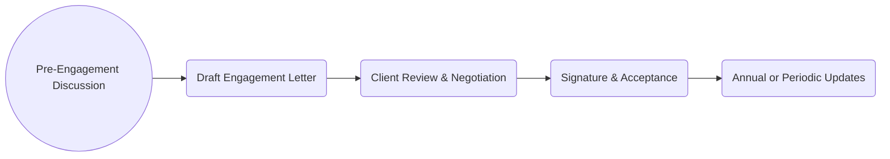

## 3.3 Engagement Letters: Scope, Objectives, Responsibilities

Engagement letters are a pivotal aspect of the auditor-client relationship. They set forth the parameters of an audit or other attest engagement, clarifying responsibilities and deliverables for both parties. By having a clear agreement in place, misunderstandings and disputes can be minimized, creating a strong foundation for a smooth and effective audit. This section explores the critical components of engagement letters—focusing on scope, objectives, responsibilities, timing, fees, limitation of liability, and the process of periodic updates.

---

### 1. Purpose of the Engagement Letter

Engagement letters serve several vital purposes:

1. **Establishing Responsibilities:** They detail who is responsible for what, ensuring no confusion about the roles of the auditor and management.  
2. **Defining Scope:** They outline the extent of work—whether it is a standalone financial statement audit, an integrated audit (which includes internal control over financial reporting), or another type of attest service.  
3. **Clarifying Deliverables:** They specify expected outputs (e.g., audit report, management letter).  
4. **Offering Legal Protection:** They help protect both parties by documenting terms, a reference point if disagreements arise.  
5. **Formalizing Professional Standards:** They usually reference the relevant auditing standards (e.g., AICPA Standards, PCAOB Standards), ensuring both sides are aligned on the audit approach.  

A well-crafted engagement letter is more than a formality; it forms the backbone of a professional relationship and is considered best practice for any CPA firm performing audit and attest services.

---

### 2. Key Elements of an Engagement Letter

Although engagement letters differ across firms, industries, and clients, certain elements are typically included.

#### 2.1 Objective and Scope of the Engagement

• **Nature of the Engagement:** State whether it is a financial statement audit, a single audit of federal funds, or an integrated audit.  
• **Applicable Standards:** Clarify which set of standards the auditor will follow (e.g., Generally Accepted Auditing Standards “GAAS”, Government Auditing Standards for certain governmental audits, or PCAOB standards for public companies).  
• **Informed Consent and Limitations:** Note any known constraints, such as remote locations, technology limitations, or specialized testing.

#### 2.2 Management’s Responsibility

• **Preparation of Financial Statements:** Management is responsible for ensuring the financial statements are prepared in accordance with the applicable financial reporting framework (e.g., Generally Accepted Accounting Principles “GAAP”).  
• **Internal Controls:** The letter underscores management’s obligation to implement and maintain effective internal controls.  
• **Representation and Access:** Management must provide complete access to all necessary records, documentation, and personnel.  
• **Preventing and Detecting Fraud:** Although the auditor designs procedures to detect material misstatements, management remains responsible for preventing and detecting fraud within the organization.

#### 2.3 Auditor’s Responsibility

• **Reasonable Assurance:** The engagement letter clarifies that audits provide a high level of assurance—but not absolute assurance—on the financial statements.  
• **Compliance with Standards:** The auditor must follow appropriate auditing standards, applying professional judgment and skepticism throughout the engagement.  
• **Communication of Findings:** The auditor will communicate significant matters such as internal control deficiencies and any discovered fraud to management and, where applicable, those charged with governance (e.g., audit committee).  
• **Reporting Objectives:** An unmodified (clean) opinion is usually the standard reporting goal. However, the letter should address other possible outcomes (e.g., qualified, adverse, or disclaimer of opinion).

#### 2.4 Timing and Fees

• **Estimated Schedule:** Outline key milestones, such as preliminary planning, fieldwork, and the expected issuance date of the audit report.  
• **Resources and Staffing:** Describe the staff levels, partner involvement, and required level of management support.  
• **Fee Structure:** Provide an estimate of total fees based on the planned scope, acknowledging that changes in scope or unforeseen issues (like significant internal control weaknesses or complex transactions) may cause revisions.  
• **Billing Arrangements:** Clarify intervals (monthly, upon completion of milestones, or upon report issuance) to mitigate payment delays and misunderstandings.

#### 2.5 Limitation of Liability (Where Permissible)

In some jurisdictions, auditors may include disclaimers or liability caps. Such clauses can:

• **Limit Monetary Damages:** Restrict the maximum liability in case of a legal dispute.  
• **Exclude Certain Types of Claims:** Exempt the auditor from punitive or consequential damages.  
• **Disclaim Non-audit Services:** Specify services outside the agreed-upon scope, such as tax advisory or consulting, to avoid confusion.  

© Always consult local regulations and professional standards because liability limitation clauses may not be enforceable in some areas or might require specific disclosures.

---

### 3. Periodic Updates to Engagement Letters

Engagement letters are not fixed documents; they should be renewed or updated periodically. Best practices include:

• **Annual Renewals:** Issuing updated letters at the start of each audit cycle to reflect changing regulations, client expansions, new products, and updated fee structures.  
• **Significant Changes in Scope:** If the client embarks on major acquisitions, changes software systems, or if external forces (e.g., new regulatory requirements) arise, auditors should amend the engagement letter accordingly.  
• **Rolling-Forward:** If there are no significant changes, some firms opt to roll forward prior-year engagement letters. Ensure a comprehensive review and subsequent sign-off from both parties to uphold clarity.

---

### 4. Practical Examples and Real-World Scenarios

1. **Small Nonprofit Audit:** A small nonprofit might have rapidly increasing funding. The engagement letter would reflect a possibly narrowing scope if most records are centralized, or an expanding scope if the nonprofit begins operating in multiple states.  
2. **Integrated Audit for a Public Company:** When publicly traded companies are subject to Sarbanes-Oxley requirements, the letter includes the integrated audit portion of internal controls. The fee might be higher because of additional testwork.  
3. **International Subsidiary:** For an engagement involving multiple jurisdictions, the letter could reference reliance on component auditors. The primary auditor is still responsible for the consolidated financial statements.  
4. **Limitation of Liability Clause:** In certain states or under certain business structures, an audit firm might limit its liability for issues beyond its control or for client misrepresentations, as permitted by local legislation.

---

### 5. Flow of Finalizing an Engagement Letter

Below is a simplified flowchart describing a typical process for finalizing an engagement letter:

• **Pre-Engagement Discussion:** The auditor outlines broad requirements, timeline, and unique considerations.  
• **Drafting the Letter:** The audit firm prepares a draft reflecting the scope and responsibilities.  
• **Client Review & Negotiation:** Both parties refine the letter’s language, fees, and special clauses.  
• **Signature & Acceptance:** The authorized parties sign off to formalize the arrangement.  
• **Annual/Periodic Updates:** The letter is revisited each audit cycle or when significant changes occur.

---

### 6. Best Practices, Common Pitfalls, and Strategies

• **Best Practices:**  
  • Use plain language to avoid confusion.  
  • Reference relevant standards (e.g., [AU-C Section 210](https://www.aicpa.org/research/standards/auditattest/clarifiedsas.html)) to demonstrate compliance with professional guidance.  
  • Keep copies of engagement letters in the permanent file for legal or reference purposes.  

• **Common Pitfalls:**  
  • Failing to specify or frequently update fees if the scope changes.  
  • Overlooking the client’s unique operational environment, leading to ambiguities.  
  • Neglecting to include management’s key responsibilities or the complexities of the industry.  

• **Strategies to Overcome Issues:**  
  • Use standardized templates but tailor them for each engagement’s unique attributes.  
  • Schedule follow-up discussions with management to ensure clarity and alignment.  
  • Have a robust internal review (Engagement Quality Review) to confirm the letter meets firm policies and legal requirements.  

---

### 7. References and Further Resources

• **Official References**  
  - [AU-C Section 210](https://www.aicpa.org/research/standards/auditattest/clarifiedsas.html): “Terms of Audit Engagements.”  
  - PCAOB AS 1301: “Communications with Audit Committees” (for public companies).  

• **Additional Resources**  
  - AICPA “Audit & Accounting Guide” series: Contains sample engagement letters for various industries (e.g., Government, Not-for-Profit, Construction).  
  - “Effective Engagement Letters” by David Cottle: Provides advanced sample language, disclaimers, and tips on structuring terms.  

---

## Engagement Letter Essentials: Interactive Quiz



### Which of the following is a primary purpose of an engagement letter?

- [ ] To replace the audit report
- [ ] To serve as an internal memo among auditors only
- [ ] To increase the auditor’s liability
- [x] To formalize the terms of the engagement, roles, and responsibilities

> **Explanation:** Engagement letters document the responsibilities, scope, timing, and fees for the audit engagement, providing a written agreement between client and auditor.

### What critical management responsibility is typically included in an engagement letter?

- [ ] Setting the audit fees based on the final report
- [ ] Providing absolute assurance on financial statements’ accuracy
- [x] Maintaining effective internal controls and providing relevant information
- [ ] Overseeing the audit fieldwork

> **Explanation:** Management is responsible for maintaining effective internal controls, preparing the financial statements, and giving the auditor access to essential documents and personnel.

### In an engagement letter for a publicly traded company, which additional component is likely to be addressed?

- [ ] The prohibition of any communication with the audit committee
- [x] The integrated audit approach, including internal control testing
- [ ] The acceptance of absolute assurance due to PCAOB requirements
- [ ] The mandatory limitation of liability clause

> **Explanation:** Public companies subject to SOX requirements typically need an integrated audit (financial statements and internal controls over financial reporting). This requirement should be reflected in the engagement letter.

### What is one notable difference between a standard financial statement audit and an integrated audit, as described in an engagement letter?

- [ ] There is no difference, both require only looking at financial statements
- [x] The integrated audit includes a separate opinion on the effectiveness of internal control
- [ ] The integrated audit always results in a qualified opinion
- [ ] The standard audit only verifies compliance with state-level regulations

> **Explanation:** An integrated audit covers both the financial statements and the effectiveness of internal controls over financial reporting, often required for public companies under PCAOB standards.

### Which statement best describes “reasonable assurance” in an engagement letter?

- [ ] It is absolute certainty that the financial statements contain no errors
- [ ] It indicates a minimal level of testing
- [x] It is a high, but not absolute, level of assurance
- [ ] It refers to fulfilling only minimal regulatory requirements

> **Explanation:** Audits provide high (reasonable) but not absolute assurance that the financial statements are free from material misstatement, reflecting the inherent limitations of the auditing process.

### Why might an auditor update an engagement letter during an audit cycle?

- [x] A change in client operations or scope that significantly impacts the audit
- [ ] Personal disagreements between staff
- [ ] To skip certain essential audit procedures for convenience
- [ ] An auditor’s routine vacation schedule

> **Explanation:** Significant changes in a client’s operations, accounting framework, or scope of services require an updated engagement letter to reflect the revised responsibilities and deliverables.

### True or False: An auditor must always include a limitation of liability clause in every engagement letter.

- [ ] True
- [x] False

> **Explanation:** Limitation of liability clauses are not always permissible or mandatory; they depend on jurisdiction, firm policy, and agreement with the client.

### What is a common pitfall related to fees within engagement letters?

- [ ] Setting them too high for large clients
- [ ] Refunding fees if the audit finishes early
- [ ] Negotiating fees after the audit report is released
- [x] Failing to update fees if the engagement scope expands significantly

> **Explanation:** When unforeseen complexities arise or the client’s scope changes, fees in the engagement letter should be revisited to reflect additional work hours and resources.

### An engagement letter typically cites professional standards. Which standards might apply for a private company audit?

- [ ] PCAOB Standards only
- [ ] Governmental Standards primarily
- [x] AICPA Statements on Auditing Standards (AU-C sections)
- [ ] IFRS Standards

> **Explanation:** Private company audits generally follow AICPA Statements on Auditing Standards (SAS), referenced as AU-C sections.

### True or False: Rolling-forward an existing engagement letter is advisable even when there are significant operational changes to the client’s business.

- [ ] True
- [x] False

> **Explanation:** When significant changes occur, simply rolling-forward the old letter can lead to misalignment and misunderstandings. It is necessary to create or update an engagement letter that reflects the new conditions.



---

## For Additional Practice and Deeper Preparation

**[Auditing & Attestation CPA Mock Exams (AUD): Comprehensive Prep](https://www.udemy.com/course/aud-cpa-mock-exams/?referralCode=D064EF7BD4A84FC6403D)**  
• Tackle full-length mock exams designed to mirror real AUD questions—from risk assessment and ethics to internal control and substantive procedures.  
• Refine your exam-day strategies with detailed, step-by-step solutions for every scenario.  
• Explore in-depth rationales that reinforce understanding of higher-level concepts, giving you a decisive edge on test day.  
• Boost confidence and reduce exam anxiety by building mastery of the wide-ranging AUD blueprint.

_Disclaimer: This course is not endorsed by or affiliated with the AICPA, NASBA, or any official CPA Examination authority. All content is created solely for educational and preparatory purposes._
