## 3.4 Documentation Requirements and Retention

Audit documentation—also commonly referred to as workpapers—constitutes the backbone of an effective audit. It provides evidence that the audit was planned and executed in accordance with applicable professional standards (for example, AICPA or PCAOB standards), while supporting the auditor’s conclusions regarding the financial statements. This section explores the key components of audit documentation requirements, retention policies, and best practices for organizing, securing, and referencing these vital records.

---

## Purpose of Audit Documentation

The overarching purpose of audit documentation is to provide a detailed account of the work the auditor performed, the evidence obtained, and the conclusions reached. Proper documentation ensures that:

1. The audit meets professional standards and regulatory requirements.  
2. The auditor’s reasoning and judgments are transparent, enabling peer reviewers or inspectors to evaluate the quality of the work.  
3. Future engagements or team members can efficiently review prior-year workpapers for reference or comparative analysis.  
4. Users of the audited financial statements can trust that the audit has been conducted thoroughly and with professional skepticism.

### Practical Example:  
Imagine an audit team working on a mid-sized manufacturing client. During the inventory count, auditors record the procedures followed (sample size, counting method, reconciliation to general ledger), along with the client’s responses to any anomalies. If these steps are clearly documented and retained, a fresh audit team the following year (or a regulatory reviewer) can understand exactly how the audit conclusion was reached on inventory accuracy.

---

## Documentation Standards (Workpapers)

### Completeness and Accuracy

Audit documentation should be sufficiently complete, so that when reviewed independently, it clearly demonstrates how the auditor arrived at their opinions and conclusions. Key components of complete workpapers often include:

• Audit programs and checklists that outline steps and procedures.  
• Memos detailing discussions with management, including judgments made and conclusions drawn.  
• Schedules, analyses, and reconciliations that support account balances.  
• Confirmation letters or emails showing evidence of verification with third parties.  
• Management representation letters affirming the completeness and accuracy of information provided.

### Clarity and Detail

The clarity of documentation ensures an experienced auditor with no prior connection to the engagement can walk through the material and clearly see:

• The specific procedures performed (Nature, Timing, Extent).  
• The evidence obtained.  
• Any deviations identified or issues encountered.  
• Responses to the identified issues or anomalies.  
• Conclusions reached—and the rationale behind those conclusions.

#### Common Pitfall: Excessive Detail vs. Insufficient Detail  
• Excessive detail can obscure important findings or conclusions, making it harder to pinpoint critical aspects.  
• Insufficient detail may lead to questions about whether all required procedures were performed or were performed thoroughly.

### Indexing and Cross-Referencing

Effective indexing and cross-referencing systems are vital for efficient navigation and review of an audit file. Each piece of evidence—whether a memo, spreadsheet, or email—should be labeled and linked to:

1. The relevant section of the audit program.  
2. The related financial statement assertion (e.g., existence, completeness, valuation).  
3. The final conclusions about that assertion or account.

This organization not only saves time during subsequent reviews but also ensures that the audit trail of evidence is easily traceable.

```mermaid
flowchart LR
    A[Engagement Objectives] --> B[Audit Planning Documents]
    B --> C[Audit Procedures Performed]
    C --> D[Indexing & Cross-Referencing to Workpapers]
    D --> E[Evidence Obtained & Conclusions]
    E --> F[Final Audit Opinion]
    
    style A fill:#f9f,stroke:#333,stroke-width:1px
    style B fill:#ccf,stroke:#333,stroke-width:1px
    style C fill:#cfc,stroke:#333,stroke-width:1px
    style D fill:#ffc,stroke:#333,stroke-width:1px
    style E fill:#fcf,stroke:#333,stroke-width:1px
    style F fill:#ccf,stroke:#333,stroke-width:1px
```

In the flowchart above, each step in the audit process is linked to corresponding documentation, emphasizing the importance of indexing and cross-referencing workpapers to ensure a logical and systematic approach.

---

## Retention Policies

Audit documentation retention policies vary based on whether an entity is subject to AICPA or PCAOB standards and other regulatory requirements. Regardless of the precise timeline, auditors must follow strict guidelines to ensure documentation integrity, confidentiality, and availability for future reference.

### Retention Period

• AICPA (Non-Issuers): Generally recommended minimum of 5 years from the report release date.  
• PCAOB (Issuers): Typically requires 7 years from the auditor’s report date.

These timelines ensure that auditors can respond to inquiries from regulators, clients, or third parties and that any subsequent litigation or investigations have documented support available.

### Confidentiality

Maintaining confidentiality of audit documents is paramount. Audit files frequently include sensitive client data, such as employee records, financial transactions, and proprietary information. Firms must have policies and physical or digital safeguards in place to:

• Restrict access only to authorized personnel.  
• Prevent unauthorized disclosure of information outside the firm or to third parties.  
• Secure both electronic and physical copies of documentation (e.g., using encryption or locked file cabinets).  
• Comply with legal and regulatory obligations (e.g., responding to subpoenas while still respecting confidentiality to the extent possible).

### Example Case Study: Data Breach Prevention

ABC, LLP, an audit firm, stores client data on a cloud-based server. To comply with confidentiality standards, ABC implements multi-factor authentication for remote access, encrypts all data, and conducts annual penetration testing to identify potential security vulnerabilities. Even though the audit files remain accessible to authorized team members, robust security measures ensure that sensitive client data remains confidential.

---

## Best Practices and Common Pitfalls

### Best Practices

1. Establish a Standard Template: Use consistent workpaper formats, indexing conventions, and sign-off sheets.  
2. Incorporate Technology: Automated platforms allow real-time collaboration, version tracking, and better security controls.  
3. Timely Completion: Complete and finalize documentation as the audit progresses, not after the fact.  
4. Perform Quality Reviews: Engender a peer-review process within the team to ensure clarity and completeness.

### Common Pitfalls

• Delayed Documentation: Waiting until after the fact to assemble workpapers may lead to inaccuracies.  
• Overlooking Updates: Changes in audit strategy or scope need timely reflection in the workpapers.  
• Ambiguous Conclusions: Memos that merely note “no exceptions found” can raise questions about thoroughness.  
• Inconsistent Indexing: Inconsistency across teams or years causes confusion and inefficiency.

---

## Relevant Standards and References

• [AU-C Section 230](https://www.aicpa.org/research/standards/auditattest/clarifiedsas.html) – “Audit Documentation” (AICPA)  
• [PCAOB AS 1215](https://pcaobus.org/oversight/standards/auditing-standards) – “Audit Documentation” (Public Companies)  
• “Audit Documentation: Best Practices” in The CPA Journal  
• [AuditFile Blog](https://blog.auditfile.com/) – Articles and tips on automating and organizing your audit documentation

---

## Glossary

• **Audit Documentation (Workpapers):** The record of procedures performed, evidence obtained, and conclusions reached, acting as support for the auditor’s opinion.  
• **Retention Period:** The required length of time audit documentation must be maintained, typically 5 years (AICPA) or 7 years (PCAOB).  
• **Cross-Referencing:** Linking each piece of evidence to the relevant statement, procedure, or audit objective to ensure a clear audit trail.  
• **Confidentiality:** Maintaining the security and privacy of all client-related documentation, preventing unauthorized access or disclosure.

---

## Key Takeaways

1. Maintain thorough and clearly organized workpapers to support every audit conclusion you make.  
2. Keep documentation clear enough that an independent evaluator can discern your workflow and rationale without extensive verbal explanation.  
3. Comply with set retention periods (5 years for non-issuers, 7 years for issuers) and ensure all documentation is securely stored.  
4. Embrace best practices, including standardization and technological tools, to streamline documentation processes and safeguard client data.

---

## SEO-Optimized Quiz: Documentation Requirements and Retention Quiz



### Which of the following best describes the primary purpose of audit documentation?

- [x] To provide evidence that the audit was conducted in accordance with professional standards and to support the auditor’s conclusions.
- [ ] To serve only as an internal reference for audit staff to recall procedures.
- [ ] To show regulators that the audit firm adheres to client preferences.
- [ ] To fulfill a legal requirement with little practical value.

> **Explanation:** Audit documentation (workpapers) serves as evidence of compliance with professional standards and supports the auditor's conclusions.  

### What is the recommended minimum retention period for audit documentation under AICPA standards for non-issuers?

- [ ] 3 years
- [ ] 4 years
- [x] 5 years
- [ ] 7 years

> **Explanation:** AICPA standards generally recommend a 5-year retention period for non-issuers.  

### Why is clarity and detail critical in audit documentation?

- [x] It allows an experienced auditor with no prior knowledge of the engagement to understand the work performed and conclusions.
- [ ] It reduces the need for any future audit work.
- [ ] It ensures that the audit firm complies with data privacy laws.
- [ ] It improves the profitability of the audit engagement.

> **Explanation:** Clarity and detail in documentation ensure transparency and enable review by independent parties.  

### Which of the following is an important best practice to ensure that audit documentation is organized efficiently?

- [x] Systematic indexing and cross-referencing.
- [ ] Minimizing descriptions to save space.
- [ ] Using separate filing systems for each type of evidence with no cross-references.
- [ ] Relying on undocumented staff recollections for clarity.

> **Explanation:** A systematic indexing and cross-referencing system accelerates the review process and ensures a clear audit trail.  

### What is a possible pitfall of having excessive detail in audit documentation?

- [x] It may obscure key findings or deductions.
- [ ] It prevents unauthorized access to sensitive data.
- [x] It automatically meets the clarity requirement.
- [ ] It satisfies retention policy requirements.

> **Explanation:** Excessive detail can bury important information and make reviewing the file inefficient.  

### Which of the following is true regarding confidentiality of audit documentation?

- [x] Audit firms must protect client data from unauthorized access or disclosure unless legally required to reveal it.
- [ ] Confidentiality rules only apply to public companies with large amounts of data.
- [ ] Firms are permitted to sell aggregated client data to third parties if it’s anonymized.
- [ ] Confidentiality ends once the audit is complete.

> **Explanation:** Confidentiality is paramount for all audit clients, and there are serious ethical and legal implications for breaches.  

### Under PCAOB standards, how many years must an audit firm typically retain documentation for an issuer (public company)?

- [ ] 3 years
- [ ] 5 years
- [x] 7 years
- [ ] 10 years

> **Explanation:** The PCAOB generally requires a retention period of 7 years for public company audits.  

### Which statement best summarizes the role of technology in documentation?

- [x] Technology offers audit software solutions that streamline indexing, cross-referencing, and secure storage.
- [ ] Technology is discouraged by regulators.
- [ ] Technology eliminates the need for evergreen documentation.
- [ ] Technology is only applicable to large multinational audits.

> **Explanation:** Modern auditing tools help manage and store workpapers more efficiently and securely, benefiting firms of any size.  

### Why should documentation be finalized in a timely manner?

- [x] To ensure accuracy and completeness by recording procedures immediately after they are performed.
- [ ] To allow management ample time to change the evidence in the workpapers.
- [ ] To increase billable hours at the conclusion of the audit.
- [ ] To satisfy internal technological requirements.

> **Explanation:** Completing documentation in a timely manner ensures accuracy and reduces the risk of omitting essential details.  

### True or False: Workpapers only need to show the final opinion and not the procedures and evidence that support it.

- [x] False
- [ ] True

> **Explanation:** Workpapers must detail the procedures performed, the evidence gathered, and the conclusions reached, not just the final opinion.  



---

## For Additional Practice and Deeper Preparation

**[Auditing & Attestation CPA Mock Exams (AUD): Comprehensive Prep](https://www.udemy.com/course/aud-cpa-mock-exams/?referralCode=D064EF7BD4A84FC6403D)**  
• Tackle full-length mock exams designed to mirror real AUD questions—from risk assessment and ethics to internal control and substantive procedures.  
• Refine your exam-day strategies with detailed, step-by-step solutions for every scenario.  
• Explore in-depth rationales that reinforce understanding of higher-level concepts, giving you a decisive edge on test day.  
• Boost confidence and reduce exam anxiety by building mastery of the wide-ranging AUD blueprint.

_Disclaimer: This course is not endorsed by or affiliated with the AICPA, NASBA, or any official CPA Examination authority. All content is created solely for educational and preparatory purposes._
