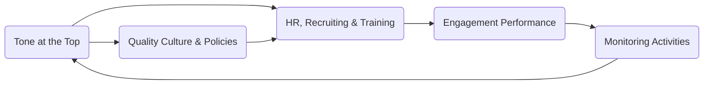
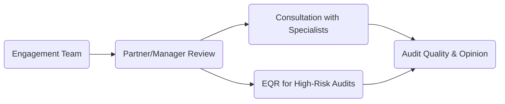

## 3.5 Quality Control at the Firm and Engagement Levels

Quality control in an audit firm is essential for ensuring that every engagement meets the highest professional standards and that the public can rely on the integrity of audit opinions. This section explores the structured approach to quality control, examining both firm-level and engagement-level responsibilities. Quality control standards draw from multiple authoritative sources, such as the Statements on Quality Control Standards (SQCS) issued by the AICPA and the Public Company Accounting Oversight Board (PCAOB) regulations for public companies.

In essence, quality control comprises policies and procedures designed to provide the audit firm reasonable assurance that:  
• The firm and its personnel comply with professional standards and applicable legal and regulatory requirements.  
• Audit reports issued by the firm are appropriate in the circumstances.  

This section breaks down two key dimensions of audit quality control: firm-level and engagement-level. While these components overlap, each focuses on different elements of leadership, staffing, review, and monitoring to maintain consistent excellence in auditing services.

---

## Firm-Level Quality Control

Firm-level quality control addresses the broader governance and operational framework that supports consistent, high-quality engagements across all audits performed by the firm. This foundation includes leadership responsibilities, ethical guidelines, resource management, and continuous monitoring.

### 3.5.1 Leadership Responsibilities and the “Tone at the Top”
A strong tone at the top is critical for embedding a culture of quality and rigorous professional conduct throughout the firm. When firm leadership consistently emphasizes quality, ethics, and accountability, auditors at all levels are more likely to uphold these values.

• Ethical Culture: Senior partners and management must promote an environment where ethics and professional integrity guide decision-making. Incentives should not undermine independence or quality (e.g., excessively tying compensation to client retention).  
• Commitment to High-Quality Engagements: Firm leaders should allocate resources to training, ensure staff capacity for audits, and enforce compliance with standards.  

### 3.5.2 Human Resources
Ensuring that personnel have the right competencies and experience for the engagements they undertake is a major dimension of firm-level quality control. Key aspects include:

• Recruitment and Hiring: The firm should attract qualified individuals with diverse skill sets, including knowledge of accounting principles, auditing standards, and specialized industry expertise.  
• Ongoing Training: Continual professional development ensures that staff understand evolving regulations and best practices. Firms can offer internal seminars, external courses, and in-house technical updates.  
• Assignment of Personnel: Effective staffing assigns partners, managers, and team members to engagements according to their relevant experience. Balancing workloads is critical to maintain thoroughness and reduce the risk of errors.  

### 3.5.3 Engagement Performance
To standardize and control the performance of multiple audit engagements, firms rely on consistent methodologies, tools, and review processes. This consistency helps maintain uniform performance standards across all clients.

Common elements include:  
1. Standardized Audit Methodologies: Many firms develop proprietary methodologies that incorporate industry guidance, best practices, and regulatory standards.  
2. Technological Tools: Electronic workpaper systems, data analytics platforms, and project management tools can streamline the audit process, reinforcing uniform execution.  
3. Review and Supervision Protocols: Engagement teams follow a hierarchical review process to ensure timely detection and correction of mistakes or oversight.  

### 3.5.4 Monitoring
Monitoring is the continuous “feedback loop” that evaluates whether the firm’s quality control system is operating effectively. It involves both ongoing and periodic activities:

• Internal Monitoring: The firm may conduct internal file reviews on a sample of completed engagements to identify areas for improvement.  
• External Peer Reviews: Firms that audit non-public entities generally undergo periodic peer reviews to assess their conformity with AICPA standards.  
• PCAOB Inspections: For auditors of publicly traded entities, the PCAOB inspects engagements to evaluate compliance with PCAOB standards.  
• Remediation: Any identified deficiencies should be addressed promptly. Corrective actions may include revising methodologies, providing additional training, or updating policies.

Below is a simple diagram depicting the cycle of firm-level quality control, highlighting continuous improvement and interactions among leadership, HR, engagement performance, and monitoring:

In this diagram, the arrows indicate how each component supports and informs the next, creating an ongoing cycle of quality improvement.

---

## Engagement-Level Quality Control

While firm-level policies set the standards, the quality of each audit engagement largely depends on the actions and decisions taken by the engagement team and the thoroughness of their review processes. Engagement-level quality control operates closer to the day-to-day execution of audit procedures.

### 3.5.5 Partner or Manager Review
The engagement partner or manager oversees the audit team’s work to ensure the application of appropriate audit methodologies, professional judgment, and compliance with relevant standards. Key responsibilities include:

• Timely Review: High-risk or non-routine areas are reviewed early and often.  
• Documentation Check: Workpapers and audit evidence must be complete, accurate, and relevant.  
• Guidance and Coaching: The partner or manager must mentor staff, address questions, and resolve complex issues as they arise.

### 3.5.6 Consultation with Experts
Complex or specialized issues sometimes require knowledge beyond the expertise of the engagement team, prompting consultation with internal or external specialists:

• Technical Experts: In areas such as complex tax positions, IT controls, or actuarial assumptions, an internal or external consultant’s input can be crucial.  
• Legal Counsel: For instances involving potential litigation or nuanced regulatory compliance, engaging legal experts may be warranted.  

Consultations must be documented, including a summary of the expert’s input and how it influenced the audit conclusions.

### 3.5.7 Engagement Quality Reviews (EQR)
Large or high-risk engagements, particularly public company audits, may require an engagement quality review (EQR) in accordance with PCAOB AS 1220 or AICPA QC Section guidance. The EQR reviewer provides an independent assessment:

• Reviewer Qualifications: The EQR reviewer is a partner (or person in an equivalent position) not directly involved in the engagement, with expertise in the industry and technical areas under review.  
• Scope of Review: Significant judgments, critical areas of the audit, risk assessments, and the proposed audit opinion are all subject to scrutiny.  
• Timing: The EQR must be performed before the audit report is released to ensure that any concerns can be addressed and resolved.  

The completion of an EQR provides additional confidence that the audit’s major judgments are sound and that the resulting opinion is appropriate.

---

## Glossary

• Peer Review: A periodic external evaluation of a firm’s standards and procedures to ensure compliance with professional standards.  
• Engagement Quality Review (EQR): A concurring review by an experienced auditor to provide an objective evaluation of significant judgments and the overall conclusion.  
• Monitoring: Ongoing and separate evaluations by the firm to sustain quality over time and detect areas in need of enhancement.

---

## Official Regulations and Additional Resources

• SQCS (Statements on Quality Control Standards) from the AICPA: Lays out essential requirements for a quality control system within accounting firms.  
• PCAOB Requirements for Engagement Quality Review (AS 1220): Mandates engagement quality reviews for audits of public issuers to enhance audit quality.  
• “Establishing and Maintaining an Effective Quality Control System” – AICPA QC Section: Offers guidance on setting up robust firm-wide quality control procedures.  
• PCAOB Inspection Process ([pcaobus.org](https://pcaobus.org/)): Explains how PCAOB inspects audit practices for compliance and ensures accountability for auditors of public companies.

---

Quality control at both the firm and engagement levels underlies the credibility of the audit profession. By promoting ethical leadership, properly training and assigning human resources, standardizing engagement performance, and implementing robust monitoring protocols, audit firms strengthen their capabilities to deliver accurate and reliable opinions. Meanwhile, on each engagement, conscientious oversight, consultations with experts, and independent quality reviewers help confirm that audit judgments are both appropriate and defensible under professional standards.

---

## Building on Quality Control Knowledge

Within the broader framework of engagement acceptance and general principles, understanding and implementing effective quality control systems can significantly reduce the risk of material misstatements or audit failures. In subsequent chapters, the emphasis on assessing the entity’s environment and designing tailored audit procedures will build on these quality foundations, illustrating how a strong control environment supports efficient and effective audit execution.

---

## Engagement and Real-World Example

Consider an audit firm specializing in the technology sector. At the firm level, leadership invests heavily in IT competency by recruiting professionals with tech backgrounds and creating proprietary tools for analyzing complex software revenue arrangements. They implement a robust training module focusing on software subscription and revenue recognition complexities. Their monitoring efforts include an internal file review program to detect misapplications of new revenue recognition standards.

When the firm accepts an audit engagement for a growing software-as-a-service (SaaS) provider, engagement-level controls are equally robust. The engagement partner reviews evidence related to deferred revenue and subscription terms, consulting with a specialized IT revenue recognition expert when the audit team encounters multi-element contract arrangements. Before the opinion is issued, an experienced partner (who was not part of the core engagement team) conducts an EQR to confirm that the significant judgments regarding stand-ready obligations, revenue allocations, and recognition timing are well-supported.

---

## Diagram: Engagement-Level Quality Control

In this chart, the engagement team’s work is overseen by the partner/manager. Based on risk or complexity, consultation with specialists and an EQR might be required, culminating in issuing a high-quality audit opinion.

---

## SEO-Optimized Quality Control Quiz



### Which element is crucial for setting the ethical and quality-focused culture of an audit firm?

- [ ] Ongoing training and development
- [ ] Peer review processes
- [x] Leadership responsibilities and tone at the top
- [ ] Engagement performance tools

> **Explanation:** The tone at the top establishes the firm’s culture by emphasizing ethics, professional responsibilities, and overall commitment to quality.  

### Which dimension of firm-level quality control ensures employees are properly trained and assigned to suitable engagements?

- [ ] Engagement-level quality review
- [ ] Monitoring and inspection
- [x] Human resources
- [ ] Legal counsel involvement

> **Explanation:** The human resources function focuses on hiring qualified personnel, providing training, and matching engagements with appropriate expertise.  

### What best describes a peer review in the context of audit quality control?

- [x] An external evaluation of the firm’s standards and procedures by another accounting firm
- [ ] An internal process for reviewing staff performance
- [ ] A formal consultation with experts
- [ ] A required step for every public company audit

> **Explanation:** A peer review is a periodic external evaluation that measures how an audit firm’s practices align with professional standards.  

### At the engagement level, consulting with an IT specialist is particularly relevant when:

- [ ] Audits involve simple cash transactions.
- [x] Audits include complex software revenue arrangements or system implementations.
- [ ] The client faces no risk from technology errors.
- [ ] Engagement partners have extensive IT experience.

> **Explanation:** Complex IT environments and multi-element software transactions often require specialized knowledge beyond the core engagement team’s skill set.  

### Which of the following is a primary purpose of an engagement quality review (EQR)?

- [x] To provide an independent objective review of significant judgments made in the audit
- [ ] To replace the need for partner review
- [x] To ensure compliance with PCAOB or AICPA standards in complex engagements
- [ ] To perform the initial planning of the audit

> **Explanation:** EQRs offer a second-layer evaluation by an experienced reviewer not directly involved in the audit, focusing on high-risk areas and overall conclusions.  

### Which statement correctly describes monitoring at the firm level?

- [x] Monitoring is a continuous process that identifies areas for improvement throughout the firm.
- [ ] Monitoring is performed only once every five years.
- [ ] Monitoring is unique to engagements in the government sector.
- [ ] Monitoring only checks administrative compliance rather than audit quality.

> **Explanation:** Monitoring involves ongoing reviews, periodic inspections, and peer reviews to help the firm enhance audit quality continuously.  

### Why is leadership’s role in quality control widely considered fundamental?

- [ ] Leadership rarely affects the conduct of audit engagements.
- [ ] Leadership focuses only on regulatory compliance.
- [x] Leadership sets the ethical tone and allocates resources to maintain high standards.
- [ ] Leadership is solely responsible for preparing workpapers.

> **Explanation:** The firm’s leadership determines the overall quality culture, establishing priorities and guiding staff on ethical and professional responsibilities.  

### What is a best practice for handling complex areas in an audit engagement?

- [ ] Rely solely on management’s representations.
- [ ] Ignore complicated areas to keep costs low.
- [x] Consult specialists or experts to validate significant judgments.
- [ ] Defer resolution until after issuing the audit report.

> **Explanation:** Consulting with specialists is recommended for complex matters such as fair value measurements, IT systems, tax law, or actuarial assumptions.  

### Select the statement that best describes the relationships among firm-level and engagement-level quality control elements:

- [ ] Engagement-level quality control policies replace firm-level standards.
- [ ] Firm-level and engagement-level controls operate independently.
- [x] Engagement-level controls rely on firm-level policies but work more specifically within a single audit.
- [ ] Firm-level policies do not affect day-to-day engagements.

> **Explanation:** Firm-level policies set a general framework, while engagement-level policies apply these standards to individual engagements.  

### True or False: Only high-risk public company audits must undergo an engagement quality review (EQR).

- [x] True
- [ ] False

> **Explanation:** EQRs are mandatory for audits of public companies under PCAOB standards and are often required for high-risk engagements.  



---

## For Additional Practice and Deeper Preparation

**[Auditing & Attestation CPA Mock Exams (AUD): Comprehensive Prep](https://www.udemy.com/course/aud-cpa-mock-exams/?referralCode=D064EF7BD4A84FC6403D)**  
• Tackle full-length mock exams designed to mirror real AUD questions—from risk assessment and ethics to internal control and substantive procedures.  
• Refine your exam-day strategies with detailed, step-by-step solutions for every scenario.  
• Explore in-depth rationales that reinforce understanding of higher-level concepts, giving you a decisive edge on test day.  
• Boost confidence and reduce exam anxiety by building mastery of the wide-ranging AUD blueprint.

_Disclaimer: This course is not endorsed by or affiliated with the AICPA, NASBA, or any official CPA Examination authority. All content is created solely for educational and preparatory purposes._
