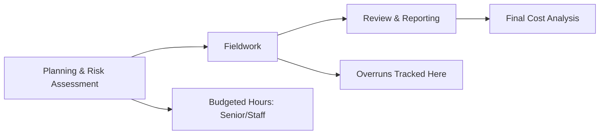

## 3.6 Engagement Economics (Staffing, Budgets, and Scheduling)

In any audit engagement, the effective and thoughtful coordination of people, time, and financial resources directly influences the audit’s quality, profitability, and overall success. Proper engagement economics help mitigate risks of cost overruns, ensure that deadlines are met, and maintain a high standard of audit work to meet professional requirements. This section explores the three key pillars of engagement economics—Staffing, Budgets, and Scheduling—providing a framework for allocating resources and controlling costs.

---

### 1. Staffing and Resource Allocation

Assigning the right team to an audit engagement is critical. Not only must you ensure that the engagement team collectively has the technical skills and industry expertise, but you also need to align staff levels with the complexity of tasks. For example, allowing senior staff to do overly basic activities might inflate costs, whereas assigning inexperienced associates to overly complex tasks can compromise quality.

#### 1.1 Staff Composition

A balanced engagement might include:  
• Audit Associate (New Staff): Performs standard testing with close supervision.  
• Senior or In-Charge: Reviews associates’ work and ensures tasks align with the audit plan.  
• Manager: Oversees the engagement holistically, handles complex areas, and coordinates with specialists.  
• Partner: Ultimately responsible for risk, quality, and client relationships.

#### 1.2 Impact on Audit Quality

• Junior Staff Development: Assigning tasks to less experienced team members fosters their growth but requires adequate mentoring and review.  
• Specialist Input: Complex industries or account balances (e.g., derivatives, intangible assets) may require specialized valuations or IT professionals.  
• Balance of Skill Sets: Each team member should have defined roles aligned with their strengths and the audit’s risk areas.

#### 1.3 Measuring Staff Utilization

Staff utilization is the ratio of billable hours to total hours worked, serving as a key performance indicator for audit firms. Overstaffing can dilute profitability, while understaffing strains quality and deadlines.

> “AICPA’s Practice Management toolkit offers guidance on optimizing staff development and alignment for audit engagements, addressing both quality and profitability.”  

---

### 2. Budgeting

A well-prepared budget serves as a roadmap, delineating costs and time allocations so that the engagement team understands performance targets early on. Budgeting is more than a financial exercise: it helps set clear expectations and fosters accountability.

#### 2.1 Time Budgets

At the heart of most audit budgets is the time budget. Typically, an engagement’s phases—planning, fieldwork, wrap-up, and final review—are assigned estimated hours:

• Planning & Risk Assessment: Understanding the entity, including internal controls and preliminary analytical procedures.  
• Fieldwork: Substantive testing, controls testing, analytical work, and follow-up of exceptions.  
• Review & Reporting: Final review of the engagement file, drafting the auditor’s report, and final partner review.  

These estimates break down into hours by personnel level (e.g., senior, staff, specialist) to project total engagement hours. Accurate estimates are critical to avoid either running out of time (jeopardizing quality) or over-allocating resources (harming profitability).

Below is a simple mermaid diagram illustrating how audit work hours might be allocated per phase:

In this flowchart, time budgets guide overall engagement flow. Monitoring these allocations at each stage helps maintain quality and profitability.

#### 2.2 Cost Management

Failing to adhere to the budget can significantly reduce engagement profitability. Common pitfalls include:  

• Underestimation of complexity: If unusual transactions or compliance requirements arise, actual hours can exceed forecasts.  
• Scope Creep: Additional requests from the client, such as expanded testing or special reviews, can drive up hours if not properly managed.  
• Inefficiencies in Review Process: Rework or repeated reviews can inflate costs and erode staff morale.

When budgets prove unrealistic, audit teams may face pressure to cut corners—which may compromise audit quality, lead to reduced public trust, and in extreme cases, result in professional liability.

---

### 3. Scheduling

Scheduling considerations ensure that your plan is executable within the deadlines set by regulations or the client’s internal needs. Misalignment between client readiness (e.g., late general ledger closings) and staff availability can create last-minute pressures, increasing the chance of errors.

#### 3.1 Timing Considerations

• Seasonal Demand: Many firms face peak workloads in certain months (e.g., busy season for December 31 year-ends).  
• Client Events: Inventory counts, interim financial statement procedures, and specialized testing must be synchronized with client availability.  
• Public vs. Private Clients: Public companies follow strict filing deadlines for 10-K and 10-Q reports (refer to the [SEC Filings Calendar](https://www.sec.gov/) for deadlines). Private companies may have more flexibility but often have contractual or banking covenant timelines.

#### 3.2 Managing Deadlines

Public companies require timely filing of audited financial statements, so missed deadlines can carry legal repercussions, reputational damage, and regulatory scrutiny:

• **SEC Filing Deadlines**: For public clients in the United States, annual financial statements (Form 10-K) typically must be filed within 60 to 90 days after the fiscal year-end, depending on the issuer’s size. Interim financials (Form 10-Q) deadlines vary between 40 to 45 days.  
• **Project Management Tools**: Tools like Microsoft Project, Asana, or Trello are frequently used to map tasks, assign responsibilities, and track progress. *CPA Practice Advisor* includes articles highlighting how these tools streamline scheduling and resource management.  

---

### 4. Coordination with Specialists

In today’s increasingly complex audit environment—especially for IT system audits, valuations, or emerging standards—coordinating with specialists is common. Engaging these experts often entails additional planning and budgeting to ensure their fees and time are properly accounted for.

#### 4.1 Types of Specialists

• IT Audit Specialists: Evaluate complex data systems and automated controls.  
• Valuation Experts: Assess fair value measurements for real estate, intangibles, or financial instruments.  
• Industry Specialists: Offer insights into sector nuances, typical risks, and regulatory requirements.  

#### 4.2 Budgeting for Specialist Involvement

Scope out the specialist’s function early in the engagement. Include hours for:  
1. Planning calls to define scope and deliverables.  
2. Reviewing the specialist’s approach and draft reports.  
3. Integrating specialist findings into management letters or the final audit report.

Costs for specialized services are typically higher than standard staff rates, so these should be factored in during the budgeting and scheduling phases to avoid last-minute budget overruns.

---

### Practical Example

Imagine a mid-sized manufacturing client with a significant inventory process and multiple production facilities:

1. The audit partner anticipates complex valuation and costing issues. They bring in an industry specialist to guide the engagement team about typical manufacturing cost flows.  
2. The engagement manager secures a time budget of 400 hours:  
   - 50 hours for initial planning and risk assessment.  
   - 300 hours for fieldwork (on-site inventory observations across three plants and testing relevant controls).  
   - 50 hours for final review and report issuance.  
3. A staff-level time budget is allocated to advanced analytics software usage for inventory turnover testing. This helps identify anomalies early and reduces manual sampling.  
4. Scheduling is carefully arranged to coincide with the client’s quarterly inventory counts, allowing the team adequate time to validate existence and completeness.  
5. All specialists’ work (particularly for intangible asset valuation and inventory costing) is built into the schedule with well-defined deliverables.  

Close monitoring of staff hours, the need for additional testing, and any potential scope expansion (e.g., inaccurate records requiring re-auditing) helps keep the engagement on track and on budget.  

---

### Best Practices & Common Pitfalls

• **Best Practices**  
  1. Perform regular budget-to-actual tracking throughout the engagement.  
  2. Maintain clear lines of communication with the client regarding timeline expectations.  
  3. Provide timely feedback to staff to avoid repeated errors.  
  4. Anticipate peak workloads and involve specialists early.  
  5. Use project management software and maintain a simplified, collaborative environment.  

• **Common Pitfalls**  
  1. Setting overly optimistic budgets and underestimating complexities.  
  2. Delaying specialist engagement until late in the fieldwork phase.  
  3. Inflexible schedules that do not accommodate client or regulatory surprises.  
  4. Inadequate senior review time, leading to cost overruns due to rework.  

---

### Key Terms and Glossary

• **Time Budget (Audit Engagement)**: A schedule of estimated hours by task and rank, continuously monitored for variances.  
• **Staff Utilization**: The share of billable hours in staff timesheets, indicating how effectively staff time is spent on client projects relative to overhead tasks.  
• **Deadlines (Regulatory)**: Legally mandated filing and issuance dates for external financial statements. For U.S. public companies, deadlines coincide with Forms 10-K and 10-Q.

---

### References and Additional Resources

• **AICPA’s Practice Management Toolkit** — Offers best practices for budgeting, staffing, and resource allocation for CPA firms.  
• [SEC Filings Calendar](https://www.sec.gov/) — Key deadlines for annual (10-K) and quarterly (10-Q) filings for publicly traded entities.  
• “Audit Efficiency & Profitability: Key Strategies for CPAs,” published in the Journal of Accountancy.  
• Articles in *CPA Practice Advisor* on project management tools (e.g., Microsoft Project, Trello, Asana) to optimize workflow in CPA firms.

---

## Engagement Economics Knowledge Check: Budgeting, Staffing, and Scheduling Quiz



### Which of the following is the most critical element in aligning staff with tasks?

- [ ] The least experienced staff should manage project timelines for learning opportunities.  
- [x] Ensuring the right staff level is allocated to tasks that match their skills and complexity.  
- [ ] Staff should always rotate tasks daily to achieve broader exposure.  
- [ ] Only managers should oversee all planning and fieldwork details.  

> **Explanation:** Staff allocation aligns skills with job complexity. Overly experienced staff on routine tasks can be expensive, while insufficiently skilled staff risk lowering audit quality.

### Which of the following best describes the purpose of a time budget in an audit engagement?

- [x] Estimating the hours and related costs for each engagement phase.  
- [ ] Making sure every senior staff member works overtime.  
- [ ] Establishing mandatory overtime policies.  
- [ ] Avoiding specialist involvement in complex areas.  

> **Explanation:** A time budget sets target hours for each phase of an audit, guiding staff on proper allocation and avoiding scope creep or inefficiencies.

### In the context of scheduling an audit, which statement is most accurate?

- [ ] Scheduling only matters for public companies with strict SEC deadlines.  
- [ ] Scheduling cannot be changed once the engagement commences.  
- [x] Effective scheduling involves coordinating staff availability and client readiness to meet deadlines.  
- [ ] Deadlines no longer matter if cost overruns are minimal.  

> **Explanation:** Effective scheduling accounts for both firm resources and client timelines. Public companies have more rigid deadlines, but private clients often have pressing timelines as well.

### Why might an engagement team engage a valuation specialist?

- [x] To obtain reliable fair value assessments on complex financial instruments or intangible assets.  
- [ ] To handle every phase of the audit engagement.  
- [ ] To reduce the cost of the audit.  
- [ ] To delegate most testing tasks, including routine ones.  

> **Explanation:** Complex fair value measurements often require specialized knowledge, making valuation experts essential for accurate and compliant reporting.

### What is the major risk when budgets are unrealistic?

- [ ] The audit team may receive more overtime pay.  
- [ ] Clients automatically extend deadlines.  
- [x] Auditors may face pressure to cut corners, jeopardizing audit integrity.  
- [ ] Staff are never trained properly.  

> **Explanation:** Unrealistic budgets can drive audit teams to cut corners to remain profitable, posing serious risks to audit quality and professional liability.

### Which of the following is a best practice for managing staff utilization?

- [x] Monitoring billable vs. total hours regularly to ensure optimal workload distribution.  
- [ ] Requiring staff always to book 100% of their time on client engagements.  
- [ ] Preventing junior staff from working more than 10 hours a week.  
- [ ] Encouraging staff to never record hours for additional research.  

> **Explanation:** Staff utilization measures how effectively time is used. Tracking billable versus total hours helps identify training needs, potential overburden, or underutilization.

### Which scenario best illustrates “scope creep” on an audit?

- [ ] Adding an industry specialist at the planning stage.  
- [x] Client requests extra procedures outside the original engagement with no budget adjustment.  
- [ ] Reducing testing after verifying strong internal controls.  
- [ ] Using advanced data analytics to improve efficiency.  

> **Explanation:** Scope creep involves additional tasks outside the original agreement without adjusting budget or deadlines, often leading to cost and time overruns.

### Which of the following is true regarding the use of project management tools (e.g., Microsoft Project, Trello) in an audit context?

- [x] They can help track milestones, staff assignments, and potential budget overruns.  
- [ ] They are strictly for IT professionals, not for the audit team.  
- [ ] They have no features to monitor staff availability.  
- [ ] They automatically fix scheduling conflicts without human intervention.  

> **Explanation:** Project management software provides transparency on deadlines, resource allocation, and costs across the audit lifecycle, aiding in real-time decision-making.

### What is a primary advantage of performing regular budget-to-actual reviews during the engagement?

- [ ] Ensuring managers do all the fieldwork.  
- [ ] Eliminating the need for a formal engagement letter.  
- [x] Identifying overruns or potential savings early, enabling timely corrective actions.  
- [ ] Avoiding the need for final partner review.  

> **Explanation:** Ongoing budget checks allow the team to address unanticipated complexities promptly, modify staffing if needed, and prevent late-stage surprises.

### The proper scheduling of audit fieldwork for a manufacturing client primarily aims to:

- [x] Align staff availability with the client’s production cycle and inventory counts.  
- [ ] Force the client to complete year-end tasks immediately after the fiscal year-end.  
- [ ] Avoid all downtime for staff.  
- [ ] Move all testing to the final week before the audit report is due.  

> **Explanation:** Scheduling must align with critical client processes (e.g., inventory counts) and staff availability for effective, timely audit completion.



---

## For Additional Practice and Deeper Preparation

**[Auditing & Attestation CPA Mock Exams (AUD): Comprehensive Prep](https://www.udemy.com/course/aud-cpa-mock-exams/?referralCode=D064EF7BD4A84FC6403D)**  
• Tackle full-length mock exams designed to mirror real AUD questions—from risk assessment and ethics to internal control and substantive procedures.  
• Refine your exam-day strategies with detailed, step-by-step solutions for every scenario.  
• Explore in-depth rationales that reinforce understanding of higher-level concepts, giving you a decisive edge on test day.  
• Boost confidence and reduce exam anxiety by building mastery of the wide-ranging AUD blueprint.  

_Disclaimer: This course is not endorsed by or affiliated with the AICPA, NASBA, or any official CPA Examination authority. All content is created solely for educational and preparatory purposes._
