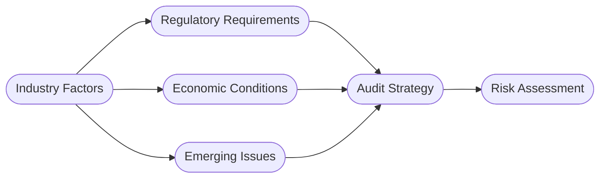

## 4.1 Industry and Regulatory Influences

When conducting an audit, understanding the entity’s industry and the regulatory environment in which it operates is vital to accurately assess risks and tailor audit procedures. Different sectors—from retail to technology—feature distinct operational, financial, and compliance characteristics. Moreover, an evolving framework of regulations can significantly impact an organization’s reporting obligations, internal controls, and disclosure requirements. This chapter delves into how industry- and regulatory-specific factors shape an auditor’s risk assessment and overall audit strategy.

---

## Importance of Industry Awareness

### Unique Cycles and Competitive Pressures
• Different industries have varying business cycles and competitive landscapes. For example:
  – Retail: Seasonal peaks during holiday periods, which can impact revenue recognition, inventory turnover, and staffing costs.  
  – Manufacturing: Fluctuations driven by supply chain complexities, raw material price changes, and technology upgrades.  
  – Software: Multiple-element revenue recognition arrangements, subscription-based models, and intangible asset considerations (e.g., intellectual property).  

A deep understanding of these cycles helps auditors identify areas that may exhibit elevated risks, including potential revenue misstatements or inventory obsolescence.

### Industry-Specific Accounting Considerations
• GAAP (Generally Accepted Accounting Principles) or IFRS (International Financial Reporting Standards) often imposes special reporting requirements for certain transactions (e.g., percentage of completion in construction, capitalization of software development costs in technology firms).  
• Industry benchmarks and key performance indicators (KPIs) can highlight outliers. For instance, in retail, an auditor might compare the client’s gross margin ratio to industry benchmarks. Significant deviations can point to misstatements, fraud, or operational inefficiencies.

### Learning Through Practical Example

Imagine an audit engagement with a regional grocery chain experiencing strong competition from discount retailers. The auditor’s understanding of price wars, promotional discounts, and seasonal surges in demand provides insight into revenue recognition timing, inventory costing, and potential operational inefficiencies. This industry-specific knowledge informs risk assessment and helps shape exact procedures for testing sales cutoffs, shrinkage rates, and more.

---

## Regulatory Requirements

### Oversight Bodies and Reporting Obligations
• Public Companies (Issuers):  
  – Governed by the SEC, which mandates forms such as 10-K (annual) and 10-Q (quarterly).  
  – The Sarbanes-Oxley Act underscores enhanced internal control documentation and attestation by management.  

• Specialized Entities:  
  – Government Auditing Standards (Yellow Book) apply when federal funds are involved.  
  – Nonprofit organizations may have distinct reporting requirements under state or federal agencies (e.g., Single Audits for entities receiving federal awards).  

### Impact on Audit Approach
• The level of regulation influences the extent and nature of disclosures in financial statements (e.g., certain industries must disclose capital expenditure plans or operational metrics).
• Auditors need to assess compliance with industry-specific laws or regulations. Noncompliance could lead to fines, operational shutdowns, or reputational damage, all of which influence inherent risk.

---

## Economic Conditions

### Macro-Level Economic Indicators
• Interest Rates, Unemployment, and Inflation: These indicators influence an entity’s cost of capital, consumer spending, and overall business performance.  
• Exchange Rate Fluctuations: For entities operating internationally, currency volatility may significantly affect asset valuations, revenue recognition, and hedging activities.

### Micro-Level Factors
• Local Competition and Consumer Trends: High competition may pressure margins, incentivize aggressive accounting, or lead to more frequent promotional campaigns.  
• Supply and Demand Constraints: Shortages in raw materials can drive up costs and lead to gross margin pressure or potential inventory write-downs.

#### Case Study Example
Consider a manufacturer of electronic components operating in a market grappling with a global semiconductor shortage. This shortage inflates raw material costs, extends production timelines, and disrupts revenue cycles. The auditor needs to:

1. Investigate inventory valuations and evaluate whether management has properly accounted for rising costs and obsolescence.  
2. Assess sales contracts to confirm the correct timing of revenue recognition and whether any improvised “cost-plus” arrangements might lead to volatile margins.  

---

## Emerging Issues

### ESG (Environmental, Social, and Governance)
• Enhanced Reporting: Stakeholders increasingly demand disclosures around carbon emissions, social impact initiatives, and governance structure.  
• New Risks: Auditors might need to evaluate non-financial metrics such as sustainability metrics or carbon offset programs for accuracy and compliance with relevant frameworks (e.g., Global Reporting Initiative, SASB Standards).

### Technological Disruptions
• AI, Automation, and Blockchain: These tools can transform core business operations, create new data sets, and introduce new control environments.  
• E-commerce Surge: Price-setting algorithms, digital payment systems, and global supply chains reshape the risk profile for retail or service-based entities.  

Staying apprised of emerging issues ensures that auditors address new risk areas promptly. It also necessitates ongoing professional education to maintain competency in rapidly evolving fields.

---

## Visualizing Industry and Regulatory Influences

Below is a simplified diagram showing how industry factors, regulatory requirements, economic conditions, and emerging issues converge to shape the auditor’s approach:

1. Industry Factors intersect with Regulatory Requirements, Economic Conditions, and Emerging Issues.  
2. All these factors collectively inform the Audit Strategy.  
3. The output of the strategy is a refined Risk Assessment that guides specific audit procedures.

---

## Best Practices and Practical Tips

1. Maintain an “Industry File”:  
   – Auditors benefit from storing sector-specific information, critical metrics, and regulatory updates in a centralized knowledge base for quick reference.

2. Build a Network of Industry Experts:  
   – Collaborate with specialists—not only for valuations or IT but also for sector-specific regulations. This approach is particularly relevant when auditing highly regulated or specialized industries (e.g., healthcare, financial services, energy).

3. Perform Targeted Analytical Reviews:  
   – Compare the client’s ratios and metrics to industry benchmarks.  
   – Investigate any material departures, as they often highlight potential risks or areas prone to misstatement.

4. Stay Current with Regulatory Changes:  
   – Subscribe to newsletters or attend webinars from leading auditing and regulatory bodies (e.g., AICPA, PCAOB, SEC).  
   – Continuously update your understanding of laws and standards that affect the industries you serve.

5. Leverage Emerging Audit Tools:  
   – Integrate data analytics for real-time monitoring of transactions, especially in high-volume environments (e.g., e-commerce).  
   – Consider AI-driven tools to identify unusual patterns or anomalies in large datasets.

---

## Glossary

• **Regulatory Oversight**: Government or industry bodies (e.g., SEC, PCAOB, GAO) that mandate and enforce standards for financial reporting.  
• **Industry Benchmarks**: Standardized metrics or ratios used to compare a client’s performance against sector norms (e.g., gross margin in retail, churn rate in subscription services).  
• **ESG**: Environmental, Social, and Governance. An evolving area where organizations report on sustainability, social responsibility, and governance practices.

---

## References and Resources

### Official References
• [SEC Filings & Forms](https://www.sec.gov/forms): Access the latest versions of annual and quarterly filing requirements for publicly traded companies.  
• GAO “Government Auditing Standards” (the Yellow Book): Required for audits involving government funding or federal programs.

### Additional Resources
• AICPA Whitepapers: Search “Auditing Your Client’s Industry” on [aicpa.org](https://www.aicpa.org) for specialized insights.  
• Industry-Specific Newsletters and Business Intelligence: Deloitte’s “On the Board’s Agenda” provides regular updates on regulatory trends, market outlooks, and governance practices.  

---

## Industry and Regulatory Influences: Knowledge Check



### Which of the following is an example of a factor that auditors should consider when evaluating industry influences?

- [x] Seasonal fluctuations specific to a client’s line of business
- [ ] The colors used in the client’s marketing materials
- [ ] The design of the client’s office spaces
- [ ] The client’s choice of in-house or outsourced janitorial services

> **Explanation:** Seasonal fluctuations—such as those in retail—directly affect revenue timing, inventory management, and staffing costs, making them relevant to an auditor’s risk assessment.

### How do industry benchmarks aid an auditor during the planning phase?

- [x] They help in identifying unusual trends or deviations that may indicate areas of higher misstatement risk.
- [ ] They serve as replacements for GAAP or IFRS in preparing financial statements.
- [ ] They eliminate the need for substantive testing by providing conclusive evidence of financial statement accuracy.
- [ ] They ensure all audits are planned identically, regardless of company size.

> **Explanation:** Industry benchmarks guide auditors in evaluating financial performance metrics (e.g., gross margin, turnover ratios), directing attention to possible abnormalities or misstatements.

### Under Government Auditing Standards (Yellow Book), an auditor must particularly focus on:

- [x] Compliance with laws, regulations, and the use of federal funds.
- [ ] Exclusively on internal controls for pyramid schemes.
- [ ] Only on commercial real estate valuations.
- [ ] Deregulation policies in foreign markets.

> **Explanation:** The Yellow Book requires additional procedures for entities receiving federal funding, emphasizing compliance and proper management of public resources.

### A severe shortage of raw materials due to economic instability would most likely affect:

- [x] Inventory valuation and cost of goods sold.
- [ ] The format of the engagement letter.
- [ ] How disclaimers are added to the auditor’s report.
- [ ] The necessity of prior period adjustments.

> **Explanation:** Rising input costs and scarcity can escalate inventory valuation risks and make cost components harder to determine precisely, thus affecting COGS calculations.

### If a technology company rapidly adopts artificial intelligence across its manufacturing processes, which new type of risk might become more prominent?

- [x] IT general control risk related to system integrity and potential automation errors.
- [ ] Lower demand risk since AI eliminates workforce redundancies.
- [ ] Reduced compliance risk for government grants.
- [ ] Decreased reliance on external auditors.

> **Explanation:** Rapid shifts to AI-based processes can change the control environment, with increased dependence on program logic and system maintenance.

### Which of the following best illustrates an emerging ESG concern that may affect audit procedures?

- [x] Verifying carbon emission data reported to stakeholders.
- [ ] Assessing brand awareness in a local market.
- [ ] Standardizing office furniture procurement.
- [ ] Reviewing management’s selection for conference venues.

> **Explanation:** With ESG, auditors may need to evaluate the accuracy of non-financial metrics, such as carbon emissions, significant to investors and regulatory bodies.

### How can data analytics transform the audit process regarding industry-specific testing?

- [x] By enabling real-time analysis of transaction flows for unusual trends or outliers.
- [ ] By fully replacing human judgment in estimating inventory obsolescence.
- [ ] By ensuring an audit opinion is always unqualified.
- [ ] By making all financial reporting standards redundant.

> **Explanation:** Data analytics improves efficiency and insight, helping auditors promptly spot irregularities; it does not replace professional judgment.

### When considering local economic factors, an auditor would be most concerned with:

- [x] The presence of new competitors influencing market share.
- [ ] The color palette of the company’s branding materials.
- [ ] The entity’s holiday party budget.
- [ ] The fund-raising strategies of the local high school.

> **Explanation:** The entry or expansion of competitors affects revenue trends and can indicate a higher risk of misstatements or fraud under pressures such as price wars.

### In a heavily regulated industry (e.g., healthcare), what might be an additional step for the auditor?

- [x] Reviewing compliance with specific laws and regulations tied to patient data security or reimbursement rules.
- [ ] Only using analytical procedures and ignoring test-of-controls due to regulatory oversight.
- [ ] Restricting scope exclusively to routine transactions.
- [ ] Issuing a disclaimer without conducting fieldwork.

> **Explanation:** Industries like healthcare demand additional consideration of regulations (e.g., HIPAA compliance, Medicare rules), influencing the nature and extent of testing.

### The risk of material misstatement is generally higher in volatile economic climates. True or False?

- [x] True
- [ ] False

> **Explanation:** During economic volatility, operational uncertainties, liquidity concerns, or asset valuation complexities can increase the likelihood of misstatements.



---

## For Additional Practice and Deeper Preparation

**[Auditing & Attestation CPA Mock Exams (AUD): Comprehensive Prep](https://www.udemy.com/course/aud-cpa-mock-exams/?referralCode=D064EF7BD4A84FC6403D)**  
• Tackle full-length mock exams designed to mirror real AUD questions—from risk assessment and ethics to internal control and substantive procedures.  
• Refine your exam-day strategies with detailed, step-by-step solutions for every scenario.  
• Explore in-depth rationales that reinforce understanding of higher-level concepts, giving you a decisive edge on test day.  
• Boost confidence and reduce exam anxiety by building mastery of the wide-ranging AUD blueprint.

_Disclaimer: This course is not endorsed by or affiliated with the AICPA, NASBA, or any official CPA Examination authority. All content is created solely for educational and preparatory purposes._
