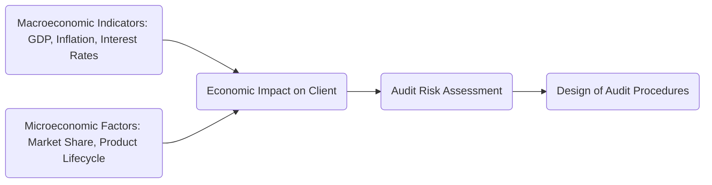

## 4.2 Economic and Market Conditions

When assessing risk in an audit, it is crucial to understand the economic and market conditions in which an entity operates. This requires evaluating both external and internal factors—from global interest rates and gross domestic product (GDP) growth to client-specific marketing strategies. Changes in these areas can directly affect a company’s financial stability, operating performance, and the susceptibility of financial statements to misstatement.

The goal of this section is to guide auditors through the evaluation of macroeconomic and microeconomic factors, highlighting how changes in economic and market environments can create incentives or pressures for management that may lead to misstatements. It also underscores the complexities that arise when organizations operate internationally, exploring currency and political risks that auditors must address.

-------------------------------------------------------------------------------

### 1. Macroeconomic Indicators

Macroeconomic indicators reflect broad economic trends and conditions. They are often leading or lagging signals that can shape how businesses plan their operations and forecast financial outcomes. For auditors, these indicators offer insight into potential risk areas, providing a backdrop against which a client’s performance can be understood.

#### 1.1 GDP Growth Rates
• GDP (Gross Domestic Product) growth rates indicate the pace at which an economy is expanding or contracting.  
• Rapid GDP growth may lead to higher corporate revenues, but it can also mask emerging risks (e.g., overleveraging or inflated asset values).  
• A declining or recessionary GDP environment often puts pressure on liquidity and solvency, thereby increasing the risk of financial misstatement—particularly surrounding inventory valuations and accounts receivable collections.

#### 1.2 Interest Rate Fluctuations
• When interest rates rise, the cost of borrowing increases, potentially impacting a client’s ability to finance operations.  
• High interest rates may lead to lower consumer spending in interest-sensitive sectors (e.g., housing, automotive).  
• Decreasing interest rates could stimulate expansion but might also encourage overinvestment in speculative ventures. This can result in overstated assets if businesses do not accurately account for impairments or obsolete inventory.

#### 1.3 Inflation Levels
• Inflation reflects the general price level increase over time. In moderate doses, it signals economic growth; however, high or volatile inflation can distort revenue and expense recognition.  
• Hyper-inflationary environments, frequently encountered in certain global markets, can create unique audit challenges such as the remeasurement of financial statements into stable currency denominations.

#### 1.4 Currency Exchange Stability
• Currency exchange rates affect entities with global supply chains and cross-border revenue streams.  
• Rapid currency fluctuations can cause large swings in profitability, heavily influencing the valuation of foreign assets and liabilities.  
• Auditors must verify the accuracy of currency translation adjustments, ensuring proper disclosure of gains or losses in the financial statements.

-------------------------------------------------------------------------------

### 2. Microeconomic Factors

Microeconomic factors zoom in on the client’s operational and competitive environment. While macro data sets the broader stage, company-specific details can reveal performance drivers, vulnerabilities, and potential misstatement risks.

#### 2.1 Market Share and Competitive Strategy
• An organization’s current market share and strategic positioning may indicate growth potential or highlight vulnerabilities.  
• Overly aggressive sales strategies to retain or grow market share might lead to premature revenue recognition or channel stuffing—where distributors are overloaded with inventory near period-end.

#### 2.2 Product Lifecycle and Innovation
• Where a product sits in its lifecycle (introduction, growth, maturity, decline) shapes revenue patterns and associated risks.  
• A company with products in the decline phase faces higher risk of obsolete inventory, necessitating adequate valuation reserves.  
• Innovative businesses may capitalize on intangible assets such as patents and R&D expenditures, requiring careful examination of capitalization criteria and impairment.

#### 2.3 Supply Chain Resilience
• Interruptions in raw materials or component availability can have direct effects on production costs, shipping expenses, and fulfillment obligations.  
• Fraud risk might escalate if management manipulates records to obscure operational inefficiencies or supply chain disruptions (e.g., falsified inventory counts to mask shortages).

-------------------------------------------------------------------------------

### 3. Risk of Overstatement or Understatement

Economic and market conditions influence motivations for presenting local or global operations in a certain light. Two significant types of misstatements that auditors should watch for include overstatement and understatement.

#### 3.1 Overstatement
• Strong markets or high-performance targets can push management to artificially inflate revenues or assets to maintain stock prices or meet investor expectations.  
• Overstatement can also occur when entities delay the recognition of expenses, thereby boosting reported net income.

#### 3.2 Understatement
• When facing weaker markets, management might under-record liabilities or gloss over necessary impairments to preserve perceived financial stability.  
• Loan covenants or debt agreements may create incentives to mask poor performance. Understatement of expenses or liabilities could help a firm maintain compliance with financial ratio thresholds.

-------------------------------------------------------------------------------

### 4. Cross-Border Operations

Entities with a presence in multiple jurisdictions often encounter additional layers of complexity. Auditors need to examine how global operations, currency conversions, and political conditions factor into financial accounts and disclosures.

#### 4.1 Currency Rate Fluctuations and Transfer Pricing
• When subsidiaries operate in countries with volatile currencies, conversion processes must be accurate and transparent.  
• Transfer pricing regulations demand that related-party transactions comply with local laws and international guidelines. Improper transfer pricing can lead to tax liabilities, penalties, or misrepresentations of intercompany sales.

#### 4.2 Political and Country Risks
• Geopolitical instability—such as trade embargoes, sanctions, or regional conflicts—affects asset recoverability, supply chains, and operational continuity.  
• Auditors should determine whether management has adequately disclosed the impact of country-specific risks in the entity’s financial statements.

#### 4.3 GAAP vs. IFRS Considerations
• Subsidiaries operating under International Financial Reporting Standards (IFRS) must reconcile their financial statements if the parent company follows U.S. GAAP (or vice versa).  
• A thorough review of local regulatory requirements ensures that consolidated statements are free from gaps or inconsistencies.

-------------------------------------------------------------------------------

### Diagram: Factors Influencing Audit Risk

Below is a simplified Mermaid diagram illustrating how macroeconomic and microeconomic factors collectively impact an entity’s financial statements and, consequently, influence audit risk.

**Explanation:**
1. Macroeconomic indicators (A) combine with microeconomic factors (C) to shape the overall economic impact on the client (B).  
2. These conditions feed into the auditor’s risk assessment (D).  
3. Based on the identified risks, the auditor designs targeted procedures (E) to detect potential misstatements.

-------------------------------------------------------------------------------

### Practical Considerations and Best Practices

1. **Maintain Current Economic Data**  
   – Regularly monitor reputable economic data sources (e.g., Bureau of Economic Analysis, Federal Reserve) for real-time updates on GDP, interest rates, and inflation trends.

2. **Industry-Specific Analysis**  
   – Different industries respond uniquely to economic cycles. An energy company, for example, may be highly sensitive to commodity prices, while a retail entity may depend on discretionary consumer spending.

3. **Engage Specialists Where Needed**  
   – For complex areas such as cross-border operations or specialized industries, consider resorting to valuation experts or tax professionals to assess specialized risks like transfer pricing.

4. **Continuously Evaluate Materiality**  
   – Economic changes can affect the significance of certain accounts or disclosures. Auditors should reassess materiality thresholds if it appears that allocated tolerances are no longer appropriate.

5. **Document the Rationale in Working Papers**  
   – Ensure working papers explicitly describe how macroeconomic and microeconomic considerations influenced the determination of significant accounts, the assessed level of risk, and the design of related procedures.

-------------------------------------------------------------------------------

### Glossary

• **Real GDP**: A measure of national (or regional) economic output adjusted for inflation, providing insight into real growth trends without price-level distortions.  
• **Currency Translation Adjustments**: Gains or losses recognized when converting the financial statements of foreign subsidiaries into the parent’s reporting currency.  
• **Tariffs/Quotas**: Forms of trade barriers that can raise costs, alter supply dynamics, and affect overall profitability.

-------------------------------------------------------------------------------

### References and Resources

• **U.S. Bureau of Economic Analysis** (https://www.bea.gov/) – Comprehensive data on GDP, trade, and sector-specific economic performance.  
• **Federal Reserve Economic Data (FRED)** (https://fred.stlouisfed.org/) – A wide array of economic indicators, including interest rates, employment, and monetary statistics.  
• “Audit Implications of Global Economic Shifts” in *The CPA Journal* – Detailed guide on how macroeconomic changes affect audit risks.  
• **AICPA** and **Institute of Internal Auditors (IIA)** – Offer courses on “Audit Approaches in Recessionary Economies” and emerging audit practices.

-------------------------------------------------------------------------------

## Quiz: Economic and Market Conditions for Auditors



### How do changes in GDP growth rates typically affect a company’s audit risk?
- [ ] Lower GDP growth rates always reduce audit risk.
- [x] Both rapidly rising and declining GDP growth rates can create unique audit risks.
- [ ] GDP growth rates do not impact audit risk at all.
- [ ] GDP growth rates are only relevant for governmental audits.

> **Explanation:** GDP growth rates, whether positive or negative, can influence a client’s financial stability and potential incentives for misstatement (e.g., hiding losses during a slowdown or over-aggressive revenue recognition in a boom).

### Which of the following represents a potential macroeconomic indicator that an auditor should monitor?
- [x] Interest rate fluctuations.
- [ ] Management’s personal investment portfolio.
- [ ] The client’s organizational chart.
- [ ] The cost of minor office supplies.

> **Explanation:** Interest rate fluctuations are a key macroeconomic indicator that can affect borrowing, consumer spending, and business investment, thus impacting the audit.

### Why might an auditor pay extra attention to inventory in a declining market environment?
- [x] There is a higher risk of obsolete or slow-moving inventory leading to valuation issues.
- [ ] Low market demand never affects inventory valuations.
- [ ] Companies in declining markets always overstate inventory on purpose.
- [ ] Auditors are not required to examine inventory in a declining market.

> **Explanation:** In a declining market, reduced demand can leave businesses with unsold or outdated inventory, which raises the risk of overvaluation and requires closer audit scrutiny.

### What is a common risk associated with cross-border operations?
- [x] Currency rate fluctuations influencing financial statement translation.
- [ ] Overly simplistic local reporting standards.
- [ ] Guaranteed profitability in foreign markets.
- [ ] Elimination of the need for an external audit.

> **Explanation:** Currency volatility in cross-border operations can significantly impact valuations and create translation adjustments, posing additional layers of risk for auditors to evaluate.

### Which scenario might emphasize the risk of revenue overstatement?
- [x] A management team under pressure to meet ambitious growth targets in a strong market.
- [ ] A stable environment with no performance pressures.
- [x] A marketing department offering aggressive sales incentives.
- [ ] A management team with no equity compensation.

> **Explanation:** When markets are strong or management faces high growth expectations, there can be pressure to overstate revenues or inflate figures to satisfy stakeholders.

### Which factor exemplifies a key microeconomic risk during an audit?
- [x] The product’s stage in its lifecycle.
- [ ] The national unemployment rate.
- [ ] Global inflation trends.
- [ ] The Federal Reserve’s policy announcements.

> **Explanation:** The product’s lifecycle is a microeconomic consideration directly impacting valuation and revenue timings. While macro trends are critical, micro-level factors give insights into a company’s operational realities.

### Why might a politically unstable region pose an audit challenge for an organization with a subsidiary there?
- [x] Unpredictable regulations and exchange controls could affect asset valuation.
- [ ] Political instability guarantees tax breaks.
- [x] Heightened risk of supply chain disruptions.
- [ ] All financial statements are automatically exempt from GAAP.

> **Explanation:** Political volatility can lead to uncertain regulations, currency restrictions, or disruptions in operations that complicate financial reporting and audit procedures.

### Which of the following is an example of how currency exchange stability can affect an audit?
- [x] Translating foreign subsidiary accounts might produce large gains or losses.
- [ ] Currency exchange rates within stable countries are unimportant.
- [ ] All global transactions are unaffected by currency fluctuations.
- [ ] Exchange rates only impact intangible assets.

> **Explanation:** Currency fluctuations can lead to significant gains or losses on translation. Auditors must verify these adjustments for correct recognition and disclosure.

### Which of these could be a potential reason for understatement of liabilities during tough economic periods?
- [x] Avoiding debt covenant breaches.
- [ ] Demonstrating artificially higher market share.
- [ ] Complying with all GAAP requirements.
- [ ] Oversubscribing to intangible assets.

> **Explanation:** Understatement of liabilities might be motivated by the desire to appear more solvent or meet certain financial ratio covenants in difficult conditions.

### True or False: Auditors only need to consider microeconomic factors when developing their audit procedures.
- [ ] True
- [x] False

> **Explanation:** Auditors must consider both macroeconomic and microeconomic factors in order to develop comprehensive risk assessments and audit plans.



-------------------------------------------------------------------------------

## For Additional Practice and Deeper Preparation

**[Auditing & Attestation CPA Mock Exams (AUD): Comprehensive Prep](https://www.udemy.com/course/aud-cpa-mock-exams/?referralCode=D064EF7BD4A84FC6403D)**  
• Tackle full-length mock exams designed to mirror real AUD questions—from risk assessment and ethics to internal control and substantive procedures.  
• Refine your exam-day strategies with detailed, step-by-step solutions for every scenario.  
• Explore in-depth rationales that reinforce understanding of higher-level concepts, giving you a decisive edge on test day.  
• Boost confidence and reduce exam anxiety by building mastery of the wide-ranging AUD blueprint.

_Disclaimer: This course is not endorsed by or affiliated with the AICPA, NASBA, or any official CPA Examination authority. All content is created solely for educational and preparatory purposes._
