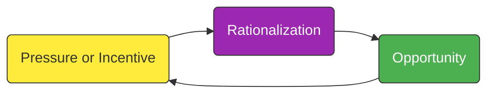
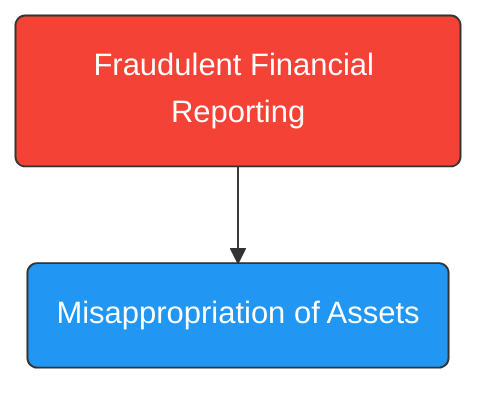

## 4.4 Fraud Risk Factors (Fraud Triangle, Pressure and Opportunity)

Fraud can manifest in numerous ways within an organization, and auditors must be diligent in detecting and preventing its occurrence. For CPA candidates and practitioners alike, understanding the Fraud Triangle is essential in evaluating a client’s risk environment. The Fraud Triangle consists of three primary components—Pressure (or Incentive), Opportunity, and Rationalization—that collectively contribute to fraudulent behavior. In addition, recognizing key fraud red flags and knowing how to assess fraud risk enable the auditor to implement more effective audit procedures and maintain professional skepticism.

In this section, we will:

• Examine in detail the three elements of the Fraud Triangle.  
• Identify red flags that may signal potential fraudulent activities.  
• Discuss brainstorming and the processes for assessing fraud risk.  
• Compare and contrast different types of fraud, such as fraudulent financial reporting and misappropriation of assets.

-----------------------------------
## 1. The Fraud Triangle

The Fraud Triangle provides a conceptual framework for understanding why individuals commit fraud. Each side of the triangle must typically be present in some form for fraudulent acts to ensue.

### 1.1 Pressure (or Incentive)
Pressure arises from personal or corporate challenges that push individuals—or management—to commit fraudulent acts. Examples include:  
• Financial pressures to meet earnings forecasts or debt covenants.  
• Personal pressures such as overwhelming medical expenses or personal debts.  
• External demands from investors, creditors, or regulatory agencies to achieve financial milestones.

Auditors should remain aware of any excessive emphasis on achieving financial results, as unrealistic targets can fuel fraudulent financial reporting. Similarly, personal matters can lead employees to rationalize actions like asset misappropriation to relieve financial stress.

### 1.2 Opportunity
Opportunity exists where internal controls are insufficient or overridden by those in positions of authority. Factors contributing to opportunity include:  
• Weak control environments, such as poor segregation of duties or inadequate oversight.  
• Dominant or autocratic management, making override of controls easier.  
• Collusion among employees that circumvents established policies.  
• Inadequate or infrequent internal audits and risk assessments.

A robust internal control environment can limit the opportunities for fraud by ensuring responsibilities are divided, approvals are required, and consistent monitoring takes place.

### 1.3 Rationalization
Rationalization involves the mental process by which an individual justifies fraudulent conduct. Common justifications include:  
• “I deserve this because I’m underpaid.”  
• “Everyone else is doing it; I’m just leveling the field.”  
• “It’s only temporary; I’ll fix the books next quarter.”  

Understanding rationalization helps the auditor remain sensitive to cultural or ethical red flags within an organization. Even if pressures exist and opportunities arise, without the capacity to rationalize the act, an individual might refrain from committing fraud.

-----------------------------------
## 2. Red Flags Signaling Potential Fraud

While the absence of red flags does not guarantee that fraud is not occurring, the presence of one or more red flags can trigger heightened scrutiny and more extensive audit procedures. Examples of common red flags include:

• Frequent last-minute or unexplained journal entries and adjustments.  
• Significant reliance on accounting estimates vulnerable to manipulation (e.g., intangible asset valuations).  
• Recurring “one-time” or “nonrecurring” charges and accruals every reporting period.  
• High turnover in key financial positions (e.g., CFO, Controller).  
• Domineering management style that discourages open communication.  
• Apparent disregard for internal control protocols and oversight.

Auditors should document these possible risk factors and investigate them further during the engagement, maintaining a skeptical mindset.

-----------------------------------
## 3. Assessing Fraud Risk

Assessing fraud risk is integral to planning and performing an effective audit. It involves team brainstorming, evaluating risk in terms of probability and impact, and identifying both financial reporting fraud and misappropriation of assets.

### 3.1 Brainstorming Sessions
AU-C Section 240 requires the engagement team to conduct brainstorming sessions to analyze possible fraud scenarios. Key considerations include:

• “What could go wrong?”: Identifying areas where financial statements might be misstated.  
• Past known control weaknesses: If prior audits discovered issues, reexamination is crucial.  
• Management’s tone at the top: Observing whether cultural or ethical concerns raise doubts about honesty and openness in financial reporting.

### 3.2 Evaluating Probability and Impact
Auditors should assess the likelihood of each identified fraud scenario and the corresponding potential material impact on the financial statements. This evaluation often considers:

• The complexity of transactions.  
• The susceptibility of certain accounts to manipulation (higher inherent risk).  
• The magnitude of potential misstatements in critical financial areas.  
• The pervasiveness of control overrides by management.

Where the probability and impact are high, in-depth substantive procedures or extended testing methods might be necessary.

-----------------------------------
## 4. Types of Fraud

Fraud can take various forms, broadly categorized into fraudulent financial reporting and misappropriation of assets. Understanding these distinctions enables auditors to tailor their procedures accordingly.

### 4.1 Fraudulent Financial Reporting
Fraudulent financial reporting typically occurs at higher management levels, where there is pressure to meet market expectations, boost stock prices, or maintain debt covenants. Common tactics include:

• Inflating revenues by recognizing them prematurely or creating fictitious sales.  
• Manipulating expense recognition, e.g., deferring current costs to future periods.  
• Concealing liabilities or misclassifying assets to improve financial ratios.  

In practice, auditors must evaluate the organization’s financial reporting processes, management’s track record, and the reasonableness of critical judgments, such as revenue recognition criteria or fair value measurement of complex assets.

### 4.2 Misappropriation of Assets
Misappropriation of assets typically occurs at lower organizational levels and can range from basic employee theft of inventory or supplies to elaborate cash disbursement schemes. Examples include:

• Skimming: Pocketing incoming payments before recording them.  
• Larceny: Stealing cash after it is recorded in the books.  
• Asset misuse: Using company equipment or resources for unauthorized personal gain.  
• Billing schemes: Creating fictitious vendors or inflating vendor invoices for personal benefit.

Auditors should pay close attention to the controls surrounding cash receipts, inventory management, and approval processes for expenses to mitigate the risk of misappropriation.

-----------------------------------
## 5. Practical Example: Pressure to Inflate Earnings

Imagine a manufacturing company, ABC Manufacturing, which must maintain a specific debt-to-equity ratio as part of its bank covenant. Due to an unexpected decline in demand, ABC is in danger of breaching the covenant. Under pressure, the CFO decides to recognize revenue prematurely by booking sales for partially completed orders that will only ship next quarter. The CFO justifies this by believing the product is “practically finished” and that the bank won’t investigate a small timing difference.

• Pressure: Meeting the bank covenant to avoid default.  
• Opportunity: Unscrutinized revenue cut-off procedures and lax internal review of shipping documents.  
• Rationalization: The CFO believes the company will finalize these shipments soon, or that this is a “temporary” fix.

This scenario highlights how the confluence of the Fraud Triangle elements can prompt management to commit financial statement fraud, threatening the integrity of the financial statements.

-----------------------------------
## 6. Best Practices and Common Pitfalls

### 6.1 Best Practices
• Ensure management establishes a strong tone at the top that emphasizes ethical conduct and personal accountability.  
• Maintain robust internal controls, including mandatory approvals and segregation of duties.  
• Conduct ongoing fraud awareness training sessions for employees.  
• Rotate roles in financial functions periodically to prevent collusion and detect irregularities.  
• Incorporate data analytics to track anomalies in large data sets, including unusual journal entries or unapproved changes to vendor master files.

### 6.2 Common Pitfalls
• Over-reliance on a strong control environment at the expense of skepticism (e.g., trusting certain executives based on past performance).  
• Insufficient documentation of fraud risk brainstorming sessions, leading to incomplete or disorganized assessments.  
• Failure to challenge management’s assumptions regarding aggressive accounting estimates.  
• Delayed or nonexistent responses to repeated red flags, which may worsen potential fraud issues over time.

-----------------------------------
## 7. References and Resources

• **Official References**  
  – [AU-C Section 240](https://www.aicpa.org/research/standards/auditattest/clarifiedsas.html) — “Consideration of Fraud in a Financial Statement Audit.”  

• **Additional Resources**  
  – [Association of Certified Fraud Examiners (ACFE)](https://www.acfe.com/) early detection tools and “Report to the Nations.”  
  – Data analytics platforms offering modules on fraud patterns and anomaly detection (e.g., specialized scripts analyzing general ledger data).  

For a deeper dive, you may consult fraud-specific literature, attend specialized webinars on emerging fraud trends, or explore advanced data analytics certifications.

-----------------------------------
## Fraud Risk Factors (Fraud Triangle) Quiz



### Which of the following best describes the “pressure” element within the Fraud Triangle?

- [ ] A weak system of internal controls within an organization.
- [x] Situations where personal or professional stress compels fraudulent actions.
- [ ] The justification process that employees use to commit fraud.
- [ ] The strict scrutiny required by external auditors during an audit.

> **Explanation:** “Pressure” refers to personal or professional circumstances that motivate individuals—often managers or employees—to partake in fraudulent activities.

### Select the common warning sign that might signal fraud in an organization:

- [ ] Strict adherence to all control procedures.
- [x] Numerous last-minute journal entries or adjustments.
- [ ] Lower-than-usual turnover of key financial personnel.
- [ ] Routine brainstorming sessions among the audit team.

> **Explanation:** Frequent last-minute adjustments are a typical red flag indicating potential manipulation of financial statements or cover-up of erroneous data.

### During a fraud brainstorming session, which of the following is generally considered?

- [x] “What could go wrong?” scenarios related to each account or transaction cycle.
- [ ] Detailed legal analysis of prior year lawsuits.
- [ ] Only the view of the senior partner in charge.
- [ ] Separating internal and external audit functions.

> **Explanation:** The auditing standards require engagement teams to evaluate various “what could go wrong” possibilities involving financial statements, control weaknesses, and management behaviors.

### What is a primary driver that leads to misappropriation of assets?

- [ ] Pressure from shareholders who want improved financial performance.
- [ ] Rationalization by upper management when under public scrutiny.
- [x] An opportunity arising from weak internal controls or lack of oversight.
- [ ] A short-term business downturn.

> **Explanation:** Misappropriation of assets typically occurs where opportunity exists due to weak controls, lack of oversight, or collusion among staff.

### Which best illustrates “rationalization” in the context of fraud?

- [ ] “Everyone else is doing it. I deserve this as well.”
- [x] “I am underpaid, so I will temporarily borrow from petty cash and repay it next month.”
- [x] “We need to report higher income this quarter so the bank doesn’t withdraw our credit line.”
- [ ] “I didn’t recognize this invoice because we have no record of the supplier.”

> **Explanation:** Rationalization involves justifying unethical behavior. Thinking “I’ll repay it,” or “Everyone does it,” exemplifies rationalization.

### What often distinguishes fraudulent financial reporting from misappropriation of assets?

- [ ] Misappropriation of assets takes place only under management’s instructions.
- [x] Fraudulent financial reporting typically involves top-level management manipulating the financial statements.
- [ ] Fraudulent financial reporting is always immaterial in size.
- [ ] Misappropriation of assets never involves collusion.

> **Explanation:** Management is more often associated with fraudulent financial reporting to enhance the appearance of financial results, whereas misappropriation of assets often occurs at lower organizational levels.

### Why are “significant, difficult-to-substantiate estimates” considered red flags?

- [ ] They are usually easy to audit thoroughly.
- [x] They provide an avenue for subjective judgments and manipulation of statements.
- [x] They can’t be used in financial statements under Generally Accepted Accounting Principles (GAAP).
- [ ] They rarely influence profits or losses.

> **Explanation:** Complex estimates (such as intangible asset or goodwill valuations) afford room for management bias and are vulnerable to manipulation, creating higher fraud risk.

### Which of the following is the best practice for reducing the “opportunity” for fraud?

- [x] Ensuring robust segregation of duties and frequent supervisory reviews.
- [ ] Eliminating brainstorming sessions from the fraud risk assessment.
- [ ] Reducing the rotation of individuals in critical financial roles.
- [ ] Enhancing pressure on sales staff to meet targets.

> **Explanation:** Adequate segregation of duties, frequent reviews, and role rotations diminish opportunities for fraud by preventing single individuals from controlling an entire process.

### When should auditors most intensively evaluate the risk of misappropriation of assets?

- [ ] Only during interim reviews.
- [ ] Immediately after the issuance of the financial statements.
- [x] During planning stages and throughout the audit whenever suspicious circumstances arise.
- [ ] Only when the annual inventory count reveals a minor discrepancy.

> **Explanation:** Because misappropriation can occur at any time, auditors should maintain vigilance throughout the entire audit process and respond to any irregularities promptly.

### The Fraud Triangle consists of three factors: Pressure, Opportunity, and _____.

- [x] Rationalization
- [ ] Explanation
- [ ] Fraud Risk
- [ ] Auditing Judgment

> **Explanation:** The three components of the Fraud Triangle are Pressure, Opportunity, and Rationalization, each of which must typically be present for fraud to occur.



-----------------------------------
## For Additional Practice and Deeper Preparation

**[Auditing & Attestation CPA Mock Exams (AUD): Comprehensive Prep](https://www.udemy.com/course/aud-cpa-mock-exams/?referralCode=D064EF7BD4A84FC6403D)**  
• Tackle full-length mock exams designed to mirror real AUD questions—from risk assessment and ethics to internal control and substantive procedures.  
• Refine your exam-day strategies with detailed, step-by-step solutions for every scenario.  
• Explore in-depth rationales that reinforce understanding of higher-level concepts, giving you a decisive edge on test day.  
• Boost confidence and reduce exam anxiety by building mastery of the wide-ranging AUD blueprint.

_Disclaimer: This course is not endorsed by or affiliated with the AICPA, NASBA, or any official CPA Examination authority. All content is created solely for educational and preparatory purposes._
