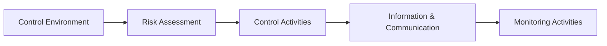

## 5.1 COSO Internal Control – Integrated Framework

In both financial reporting and broader organizational governance, effective internal control is crucial. The COSO (Committee of Sponsoring Organizations of the Treadway Commission) Internal Control – Integrated Framework is one of the most widely accepted models for assessing and enhancing internal control systems. This framework provides management, auditors, and other stakeholders with a comprehensive structure for understanding, designing, and evaluating controls that help an entity achieve its objectives.

This section explores the core elements of the COSO framework, including the five fundamental components and how they interact. It also examines the principles-based approach that underpins COSO, as well as the distinction between design effectiveness and operating effectiveness. By the end, you should have a clear understanding of how to apply COSO principles in a practical context, helping ensure the reliability of financial reporting, compliance with laws and regulations, and efficient operations within any organization.

---

## Overview of COSO

COSO was formed to assist in the fight against corporate fraud and to promote strong internal controls across various industries. It comprises five major professional associations:

• American Accounting Association (AAA)  
• American Institute of Certified Public Accountants (AICPA)  
• Financial Executives International (FEI)  
• Institute of Management Accountants (IMA)  
• Institute of Internal Auditors (IIA)  

Together, these bodies sought to create a unified framework that organizations of all sizes and complexities could use to fortify their internal control systems. The resulting “Internal Control—Integrated Framework” has since become a fundamental resource for regulators, practitioners, and academics worldwide.

---

## The Five Components of Internal Control

The COSO framework is organized around five interrelated components. While each component is distinct, they function as a cohesive system to support an organization’s objectives. Below is a visual summary using Mermaid.js:

### 1. Control Environment

The Control Environment sets the foundation and tone for an organization’s internal control structure. Sometimes referred to as the “tone at the top,” the Control Environment dictates the ethical culture, values, and integrity upon which all other components depend. Key factors include:

• Board and management’s commitment to sound ethics and integrity  
• Clear organizational structure, including lines of authority and responsibility  
• Policies for attracting and retaining competent employees  
• Management’s philosophy regarding risk-taking, communication, and supervision  

A strong Control Environment fosters a culture where employees understand the importance of internal controls, realize that ethical behavior is expected, and are encouraged to act responsibly in pursuit of the entity’s objectives.

### 2. Risk Assessment

Risk Assessment involves the ongoing process of identifying, evaluating, and prioritizing risks that could affect the achievement of an organization’s objectives. Key steps include:

• Understanding the internal and external factors that introduce risk (e.g., regulatory changes, economic volatility, technological disruptions)  
• Identifying significant accounts and transactions with high susceptibility to errors or fraud  
• Determining materiality thresholds for financial misstatements  
• Evaluating the severity of potential risk impacts and the likelihood of occurrence  

By systematically identifying where errors, fraud, or inefficiencies can originate, management can prioritize resources and design targeted strategies to mitigate these risks. Proper Risk Assessment ensures that the subsequent Control Activities focus on the areas of greatest concern.

### 3. Control Activities

Control Activities are the policies, procedures, and mechanisms put in place to address the risks identified by management. They are grouped primarily into two categories:

• Preventive Controls: Designed to deter errors or fraud before they occur (e.g., segregation of duties, setting approval limits).  
• Detective Controls: Designed to identify errors or fraud that have already taken place (e.g., reconciliations, exception reports).  

Typical Control Activities include:

• Authorizations and approvals  
• Verifications and reconciliations  
• Documentation standards and audit trails  
• Physical controls over assets (e.g., locked storerooms, restricted server access)  

When well-designed and consistently executed, Control Activities help maintain the accuracy and completeness of financial transactions, thereby instilling confidence in reported results.

### 4. Information and Communication

Information and Communication refers to the processes by which relevant and timely data are captured, processed, and shared across an organization and with external stakeholders. Key considerations include:

• Systems that provide reliable financial and operational data on a timely basis  
• Effective channels (manual or automated) for communicating roles, responsibilities, and expected values  
• Open lines of communication facilitating feedback upward, downward, and horizontally  

Good communication ensures employees at all levels understand the importance of internal controls, their individual responsibilities within the control framework, and the consequences of non-compliance.

### 5. Monitoring Activities

Monitoring Activities involve ongoing or periodic reviews of internal control performance. This component ensures that the other four components are present and functioning effectively over time. Monitoring can be achieved through:

• Ongoing monitoring, embedded in standard operating procedures  
• Separate evaluations, such as independent internal or external audits  
• Reporting deficiencies to the appropriate levels of management or governance  

Prompt corrective action is essential when deviations from expected control performance are identified. Vast changes in business operations, the competitive landscape, or regulations also necessitate timely updates to internal controls.

---

## Principles-Based Approach

COSO’s guidance is often described as a “principles-based” framework, which means that each of the five components comprises specific underlying principles—17 in total. These principles break down the components into actionable details and reflect best practices that organizations can adapt to their unique circumstances. Examples of these principles include the need to demonstrate a commitment to integrity and ethical values, specify suitable objectives, and select and develop general control activities.

Because the framework is principles-based rather than prescriptive, it can be scaled to organizations of various sizes, industries, and complexities. A small startup, for instance, will not have the same organizational chart or resources as a multinational conglomerate, but it can still apply COSO’s principles in a way that aligns with its operational reality.

---

## Design Effectiveness vs. Operating Effectiveness

When evaluating internal controls in accordance with COSO, two critical dimensions emerge:

1. Design Effectiveness  
   • Focuses on whether controls are suitably designed to address the identified risks.  
   • Asks: “If this control is performed as intended, would it prevent or detect material errors or fraud?”  
   • Example: A policy requiring dual signatures on checks above a certain threshold may be an effective design to mitigate unauthorized disbursements.

2. Operating Effectiveness  
   • Focuses on whether controls actually operate as intended on a consistent basis.  
   • Asks: “Are the people responsible for the control following the policy or procedure correctly and consistently?”  
   • Example: Even if dual signatures are required, the control is only effective if the signer(s) thoroughly review all supporting documentation before signing.

Both design and operating effectiveness are critical for a control to be fully reliable. An excellently designed control that is never followed in practice is as ineffective as a poorly designed control that is diligently executed.

---

## Practical Examples and Case Studies

• Example 1 – Retail Company:  
  A medium-sized retail chain implements a new point-of-sale system to reduce inventory theft (a high-risk area) and improve recording accuracy. The IT department sets up automatic system controls for scanning barcodes, while store managers conduct monthly inventory counts (detective control) and ensure daily register reconciliations (preventive control). These activities help them quickly identify discrepancies and act to minimize losses and errors.

• Example 2 – Healthcare Provider:  
  A healthcare organization identifies a risk of billing errors and potential insurance fraud. It introduces new data validation checks in its billing software (preventive) and regularly reviews advanced analytics reports to detect anomalies (detective). The CFO also organizes periodic training sessions to reinforce ethical billing practices (part of the Control Environment), reducing the risk of intentional misstatements.

• Example 3 – Small Nonprofit Organization:  
  With fewer staff and limited resources, a small nonprofit segregates financial duties as much as possible. The executive director and board treasurer review and sign checks together (preventive), and an independent volunteer reconciles the bank statements monthly (detective). Although resources are minimal, the nonprofit still applies COSO principles by ensuring that controls, while simple, are clearly defined and monitored.

---

## Common Pitfalls and Best Practices

1. Insufficient Tone at the Top:  
   • Pitfall: Senior management does not actively promote integrity or accountability.  
   • Best Practice: Conduct regular leadership training and enforce disciplinary actions consistently for control breaches.

2. Outdated Risk Assessment:  
   • Pitfall: Risks evaluated only once a year fail to capture emerging threats like cyberattacks or sudden economic downturns.  
   • Best Practice: Perform continuous or more frequent assessments, especially in volatile industries.

3. Over-Reliance on Automated Controls:  
   • Pitfall: Assuming technology is infallible or not properly verifying system outputs, leading to data inaccuracies.  
   • Best Practice: Periodically review and test system configurations, and maintain manual review processes as necessary.

4. Inadequate Communication Channels:  
   • Pitfall: Control responsibilities are not clearly communicated, leading to confusion and errors.  
   • Best Practice: Implement staff training sessions, user-friendly procedure manuals, and encourage open dialogue at all levels.

5. Weak Monitoring:  
   • Pitfall: Failing to consistently evaluate the performance of controls, resulting in overlooked control lapses.  
   • Best Practice: Use a combination of ongoing monitoring and periodic independent reviews to identify and correct issues in a timely manner.

---

## Glossary

• COSO: Committee of Sponsoring Organizations of the Treadway Commission—an initiative to reduce fraud and strengthen internal controls.  
• Control Environment: The foundation of an organization’s internal control system, setting the tone for integrity and ethical values.  
• Preventive Controls: Measures designed to deter errors or fraud before they occur (e.g., dual approvals for high-value transactions).  
• Detective Controls: Measures designed to identify errors or fraud that have already occurred (e.g., exception reporting, reconciliation).

---

## References and Resources

• Official References:  
  – [COSO “Internal Control—Integrated Framework”](https://www.coso.org/Pages/ic.aspx)  
• Additional Resources:  
  – AICPA resources on “Implementing the COSO Framework” featuring real-life case studies.  
  – “COSO Enterprise Risk Management—Integrating with Strategy and Performance” for broader risk oversight guidance.

---

## Internal Control Mastery: COSO Framework Quiz



### Which of the following best describes the tone at the top in an organization?

- [ ] The risk appetite statement published in the annual report.  
- [x] The ethical culture and values promoted by leadership and management.  
- [ ] The interior design and branding elements in corporate offices.  
- [ ] The day-to-day operational tasks delegated to front-line staff.  

> **Explanation:** Tone at the top refers to the attitude, ethical culture, and sense of accountability that leadership sets, influencing how other employees perceive and practice internal control.

### What is the primary purpose of Risk Assessment in the COSO model?

- [x] Identifying and evaluating risks that could prevent the achievement of objectives.  
- [ ] Compiling financial statements for external investors.  
- [ ] Preparing budgets for departmental expenditures.  
- [ ] Ensuring that employees routinely follow HR guidelines.  

> **Explanation:** Risk Assessment focuses on identifying and analyzing risks that might hinder an entity’s objectives, enabling organizations to prioritize and address the biggest threats.

### Which of the following controls is an example of a preventive control?

- [ ] Monthly bank reconciliations.  
- [x] Requiring two authorized signatures before issuing payment.  
- [ ] Performing analytical reviews of prior-month transactions.  
- [ ] Generating exception reports for unusual transactions.  

> **Explanation:** Preventive controls aim to deter errors or fraud before they occur. Two authorized signatures is a classic technique for deterring unauthorized or fraudulent disbursements.

### Which of the following best illustrates design effectiveness?

- [x] The control, if executed properly, should prevent or detect material misstatements.  
- [ ] The control is performed consistently by employees over time.  
- [ ] The control fails to address any key financial reporting risks.  
- [ ] Management’s oversight ensures that employees follow HR policies.  

> **Explanation:** Design effectiveness focuses on whether the control is capable of preventing or detecting misstatements if correctly executed.

### What is a key feature of detective controls?

- [x] They identify errors or fraud that have already occurred.  
- [x] They require robust monitoring and reporting to function.  
- [ ] They stop unauthorized transactions from taking place in the first place.  
- [ ] They are only relevant to small organizations.  

> **Explanation:** Detective controls such as reconciliations and exception reports help organizations discover issues after they have happened and before they escalate.

### Which of the following activities fall under Information and Communication?

- [x] Sharing reliable financial information with employees and regulators.  
- [ ] Creating new marketing materials for external clients.  
- [ ] Upgrading the company fleet of delivery vehicles.  
- [ ] Automating the supply chain process.  

> **Explanation:** Information and Communication ensures relevant data is captured, processed, and shared within the organization and externally, supporting strategic and compliance objectives.

### Which of the following statements is true regarding Monitoring Activities?

- [x] Monitoring can be done on an ongoing basis or through periodic evaluations.  
- [ ] Monitoring only refers to external audits.  
- [x] Monitoring includes reporting deficiencies to appropriate stakeholders.  
- [ ] Monitoring solely focuses on technology-based controls.  

> **Explanation:** Monitoring involves regularly reviewing control performance, identifying deficiencies, and elevating issues to management so they can take corrective action.

### Which of the following is a principle-based attribute of the COSO framework?

- [x] It can be scaled for large and small organizations alike.  
- [ ] It imposes identical checklists for all entities.  
- [ ] It offers no guidance on risk assessment.  
- [ ] It disregards the role of management.  

> **Explanation:** As a principles-based approach, COSO allows organizations to scale and adapt its guidelines to their specific environment and complexity, rather than imposing a one-size-fits-all checklist.

### What is an example of operating effectiveness?

- [x] A control is performed consistently and thoroughly across all relevant transactions.  
- [ ] The control does not address any of the identified risks in the risk assessment.  
- [ ] A control that exists only on paper but is never implemented in practice.  
- [ ] Management designing a new policy but failing to communicate it.  

> **Explanation:** Operating effectiveness is tested by verifying that a control is not just well-designed but also executed consistently in real-world situations.

### The COSO framework is designed solely for financial reporting.

- [ ] True  
- [x] False  

> **Explanation:** Although historically known for its application to financial reporting, COSO principles can also be applied to operations, compliance, and strategic initiatives.



---

## For Additional Practice and Deeper Preparation

**[Auditing & Attestation CPA Mock Exams (AUD): Comprehensive Prep](https://www.udemy.com/course/aud-cpa-mock-exams/?referralCode=D064EF7BD4A84FC6403D)**  
• Tackle full-length mock exams designed to mirror real AUD questions—from risk assessment and ethics to internal control and substantive procedures.  
• Refine your exam-day strategies with detailed, step-by-step solutions for every scenario.  
• Explore in-depth rationales that reinforce understanding of higher-level concepts, giving you a decisive edge on test day.  
• Boost confidence and reduce exam anxiety by building mastery of the wide-ranging AUD blueprint.

_Disclaimer: This course is not endorsed by or affiliated with the AICPA, NASBA, or any official CPA Examination authority. All content is created solely for educational and preparatory purposes._
