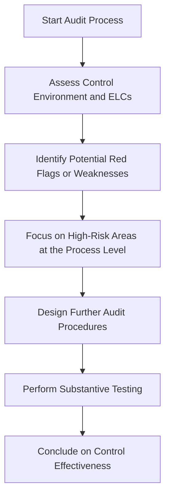

## 5.2 Entity-Level Controls and the Control Environment

Entity-level controls (ELCs) are overarching controls that set the tone across an organization. They shape the way control activities are carried out within departments, business units, and specific processes. The control environment, meanwhile, is foundational—it consists of governance and cultural factors enacted by top leadership and the board of directors. These two elements combine to create an atmosphere in which other controls can operate effectively.

Auditors must understand the entity-level controls and the control environment before scrutinizing more granular process-level controls. This section emphasizes the importance of the control environment as the cornerstone of an effective internal control system, explores the essential components of entity-level controls, and provides practical frameworks and real-world considerations for assessing them.

--------------------------------------------------------------------------------

## Importance of Entity-Level Controls

Entity-level controls affect the organization at large, influencing multiple processes and transaction cycles. Examples include:

• A well-defined code of conduct or ethics that applies to all employees.  
• The oversight function of the board of directors and its committees.  
• Organization-wide IT security policies, such as mandatory multi-factor authentication.  
• Consistent, transparent communication protocols established by senior management.

If entity-level controls are designed and operating effectively, they can significantly reduce the risk of misstatements, fraud, or breaches across the enterprise. Conversely, weak entity-level controls heighten the likelihood of pervasive issues because the organization lacks consistent ethical guidelines, oversight, or security measures.

--------------------------------------------------------------------------------

## Elements of the Control Environment

The control environment is often viewed as the foundation of the entire internal control structure. The Committee of Sponsoring Organizations of the Treadway Commission (COSO) Internal Control – Integrated Framework underscores several components of the control environment:

1. Leadership’s Commitment to Integrity and Ethical Values.  
   ◦ Management and the board must model ethical conduct consistently.  
   ◦ Formal codes of ethics and whistleblower policies encourage employees to speak up.  
   ◦ Any tolerance for misconduct can undermine even the most robust control systems.

2. Effective Audit Committee.  
   ◦ An informed, proactive, and independent audit committee is critical for strong governance.  
   ◦ Duties include overseeing the financial reporting process, monitoring the external audit, and addressing management override issues.  
   ◦ The audit committee should have direct communication channels with both internal and external auditors.

3. Organizational Structure.  
   ◦ Clearly defined reporting lines, job roles, and responsibilities enhance accountability.  
   ◦ Qualified personnel in key roles reduce the risk of errors and inefficiencies.  
   ◦ Departments should not be siloed; the structure should allow for cross-functional collaboration to strengthen controls.

4. Commitment to Competence.  
   ◦ Employees must possess the requisite knowledge, skills, and abilities to perform their roles effectively.  
   ◦ Training programs and continued professional development reinforce a culture of competence.

5. Accountability Mechanisms.  
   ◦ Performance evaluation and reward systems align with the organization’s code of conduct.  
   ◦ Timely disciplinary actions for breaches of policy reinforce integrity.

--------------------------------------------------------------------------------

## Formal vs. Informal Entity-Level Controls

• Formal ELCs.  
  ◦ Written policies and procedures, detailed codes of conduct, staff handbooks, and official governance bylaws.  
  ◦ Monitoring by a compliance team or external consultants to ensure ongoing adherence.

• Informal ELCs.  
  ◦ Unwritten but well-understood cultural norms, such as an open-door policy practiced by leadership.  
  ◦ Strong leadership tone and consistent demonstration of values—often found in smaller organizations.

Regardless of whether entity-level controls are codified in formal documentation or embedded in organizational culture, auditors must evaluate their effectiveness in practice.

--------------------------------------------------------------------------------

## Top-Down Risk Assessment

Auditors typically employ a top-down approach to assess controls, starting at the highest organizational level and drilling down into specific processes. Evaluating the strength of the control environment and entity-level controls is the first step:

1. **Assess Control Environment and ELCs**  
   Auditors gauge the leadership’s commitment to integrity, the effectiveness of the audit committee, and the clarity of the organizational structure.

2. **Identify Potential Red Flags or Weaknesses**  
   Red flags might include an authoritarian CEO who promotes a culture of fear, high turnover in key financial positions, or frequent conflicts of interest within senior management.

3. **Focus on High-Risk Areas at the Process Level**  
   If auditors discover weaknesses in the entity-level controls—e.g., inadequate board oversight or failure to enforce the code of ethics—they increase the breadth and depth of their testing in targeted areas.

4. **Design Further Audit Procedures**  
   Auditors select additional procedures—including walkthroughs, inspections, or improvised data analytics—to investigate potential problem areas.

5. **Perform Substantive Testing and Conclude**  
   After concluding on the adequacy of ELCs, auditors refine their audit strategies, focusing on areas with higher risk of material misstatement.

--------------------------------------------------------------------------------

## Red Flags in the Control Environment

Although red flags can appear in any part of the organization, certain entity-level signals warrant extra caution:

• Excessive reliance on one individual or an authoritarian leadership style.  
• Management or board members with conflicts of interest in supplier or customer relationships.  
• Frequent restatements of financial results or repeated regulatory sanctions.  
• High turnover in key positions within the finance or internal audit departments.  
• Blurred lines of accountability, where employees are uncertain whom to report to.  

When these signs are present, the likelihood that material misstatement or fraud could go undetected increases. Auditors should design more in-depth procedures in these circumstances.

--------------------------------------------------------------------------------

## Best Practices for Strong Entity-Level Controls

1. **Formalize Policies and Procedures**  
   Maintain a clear, well-communicated code of conduct and ensure employees acknowledge and understand it.

2. **Demonstrate Tone at the Top**  
   Leaders must consistently exhibit ethical behavior and enforce policies without exception.

3. **Maintain an Effective Audit Committee**  
   A diverse, qualified, and independent audit committee that communicates directly with internal and external auditors promotes robust oversight.

4. **Continuous Monitoring and Periodic Reviews**  
   Regularly assess whether entity-level controls remain relevant and effective amid organizational changes (e.g., mergers, new IT systems, emerging markets).

5. **Compliance Culture**  
   Reward adherence to ethical guidelines and penalize reoccurring or severe violations. A culture emphasizing compliance increases trust in financial reporting processes.

--------------------------------------------------------------------------------

## Common Pitfalls and How to Address Them

• **Overlooking ELCs Because They Seem “Intangible”**  
  ◦ Auditors might focus heavily on transaction-level controls and ignore entity-level factors.  
  ◦ Solution: Use structured checklists and interviews concerning governance and cultural elements.

• **Failure to Recognize Weak “Tone at the Top”**  
  ◦ If leadership’s words differ from their actions, employees are likely to follow management’s real (unethical) example.  
  ◦ Solution: Extend testing to areas susceptible to management override, and carefully review board minutes for potential red flags.

• **Ineffective Board or Audit Committee Oversight**  
  ◦ Passive boards that rely solely on management representations.  
  ◦ Solution: Ensure committees receive regular, expert reporting on financial and compliance matters. Confirm that they ask probing questions of management.

• **Neglecting IT Security at the Entity Level**  
  ◦ A lack of patch updates or multi-factor authentication can affect numerous applications and data sets.  
  ◦ Solution: Coordinate with IT specialists to assess the design and effectiveness of enterprise-wide security controls.

--------------------------------------------------------------------------------

## Practical Examples and Case Studies

1. **Case: Overstated Revenue in a Manufacturing Firm**  
   • The CEO strongly emphasized meeting aggressive sales targets.  
   • Although a code of conduct existed, the CEO consistently pressured sales personnel to record sales prematurely.  
   • The audit committee rarely convened and relied on the CEO for updates.  
   • Outcome: The entity-level control environment—particularly tone at the top—encouraged the inflating of revenues. Auditors discovered the misstatements during substantive testing prompted by concerns over a sudden spike in sales near quarter-end.

2. **Case: Robust Controls in a Nonprofit Organization**  
   • The board and executive director maintained an open communication channel with staff, encouraging whistleblower protection.  
   • The audit committee included two CPAs who regularly reviewed financial statements with the external auditors.  
   • Formal IT policies mandated periodic reviews of user access across all systems.  
   • Outcome: Strong entity-level controls minimized the risk of misstatements and built confidence among donors and grantors.

--------------------------------------------------------------------------------

## References for Further Exploration

• PCAOB Auditing Standard (AS) 2110 – Identifying and Assessing Risks of Material Misstatement: Guidance on assessing entity-level controls.  
• COSO Internal Control – Integrated Framework: Comprehensive reference for understanding control environments.  
• The IIA (Institute of Internal Auditors): Articles on best practices for board and audit committees (https://www.theiia.org).  

--------------------------------------------------------------------------------

## Quiz: Mastering Entity-Level Controls and the Control Environment



### Which of the following best describes an entity-level control (ELC)?
- [ ] A control that is unrelated to the organization’s objectives.
- [x] A control that influences many processes across the organization.
- [ ] A control that applies only to the payroll department.
- [ ] A highly technical control only the IT team manages.

> **Explanation:** Entity-level controls are pervasive in nature and influence how controls are executed throughout an entire organization.  

### Which component is generally considered the foundation of an effective internal control system?
- [ ] Control Activities
- [ ] Monitoring
- [x] Control Environment
- [ ] Information and Communication

> **Explanation:** The control environment is the bedrock of internal controls, emphasizing ethical values, leadership tone, and governance structures that guide all other controls.

### What is one of the primary functions of an audit committee?
- [x] Overseeing the financial reporting process and external audit.
- [ ] Handling daily accounting entries.
- [ ] Setting all employee performance targets.
- [ ] Approving marketing campaigns.

> **Explanation:** The audit committee’s role is to monitor the integrity of financial statements, oversee the external audit process, and ensure effective governance.

### Which of the following would be a red flag in the entity-level control environment?
- [x] High turnover in key finance positions and an authoritarian CEO.
- [ ] Routine training updates for all accounting staff.
- [ ] A board of directors that meets regularly and questions management rigorously.
- [ ] A clearly communicated code of conduct.

> **Explanation:** High turnover and authoritarian leadership often point to deeper control environment issues, increasing the risk of errors or fraud.

### What is the “tone at the top”?
- [x] The ethical and cultural messages sent by leadership through their actions and words.
- [ ] The physical volume level of employees in an open-plan office.
- [ ] A policy that is followed only by mid-level managers.
- [ ] A requirement to have open-door policies in all departments.

> **Explanation:** “Tone at the top” reflects the ethical climate established by senior management and influences employee behavior throughout the organization.

### Why is a top-down risk assessment important in auditing?
- [x] It allows auditors to evaluate entity-level controls first, identifying potential high-risk areas.
- [ ] It starts by looking at individual transactions, ignoring broader controls.
- [ ] It focuses mainly on internal audit department performance.
- [ ] It avoids examining the control environment.

> **Explanation:** By starting at the entity level, auditors can determine where the greatest risks lie and tailor their procedures to those areas.

### Which of the following is an example of a formal entity-level control?
- [x] Written policies and procedures that apply organization-wide.
- [ ] Unspoken cultural norms passed along informally.
- [ ] A single manager’s approach to controlling inventory.
- [ ] Internal phone lists.

> **Explanation:** Formal ELCs typically take written form, such as codes of conduct, policy manuals, or official governance documents.

### How can an organization mitigate the risk posed by an overly dominant CEO?
- [ ] Grant the CEO more responsibilities to keep them busy.
- [ ] Require the CEO to supervise all internal audits personally.
- [x] Strengthen the audit committee’s independence and authority.
- [ ] Restrict communication with the board of directors.

> **Explanation:** A strong, independent audit committee can counterbalance an authoritarian CEO by questioning decisions and ensuring proper oversight.

### What is the effect of weak entity-level controls on the likelihood of material misstatement?
- [x] It significantly increases the risk of material misstatement.
- [ ] It has minimal to no effect on misstatements.
- [ ] It only affects fraudulent transactions but not errors.
- [ ] It only impacts smaller organizations.

> **Explanation:** When entity-level controls are weak, a culture lacking integrity and oversight can result in widespread errors or intentional misstatements going undetected.

### True or False: An ineffective board of directors may rely too heavily on management representations, increasing the risk of misstatements.
- [x] True
- [ ] False

> **Explanation:** If the board lacks independence or proper expertise, it may accept management representations at face value, potentially overlooking significant errors or fraud indicators.



--------------------------------------------------------------------------------

## For Additional Practice and Deeper Preparation

**[Auditing & Attestation CPA Mock Exams (AUD): Comprehensive Prep](https://www.udemy.com/course/aud-cpa-mock-exams/?referralCode=D064EF7BD4A84FC6403D)**  
• Tackle full-length mock exams designed to mirror real AUD questions—from risk assessment and ethics to internal control and substantive procedures.  
• Refine your exam-day strategies with detailed, step-by-step solutions for every scenario.  
• Explore in-depth rationales that reinforce understanding of higher-level concepts, giving you a decisive edge on test day.  
• Boost confidence and reduce exam anxiety by building mastery of the wide-ranging AUD blueprint.

_Disclaimer: This course is not endorsed by or affiliated with the AICPA, NASBA, or any official CPA Examination authority. All content is created solely for educational and preparatory purposes._
