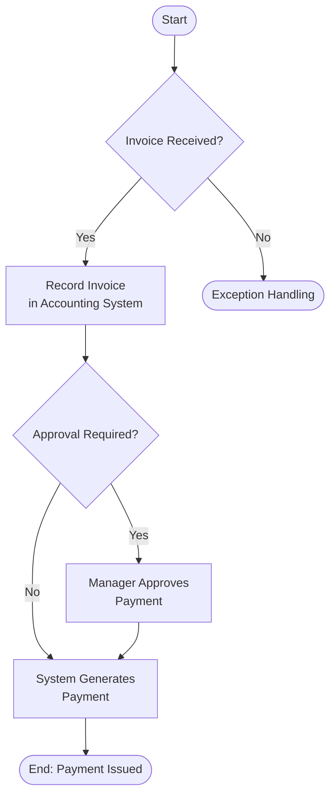

## 5.4 Walkthroughs, Flowcharts, and Narratives

Accurate and thorough documentation of an entity’s processes is fundamental to understanding its internal controls and identifying areas of risk. This section focuses on three key documentation methods that external auditors and internal auditors commonly use: walkthroughs, flowcharts, and narratives. These tools provide different but complementary perspectives on how transactions flow through an organization’s processes and systems, helping auditors make informed judgments about control design and operational effectiveness.

--------------------------------------------------------------------------------
## 1. Introduction

Before auditors can effectively assess the risk of material misstatement, they must understand how transactions are initiated, authorized, processed, and recorded. This understanding is gained by comprehensively documenting business processes. Depending on the complexity, volume of transactions, and nature of the client’s operations, auditors may use:

• Walkthroughs – to trace a transaction end-to-end, reviewing internal controls at each step.  
• Flowcharts – to create a visual representation of the process, including decision points and approvals.  
• Narratives – to provide a written, detailed description of the system, controls, and transaction flows.

Each of these methods plays a vital role in evaluating the design and implementation of internal control. When used in tandem, they offer a complete perspective, revealing strengths, weaknesses, and the interplay between manual and automated controls.

--------------------------------------------------------------------------------
## 2. Walkthroughs

### 2.1 Definition and Purpose
A walkthrough involves tracing a single transaction (or a small sample of transactions) from initiation to final recording in the financial statements. It’s a step-by-step testing method that confirms whether the controls described in a client’s policies are actually in place and working as intended. Auditors examine documents, observe procedures, and participate in discussions with client personnel to verify the existence and operation of controls. 

### 2.2 Process Overview
1. Select a Representative Transaction: Choose a transaction that typifies the process being audited—e.g., a routine purchase or a common sales transaction.  
2. Trace the Transaction Path: Observe or re-perform steps such as approval, data entry, accounting postings, and final reporting.  
3. Examine Supporting Documentation: Check purchase orders, invoices, sales orders, shipping documents, or any relevant records.  
4. Confirm Control Points: Identify each checkpoint (e.g., authorizations, limit checks, segregation of duties) to ensure controls exist and function properly.  
5. Note Exceptions or Gaps: If an authorization is skipped or a system flag isn’t triggered, this is noted as a control deficiency that may need further evaluation.

### 2.3 Integrating IT and Manual Processes
Modern enterprises rely heavily on integrated platforms—such as ERP systems—blending automated and manual controls. Auditors must consider the IT environment (user access, system validations, interface controls) and physical steps or manual reviews (signature approvals, management oversight). Walkthroughs highlight how effectively these IT and manual controls work together.

--------------------------------------------------------------------------------
## 3. Flowcharts

### 3.1 Definition and Purpose
A flowchart is a diagrammatic representation of a process, displaying each step, its sequence, decision points, documents or records involved, and any approvals required. Flowcharts are particularly useful for complex or high-volume cycles, such as Order-to-Cash, Procure-to-Pay, or Payroll.

### 3.2 Standardized Symbols  
To maintain clarity and consistency, auditors use common shapes and symbols, for example:  
• Rectangle: A process step or control activity.  
• Diamond: A decision point (with “Yes”/“No” branches).  
• Oval: Start or end of a flow.  
• Arrows: Direction of process flow.  
• Document icons: Input or output documents.

### 3.3 Benefits 
• Clarity in Presentation: Flowcharts make it easy to visualize the big picture and quickly identify where documents move, who authorizes transactions, and when decisions are made.  
• Identifying Gaps: By mapping the entire process, it’s easier to spot missing or redundant steps, lack of segregation of duties, or potential override points.  
• Time Savings: Once created, well-designed flowcharts can be used repeatedly for staff training, risk analysis, or process improvement initiatives.

### 3.4 Flowchart Example

Below is a simple illustration of a payment process flowchart. Note how each shape represents a distinct step in the process, and decision points require a Yes/No response:

In this flowchart:  
• Diamond shapes (steps B and E) indicate decision points.  
• Rectangles denote a process step, such as recording an invoice (Step C).  
• Branching arrows show the different routes depending on decisions.

--------------------------------------------------------------------------------
## 4. Narratives

### 4.1 Definition and Purpose
A narrative is a written description that explains how transactions are processed within a particular cycle or system. Narratives are often used to supplement or replace flowcharts, especially in smaller or simpler processes. In some organizations, narratives are preferred for their readability and ease of maintenance.

### 4.2 Components of a Narrative
• Key Personnel: Identify individuals responsible for each step (e.g., warehouse manager, A/P clerk).  
• Documents and Records: Describe the documents used, such as purchase orders or time sheets.  
• Control Activities: Note control mechanisms, such as manager approvals or system validations.  
• Technological Aspects: Mention relevant software modules, automated approvals, or password-protected areas.  
• Frequency and Exceptions: State how often the process runs (daily, weekly) and how exceptions are handled.

### 4.3 Advantages of Narratives
• Simplicity: For processes with fewer steps, a narrative can be more straightforward than a detailed flowchart.  
• Enhanced Context: Narratives can provide the “why” and “how” behind steps, giving more background on control rationale.  
• Audit Trail: Written documentation can serve as a robust reference during audit fieldwork, especially when verifying specific details.

--------------------------------------------------------------------------------
## 5. Audit Applications

### 5.1 Spotting Gaps and Deficiencies
Comprehensive walkthroughs, flowcharts, and narratives help identify missing approvals, overly manual steps, or high-risk control points subject to management override. For instance, a flowchart might show that the same employee both processes and approves refunds. This conflict indicates a segregation of duties deficiency.

### 5.2 Risk Assessment and Control Testing
Documentation tools support significant judgments about inherent risk and control risk. Processes prone to error or misappropriation—like cash handling—may warrant more rigorous testing. Conversely, well-documented and consistently applied controls may allow for a more efficient audit approach.

### 5.3 Communication with Stakeholders
Clear diagrams and narratives make it easier to discuss potential issues or propose remediation steps with management and those charged with governance. Additionally, these visuals serve as training aids for new finance or audit staff, enhancing organizational knowledge transfer.

--------------------------------------------------------------------------------
## 6. Best Practices for Documentation

1. Keep It Current: Update flowcharts, narratives, and walkthrough procedures whenever operational changes occur.  
2. Use Consistent Symbols and Terminology: Standardization reduces confusion and facilitates cross-team understanding.  
3. Validate with Process Owners: Engage department heads and staff to confirm the accuracy of documentation.  
4. Align Controls with Risks: Ensure each control activity addresses a specific financial statement assertion or recognized risk.  
5. Integrate With IT System Reviews: If systems are upgraded or replaced, ensure documentation reflects the new workflows and access controls.

--------------------------------------------------------------------------------
## 7. Common Pitfalls and Challenges

- Overcomplicating the Process: Using overly detailed flowcharts or lengthy narratives can overwhelm users. Aim for clarity and relevance.  
- Failing to Capture Exceptions: Processes often deviate from written policies. Ask about ad hoc situations and exceptions during walkthroughs.  
- Inadequate Maintenance: Documents must evolve with the business; out-of-date flowcharts or narratives can misrepresent the current control environment.  
- Fragmented Approach: Focusing on only one documentation method (e.g., only narratives) might cause you to overlook diagrammatic insights. Use multiple approaches when needed.

--------------------------------------------------------------------------------
## 8. Real-World Example

Imagine a mid-sized manufacturing company implementing a new inventory management system. The auditor performs a walkthrough of inventory transactions—from the point materials enter the warehouse to the final accounting entry for cost of goods sold (COGS). A flowchart is created to show how the company requests, receives, and records materials, highlighting which staff perform each step and where approvals are required. 

During the walkthrough, the auditor notices that the system does not block unauthorized users from making stock adjustments. The narrative indicates that a manual review is “supposed to take place,” but in practice, it often gets skipped if the warehouse supervisor is busy. This inconsistency represents a control gap that could lead to misstatements. The auditor flags this for further testing and discussion with management.

--------------------------------------------------------------------------------
## 9. Conclusion and References

Walkthroughs, flowcharts, and narratives provide critical insight into the design and operation of internal controls. As auditors progress through the risk assessment process, these documentation methods guide the focus of testing and clarify where controls may be insufficient. Thorough, well-maintained, and accurately depicted processes are not only beneficial for audit purposes but also serve as powerful tools for continuous improvement within the entity.

For more information on best practices, consult:

• AICPA “Documenting Processes Using Flowcharts” (various articles and toolkits)  
• Publications from “The Institute of Internal Auditors (IIA)” featuring flowcharting and narrative documentation  
• COSO Internal Control – Integrated Framework for overarching concepts related to control design and application  

--------------------------------------------------------------------------------

## Walkthroughs, Flowcharts, and Narratives: Master Your Internal Control Documentation



### Walkthroughs trace how many transactions as a general rule to confirm control design?
- [x] A single transaction, or a small selection of transactions, from initiation to recording.
- [ ] All transactions within a financial period.
- [ ] Randomly selected transactions from every quarter.
- [ ] Every transaction generated by a specific department.

> **Explanation:** Walkthroughs typically follow one transaction (or a small sample) throughout the entire process, ensuring that each step and related control is evaluated from start to finish.

### Which approach is most suitable for visually representing complex, multi-step processes?
- [x] Flowcharts are excellent for illustrating complex processes step-by-step.
- [ ] Narratives are more effective than flowcharts for complex processes.
- [ ] Verbal questioning during a walkthrough is sufficient for complex processes.
- [ ] Using spreadsheets and pivot tables replaces the need for process mapping.

> **Explanation:** Flowcharts provide a visual depiction of all steps, decision points, and approvals, making them ideal for complicated cycles like procure-to-pay or inventory management.

### Which of the following best describes a narrative’s primary advantage?
- [x] It provides a detailed, written explanation of process steps and relevant controls.
- [ ] It replaces the need for visual representations like flowcharts.
- [ ] It is concise and contains only flow diagrams.
- [ ] It only covers financial calculations, not operational controls.

> **Explanation:** Narratives are textual and detailed, often explaining the “why” and “how” behind each action. They offer context and detail that might not appear in a purely visual flowchart.

### When creating a flowchart, which symbol is commonly used to signify a decision point?
- [x] A diamond shape.
- [ ] A rectangle.
- [ ] An oval.
- [ ] A circle.

> **Explanation:** Diamonds usually denote branching logic or a yes/no decision that leads to different pathways in the process.

### What is a key concern that flowcharts and narratives both help auditors identify?
- [x] Segregation of duties conflicts or missing authorizations.
- [ ] The reliability of external financial statements.
- [ ] The exact dollar amount of material misstatements.
- [ ] None of the above.

> **Explanation:** By detailing who does what and when, these documentation methods reveal potential internal control weaknesses, such as inadequate segregation of duties.

### Which of the following is a common pitfall when documenting processes?
- [x] Creating overly detailed documentation that lacks clarity.
- [ ] Updating the documentation frequently.
- [ ] Confirming accuracy with process owners.
- [ ] Linking every control to a specific risk.

> **Explanation:** Too much detail can overwhelm both auditors and client personnel, making it harder to identify key controls and potential gaps.

### How can walkthroughs and flowcharts be used together effectively?
- [x] Perform a walkthrough to trace one transaction, then create a flowchart to represent the overall process.
- [ ] Use only a flowchart, as walkthroughs are always redundant.
- [ ] Never use a flowchart if a walkthrough was completed.
- [ ] Only use walkthroughs after you have created a narrative.

> **Explanation:** Walkthroughs confirm how controls operate in real practice. Flowcharts provide a big-picture visual of the entire process, so combined usage is complementary and thorough.

### Which process documentation technique is most suitable for smaller or less complex processes?
- [x] Narratives.
- [ ] Extensive parallel testing with flowcharts.
- [ ] Automated data analytics software only.
- [ ] None of the above.

> **Explanation:** When processes are straightforward, a written narrative can sufficiently capture the steps and control points without the need for extensive diagrams.

### Which of the following statements about walkthroughs is correct?
- [x] They involve observing and testing each step in a real or hypothetical transaction.
- [ ] They are limited to solely software testing of IT controls.
- [ ] They only focus on year-end journal entries.
- [ ] They must always be performed on all transactions for complete accuracy.

> **Explanation:** Walkthroughs are typically performed on one representative transaction, allowing the auditor to observe and confirm control operations in practice.

### True or False? A narrative can provide context regarding why a particular control is implemented in the process.
- [x] True
- [ ] False

> **Explanation:** Narratives often include not only the “what” and “how” of a control but also the rationale, making them valuable for understanding the broader purpose of each control point.



--------------------------------------------------------------------------------

## For Additional Practice and Deeper Preparation

**[Auditing & Attestation CPA Mock Exams (AUD): Comprehensive Prep](https://www.udemy.com/course/aud-cpa-mock-exams/?referralCode=D064EF7BD4A84FC6403D)**  
• Tackle full-length mock exams designed to mirror real AUD questions—from risk assessment and ethics to internal control and substantive procedures.  
• Refine your exam-day strategies with detailed, step-by-step solutions for every scenario.  
• Explore in-depth rationales that reinforce understanding of higher-level concepts, giving you a decisive edge on test day.  
• Boost confidence and reduce exam anxiety by building mastery of the wide-ranging AUD blueprint.

_Disclaimer: This course is not endorsed by or affiliated with the AICPA, NASBA, or any official CPA Examination authority. All content is created solely for educational and preparatory purposes._
