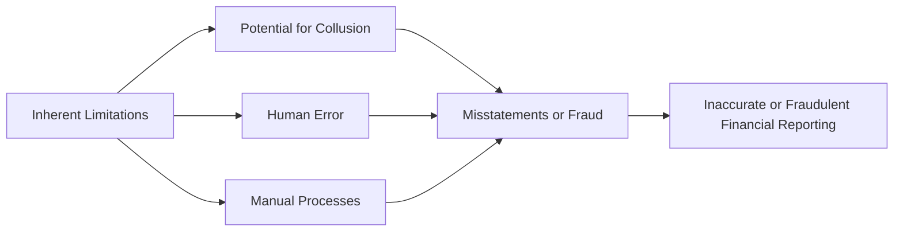

## 5.5 Limitations of Internal Control and Management Override

Internal control systems are vital for maintaining the integrity, reliability, and accuracy of an organization’s financial reporting and operational processes. However, no matter how well-designed, every system faces inherent limitations. Of particular concern is the ability of high-level personnel to override established controls, which can lead to fraudulent reporting or the misappropriation of assets. This section explores these limitations, focusing on both the inherent shortcomings of internal controls and the risks associated with management override.

---

### Understanding the Inherent Limitations of Internal Control

Inherent limitations refer to the built-in vulnerabilities present in any organizational control framework. While effective internal controls minimize risk, they cannot eliminate it entirely.

1. Human Error: Even the most carefully designed procedures rely on human judgment. Employees may misinterpret instructions, input incorrect data, or forget to follow established protocols.  
2. Poor Judgment or Bias: Staff could exercise incorrect or biased judgment when evaluating transactions or deciding which procedures to follow.  
3. Collusion: Multiple individuals might work together (or collude with an external party) to circumvent controls. This could include manipulating records, forging documents, or conspiring to hide unauthorized transactions.  
4. Technological Glitches: Automated control programs are designed by humans and run on software susceptible to coding errors, cybersecurity threats, or system downtime.  
5. Manual Processes: In many smaller organizations or in certain workflows, controls involve manual steps (e.g., approvals, sign-offs). These manual processes are prone to oversight or manipulation.

Below is a simplified diagram showcasing how these inherent limitations can lead to misstatements or fraud:

#### Practical Example: Human Error in Inventory Management
Consider a manufacturing company that relies on clerks to track incoming raw materials. Despite having a strong access control system, clerks might accidentally record a delivery twice, inflating inventory figures. An additional oversight—or lack of review—may allow this error to go unnoticed, showcasing how basic mistakes can undermine well-intentioned controls.

---

### The Challenge of Management Override

Management override refers to instances where high-level personnel leverage their authority to bypass or disable established controls. In contrast to inadvertent control failures, management override typically involves deliberate actions by senior executives, such as the chief executive officer (CEO) or chief financial officer (CFO).

1. Authority to Bypass Settings or Rules: Executives often possess system privileges or the authority to adjust financial records, approve unusual transactions, or instruct subordinates to deviate from normal processes.  
2. Concealed Adjustments: Top-level managers might process adjustments late in the accounting period or manipulate journal entries to alter financial results surreptitiously.  
3. Risk of Collusion with Third Parties: Senior personnel sometimes conspire with suppliers, creditors, or external agents to adjust transactions or create fictitious documentation that circumvents controls.

#### Practical Example: Journal Entry Manipulation
A CFO might post a large, last-minute journal entry to capitalize operating expenses, boosting reported net income. If the CFO instructs the accounting team to accept this entry with minimal review, the override bypasses normal internal checks, and financial reporting becomes misleading.

---

### Key Indicators of Management Override

Auditors are particularly vigilant if they detect indicators suggesting that senior management is misusing their authority. Common red flags include:

• Significant Late-Period Adjustments: Large additional entries made close to or after period-end often raise concerns about manipulation.  
• Complex or Mysterious Related-Party Transactions: Transactions involving related entities with unclear details or circular funding arrangements can hide fraudulent conduct.  
• Management’s Evasive Behavior: Reluctance to provide supporting documentation or dismissive attitudes toward reasonable queries can signal an attempt to conceal inappropriate activity.  
• Inconsistent Explanations: Explanations that change over time, especially regarding large transactions or unusual journal entries, warrant additional scrutiny.

---

### Audit Implications and Strategies to Address Risks

Because of these limitations—and especially the danger of management override—auditors must maintain professional skepticism throughout the engagement, staying alert to the possibility that seemingly robust controls could be undermined.

1. Risk Assessments: Auditors evaluate where internal control breakdowns are most likely (e.g., areas requiring high subjectivity, such as intangible asset valuations or significant estimates).  
2. Journal Entry Testing: Reviewing top-side adjustments or non-routine entries in the general ledger is a common approach to combat override. Auditors test the legitimacy of these entries, verifying authorization and supporting documentation.  
3. Segregation of Duties Overrides: Auditors may test whether authorized exceptions—like C-suite approvals—align with established policies and are adequately documented.  
4. Communications with the Audit Committee: Auditors should promptly communicate concerns over possible override attempts or suspicious behavior to those charged with governance. Transparency can help ensure swift remedial actions.

#### Table: Common Areas Prone to Management Override

| Vulnerable Area              | Example Scenario                                        | Recommended Audit Approach                                     |
|------------------------------|---------------------------------------------------------|----------------------------------------------------------------|
| Revenue Recognition          | Recording fictitious or premature sales                | Perform cutoff testing, confirmations with customers, and verify shipping documents. |
| Expense Classifications      | Capitalizing expenses to inflate assets                | Review large late-period entries for supporting detail and consistency with policy.   |
| Estimates & Reserves         | Understating reserves to boost profits                 | Examine consistency in estimation methods and compare actual outcomes against prior estimates. |
| Related-Party Transactions   | Executing contracts with entities controlled by mgmt.  | Scrutinize substance over form, confirm external parties’ independence.               |

---

### Glossary

• Collusion: A secret agreement among multiple parties to deceive or commit fraud, often by bypassing internal controls.  
• Journal Entry Testing: A process by which auditors review recorded entries—especially unusual or high-value ones—to verify authorization, support, and the rationale behind them.

---

### References and Resources

• Official References:  
  – [AU-C Section 315](https://www.aicpa.org/research/standards/auditattest/clarifiedsas.html) (AICPA) regarding the auditor’s responsibility for understanding the entity and its internal control, paying special attention to the risk of management override.  

• Additional Resources:  
  – COSO’s “Fraud Risk Management Guide,” which outlines oversight measures to help mitigate the risk of fraud—particularly from senior-level officials.  
  – ACFE (Association of Certified Fraud Examiners) publications exploring collusion detection strategies, whistleblower protection, and ethical guidelines to prevent override.

---

## Limitations of Internal Control and Management Override Quiz: Strengthen Your Understanding



### Which of the following describes an inherent limitation of internal control?

- [ ] Automated checks that reduce the likelihood of error  
- [x] The possibility of human error or inadvertent oversight  
- [ ] Rigorous segregation of duties  
- [ ] Frequent internal audits by a third party  

> **Explanation:** Even well-designed controls can fail due to human mistakes or oversight, highlighting an inherent limitation absolutely any system can face.

### What is a key indicator that management might be overriding controls?

- [ ] Early revenue recognitions at the beginning of a fiscal year  
- [ ] Increased investment in internal control software  
- [x] Significant late-period journal entries with minimal explanations  
- [ ] Minor adjustments to administrative expenses  

> **Explanation:** Large or unusual entries made close to a reporting period’s end often indicate potential manipulation by higher-level personnel.

### Which action can auditors use to detect unusual top-level adjustments?

- [ ] Increasing the sample size of vendor confirmation letters  
- [x] Performing detailed journal entry testing  
- [ ] Outsourcing the audit function to another firm  
- [ ] Rotating the internal audit team quarterly  

> **Explanation:** Journal entry testing is specifically designed to identify entries that seem inconsistent, unsupported, or unauthorized, ensuring potential override issues are flagged.

### How does collusion affect the reliability of internal controls?

- [x] It undermines controls by allowing multiple individuals to orchestrate fraud.  
- [ ] It enhances controls by requiring multiple parties to cooperate.  
- [ ] It focuses solely on preventing minor clerical errors.  
- [ ] It eliminates the risk of management override altogether.  

> **Explanation:** Collusion among employees or with external parties can evade even the strongest controls, making the system more vulnerable to inaccuracies or fraud.

### Which of the following is a potential effect of management override?

- [x] Misleading financial statements  
- [x] Concealment of fraudulent transactions  
- [ ] Better detection of errors due to increased scrutiny  
- [ ] Enhanced internal control environment  

> **Explanation:** Executives overriding established procedures can distort financial results or hide fraud, often leading to inaccurate statements and eroded trust.

### What is one recommended approach to mitigate the risk of management override?

- [x] Maintain strong communication channels with those charged with governance.  
- [ ] Allow the CFO to approve all high-value journal entries without review.  
- [ ] Restrict the scope of the external audit to minimize costs.  
- [ ] Rely exclusively on automated controls.  

> **Explanation:** Transparent communication with the audit committee or board of directors can help escalate issues quickly and deter unethical behavior.

### In areas with significant accounting estimates, why is management override risk higher?

- [x] Due to the subjective nature of judgments involved  
- [ ] Because there are fewer required disclosures  
- [x] Managers can manipulate assumptions to achieve desired outcomes  
- [ ] Auditors typically do not focus on estimates  

> **Explanation:** When significant subjectivity is involved, management may adjust key assumptions or methods to alter financial results, increasing the override risk and requiring thorough auditor scrutiny.

### Which of the following might signal a collusion risk among employees?

- [x] Employees processing transactions in pairs without typical sign-offs  
- [ ] Regular staff rotations and cross-training  
- [ ] Frequent and transparent management meetings  
- [ ] A robust whistleblower program  

> **Explanation:** When two or more people consistently bypass normal protocols, they may be conspiring to hide impropriety or manipulate financial records.

### What is the primary objective of journal entry testing?

- [x] To verify unusual or significant adjustments for proper authorization and support  
- [ ] To reduce the auditor’s workload through automation  
- [ ] To confirm the existence of physical inventory  
- [ ] To fix missing controls in the client’s system  

> **Explanation:** This procedure ensures that auditors detect potential irregularities in high-risk entries, focusing on authenticity and validity before concluding the audit.

### Auditors should:

- [x] Always maintain an attitude of professional skepticism regarding possible override.  
- [ ] Trust management assertions without question if provided in writing.  
- [ ] Rely solely on prior-year audit results for risk assessment.  
- [ ] Avoid performing new procedures when management override is suspected.  

> **Explanation:** Professional skepticism is critical—auditors must stay alert, challenge assumptions, and conduct additional procedures if override is suspected.



---

## For Additional Practice and Deeper Preparation

**[Auditing & Attestation CPA Mock Exams (AUD): Comprehensive Prep](https://www.udemy.com/course/aud-cpa-mock-exams/?referralCode=D064EF7BD4A84FC6403D)**  
• Tackle full-length mock exams designed to mirror real AUD questions—from risk assessment and ethics to internal control and substantive procedures.  
• Refine your exam-day strategies with detailed, step-by-step solutions for every scenario.  
• Explore in-depth rationales that reinforce understanding of higher-level concepts, giving you a decisive edge on test day.  
• Boost confidence and reduce exam anxiety by building mastery of the wide-ranging AUD blueprint.

_Disclaimer: This course is not endorsed by or affiliated with the AICPA, NASBA, or any official CPA Examination authority. All content is created solely for educational and preparatory purposes._
