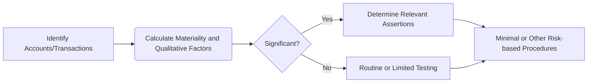

## 6.1 Significant Accounts, Transactions, and Assertions

Assessing whether an account or a class of transactions is “significant” is a critical first step in planning an effective audit. By determining areas where a misstatement could be both reasonably possible and material, auditors can focus their resources on the items most likely to impact the financial statements. This section discusses the concept of significance determination, differentiates between classes of transactions and account balances, and shows how relevant assertions (e.g., completeness, accuracy, valuation) guide auditors in designing appropriate procedures. It also provides practical examples, a visual diagram, and a structured approach for evaluating significance.

--------------------------------------------------------------------------------
## 1. Significance Determination

Auditors use both quantitative and qualitative factors to decide which items are significant. These factors help them identify where the risk of material misstatement (RMM) is highest, and thus where to direct audit effort.

1. Quantitative Factors:  
   - • Dollar Amounts: Large account balances or transaction totals are more likely to be material if misstated.  
   - • Volume of Transactions: Accounts with high transaction volume—such as sales or payroll—are often prone to manual or automated processing errors.  

2. Qualitative Factors:  
   - • Complexity and Estimation: Areas like fair value measurements, derivatives, or pension obligations involve detailed estimates, assumptions, and judgments, often increasing susceptibility to error.  
   - • Industry-Specific Issues: Entities in specialized industries (e.g., healthcare, banking) may encounter unique accounting treatments or regulations that create higher or more specific risks.  
   - • Transactional Complexity or Unusual Nature: Non-routine transactions (mergers, acquisitions, discontinued operations) can be more prone to misinterpretation or misstatement.

3. Likelihood and Magnitude:  
   - The frequency or plausibility of misstatements—with an eye toward both the potential size (magnitude) and how likely it is to occur (likelihood)—determines whether an item is significant.  
   - In professional guidance, significance centers around whether a misstatement could be “reasonably possible” and materially affect the financial statements.

--------------------------------------------------------------------------------
## 2. Classes of Transactions vs. Account Balances

Significant financial items can stem from either classes of transactions (e.g., sales, purchases) or ending account balances (e.g., inventory, accounts payable). Understanding the difference allows auditors to adapt their approach to the nature and flow of transactions:

1. Classes of Transactions  
   - • Impacts on Financial Statements: Classes of transactions typically flow through multiple line items. For instance, revenue transactions affect both the income statement (revenue account) and the balance sheet (accounts receivable).  
   - • Risk Examples: 
     – Revenue: Timing of revenue recognition (completeness vs. cutoff).  
     – Payroll: Accuracy of wage calculations, completeness of payroll taxes withheld.  
   - • Testing Approaches: Substantive procedures often include sample testing of specific transaction flows, tracing or vouching source documents, and analytics that examine key performance indicators or unusual fluctuations.

2. Account Balances  
   - • Nature and Composition: Ending balances capture the cumulative effect of many transactions. An account like “Inventory” might reflect purchases, production, spoilage, and sales returns.  
   - • Risk Examples: 
     – Receivables: Valuation (collectibility), existence (ensuring recorded balances are real).  
     – Accruals: Completeness (ensuring all liabilities are properly accrued).  
   - • Testing Approaches: Analysts may use a combination of tests of details (matching invoices to account balances) and analytical procedures (evaluating reasonableness of accruals based on prior periods or budgets).

--------------------------------------------------------------------------------
## 3. Assertions

The concept of an “assertion” is fundamental for linking audit procedures to management’s claims about financial statements. Assertions are groupings of management’s representations about financial data. Selecting the right assertion(s) ensures efficient and focussed audit work.

The most common assertions for classes of transactions and account balances include:

1. Existence or Occurrence  
   - • Existence: Used primarily for balance sheet accounts to verify that assets, liabilities, or equity balances are real.  
   - • Occurrence: Used for transactions on the income statement to confirm that recorded transactions actually took place during the period.

2. Completeness  
   - • Ensures that all transactions and account balances that should be included have indeed been recorded. Common risk areas include liabilities (e.g., unrecorded accruals) or revenue (e.g., unrecorded sales).

3. Accuracy (including Valuation and Allocation)  
   - • For transactions, confirms that amounts and related data (e.g., classification) are recorded correctly.  
   - • For balances, verifies that assets and liabilities are carried at appropriate amounts under the applicable financial reporting framework.

4. Rights and Obligations  
   - • Examines whether the entity holds or controls the rights to assets, and whether reported liabilities are the entity’s obligations.

5. Classification, Presentation, and Disclosure  
   - • Evaluates if items are appropriately classified in the correct financial statement line item and whether disclosures in the footnotes are adequate, clear, and in compliance with the relevant accounting framework.

--------------------------------------------------------------------------------
## 4. Linking Significant Items to Relevant Assertions

Once an auditor identifies a pervasive risk of material misstatement associated with a specific area, the next step is targeting the right assertions. For instance, if a client’s key area of risk is in unauthorized revenue transactions, the “occurrence” and “cutoff” (a subset of completeness) assertions are likely primary focuses.

Consider the following illustrative table:

| Account / Transaction | Potential Misstatement                         | Key Assertion(s)              | Example Audit Procedures                                                                  |
|-----------------------|------------------------------------------------|--------------------------------|-------------------------------------------------------------------------------------------|
| Sales Revenue         | Overstatement of revenue, improper timing      | Occurrence, Cutoff             | Vouch selected sales entries to shipping documents, verify sales near period-end, inspect credit memos |
| Accounts Receivable   | Uncollectible or fictitious accounts           | Existence, Valuation           | Confirm balances with customers, evaluate allowance for doubtful accounts                 |
| Accounts Payable      | Understatement (unrecorded liabilities)        | Completeness                   | Perform vendor statement reconciliation, examine subsequent payments for missing liabilities |
| Inventory             | Obsolescence or overstatement of quantity      | Valuation, Existence           | Observe inventory count, recalculate overhead allocations, evaluate net realizable value  |
| Accrued Liabilities   | Missing accruals or inaccurate estimation      | Completeness, Accuracy         | Examine post-balance sheet events, test management’s estimation process                   |

--------------------------------------------------------------------------------
## 5. Practical Example: Evaluating Completeness for Liabilities

Suppose a manufacturing company has a comprehensive purchasing and disbursement cycle. The auditor wants to ensure that all major liabilities are recorded at year-end.

1. Assess Significance:  
   - • The company has a history of missed accruals.  
   - • Purchase transactions exceed millions of dollars monthly.  
   - • Supplier relationships involve complex vendor contracts and potential pricing adjustments.  

2. Identify Relevant Assertions:  
   - • Completeness: Are all outstanding purchase invoices, work in progress costs, and accrued liabilities properly recorded?  

3. Select Audit Procedures:  
   - • Match vendor statements and subsequent payments to year-end liabilities.  
   - • Perform a search for unrecorded liabilities by examining cash disbursements after year-end.  
   - • Compare the historical ratio of accruals to expense levels with current-year figures to detect anomalies.

By systematically linking the “completeness” assertion to the significant liability accounts, the auditor gains reasonable assurance that no material payables remain unrecorded.

--------------------------------------------------------------------------------
## 6. Visual Diagram: Identifying Significant Accounts and Assertions

Below is a simple Mermaid flowchart illustrating the steps auditors often follow when identifying significant accounts and determining related assertions:

• Step A: Pinpoint accounts or transaction classes where material misstatements are likely.  
• Step B: Evaluate amounts, complexity, and qualitative factors (e.g., regulatory requirements, management incentives).  
• Step C: Assess if the item meets the definition of “significant.”  
• Step D and Step E: Select assertions for significant items or retain basic procedures for lower-risk areas.  
• Step F: Execute procedures to obtain sufficient appropriate audit evidence.

--------------------------------------------------------------------------------
## 7. Common Pitfalls and Best Practices

1. Underestimating Qualitative Factors:  
   - The risk of misstatement can also hinge on complexities like new accounting rules or industry-specific issues. Purely quantitative thresholds may overlook these nuances.

2. Overlooking Transaction Streams:  
   - Auditors sometimes focus heavily on end-of-year balances and neglect the processes and transaction flows that generate these balances, missing potential misstatements in the transaction cycles.

3. Failing to Link Assertions Properly:  
   - Not every assertion applies equally to each area. Targeted testing procedures should relate to the assertion most at risk.

4. Best Practice – Comprehensive Documentation:  
   - Documenting the rationale for focusing on specific accounts (e.g., “Revenue is historically misstated in the healthcare sector due to complex reimbursements”) fosters clarity and serves as evidence of professional judgment.

5. Best Practice – Dynamic Risk Assessment:  
   - Business environments change quickly. Reevaluate significance and associated assertions throughout the audit, especially if new information surfaces (e.g., management obtains new financing, or major operational disruptions occur).

--------------------------------------------------------------------------------
## 8. Glossary

- **Misstatement**: A discrepancy between the reported financial statement item and the appropriate presentation under the applicable framework (e.g., GAAP or IFRS).  
- **Relevant Assertion**: A management representation that could be misstated, such as “existence” for inventory to ensure that recorded goods actually exist.  
- **Reasonable Possibility**: Commonly used in assessing the significance of an item. Focuses on whether a misstatement could reasonably occur (greater than a remote possibility) and be material in amount or nature.

--------------------------------------------------------------------------------
## 9. References and Resources

- **Official References**  
  - AU-C Section 315.26–.31 (AICPA) offers additional discussion on how to identify significant accounts and disclosures.  

- **Additional Resources**  
  - “Auditing Revenue Recognition: Identifying Key Assertions,” Journal of Accountancy (journalofaccountancy.com)  
  - AICPA Practice Aids on Mapping Financial Statement Accounts to Assertions  
  - PCAOB Auditing Standard (AS) 2110 for public-filing entities, highlighting the importance of evaluating risk of material misstatement.

--------------------------------------------------------------------------------
## SEO-Optimized Quiz: Identifying Significant Accounts, Transactions, and Assertions Quiz



### Which factor is NOT typically used to determine whether an account is significant?

- [x] The personal preference of the CFO
- [ ] The nature and volume of transactions
- [ ] The quantitative materiality threshold
- [ ] The complexity of related accounting estimates

> **Explanation:** An account’s significance is driven by its potential impact on the financial statements and the complexity or volume of transactions affecting it—not by personal preferences of management.

### What is the primary goal of identifying significant accounts and transactions?

- [x] Targeting areas where the risk of material misstatement is highest
- [ ] Confirming that all management estimates are ignored
- [ ] Reducing audit fees by focusing only on small balances
- [ ] Prioritizing testing of all accounts equally

> **Explanation:** Auditors focus on significant areas where misstatements are most likely and could be material, allowing for an efficient and targeted audit approach.

### Which of the following statements best describes “reasonably possible”?

- [x] More than a remote chance that a misstatement could occur and be material
- [ ] An event that is certain to occur
- [ ] A hypothetical event that is always immaterial
- [ ] A common approach for immaterial errors

> **Explanation:** “Reasonably possible” implies a misstatement could happen and be material, going beyond a merely remote likelihood.

### In evaluating a class of transactions (such as sales) for significance, an auditor should consider:

- [x] Both the volume of transactions and the potential for errors in recognition
- [ ] Only the year-end physical inventory count
- [ ] Only transaction approvals by the CFO
- [ ] Irrelevant transactions with no risk of error

> **Explanation:** Volume, complexity, timing, and recognition issues play a central role when evaluating transaction classes for significance.

### Which assertion primarily addresses the risk of an asset or transaction being recorded that does not actually exist?

- [x] Existence/Occurrence
- [ ] Completeness
- [x] Valuation
- [ ] Rights and Obligations

> **Explanation:** Existence/Occurrence ensures that recorded assets and transactions genuinely exist at a given date or actually occurred during a period.

### The completeness assertion is most critical when auditing:

- [x] Accounts Payable
- [ ] Cash
- [ ] Revenue
- [ ] Equity

> **Explanation:** Completeness is essential for ensuring that all liabilities (i.e., accounts payable) are recorded. Liabilities are at high risk of understatement, making completeness a key concern.

### Which of the following is a best practice to avoid overlooking transaction streams?

- [x] Examining both balances and the flow of transactions that build those balances
- [ ] Auditing only the ending balances at year-end
- [x] Focusing exclusively on transactions under $10,000
- [ ] Ignoring transactions in high-volume areas

> **Explanation:** Both the balances and the originating transactions should be considered to capture all possible risks of misstatement.

### Underestimating the qualitative factors of an account or transaction can lead to:

- [x] Failure to identify significant risks where no large monetary values are affected, but complexity or specific regulations pose risks
- [ ] Overstating the completeness assertion
- [ ] Having a more precise cutoff test
- [ ] Automatic reliance on the control environment

> **Explanation:** Purely focusing on quantitative thresholds can cause auditors to miss complexity or industry-specific factors that carry significant risk.

### Which of the following is an example of a non-routine transaction?

- [x] Acquisition of a subsidiary
- [ ] Daily sales on credit
- [ ] Weekly payroll processing
- [ ] Routine rent expense

> **Explanation:** Non-routine transactions, such as acquisitions, mergers, or restructuring, require special audit attention due to higher risks of misstatement and complexity.

### True or False: “Rights and obligations” refers strictly to the valuation of assets and liabilities.

- [x] False
- [ ] True

> **Explanation:** “Rights and obligations” focuses on whether the entity legally owns or has the rights to its reported assets, and whether the liabilities reported are truly its obligations. It is distinct from valuation.



--------------------------------------------------------------------------------

## For Additional Practice and Deeper Preparation

**[Auditing & Attestation CPA Mock Exams (AUD): Comprehensive Prep](https://www.udemy.com/course/aud-cpa-mock-exams/?referralCode=D064EF7BD4A84FC6403D)**  
• Tackle full-length mock exams designed to mirror real AUD questions—from risk assessment and ethics to internal control and substantive procedures.  
• Refine your exam-day strategies with detailed, step-by-step solutions for every scenario.  
• Explore in-depth rationales that reinforce understanding of higher-level concepts, giving you a decisive edge on test day.  
• Boost confidence and reduce exam anxiety by building mastery of the wide-ranging AUD blueprint.

_Disclaimer: This course is not endorsed by or affiliated with the AICPA, NASBA, or any official CPA Examination authority. All content is created solely for educational and preparatory purposes._
