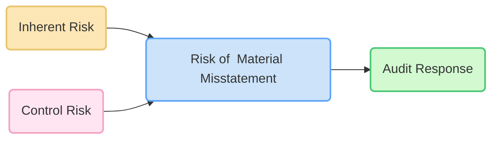

## 6.2 Inherent Risks vs. Control Risks

In the context of audit risk assessment, two key concepts form the linchpin of an effective and efficient audit strategy: Inherent Risk (IR) and Control Risk (CR). Understanding these risks, and how they combine to create the Risk of Material Misstatement (RMM), is fundamental to designing an appropriate audit response. This section explores each element in detail, offering practical examples, common pitfalls, and best practices to strengthen your understanding and application of these concepts.

---

### Overview of Inherent Risk (IR)

Inherent Risk refers to the likelihood that a material misstatement could occur in a specific assertion or account before considering the influence of internal controls. Essentially, if there were no controls in place, how likely is it that the financial statements would contain a significant error or fraud related to that account or transaction class?

#### Key Characteristics of Inherent Risk

• Susceptibility to Error or Fraud: Inherent risk is primarily influenced by factors that make an account prone to error or fraud (e.g., complex accounting standards, estimates that involve significant judgment).  
• Business and Industry Conditions: Changes in market conditions, new regulations, or rapid organizational changes can elevate uncertainty and complexity.  
• Complexity of Transactions: Complex transactions (e.g., derivatives, revenue recognition under multiple-element arrangements, lease modifications) are more susceptible to misapplication of standards.  
• Management Judgment: Accounts involving estimates (e.g., allowances for doubtful accounts, impairments, warranty reserves) carry higher inherent risk due to the subjective nature of judgments required.  

#### Factors Increasing Inherent Risk

• Adoption of New Accounting Standards: Implementing new standards can lead to misunderstandings or misapplications.  
• Rapid Growth or Reorganization: As entities expand or restructure, processes and personnel may not keep pace with the changes, leading to greater susceptibility to mistakes.  
• Heavy Reliance on Estimates or Non-Routine Transactions: Areas involving significant judgment are naturally more exposed to errors.  
• Highly Specialized Operations: Certain industries (e.g., financial services, pharmaceuticals) require advanced technical knowledge and are prone to unique risks.

---

### Overview of Control Risk (CR)

Control Risk refers to the risk that a material misstatement will not be prevented—or detected and corrected quickly—by the entity’s internal control system. Even if an account or transaction is inherently prone to misstatement, an effective system of controls can significantly reduce that risk. Conversely, weak or absent controls elevate Control Risk, leaving material misstatements undetected or uncorrected.

#### Key Characteristics of Control Risk

• Internal Control Effectiveness: An entity’s control environment, risk assessment process, and control activities directly influence Control Risk.  
• Design and Operation of Controls: Even well-designed controls can fail if they are not properly implemented, monitored, or updated over time.  
• IT Environment and General Controls: If IT general controls (e.g., program change controls, access controls) are weak, system-generated financial information can become unreliable.  

#### Factors Affecting Higher Control Risk

• Weak Control Environment: Inadequate tone at the top, lack of accountability, or insufficient resources for compliance.  
• Outdated or Poorly Configured IT Systems: Makes it easier for errors or unauthorized transactions to occur.  
• Ineffective Entity-Level Controls: If high-level governance structures (e.g., Board oversight, risk committees) are not robust, localized controls may fail.  
• Inadequate Segregation of Duties: Employees having conflicting responsibilities (e.g., the same person approving invoices and reconciling the bank account) may lead to fraud or error going undetected.

---

### Relationship Between IR, CR, and RMM

Audit standards define the Risk of Material Misstatement (RMM) at both the overall financial statement level and the assertion level. This is often expressed as:


RMM = IR \times CR


1. **Inherent Risk (IR):** Risk of error or misstatement without considering controls.  
2. **Control Risk (CR):** Risk that existing internal controls fail to detect or prevent material misstatements in a timely manner.  
3. **Combined Effect:** When IR and CR both are high, the RMM is elevated, prompting auditors to adjust their procedures accordingly.

---

### Practical Example: Assessing IR and CR Together

Suppose an apparel retailer undergoes a rapid expansion into new markets while also implementing a new enterprise resource planning (ERP) system. Assuming no controls, the inherent risk is high because:  
• The new system might not be fully integrated.  
• Management’s estimates for sales returns in newly established geographies could be off due to limited historical data.

Now consider Control Risk:  
• If the retailer’s controls over the ERP implementation are robust (e.g., thorough user acceptance testing, controlled migrations of data), CR for system errors may be moderate or low.  
• If staff have been properly trained on the new system with diligent oversight, CR decreases further.  
• Conversely, if staff are ill-prepared and data migration processes are poorly documented, CR escalates significantly.

This scenario underlines how IR and CR interplay, influencing the final RMM. Even if IR is high, robust controls can partially contain it. Conversely, poorly managed controls can magnify the risk of misstatement.

---

### Audit Response to Varying Levels of RMM

When faced with a high RMM, auditors respond by modifying the nature, timing, and extent of their procedures. This includes:

1. **Nature (Type of Testing):** Increasing use of detailed, substantive procedures or specialized methods (e.g., forensic techniques or advanced data analytics).  
2. **Timing (When Testing is Performed):** Performing procedures closer to or after year-end to capture complete transaction flows.  
3. **Extent (Scope and Sample Sizes):** Expanding sample sizes, conducting more frequent testing, or adding unpredictability to audit procedures.

If the RMM is comparatively low for certain accounts or assertions, auditors may leverage more control-based testing alongside analytical procedures, reducing the reliance on highly detailed tests of details.

---

### Visualizing the Interplay of IR and CR

Below is a simplified Mermaid diagram illustrating how Inherent Risk and Control Risk combine to form the Risk of Material Misstatement, which in turn informs the Audit Response:

1. **IR** and **CR** feed into **RMM**.  
2. **RMM** directly impacts the **Audit Response**, guiding the auditor’s professional strategy for tests and sampling parameters.

---

### Common Pitfalls and Best Practices

• **Pitfall:** Failing to tailor standard audit programs to unique client circumstances, leading to overlooked high-risk areas.  
  **Best Practice:** Perform thorough risk assessments that consider both IR and CR, supported by ongoing professional skepticism.  

• **Pitfall:** Over-reliance on entity-level controls without understanding specific process-level controls.  
  **Best Practice:** Validate the operating effectiveness of relevant controls through walkthroughs, tests of design, and tests of operating effectiveness.  

• **Pitfall:** Neglecting to update risk assessments when significant changes occur (e.g., new regulations or major shifts in business strategy).  
  **Best Practice:** Reassess risk regularly throughout the audit process as new information arises.  

• **Pitfall:** Insufficiently linking the assessed RMM to substantive procedures, resulting in incomplete or ineffective testing.  
  **Best Practice:** Clearly document the linkage of identified risks to the nature, timing, and extent of planned procedures.

---

### Glossary Highlights

• **Susceptibility:** Reflects the inherent likelihood of misstatement without controls.  
• **Assertions-Level Risks:** Pertains to specific assertions (existence, completeness, valuation, etc.) within particular accounts or classes of transactions.  
• **Nature, Timing, and Extent:** Dimensions used to craft a customized audit plan, directly influenced by the level of RMM.  

---

### References and Resources

• **Official References**  
  – PCAOB AS 2110: Identifying and Assessing Risks of Material Misstatement.  

• **Additional Resources**  
  – AICPA Audit Risk Assessment Toolkits.  
  – Risk-based auditing guides published by major accounting firms.  

These resources deepen your comprehension of how to assess IR, CR, and RMM in real-world scenarios while maintaining compliance with auditing standards.

---

## Inherent Risks vs. Control Risks: Practice Quiz



### Which of the following best defines Inherent Risk?

- [ ] The risk that staff neglects to reconcile accounts on time.  
- [x] The susceptibility of an assertion to a material misstatement assuming no relevant controls.  
- [ ] The risk that a material misstatement is not prevented by detective controls.  
- [ ] The total risk of a company going into bankruptcy during the audit period.  

> **Explanation:** Inherent Risk focuses on the inherent vulnerabilities of an assertion—how likely a misstatement could occur if no controls exist.

### Which of the following would likely increase an entity’s Inherent Risk?

- [x] Adopting a new lease accounting standard for the first time.  
- [ ] Hiring a new internal audit director to oversee control activities.  
- [ ] Removing a complex product line from the company's SKU list.  
- [ ] Automating routine transaction processing with proven technology.  

> **Explanation:** New accounting standards bring complexity and uncertainty, boosting susceptibility to error or misapplication.

### Which factor could indicate High Control Risk?

- [ ] Thorough documentation of IT change management controls.  
- [x] Lack of segregation of duties between authorization and record-keeping.  
- [ ] Periodic oversight from an effective audit committee.  
- [ ] Well-implemented data analytics in the financial reporting process.  

> **Explanation:** When one individual handles multiple functions without checks, the controls could fail to prevent or detect material misstatements.

### The Risk of Material Misstatement (RMM) is calculated by:

- [ ] CR ÷ IR.  
- [x] IR × CR.  
- [ ] IR + CR.  
- [ ] IR² × CR.  

> **Explanation:** Audit literature defines RMM = IR × CR.

### Which of the following best describes an appropriate audit response when RMM is deemed high?

- [x] Increase the extent of testing, shift some testing closer to year-end, and use more experienced staff.  
- [ ] Perform fewer tests of details and more analytical procedures.  
- [x] Incorporate an element of unpredictability in audit procedures.  
- [ ] Rely solely on the client’s internal audit department.  

> **Explanation:** When RMM is high, auditors enhance their testing procedures and add unpredictability to reduce the likelihood of undetected errors or fraud.

### Which of the following transactions would most likely have a higher Inherent Risk?

- [x] A multi-year derivative contract requiring complex valuation models.  
- [ ] Routine inventory transactions with clear, well-documented policies.  
- [ ] Standard payroll accruals for salaried employees.  
- [ ] Bank interest income recognized monthly using a simple rate.  

> **Explanation:** Complex derivatives often involve substantial estimation and judgment, increasing their inherent susceptibility to misstatement.

### In which scenario might the auditor consider lowering Control Risk?

- [x] Strong entity-level controls and consistent results from past internal control testing.  
- [ ] Recent management turnover and an incomplete risk assessment.  
- [x] Positive results from control testing of key processes.  
- [ ] Ongoing major IT disruptions causing transaction errors.  

> **Explanation:** Effective entity-level controls and positive results from control testing indicate a lower risk that controls will fail to detect material misstatements.

### Which statement about Inherent and Control Risk is true?

- [ ] If Inherent Risk is zero, then Control Risk automatically equals zero.  
- [ ] Control Risk levels are always fixed, regardless of the audit year.  
- [x] Even if Inherent Risk is high, strong controls can mitigate the overall RMM.  
- [ ] Inherent Risk is primarily determined by an entity’s internal controls.  

> **Explanation:** Robust internal controls can reduce the ultimate RMM, even in areas with high susceptibility to misstatement.

### The purpose of identifying specific Inherent and Control Risks in an audit is to:

- [x] Develop a targeted, effective, and efficient audit plan.  
- [ ] Replace objective testing with reliance on management representations.  
- [ ] Eliminate the need for tests of details.  
- [ ] Comply only with SEC mandates.  

> **Explanation:** Understanding IR and CR is crucial for tailoring audit procedures to risk levels, ensuring efficiency and effectiveness.

### True or False: “Control Risk only applies to manual controls and not automated controls.”

- [x] False  
- [ ] True  

> **Explanation:** Control Risk encompasses all forms of controls (physical, manual, or automated). An ineffective automated control can be just as risky as a manual one.



---

## For Additional Practice and Deeper Preparation

**[Auditing & Attestation CPA Mock Exams (AUD): Comprehensive Prep](https://www.udemy.com/course/aud-cpa-mock-exams/?referralCode=D064EF7BD4A84FC6403D)**  
• Tackle full-length mock exams designed to mirror real AUD questions—from risk assessment and ethics to internal control and substantive procedures.  
• Refine your exam-day strategies with detailed, step-by-step solutions for every scenario.  
• Explore in-depth rationales that reinforce understanding of higher-level concepts, giving you a decisive edge on test day.  
• Boost confidence and reduce exam anxiety by building mastery of the wide-ranging AUD blueprint.

_Disclaimer: This course is not endorsed by or affiliated with the AICPA, NASBA, or any official CPA Examination authority. All content is created solely for educational and preparatory purposes._
