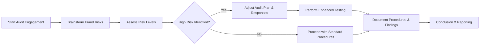

## 6.3 Fraud Risks: Detection, Response, and Documentation

Fraud risks can compromise the integrity of financial statements and damage stakeholder confidence. As auditors, it is essential to understand, detect, and effectively respond to potential fraudulent activities within an engagement. The AICPA underscores the importance of brainstorming potential areas of fraud, designing appropriate responses, and maintaining rigorous documentation. This chapter provides a comprehensive overview of fraud risk identification, response strategies, and the critical role of clear documentation in addressing these risks.

---

### 1. Brainstorming Fraud Risks

An often-underrated yet vital step in the audit process is ensuring that the entire engagement team dedicates time to collectively identify and assess potential fraud risks. This collaborative session — commonly referred to as fraud brainstorming — helps auditors build a shared understanding of:

• Relevant fraud types (e.g., fraudulent financial reporting, misappropriation of assets).  
• How prior-year misstatements or near-misses might foreshadow future fraud issues.  
• Which areas of complex judgments, estimates, or key financial statement items might be particularly vulnerable.  
• Any changes in corporate governance, internal controls, or management’s attitude that might increase the risk of fraudulent activity.

#### 1.1 Collaboration and Cross-Functional Insights
A crucial element of the fraud brainstorming session is diversity of thought. Staff from different backgrounds, with varying levels of experience and specialized knowledge, can surface anomalies that might be missed by a single individual. For instance, a junior staff member focusing on accounts payable might notice unusual vendor invoice patterns missed by management.

#### 1.2 Revisiting Prior-Year Misstatements
Historical misstatements or significant deficiencies may signal elevated fraud risk. By examining management’s responses — whether corrective actions were taken or not — the team can develop deeper insights into how effectively the organization addresses control weaknesses.

#### 1.3 Assessing Estimates and Complex Judgments
Areas involving significant estimates, such as intangible asset valuation, revenue allocation in multiple-element arrangements, or long-term contract accounting, increasingly demandprofessional skepticism. Fraudsters may exploit complexity or grey areas in financial reporting to manipulate results.

---

### 2. Fraud Risks Across the Organization

Fraud can manifest in numerous ways. It is essential to categorize potential fraud risks to ensure comprehensive coverage in the audit plan. The two overarching categories are:

• Fraudulent Financial Reporting  
• Misappropriation of Assets  

However, fraud may also be facilitated by collusion among employees, override of internal controls by managers, or third-party involvement. Failing to consider these dynamics may lead to an incomplete fraud risk assessment.

---

### 3. Response to Heightened Fraud Risks

When the team identifies specific fraud risks, the auditor should adapt the audit strategy and procedures accordingly. This heightened risk response typically includes:

1. **Adjusting the Audit Plan**  
   • Perform more tests of details.  
   • Expand sample sizes for higher-risk areas.  
   • Introduce unpredictability into test procedures, such as surprise inventory counts or unannounced site visits.

2. **Evaluating Management’s Oversight**  
   • Examine the tone at the top: Does management demonstrate integrity, or are there warnings of unethical behaviors?  
   • Assess the role of those charged with governance in monitoring financial reporting and controls.

3. **Performing Detailed Journal Entry Testing**  
   • Evaluate entries posted near period-end or in traditionally high-risk accounts (e.g., revenue or intangible assets subject to complex valuation).  
   • Watch for “round-dollar” or manual entries that bypass or override standard approval processes.  
   • Scrutinize entries made by senior management, especially if they appear unusual or lack a clear audit trail.

4. **Enhancing Overall Unpredictability**  
   • Rotate procedures or test specific accounts in randomly selected months to prevent predictability.  
   • Request additional supporting documents or delve deeper into non-routine transactions.  
   • Conduct one-off site visits to subsidiaries or remote facilities.

By carefully tailoring the audit procedures to the identified fraud risks, auditors heighten the likelihood of detecting fraudulent activities, even when sophisticated concealment methods are employed.

---

### 4. Documentation of Fraud Risk Assessment and Responses

Documentation underpins the audit process, serving as both evidence of auditor diligence and a reference point for future engagements. Proper documentation on fraud risks should address:

1. **Nature of Identified Fraud Risks**  
   • Which specific fraud typologies (e.g., revenue manipulation, inventory theft) were flagged?  
   • Why the auditor deemed them significant or likely?

2. **Audit Response and Rationale for Chosen Procedures**  
   • Specify how the audit plan was altered to address these risks.  
   • Detail which additional tests were deployed, including the nature, timing, and extent.  
   • Justify the scope of extended procedures, such as the expansion of sample sizes or surprise testing.

3. **Changing Conditions and Risk Reevaluation**  
   • If new risks emerged during the audit, document how the team responded and why.  
   • Track adjustments to staffing or scheduling as a result of new factors discovered.

4. **Communication with Management and Governance**  
   • Keep clear records of discussions around fraud risk with the entity’s management, audit committee, or board.  
   • Document any concerns raised or clarifications provided, as these discussions often shape the final audit strategy.

#### 4.1 Importance of Timely Documentation
Timeliness and consistency in audit documentation support robust internal communication. It also ensures that anyone reviewing the work papers can follow the logical thread from identified risks to the steps performed to mitigate them.

---

### 5. Practical Examples and Case Studies

1. **Case Study: Revenue Overstatement via Side Agreements**  
   • A technology firm offering bundled products was discovered to have “side deals” with certain customers, enabling early revenue recognition.  
   • The fraud brainstorming session flagged revenue manipulation as a significant risk, leading to an expanded sample of sales invoices.  
   • Unpredictability played a role in detecting unauthorized side agreements that were not recorded in the company’s main sales system.

2. **Case Study: Misappropriation of Inventory**  
   • A manufacturing company found discrepancies between recorded inventory levels and physical counts.  
   • Surprise counts, introduced based on the engagement team’s heightened fraud awareness, revealed that certain employees were siphoning off finished goods.  
   • Thorough documentation of the testing approach, results, and subsequent adjustments to risk assessment underscored how the auditor’s heightened skepticism led to discovery of the misappropriation.

By analyzing such real-world scenarios, auditors can recognize early warning signs of fraud, develop targeted responses, and strengthen their approach to documentation.

---

### 6. Utilizing Visual Tools to Understand Fraud Risk Assessment

Below is a simple Mermaid.js diagram depicting a high-level fraud risk assessment flow:

• “Brainstorm Fraud Risks” (B) sets the stage by identifying potential threats.  
• “Assess Risk Levels” (C) and the decision point (D) direct how the auditor tailors the audit plan.  
• “Adjust Audit Plan & Responses” (E) outlines specific strategies if a heightened fraud risk is flagged.  
• “Document Procedures & Findings” (H) remains crucial for both the standard and enhanced testing approaches.  

---

### 7. Glossary of Key Terms

• **Unpredictability**: Purposeful variation of audit procedures to prevent management or employees from anticipating exact testing methods, timing, or scope. This strategy reduces the risk of fraudsters circumventing questions or controls.  
• **Fraudulent Financial Reporting**: Intentional misstatement or omission within financial statements, carried out by management to mislead investors, creditors, or other stakeholders.  
• **Misappropriation of Assets**: Theft or misuse of an organization’s resources (e.g., unauthorized personal use of company property, manipulation of petty cash, skimming of cash receipts).

---

### 8. References and Further Reading

• **Official References**  
  - AU-C Section 240 (AICPA): “Consideration of Fraud in a Financial Statement Audit”  
    (https://www.aicpa.org/research/standards/auditattest/clarifiedsas.html)  
• **Additional Resources**  
  - The Association of Certified Fraud Examiners (ACFE): “Fraud Examiners Manual”  
    (https://www.acfe.com/fraud-resources.aspx)  
  - PCAOB Staff Audit Practice Alerts (https://pcaobus.org) covering revenue recognition and other common fraud areas.  

Auditors aiming to excel in the AUD section of the Uniform CPA Examination should stay updated on evolving fraud risk factors and have a robust understanding of the professional standards governing fraud detection. Engaging with multiple references — from internal memoranda to external publications — broadens the auditor’s perspective and rigor in addressing fraud risks.

---

## SEO-Optimized Fraud Risk Detection, Response & Documentation Quiz



### Which of the following best describes the purpose of a fraud brainstorming session?

- [ ] To discuss fee arrangements and time budget.
- [ ] To plan interview questions for management.
- [x] To identify potential fraud areas and develop a targeted approach.
- [ ] To establish overall business strategy for the client.

> **Explanation:** Fraud brainstorming focuses on identifying areas where fraud may occur and planning procedures to address those areas.

### What is the primary advantage of unpredictability in audit procedures?

- [ ] It decreases audit costs by focusing on fewer areas of testing.
- [x] It reduces the likelihood that management can anticipate specific testing methods or timing.
- [ ] It eliminates the need for prior-year workpaper review.
- [ ] It ensures that all routine elements are tested thoroughly.

> **Explanation:** By introducing unpredictability, the auditor makes it more difficult for potential fraudsters to conceal improper activities or manipulate key evidential items.

### When an auditor identifies a heightened fraud risk related to revenue recognition, which of the following is typically included in their response?

- [x] Expanding the sample size and performing more detailed substantive tests on revenue.
- [ ] Performing fewer substantive procedures to save time for the final review.
- [ ] Relying solely on internal controls without additional substantive testing.
- [ ] Avoiding revenue until management’s annual forecast is finalized.

> **Explanation:** A primary response to heightened fraud risk is expanding the extent of substantive testing to gain greater assurance about that account balance.

### Which of the following best describes misappropriation of assets?

- [x] Theft of company resources or property by employees.
- [ ] Overstating revenues through phony sales transactions.
- [ ] Falsifying market share information presented to investors.
- [ ] Writing off obsolete inventory to manipulate financial ratios.

> **Explanation:** Misappropriation of assets involves stealing or misusing the company’s resources, such as cash, inventory, or supplies.

### In which phase does the auditor typically observe unannounced inventory counts to increase the chance of detecting fraud?

- [ ] Reporting phase.
- [x] Fieldwork phase (substantive testing).
- [ ] Engagement acceptance phase.
- [x] Planning phase.

> **Explanation:** Surprise counts and random visits are often executed during planning or fieldwork to introduce unpredictability, increasing the prospect of finding fraud if it exists.

### What is the main reason for thoroughly documenting changes made to an audit strategy?

- [x] To provide evidence that the auditor responded to newly identified risks in a timely manner.
- [ ] To reduce the overall cost of the audit engagement.
- [ ] To communicate to the board that the audit plan is flexible.
- [ ] To serve as a basis for any required restatements of financial statements.

> **Explanation:** Proper documentation ensures transparency about the rationale behind every adjustment in the audit approach and provides a reference for the auditor’s professional judgment.

### Which of the following is most likely a key focus of a journal entry test aimed at identifying fraud?

- [ ] Routine adjusting entries with consistent patterns.
- [x] Late or last-minute entries that are material in amount.
- [x] Entries with no documented approval or unexplained references.
- [ ] Entries affecting immaterial accounts only.

> **Explanation:** Fraudulent activity often manifests in late, manual, or poorly documented entries, particularly if they significantly affect critical accounts or final reported balances.

### How does evaluating management’s oversight help auditors detect potential fraud?

- [x] It reveals the “tone at the top” and potential override of controls.
- [ ] It lowers the materiality threshold.
- [ ] It ensures the completion of only routine tests of transactions.
- [ ] It replaces the need to test internal controls directly.

> **Explanation:** Management’s attitude, ethical values, and oversight can indicate whether a strong control environment exists or if control overrides and unethical behaviors are likely.

### Why might the auditor perform walk-throughs of high-risk processes even after performing them in prior years?

- [ ] Due to lack of engagement from senior staff.
- [x] Because control environments and key personnel can change, altering the risk profile.
- [ ] To increase the audit fee for higher profitability.
- [ ] To fulfill a requirement that all processes be fully re-tested every year.

> **Explanation:** Conditions can evolve, staff may change, or new technology processes may be introduced. Periodic walk-throughs ensure the auditor’s understanding remains current.

### Fraud risk considerations are important primarily because:

- [x] They have a direct impact on the nature, timing, and extent of audit tests.
- [ ] They remove the need to perform materiality assessments.
- [ ] They allow auditors to provide a guarantee about the absence of fraud.
- [ ] They replace the importance of evaluating internal control over financial reporting.

> **Explanation:** Fraud risks shape the entire audit plan by indicating how procedures must be tailored to detect potential misstatements. However, auditors can only provide reasonable (not absolute) assurance of fraud detection.



---

## For Additional Practice and Deeper Preparation

**[Auditing & Attestation CPA Mock Exams (AUD): Comprehensive Prep](https://www.udemy.com/course/aud-cpa-mock-exams/?referralCode=D064EF7BD4A84FC6403D)**  
• Tackle full-length mock exams designed to mirror real AUD questions—from risk assessment and ethics to internal control and substantive procedures.  
• Refine your exam-day strategies with detailed, step-by-step solutions for every scenario.  
• Explore in-depth rationales that reinforce understanding of higher-level concepts, giving you a decisive edge on test day.  
• Boost confidence and reduce exam anxiety by building mastery of the wide-ranging AUD blueprint.

_Disclaimer: This course is not endorsed by or affiliated with the AICPA, NASBA, or any official CPA Examination authority. All content is created solely for educational and preparatory purposes._
