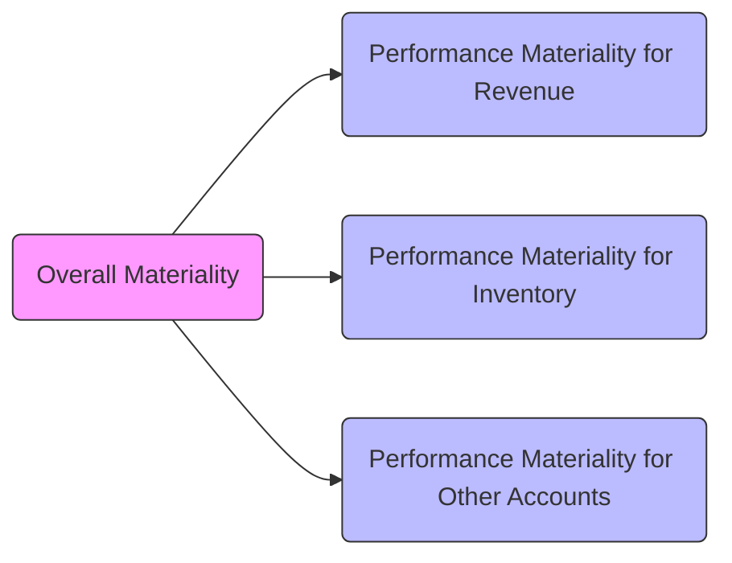

## 6.4 Determining Materiality and Performance Materiality

In the audit process, determining materiality and performance materiality is central to planning, conducting, and concluding an engagement. In essence, auditors rely on materiality thresholds to decide (1) which items to scrutinize and (2) how extensively to test particular account balances and transactions. Throughout this chapter, we will discuss how materiality is established, applied, and revised. We will provide real-life illustrations, referencing authoritative guidance—such as AU-C Section 320 and international best practices—to ground each concept in recognized professional standards.

--------------------------------------------------------------------------------

### 1. What Is Materiality?

Materiality represents a threshold above which the omission or misstatement of information in the financial statements could reasonably be expected to influence the decisions of financial statement users. If an error (whether due to fraud or unintentional misstatement) is small relative to a chosen benchmark but has a significant qualitative effect—such as turning a net profit into a loss—it could still be considered material.

#### 1.1 Quantitative vs. Qualitative Materiality
• Quantitative considerations:  
  – Typically calculated as a percentage of a relevant measure like pre-tax income, total assets, net sales, or equity.  
  – A commonly used benchmark for for-profit entities may be 5% of net income, while for a non-profit, the benchmark might be total revenue or total expenses.  

• Qualitative considerations:  
  – Even a small misstatement can be deemed “material” if it relates to compliance with regulations, conceals fraud, affects trends, or transforms a net loss into a net income.  
  – The importance of a specific disclosure or the nature of the transaction could make a difference in users’ decisions, thus giving it a material significance.  

--------------------------------------------------------------------------------

### 2. Establishing Overall Materiality

#### 2.1 Selecting the Benchmark
Typically, the auditor selects a benchmark that best represents the focal point of users’ decisions. For instance, in a manufacturing company, pre-tax income may be the most relevant metric. In a capital-intensive industry or where revenue is more stable than profit, auditors might choose total revenue or total assets.

Below is a simplified example of common benchmarks and potential percentages:

• 5% of pre-tax net income  
• 1% of total assets  
• 0.5% to 1% of total revenue  
• 1% to 2% of total equity (useful for entities financed significantly by equity)  

#### 2.2 Calculating Overall Materiality
While formulas vary, an example approach is as follows:

KaTeX formula example:


\text{Overall Materiality} = \text{Chosen Benchmark} \times \text{Chosen Percentage}


For a company with pre-tax income of \$2,000,000, an auditor might decide to use 5% as a reference point:


\text{Overall Materiality} = \$2,000,000 \times 0.05 = \$100,000


This calculation is a starting point. The auditor then refines it based on known risk factors, the nature of the engagement, and any applicable professional judgment considerations.

--------------------------------------------------------------------------------

### 3. Performance Materiality

#### 3.1 Defining Performance Materiality
Performance materiality (also referred to as “tolerable misstatement” in some contexts) is typically set below overall materiality. Its purpose is to reduce the risk that the aggregate of uncorrected and undetected misstatements in various accounts can exceed the overall materiality threshold. With performance materiality, the auditor essentially builds a safety margin.

#### 3.2 Setting Performance Materiality for Accounts
Auditors typically tailor performance materiality to different classes of transactions, account balances, or disclosures. For instance, accounts prone to misstatement—like revenue or intangible assets—might have a lower performance materiality limit due to heightened risk factors.

Below is a simple illustration of how an auditor might allocate performance materiality for different financial statement areas:

| Financial Statement Area  | Overall Materiality | Allocated Performance Materiality |
|---------------------------|---------------------|-----------------------------------|
| Revenue                   | \$100,000          | \$80,000                          |
| Inventory                 | \$100,000          | \$60,000                          |
| Fixed Assets              | \$100,000          | \$70,000                          |
| Other Accounts            | \$100,000          | \$80,000                          |

These allocations ensure that if minor misstatements occur in each area but remain undetected, their total would still not exceed the overall materiality of \$100,000.

#### 3.3 Illustrating the Relationship

Below is a Mermaid diagram that visually depicts the relationship between overall materiality and performance materiality:

In the diagram:  
• The single “Overall Materiality” shapes the starting threshold.  
• Multiple branches of “Performance Materiality” are designed for specific areas to ensure misstatements in different segments do not, in aggregate, exceed the overall threshold.

--------------------------------------------------------------------------------

### 4. Revising Materiality

#### 4.1 Changing Benchmarks and Assumptions
Materiality, once set, is not a static concept. During the audit, the auditor may revise materiality if the chosen benchmark changes significantly. For instance, if a client’s projected net income of \$2,000,000 ends up closer to \$2,500,000, the original calculation of \$100,000 might be adjusted accordingly.

#### 4.2 Expanding or Reducing Audit Procedures
If the new calculation of materiality is higher, the auditor may reassess whether certain planned procedures are still necessary. Conversely, if materiality has decreased, the auditor might need to expand testing to address the now smaller margin for error.

#### 4.3 Communication with Management and Those Charged with Governance
Any significant reassessment of materiality—whether up or down—needs to be communicated to management, and potentially those charged with governance. Such communication ensures transparency in how the audit is being conducted and clarifies how detected misstatements will be evaluated.

--------------------------------------------------------------------------------

### 5. Qualitative Factors Affecting Materiality

It is crucial that the auditor not rely on a single numeric threshold. For example, a \$10,000 misstatement could be more material than a \$100,000 misstatement if it relates to illegal activities or significantly impacts compliance obligations.

Common qualitative factors include:  
• The legality of a transaction (e.g., compliance with regulations).  
• The effect of the misstatement on key performance indicators or ratios (e.g., changing a technical debt covenant breach into compliance).  
• Fraud risk or instances of management override.  
• Material misstatements in prior periods, which raise the possibility of repeated or continuous misstatements.  

--------------------------------------------------------------------------------

### 6. Practical Examples and Case Studies

#### 6.1 Small Amount, Big Impact
A healthcare entity with annual revenues of \$50 million sets overall materiality at \$250,000 (0.5% of revenues). The auditor finds a \$40,000 overstatement in charity care expense. Although \$40,000 is well below overall materiality, further investigation reveals the item is masking management’s attempts to inflate patient services revenue. Given the potential fraud implications, that \$40,000 misstatement has a greater qualitative impact and is considered material.

#### 6.2 Adjusting Materiality Mid-Audit
A manufacturing client’s preliminary numbers showed profit before taxes at \$1.8 million, and the auditor chose a 5% benchmark (\$90,000) for overall materiality. Midway through the engagement, new projections estimate a pre-tax profit of \$3 million. In light of this development, the auditor re-calculates overall materiality: \$3,000,000 × 5% = \$150,000. Substantive procedures may be adjusted accordingly.  

--------------------------------------------------------------------------------

### 7. Best Practices, Common Pitfalls, and Strategies

• Best Practices:  
  – Use relevant benchmarks that reflect the priorities of financial statement users (investors, creditors, regulators).  
  – Revisit and document reasoning behind each materiality determination, ensuring the audit team aligns on changes.  

• Common Pitfalls:  
  – Setting performance materiality too high, risking undetected misstatements aggregated across several accounts.  
  – Failing to consider the subtle qualitative factors that can elevate even small misstatements to material status.  

• Strategies to Overcome Challenges:  
  – Leverage group discussions and second-partner reviews to validate the auditor’s judgment on materiality thresholds.  
  – Maintain rigorous documentation of performance materiality allocations and the rationale behind each decision.  

--------------------------------------------------------------------------------

### 8. Key Terms and Glossary

• **Overall Materiality (Financial Statement Materiality):** The maximum amount by which the auditor believes the statements could be misstated without influencing users’ decisions.  
• **Performance Materiality (Tolerable Misstatement):** An amount set below overall materiality, allocated to specific account balances or transaction classes to ensure aggregated misstatements do not exceed overall materiality.  
• **Qualitative Factors:** Aspects such as legality, regulatory compliance, or potential impacts on key performance indicators that can deem an item material regardless of its dollar amount.  

--------------------------------------------------------------------------------

### 9. References and Resources

• **Official References**  
  – AU-C Section 320 “Materiality in Planning and Performing an Audit.”  
  
• **Additional Resources**  
  – IFRS Practice Statement on Materiality for international best practices.  
  – AICPA “Determining Materiality: A Toolkit” for practical exercises, real-life scenarios, and deeper insights.

--------------------------------------------------------------------------------

## Mastering Materiality & Performance Materiality: CPA Exam Prep Quiz



### Determining overall materiality typically starts with:
- [ ] Selecting the smallest recorded account balance for the client.  
- [x] Identifying an appropriate benchmark (e.g., pre-tax income) and applying a percentage.  
- [ ] Projecting accounts payable and accrued expenses.  
- [ ] Randomly picking a materiality amount without reference to benchmarks.  

> **Explanation:** Auditors first select the most relevant benchmark—such as pre-tax income or total assets—and then use a percentage to establish overall materiality.

---

### Which of the following represents a correct statement about performance materiality?
- [ ] It must always be higher than overall materiality.  
- [x] It is set at a level below overall materiality to reduce the risk of undetected misstatements.  
- [ ] It remains fixed throughout the audit and cannot be amended.  
- [ ] It applies only to nonprofit organizations.  

> **Explanation:** Performance materiality is deliberately set lower than overall materiality to provide a buffer and lessen the possibility that uncorrected or undetected errors aggregate to exceed overall materiality.

---

### A misstatement is considered qualitatively material if it:
- [x] Conceals fraud or changes a net loss into a net profit.  
- [ ] Arises from flawed budget forecasts.  
- [ ] Is under 0.5% of total assets.  
- [ ] Occurs solely due to clerical errors.  

> **Explanation:** Qualitative materiality considers elements such as fraud, illegal acts, or masking of trends—even if the dollar amount is small.

---

### How might performance materiality be allocated among specific accounts?
- [ ] Equally across all accounts without distinction.  
- [x] By assigning different thresholds for high-risk areas such as revenue or intangible assets.  
- [ ] Only if the client has more than five major accounts.  
- [ ] By applying a single threshold for all categories, regardless of risk.  

> **Explanation:** Auditors frequently reduce thresholds for high-risk areas, ensuring that potential errors in those accounts do not individually or collectively exceed overall materiality.

---

### If the preliminary net income estimate significantly changes during the audit, auditors should:
- [x] Adjust materiality calculations and possibly modify their testing scope.  
- [ ] Continue with the same materiality and ignore any changes.  
- [ ] Disclose it as a prior period adjustment.  
- [ ] Immediately disclaim an opinion on the financial statements.  

> **Explanation:** Auditors revisit and revise materiality if the underlying benchmark changes significantly, which may alter the scope of testing.

---

### Tolerable misstatement is another term that is most closely associated with:
- [ ] Overall materiality.  
- [x] Performance materiality.  
- [ ] Qualitative materiality.  
- [ ] Analytical procedures.  

> **Explanation:** Tolerable misstatement is a concept closely related to performance materiality and is effectively managed at the individual account or area level.

---

### Small misstatements can be material if:
- [x] They involve non-compliance with laws or have significant qualitative impact.  
- [ ] The client’s management prefers to ignore them.  
- [x] They hide profitability issues or violate debt covenants.  
- [ ] The client’s net income is already below expectations.  

> **Explanation:** Even small errors can be material if they have significant qualitative implications, such as concealing regulatory violations or impacting key performance metrics.

---

### Setting performance materiality too high may:
- [ ] Ensure a thorough and complete audit.  
- [ ] Only impact minor accounts and have no broader consequence.  
- [x] Increase the risk that multiple small misstatements in various accounts exceed overall materiality.  
- [ ] Replace the need for detailed substantive testing.  

> **Explanation:** If performance materiality is too high, multiple small errors could go undetected, cumulatively exceeding the overall materiality threshold.

---

### When communicating a revised materiality to top management, the auditor:
- [x] Explains reasons for the change and the potential impacts on audit scope.  
- [ ] Does not need to provide any justification.  
- [ ] Should only inform the CEO but not the board of directors.  
- [ ] Must issue an adverse opinion automatically.  

> **Explanation:** Transparency is crucial; the auditor should detail why materiality was changed and how that affects the audit plan.

---

### An auditor who reduces materiality mid-audit typically does so because:
- [x] New financial data indicates a shift in the chosen benchmark or assumptions.  
- [ ] The client objects to certain testing procedures.  
- [ ] They plan to disclaim an opinion regardless of the balance.  
- [ ] They have completed all substantive testing and found no misstatements.  

> **Explanation:** Auditors revise materiality if key metrics like net income differ significantly from initial projections, thereby adjusting the audit scope accordingly.



--------------------------------------------------------------------------------

## For Additional Practice and Deeper Preparation

**[Auditing & Attestation CPA Mock Exams (AUD): Comprehensive Prep](https://www.udemy.com/course/aud-cpa-mock-exams/?referralCode=D064EF7BD4A84FC6403D)**  
• Tackle full-length mock exams designed to mirror real AUD questions—from risk assessment and ethics to internal control and substantive procedures.  
• Refine your exam-day strategies with detailed, step-by-step solutions for every scenario.  
• Explore in-depth rationales that reinforce understanding of higher-level concepts, giving you a decisive edge on test day.  
• Boost confidence and reduce exam anxiety by building mastery of the wide-ranging AUD blueprint.

_Disclaimer: This course is not endorsed by or affiliated with the AICPA, NASBA, or any official CPA Examination authority. All content is created solely for educational and preparatory purposes._
