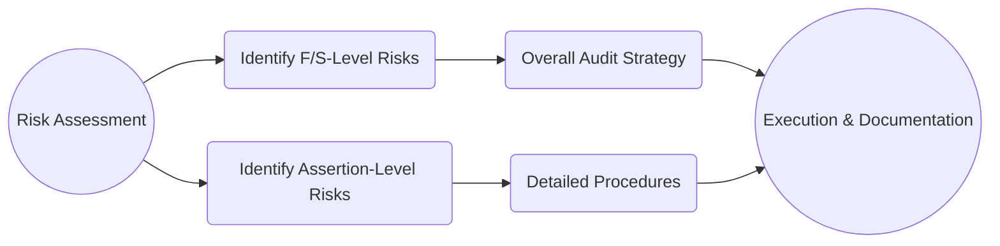

## 7.1 Overall Strategy and Risk Responses

Developing a comprehensive audit strategy is a pivotal element of effective audit planning. The strategy should reflect the auditor’s response to identified risks at both the financial statement level and the assertion level. By aligning high-level considerations—such as engagement staffing, deadlines, budget, and scheduling—with more focused procedures targeted at high-risk areas, auditors can better allocate resources, control engagement costs, and most importantly, produce an effective and efficient audit.

This section delves into the relationship between risk assessment and the audit strategy, explores the distinction between high-level and detailed (assertion-level) risk responses, and discusses how materiality thresholds influence the overall approach.

---

## Linking Risk Assessment to Strategy

### 1. Connecting Financial Statement-Level Risk and Strategy
Financial statement-level risk refers to the potential for pervasive misstatements affecting multiple accounts or disclosures. For instance, if a client is undergoing significant leadership changes or has a volatile business model, the risk of financial information distortions could be elevated across the board. These risks may prompt broad, global modifications to the overall audit strategy, such as:
• Assigning more experienced audit personnel to the engagement.  
• Increasing the emphasis on professional skepticism throughout the audit.  
• Scheduling certain audit procedures for a later date, closer to period-end, to minimize the chance of missing major events or transactions.  
• Incorporating more unpredictability in the nature, timing, and extent of audit tests.

### 2. Connecting Assertion-Level Risk and Strategy
Assertion-level risks focus on specific balances, transactions, or disclosures. For example, revenue recognition is often a high-risk assertion area because of its sensitivity to manipulation, complexity of contractual terms, or the need for management estimations. A robust approach to these risks might involve:
• Designing targeted substantive procedures, such as direct confirmations, recalculations, or re-performance.  
• Expanding sample sizes for estimates, such as the allowance for doubtful accounts.  
• Applying advanced data analytics to identify unusual patterns of revenue entries.  
• Conducting in-person visits to warehouses to verify inventory or confirm the actual existence of assets.

These assertion-level responses reflect the fact that each account, transaction class, or disclosure may face distinct sets of inherent and control risks, requiring tailored procedures for effective coverage.

---

## High-Level vs. Detailed Responses

### 1. Overall (High-Level) Responses
High-level responses guide the entire audit approach. They support the mitigation of pervasive risks and set the tone of engagement execution. These broad actions can include:
• Adjusting the Composition of the Audit Team  
  – Bringing in specialists for complex areas (e.g., valuation of derivatives or projected pension liabilities).  
  – Using personnel with deep industry knowledge to address unique regulatory or operational nuances.  

• Heightened Professional Skepticism  
  – Instructing the team to challenge management’s assumptions more vigorously.  
  – Planning regular team discussions to brainstorm potential fraud scenarios.  

• Shifting Timing of Procedures  
  – Performing specific procedures near the end of reporting periods or immediately subsequent to year-end.  
  – Scheduling surprise or unpredictable testing to make it more difficult for potential fraud to go undetected.  

### 2. Detailed (Assertion-Level) Responses
At the assertion level, risk responses become more granular. They involve the specific selection of audit procedures and the nature, timing, and extent (NTE) of each. Examples include:

1. Tailored Substantive Testing  
   – Using confirmations for accounts receivable in a high-risk revenue cycle.  
   – Applying recalculations, reconciliations, and analytical review for suspicious expense transactions.  

2. Specialized Procedures  
   – Engaging external experts or specialists (e.g., to evaluate complex fair value measurements).  
   – Testing management’s estimates using data analytics tools or independent predictive analysis.  

3. Sampling Strategies  
   – Increasing sample sizes in risky areas and performing additional testing on outliers identified through data analytics.  
   – Combining random sampling with judgmental sampling focused on high-value or unusual transactions.

4. Enhanced Documentation  
   – Creating detailed documentation of the rationale for choosing certain procedures over others.  
   – More thorough cross-referencing of supporting schedules, working papers, and final conclusions.

---

## Materiality Implications

Materiality and performance materiality thresholds, set during the risk assessment process, underpin the development of the audit strategy and planning:

• Setting Overall Materiality  
  – High-level decisions regarding the appropriate materiality threshold directly influence the extent of testing.  
  – A lower overall materiality figure typically means more extensive documentation, potential expansion of sample sizes, and closer scrutiny of individual transactions.

• Performance Materiality  
  – Performance materiality serves as a buffer to reduce the possibility that the total of uncorrected and undetected misstatements exceeds overall materiality.  
  – In higher-risk assertions or accounts, performance materiality may be set lower, triggering more rigorous testing and evaluation.

• Reassessment of Materiality  
  – Materiality levels should be reevaluated as the audit progresses, especially if new risk factors emerge or if the organization’s financial performance significantly deviates from initial expectations.

---

## Illustrative Diagram: Risk Assessment to Strategy

Below is a Mermaid diagram showing how risk assessment flows into the formulation of an overall audit strategy and subsequent detailed procedures:

Explanation:  
• Risk Assessment identifies both financial statement-level risks and assertion-specific risks.  
• Financial statement-level risks inform the overall audit strategy (D).  
• Assertion-level risks dictate the nature, timing, and extent of detailed audit procedures (E).  
• Both levels converge in the execution and documentation phases (F).

---

## Practical Table: Types of Audit Responses at Different Risk Levels

Below is a sample table illustrating how an auditor’s strategy may shift based on risk level:

| Risk Level            | Financial Statement-Level Response                                  | Assertion-Level Response                                    |
|-----------------------|---------------------------------------------------------------------|-------------------------------------------------------------|
| Low                   | • Standard staffing                                                 | • Basic substantive tests around key accounts              |
| Moderate              | • Mix of experienced and entry-level staff                          | • Expanded sample sizes on moderate-risk assertions        |
| High                  | • Involvement of Senior Engagement Team / Industry Experts          | • Use of specialists or advanced data analytics            |
| Very High (Fraud)     | • Intensive, year-end plus surprise procedures                     | • Confirmation of key balances, deeper analytics on revenue|

---

## Best Practices, Common Pitfalls, and Challenges

1. Best Practices  
   • Maintain Ongoing Risk Evaluation: Keep adjusting the strategy throughout the engagement if new risks materialize.  
   • Integrate Technology Wisely: Data analytics can provide powerful insights but should be matched to the complexity of the client’s environment.  
   • Foster Communication: Frequent communication with management and those charged with governance helps align expectations and identify emerging risks.

2. Common Pitfalls  
   • Overlooking Pervasive Risks: Focusing too narrowly on assertion-level risks can hide broader systemic issues.  
   • Underestimating Materiality: Setting materiality thresholds too high could lead to overlooking meaningful misstatements.  
   • Neglecting Documentation: Insufficient documentation obscures the audit trail and can undermine important conclusions.

3. Challenges  
   • Evolving Standards: Levels of acceptable risk and materiality thresholds can shift with changes in the regulatory environment.  
   • Resource Constraints: Balancing budgets, personnel hours, and tight deadlines can challenge the execution of a robust strategy.

---

## Glossary

• **Audit Strategy**: A high-level outline that reflects the nature, extent, and timing of the planned audit procedures in response to risks.  
• **Assertion-Level Risks**: Risks linked to specific account balances, classes of transactions, or disclosures.  
• **Professional Skepticism**: An investigative mindset that challenges assumptions and remains alert to evidence of potential misstatement.

---

## References and Resources

• **Official References**  
  – AU-C Section 300 (AICPA): “Planning an Audit.”  

• **Additional Resources**  
  – PCAOB Staff Guidance on “Responding to the Risk of Material Misstatement”: Provides illustrations for crafting effective and efficient responses.  
  – “Audit Planning and Analytical Procedures” in Auditing: A Journal of Practice & Theory: Offers academic perspectives on risk-based audit planning.

---

## Quiz: Master the Art of Audit Strategy and Risk Response



### An auditor identifies company-wide management override risk. Which of the following is a possible high-level response?

- [ ] Decreasing sample sizes on revenue transactions.  
- [x] Involving more experienced staff and increasing unpredictability in audit tests.  
- [ ] Eliminating surprise inventory counts.  
- [ ] Reducing substantive procedures on major accounts.  

> **Explanation:** When risk is pervasive across the financial statements—e.g., potential management override—the auditor typically escalates the level of professional skepticism and brings in more seasoned auditors who can effectively respond to this heightened risk.  

### What is the primary focus of assertion-level risk responses?

- [ ] Allocating overall audit engagement resources.  
- [x] Tailoring specific procedures to address risks in account balances or transactions.  
- [ ] Establishing broad organizational policies for the audit.  
- [ ] Ensuring management’s cooperation and buy-in.  

> **Explanation:** Assertion-level risks are addressed through direct testing of the specific accounts, transactions, or disclosures deemed at higher risk of material misstatement.  

### How does materiality impact audit strategy?

- [x] It influences both the extent of testing and the thresholds for evaluating misstatements.  
- [ ] It determines whether the audit should be performed at all.  
- [ ] It only applies when internal controls are deemed ineffective.  
- [ ] It is set solely by the client’s management.  

> **Explanation:** Materiality levels help define the scope and rigor of the examiner’s procedures, as well as set the bar for what will be considered a reportable misstatement.  

### Which of the following is a financial statement-level risk rather than an assertion-level risk?

- [x] A newly volatile industry environment that affects overall operations.  
- [ ] Overstated allowance for doubtful accounts.  
- [ ] Misclassification of a lease categorized as operating instead of finance.  
- [ ] Unrecorded liability in accounts payable.  

> **Explanation:** A volatile industry environment can influence broader aspects of the financial statements, requiring overarching changes to the audit strategy.  

### Which strategy below is best suited for addressing a high-risk assertion for inventory valuation?

- [x] Engaging specialists and performing recalculations tailored to the valuation method.  
- [ ] Maintaining only standard planned procedures without changes.  
- [x] Increasing sample sizes for cost testing and applying data analytics to detect anomalies.  
- [ ] Scheduling walkthroughs exclusively post-year-end.  

> **Explanation:** When inventory valuation is high-risk, specialized skills may be necessary, and the auditor may expand sample sizes or deploy data analytics to detect irregularities.  

### A client’s management is highly incentivized to show profit growth. How does this condition typically affect the auditor’s overall strategy?

- [x] It raises the likelihood of material misstatement, prompting increased professional skepticism.  
- [ ] It reduces the risk of misstatements across the board.  
- [ ] It requires halting the audit until official SEC guidance is provided.  
- [ ] It has minimal effect on the audit approach.  

> **Explanation:** High incentives for profit growth could create inherent motivations to manipulate data, increasing the auditor’s vigilance and responses to potential misstatements.  

### What is the primary purpose of using advanced data analytics in assertion-level testing?

- [x] To identify unusual patterns or transactions for further investigation.  
- [ ] To reduce the necessity for any substantive testing.  
- [x] To lower the number of overall audit hours necessarily performed.  
- [ ] To ensure fraud is entirely eliminated from an organization.  

> **Explanation:** Data analytics helps auditors focus on transactions or areas that exhibit unusual characteristics, increasing audit efficiency and effectiveness.  

### When would an auditor likely use a lower performance materiality?

- [x] If there is a higher overall risk of misstatement.  
- [ ] If they want to reduce the total audit fee.  
- [ ] If the client has a stable business model with no significant changes.  
- [ ] If the client is large with many transactions.  

> **Explanation:** With heightened risks, the auditor reduces performance materiality to catch smaller misstatements and mitigate the chance of an aggregation that exceeds overall materiality.  

### Which of the following is NOT an example of a high-level risk response?

- [ ] Assigning more experienced staff to test complex areas.  
- [ ] Changing the overall timing of procedures.  
- [x] Increasing sample size for accounts payable confirmations.  
- [ ] Enhancing professional skepticism throughout the team.  

> **Explanation:** Increasing sample size for accounts payable confirmations is an assertion-level (detailed) response, not an overarching, high-level strategy.  

### True or False: Reassessing materiality during the audit should only be done when new audit standards are issued.

- [ ] True  
- [x] False  

> **Explanation:** Materiality reassessments occur whenever significant changes in the engagement circumstances arise, such as identifying new risks, significant adjustments in the client’s financial results, or discovery of major misstatements.  



---

## For Additional Practice and Deeper Preparation

**[Auditing & Attestation CPA Mock Exams (AUD): Comprehensive Prep](https://www.udemy.com/course/aud-cpa-mock-exams/?referralCode=D064EF7BD4A84FC6403D)**  
• Tackle full-length mock exams designed to mirror real AUD questions—from risk assessment and ethics to internal control and substantive procedures.  
• Refine your exam-day strategies with detailed, step-by-step solutions for every scenario.  
• Explore in-depth rationales that reinforce understanding of higher-level concepts, giving you a decisive edge on test day.  
• Boost confidence and reduce exam anxiety by building mastery of the wide-ranging AUD blueprint.

_Disclaimer: This course is not endorsed by or affiliated with the AICPA, NASBA, or any official CPA Examination authority. All content is created solely for educational and preparatory purposes._
