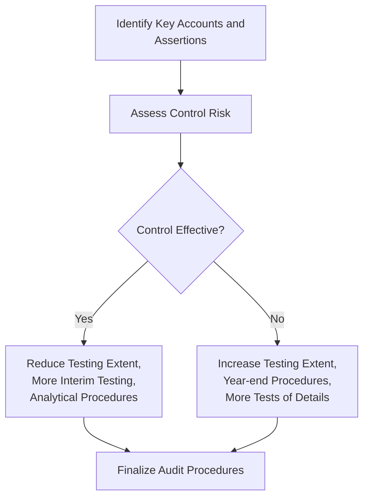

## 7.2 Selecting Audit Procedures: Nature, Timing, and Extent

As part of the audit planning process—outlined in Chapter 7, “Planning the Audit Strategy and Developing the Audit Plan”—the auditor must determine which procedures to perform and in what manner to execute them. Selecting audit procedures is guided by three key dimensions:

• Nature: The specific type or quality of the audit test (e.g., confirmation, recalculation, inspection).  
• Timing: When in the accounting cycle or audit timeline procedures take place (e.g., at interim vs. year-end).  
• Extent: How much testing is done (e.g., sample sizes, scope of coverage over multiple locations, level of detail).

These decisions are driven by the auditor’s risk assessment—higher risk typically requires more extensive or high-quality (more persuasive) procedures, or procedures performed as close to year-end as possible. Conversely, if control risk is relatively low, the auditor may place greater reliance on internal controls and reduce the extent of direct testing of balances and transactions. This section provides practitioners a clear framework for implementing and adjusting these audit dimensions in practice.

---

## 1. Understanding the “Nature” of Audit Procedures

In auditing, the “nature” of a procedure refers to the type or characteristic of the test performed, such as inspection, observation, inquiry, confirmation, recalculation, re-performance, or analytical procedures. Each method yields certain forms of evidence, all of which vary in their persuasiveness and relevance to a given set of assertions.

1. Inspection of Records and Documents  
   • Entails examining supporting documents, such as invoices, rental agreements, or bank statements.  
   • Offers direct evidence about the completeness or valuation of transactions or balances.  

2. Inspection of Tangible Assets  
   • Involves physically verifying assets—commonly used in inventory audits or fixed asset verifications.  

3. Observation  
   • Auditor watches processes or procedures being performed by client personnel (e.g., observing a cycle count in a warehouse).  
   • Useful for testing the operation of controls like segregation of duties.  

4. Inquiry  
   • Consists of asking client personnel about processes, methods, and potential misstatements.  
   • Typically less persuasive alone; it is often supplemented by more objective testing.  

5. Confirmation  
   • Obtaining representations directly from an external third party (e.g., confirming bank balances with financial institutions, confirming receivables with customers).  
   • Highly persuasive because the evidence is sourced externally and directly to the auditor.  

6. Recalculation and Re-performance  
   • The auditor independently recalculates figures or re-performs processes to check arithmetic accuracy and the correct application of internal controls.  
   • Offers direct evidence of a client’s calculations or processes.  

7. Analytical Procedures  
   • Evaluating plausible relationships among financial and nonfinancial data (e.g., ratio analysis, trend analysis).  
   • Can indicate anomalies or areas of overlooked risk that require further investigation.

Each procedure has distinct strengths. For instance, direct confirmations from external parties are generally more persuasive than internal inquiries of management. As risk increases, auditors often select more persuasive procedures or combine multiple procedures to collect sufficient appropriate evidence.

---

## 2. Timing of Audit Procedures

Timing determines when the procedures are performed during the audit engagement. Generally, the auditor can choose to test during the interim period, at year-end (or close to it), or after year-end. The selection depends on the assessed risk, the availability of client information, and the complexity of the financial statement area under examination.

1. Interim Procedures  
   • Often used for low- or moderate-risk accounts (e.g., smaller accounts with stable balances).  
   • Reduces the workload at year-end but may require “roll-forward” testing to ensure no material changes took place from the interim date to the fiscal year-end date.  

2. Year-End Procedures  
   • Typically used for high-risk or highly material balances (e.g., accounts receivable in a company with significant credit sales).  
   • Minimizes audit risk that transactions occurring between the interim period and year-end are missed.  

3. Post-Year-End Testing  
   • Useful when the financial close process is prolonged or when transactions relevant to the financial statements occur after the official year-end but before issuance of the auditor’s report.  
   • For instance, the auditor might verify subsequent events or contingencies that affect the year-end account balances.

Moreover, timing decisions are often iterative. If significant new risks emerge late in the year—perhaps due to sudden operational changes or an unexpected business event—the auditor may modify the plan to perform additional or more extensive procedures near or after year-end.

---

## 3. Extent of Audit Procedures

“Extent” refers to the amount or breadth of testing. This includes the size of the sample, the number of locations visited in a multi-site engagement, or the depth of cut-off tests around key transaction dates.

1. Sample Size  
   • Sample sizes often increase with higher levels of risk, particularly for areas susceptible to material misstatement.  
   • Audit sampling guidance (e.g., AICPA “Audit Sampling” guide) provides best practices, including nonstatistical and statistical sampling methods.  

2. Coverage Across Locations  
   • For multinational or multi-branch entities, high-risk components may receive full-scope audits, while lower-risk components might be subject to review or analytical procedures.  
   • The “extent” may expand to additional branches or subsidiaries if preliminary testing uncovers potential issues.  

3. Expanded Cut-Off Testing  
   • If there is a risk of misstatement around period-end transactions (e.g., revenue being recorded prematurely), the auditor may test transactions before and after the fiscal year-end date more comprehensively.  
   • This reduces the risk that material transactions get recorded in the wrong period.

The extent of procedures is often dependent on the preliminary risk assessment. If the auditor detects a higher risk due to weak controls, questionable management integrity, or prior-year adjustments, they usually increase the sample size or testing coverage. Conversely, if the internal control environment is strong and supported by robust risk management, the auditor may reduce the extent of direct testing (though must remain vigilant for any potential override of controls by management).

---

## 4. Integration with Internal Controls

Decisions around nature, timing, and extent are interwoven with the strength of internal controls established by management. Understanding, evaluating, and testing the design and operating effectiveness of these controls usually occurs before the auditor finalizes the detailed audit plan.

1. When Controls Are Effective  
   • The auditor may opt for more interim testing, smaller sample sizes, and more analytical procedures.  
   • For example, if the sales system is automated with strong validation checks and approvals, the auditor might reduce the number of direct verification procedures on individual transactions and focus instead on testing the IT general controls (ITGCs) and application controls.  

2. When Controls Are Weak  
   • The auditor is likely to perform a significant amount of substantive procedures at or near year-end and increase the extent of testing to fully mitigate the identified risks.  
   • Substantive testing will be more detailed, encompassing larger sample sizes or 100% validation for certain accounts.

### Visual Representation

Below is a Mermaid.js diagram illustrating how internal control effectiveness influences nature, timing, and extent of procedures:

• The diagram highlights that the initial control risk assessment dictates whether the auditor places reliance on internal controls or opts for a more substantive audit approach.

---

## 5. Practical Examples and Case Studies

1. Interim Payroll Testing in a Low-Risk Environment  
   • A medium-sized software company with a stable payroll environment and strong payroll controls (segregation of duties, well-coded payroll software) may allow the audit team to test payroll at an interim date.  
   • The auditor can then perform limited roll-forward procedures at year-end, ensuring that any changes (like bonus payouts or year-end adjustments) are accounted for accurately.

2. Confirmations of High-Risk Receivables  
   • A manufacturing client has experienced cash flow problems, raising concerns about collectability of accounts receivable.  
   • The auditor decides to send confirmations close to year-end to capture the latest balances and reduce the lag between the confirmation date and the issuance of the financial statements.  
   • The confirmations are performed in large volumes (extended extent) due to elevated inherent risk.

3. Extended Cut-Off Testing in Revenue Recognition  
   • A technology retailer often runs aggressive year-end promotional campaigns.  
   • The auditor identifies a high risk of premature revenue recognition, deciding to test all sales transactions during the last week of the fiscal year and the first week of the next year (significantly increasing the extent of testing).  
   • Additionally, the auditor may observe the inventory count and shipping processes to verify that recognized sales match actual deliveries.

---

## 6. Best Practices and Common Pitfalls

• Align Procedures with Risk: Always tailor the nature, timing, and extent of procedures to the specific risks identified. Standard templates can be helpful but should not override professional judgment.  
• Adequate Documentation: Ensure thorough documentation of why certain procedures were chosen, why some were omitted, and how final conclusions on sufficiency of evidence were reached.  
• Avoid Overreliance on Inquiry: Even when client personnel are knowledgeable and trustworthy, inquiry alone is rarely sufficient, especially for high-risk areas. Pair it with independent verification or recalculation.  
• Comprehensive Interim Testing Approach: When placing reliance on interim testing, design effective roll-forward procedures to capture significant changes.  
• Continuous Reassessment: If new information or unexpected results arise, be prepared to revise the audit plan and expand or shift procedures accordingly.

---

## 7. References and Resources

• Official References  
  – [AU-C Section 500 – Audit Evidence](https://www.aicpa.org/research/standards/auditattest/clarifiedsas.html)  
  – AICPA Professional Standards on Audit Sampling  

• Additional Resources  
  – AICPA “Audit Sampling” Guide for determining sample sizes and selection methods  
  – “Timing the Audit: Aligning Procedures with Risk,” Journal of Accountancy  

These sources provide extensive guidance on how to plan and execute procedures, using robust sampling methods and risk-based approaches. They offer insights into state-of-the-art practices for evaluating the persuasiveness of evidence in various audit environments.

---

## SEO-Optimized Quiz: Mastering Nature, Timing, and Extent in Audits



### Which of the following best describes “nature” in the context of audit procedures?

- [x] The type or quality of the procedure (e.g., confirmation, inspection)
- [ ] The point in time at which an audit procedure is performed
- [ ] The sample size used to test an account
- [ ] The IT environment’s impact on an audit

> **Explanation:** “Nature” refers to the type or quality of the audit procedure itself—confirmation, recalculation, and analytical procedures are examples.

### Which audit procedure generally provides the most persuasive evidence?

- [x] External confirmations
- [ ] Management inquiry
- [ ] Comparing current-year and prior-year results
- [ ] Observations of transactions processed

> **Explanation:** External confirmations are highly persuasive because they are received directly from an independent third party, minimizing the risk of management bias.

### When internal controls are strong and reliable, how does that typically affect the auditor’s work?

- [x] The auditor may reduce the extent of direct testing of transactions and balances.
- [ ] The auditor should always increase the extent of direct testing.
- [ ] The auditor will ignore the assessed control risk.
- [ ] The auditor will only rely on substantive analytical procedures.

> **Explanation:** If controls are effective, the auditor may reduce but not eliminate the extent of direct tests of details, placing greater reliance on test of controls and analytical procedures.

### What is the main reason auditors perform roll-forward procedures?

- [x] To ensure transactions from an interim testing date through year-end are captured
- [ ] To minimize the need for interim testing
- [ ] To confirm accounts receivable and inventory balances
- [ ] To ensure that all audit work is postponed until year-end

> **Explanation:** Roll-forward procedures bridge the period between interim testing and year-end, ensuring that any material transaction changes are accurately audited.

### Which of the following would most likely require an increased extent of testing?

- [x] Weak or nonexistent internal controls
- [ ] A high volume of low-dollar transactions
- [x] A higher assessed risk of material misstatement
- [ ] Stable internal control processes validated in prior years

> **Explanation:** When risk is higher or controls are weak, the auditor expands the extent of tests to gather sufficient appropriate evidence.

### What is the key consideration when choosing to accept an interim testing strategy?

- [x] The likelihood of material changes affecting the account balances post-interim
- [ ] The client’s desire to finish the audit quickly
- [ ] The number of subsidiaries involved
- [ ] The discount offered by the external confirmation service

> **Explanation:** If significant transactions or changes occur between the interim testing and year-end, additional testing (roll-forward) is required to ensure completeness and accuracy.

### In a multi-location audit, which scenario might prompt the auditor to expand the extent of testing to more locations?

- [x] Detecting a significant deficiency in key controls at one of the locations
- [ ] Observing that one branch processed fewer transactions
- [x] Identifying inconsistencies in subsidiary-level financial reporting
- [ ] Ensuring faster audit performance to meet deadlines

> **Explanation:** A deficiency in controls or inconsistencies at one location can increase overall audit risk, prompting auditors to expand the scope to additional locations for thorough coverage.

### Why might an auditor choose substantive testing over control testing in certain circumstances?

- [x] Because the cost of testing controls may outweigh the benefits if controls appear weak
- [ ] To minimize direct testing of account balances
- [ ] To avoid reliance on third-party confirmations
- [ ] To comply with the client’s timing preferences

> **Explanation:** If controls are unreliable or expected to be ineffective, substantive procedures (e.g., direct testing of balances) are generally more efficient and appropriate.

### The decision to perform testing of certain accounts at year-end rather than at an interim period is primarily influenced by:

- [x] The risk level associated with those balances or transaction classes
- [ ] The client’s preference to have fewer on-site visits
- [ ] The total amount of daily transactions
- [ ] The audit firm’s scheduling constraints alone

> **Explanation:** Balances with higher inherent or control risk are best tested at or near year-end to minimize the window for potential misstatements.

### The term “extent” in audit planning primarily refers to:

- [x] How much testing is performed (e.g., sample size, number of locations)
- [ ] The quality and variety of tests performed
- [ ] Interim vs. year-end testing
- [ ] Using only management inquiry for low-risk accounts

> **Explanation:** Extent deals with the volume or coverage of testing—such as how many samples or branches are included in the audit procedures.



---

## For Additional Practice and Deeper Preparation

**[Auditing & Attestation CPA Mock Exams (AUD): Comprehensive Prep](https://www.udemy.com/course/aud-cpa-mock-exams/?referralCode=D064EF7BD4A84FC6403D)**  
• Tackle full-length mock exams designed to mirror real AUD questions—from risk assessment and ethics to internal control and substantive procedures.  
• Refine your exam-day strategies with detailed, step-by-step solutions for every scenario.  
• Explore in-depth rationales that reinforce understanding of higher-level concepts, giving you a decisive edge on test day.  
• Boost confidence and reduce exam anxiety by building mastery of the wide-ranging AUD blueprint.

_Disclaimer: This course is not endorsed by or affiliated with the AICPA, NASBA, or any official CPA Examination authority. All content is created solely for educational and preparatory purposes._
