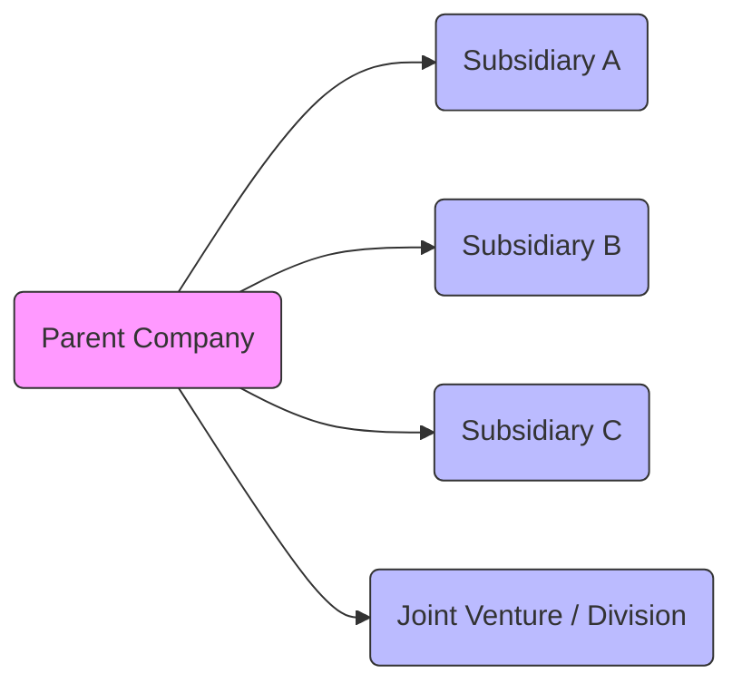
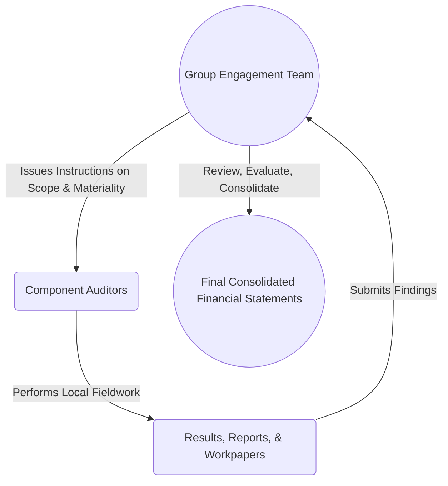

## 7.3 Group Audits: Component Auditors and Consolidations

Group audits arise when multiple entities or components—such as subsidiaries, branches, joint ventures, or divisions—are aggregated into a single set of financial statements. These consolidated financial statements are the responsibility of the group engagement team. Managing a group audit requires meticulous planning, clear communication, and robust oversight to ensure an appropriate audit opinion is expressed.

This section covers key concepts and methods for conducting group audits effectively:

• Defining Group Audits  
• Component Materiality  
• Using Component Auditors  
• Consolidation Process  

By the end of this section, you will understand how to plan and execute group audits from initial risk assessment through the consolidation of financial data. We will also explore best practices and illustrate potential pitfalls to avoid.

---

### Defining Group Audits

A “group” is formed when a parent entity, directly or indirectly, controls one or more subsidiaries. These components, individually or collectively, feed into the group’s consolidated financial statements. Examples include:  
• A manufacturing conglomerate that has multiple subsidiaries in different countries.  
• A tech company operating through joint ventures or special-purpose entities.  
• Financial institutions with multiple branches and foreign subsidiaries.  

The group engagement team holds ultimate responsibility for the group audit opinion. Even if parts of the audit are delegated to component auditors, the group engagement partner signs off on the consolidated financial statements.

#### Roles Within a Group Audit

• Group Engagement Team (GET): Coordinates the audit plan, methodology, and issuance of the final audit report.  
• Component Auditors: Local or specialized auditors who perform procedures on the individual entity or division.  
• Management: Ensures the flow of accurate, complete, and timely financial data from each component.

Below is a simplified diagram illustrating the hierarchical structure often seen in group audits:

The group engagement team is primarily responsible for the consolidated financial statements, but each subsidiary or branch (component) may have separate audits performed by local auditors.

---

### Component Materiality

“Component materiality” is a separate threshold set for each subsidiary, branch, or division under the group umbrella. This determination is guided by:  
• Relative size of the component in terms of total assets, revenue, or profits.  
• Significance of qualitative factors (e.g., operational complexity, high-risk transactions).  
• Potential impact of misstatements on the consolidated financial statements.

#### Determining Component Materiality

1. Start with overall group materiality based on the consolidated financial statements.  
2. Adjust, if necessary, to account for the size or risk profile of each component. For instance, a smaller but high-risk component might have a lower materiality threshold.  
3. Communicate the determined thresholds to component auditors to ensure consistent application.

**Practical Example**  
If the group sets an overall materiality of $1 million but has a manufacturing subsidiary prone to complex, high-volume transactions, the group engagement team might assign that subsidiary a lower component materiality of $500,000, reflecting a higher risk profile.

---

### Using Component Auditors

When the work required for specific components is performed by local or specialized audit teams, the group engagement team maintains overall responsibility but benefits from the component auditors’ local expertise.

#### Reviewing Qualifications and Independence

The group engagement team must evaluate:  
• The component auditors’ professional competence, including technical knowledge of local regulations.  
• Independence standards, ensuring that the component auditors do not have conflicts of interest.  

#### Communicating with Component Auditors

Effective communication is vital. The group engagement team generally issues formal instructions that cover:  
1. Audit scope, timelines, and key deliverables.  
2. Applicable auditing standards (e.g., GAAS, PCAOB standards).  
3. Materiality levels and any special audit considerations.  
4. Reporting protocols for identified misstatements or internal control deficiencies.

Coordination and follow-up are also essential, especially when multiple component auditors are involved. Virtual meetings and document-sharing platforms can streamline collaboration and documentation.

#### Reviewing the Component Auditor’s Work

After the component auditors complete their fieldwork, the group engagement team must:  
• Evaluate whether the work performed aligns with the stated instructions and scope.  
• Assess the sufficiency and appropriateness of the audit evidence to support conclusions.  
• Determine any further audit procedures if the aggregated results at the group level suggest heightened risk.

---

### Consolidation Process

Obtaining assurance over the consolidation process is a core element of a group audit. The group engagement team must confirm that:

1. **Intercompany Transactions** are appropriately eliminated to avoid double-counting revenue, expenses, assets, or liabilities.  
2. **Uniform Accounting Policies** are consistently applied across components, ensuring comparability.  
3. **Translation Adjustments** from foreign operations comply with relevant accounting standards (e.g., ASC 830 for U.S. GAAP).  
4. **New or Complex Components** are thoroughly vetted for unique accounting issues that may impact consolidation.

#### Pitfalls and Best Practices

• **Pitfall**: Overreliance on component auditors without sufficient oversight.  
  **Best Practice**: Implement a structured review process, including site visits, timely communication, and robust documentation reviews.

• **Pitfall**: Failing to account for differences in local accounting frameworks or IFRS vs. U.S. GAAP.  
  **Best Practice**: Ensure staff is trained to reconcile differences and adjust the consolidation entries accordingly.

• **Pitfall**: Missing newly acquired subsidiaries in the oversight process.  
  **Best Practice**: Update audit planning documents regularly to reflect acquisitions, changes in corporate structure, or evolving accounting policies.

---

### Real-World Case Study

Consider an international consumer products company based in the United States with ten subsidiaries worldwide. The parent entity in the U.S. follows U.S. GAAP, while one large subsidiary in Europe uses IFRS. The group engagement team sets an initial materiality level for the group at $1.5 million. However, due to currency risk and significantly different reporting environments, the European subsidiary receives a separate component materiality of $800,000. Local auditors in each country handle the preliminary fieldwork, focusing on internal controls, existence of inventory, and compliance with local regulations. The group engagement team then consolidates their findings, makes necessary IFRS-to-GAAP adjustments, eliminates intercompany transactions, and prepares the financial statements in a consistent manner. Throughout the process, they maintain frequent communication via scheduled online meetings and standardized reporting procedures to consolidate the group’s financial results effectively.

---

### Diagram: Overview of the Group Audit Communication Flow

**Figure Explanation**  
1. The group engagement team sets the plan, including scope, key risks, and materiality thresholds.  
2. Component auditors execute audit procedures in their respective jurisdictions.  
3. Component auditors report back to the group engagement team, providing supporting documents and conclusions.  
4. The group engagement team evaluates and aggregates findings into the final consolidated financial statements.

---

### Glossary

• **Group Engagement Team (GET)**: The main audit team responsible for orchestrating the overall group audit, reviewing the component auditors’ work, and issuing the final audit opinion.  
• **Component Materiality**: A separate threshold for evaluating misstatements within a subsidiary or division, reflective of its significance and risk profile.  
• **Uniform Accounting Policies**: Consistent accounting treatments applied across all components within the group, crucial for comparability and proper consolidation.

---

### References and Resources

• **Official References**  
  – [AU-C Section 600](https://www.aicpa.org/research/standards/auditattest/clarifiedsas.html) – “Special Considerations—Audits of Group Financial Statements.”  
  – PCAOB Auditing Standards (AS 1205 – Part of multi-location audits requirements).

• **Additional Resources**  
  – “Group Audit Pitfalls and Best Practices” (available in various Big Four whitepapers).  
  – Professional journals and publications focusing on international auditing coordination.

---

## Group Audits Knowledge Quiz: Consolidations & Multi-Location Strategies



### In a group audit, which team is ultimately responsible for the consolidated financial statements?

- [ ] The local component auditors in each subsidiary jurisdiction
- [x] The group engagement team
- [ ] The parent company management
- [ ] The external regulatory body

> **Explanation:** While component auditors perform procedures at their locations, the group engagement team takes final responsibility for the consolidation and the overall audit opinion.

### What is the primary purpose of setting different component materiality levels?

- [x] To address varying sizes and risk profiles across different subsidiaries
- [ ] To reduce the overall workload of the auditing team
- [ ] To ensure the group engagement partner does not need to review every component
- [ ] To meet a regulatory requirement that each component have the same threshold

> **Explanation:** Components often vary in size and risk. Assigning separate materiality levels ensures each subsidiary or branch is audited appropriately, aligning with its significance to the group.

### Which of the following is a key consideration in selecting and reviewing a component auditor?

- [ ] The auditor’s adherence to IFRS only
- [ ] Whether the auditor has a lower fee structure
- [x] The auditor’s independence and professional competence
- [ ] The distance of the component location from the group engagement team

> **Explanation:** Independence and professional competence are paramount for all auditors working on a group engagement to ensure reliable and valid audit results.

### Why are uniform accounting policies important in a group audit?

- [x] They ensure consistency and comparability across all components
- [ ] They reduce the overall audit fee for the client
- [ ] They facilitate local decisions that disregard the parent’s guidelines
- [ ] They are only required by public companies

> **Explanation:** Uniform accounting policies help ensure that financial statements are comparable and consistent, facilitating an accurate consolidation process.

### What is the group engagement team’s responsibility when the component auditor completes their work?

- [x] Evaluate whether the component auditor’s procedures are sufficient
- [ ] Accept the component auditor’s report without any review
- [x] Perform additional procedures if necessary
- [ ] Replace the component auditor’s report with internal documents only

> **Explanation:** The group engagement team must review the component auditor’s work for sufficiency and may perform additional procedures to address any identified risks.

### Which of the following best describes intercompany transactions in the consolidation process?

- [x] Transactions between subsidiaries or between the parent and its subsidiaries
- [ ] Transactions between management and the external auditors
- [ ] Transactions prepared by an external regulatory authority
- [ ] None of the above

> **Explanation:** Intercompany transactions are those that happen within the group, such as parent-subsidiary or subsidiary-subsidiary deals, and must be eliminated during consolidation.

### What is a best practice for a group engagement team to avoid overreliance on component auditors?

- [ ] Delegating all key decisions to component auditors
- [x] Maintaining structured review protocols and regular communication
- [x] Conducting site visits as necessary
- [ ] Letting the group engagement partner primarily rely on management-supplied data

> **Explanation:** A structured review process, frequent communication, and site visits mitigate the risk of overreliance and help ensure that component audits maintain high quality.

### After consolidating the financial statements, what should the group engagement team do to finalize the audit?

- [x] Conduct a final review to ensure all intercompany transactions are eliminated
- [ ] Rely solely on component auditors’ legal letters
- [ ] Delegate responsibility for final sign-off to local management
- [ ] Eliminate materiality thresholds

> **Explanation:** Eliminating intercompany transactions and undertaking a final review helps ensure accurate consolidated results and protects audit quality.

### Which subsidiary would typically be assigned a lower component materiality threshold?

- [x] A high-risk subsidiary
- [ ] A subsidiary with minimal transactions
- [ ] A dormant subsidiary with no operations
- [ ] All subsidiaries must have the same threshold

> **Explanation:** Higher-risk subsidiaries often warrant lower materiality thresholds to ensure that potential misstatements are adequately identified and addressed.

### True or False: PCAOB standards specifically address the coordination of multi-location audits, including group audits.

- [x] True
- [ ] False

> **Explanation:** PCAOB standards include guidance on multi-location audit considerations, making it a key reference point for larger entity audits.



---

## For Additional Practice and Deeper Preparation

**[Auditing & Attestation CPA Mock Exams (AUD): Comprehensive Prep](https://www.udemy.com/course/aud-cpa-mock-exams/?referralCode=D064EF7BD4A84FC6403D)**  
• Tackle full-length mock exams designed to mirror real AUD questions—from risk assessment and ethics to internal control and substantive procedures.  
• Refine your exam-day strategies with detailed, step-by-step solutions for every scenario.  
• Explore in-depth rationales that reinforce understanding of higher-level concepts, giving you a decisive edge on test day.  
• Boost confidence and reduce exam anxiety by building mastery of the wide-ranging AUD blueprint.

_Disclaimer: This course is not endorsed by or affiliated with the AICPA, NASBA, or any official CPA Examination authority. All content is created solely for educational and preparatory purposes._
