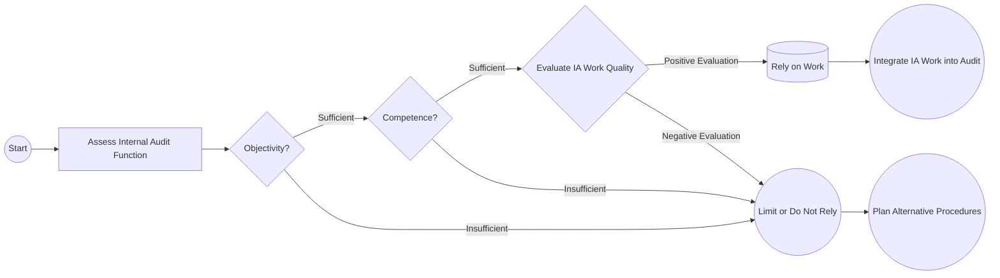

## 7.4 Relying on Internal Audit, Specialists, and Others

Effective audits often require collaboration with diverse resources both within and outside the organization. External auditors can optimize their work by leveraging internal audit functions, consulting with specialists for areas requiring technical expertise, and considering work performed by service organizations that process or maintain client data. This collaboration or reliance must always be approached with professional skepticism, ensuring objectivity, competence, and alignment with auditing standards.

In this section, we examine when and how external auditors can rely on:  
• Internal auditors, including how to evaluate their objectivity and competence.  
• Specialists, such as actuaries and valuation experts, ensuring their independence and verifying the appropriateness of their methods.  
• Service organizations, particularly understanding their impact on the client’s control environment and the significance of obtaining service organization control (SOC) reporting.  

---

## 1. Leveraging Internal Audit

### 1.1 Overview and Benefits

Internal audit functions exist within many organizations to evaluate and improve the effectiveness of risk management, internal controls, and governance processes. Because internal auditors often possess deep knowledge of the organization’s operations, processes, and controls, leveraging their work can increase audit efficiency and avoid duplication.

Key benefits of leveraging internal audit:
• Better insight into entity-specific risks and controls.  
• Reduced redundancy in testing if internal audit’s procedures and scope align with external audit objectives.  
• Improved communication regarding potential fraud, noncompliance, or emerging issues.  

### 1.2 Assessing Objectivity and Competence

Under [AU-C Section 610](https://www.aicpa.org/research/standards/auditattest/clarifiedsas.html), the external auditor must consider:
• Objectivity: The internal auditors should be independent within the organization, and free from bias or influence from management.  
• Competence: They should possess the necessary education, experience, and expertise to perform work of high quality.  

#### Evaluation Factors

| Factor                | Indicators                                                        |
|-----------------------|-------------------------------------------------------------------|
| Objectivity           | • Internal audit’s reporting lines (e.g., direct to Audit Committee) • Policies safeguarding independence and ethical standards |
| Competence            | • Professional certifications (CIA, CPA, etc.) • Technical training and continuing education • Previous track record or peer reviews |

If internal audit staff meet rigorous standards, the external auditor can rely more substantially on their work. However, if objectivity or competence is lacking, reliance should be curtailed or avoided entirely.

### 1.3 Direct Assistance vs. Use of Internal Audit’s Work

1. **Use of Internal Audit’s Work**  
   The external auditor may leverage internal audit’s completed work (e.g., reports, test results) in formulating audit conclusions. The external auditor must review the nature, timing, and extent of the procedures performed, as well as evaluate the internal auditor’s documentation of test work.

2. **Direct Assistance**  
   In some cases, the external auditor may request internal auditors to perform specific audit procedures on behalf of the external auditor. This is permissible, subject to proper oversight and the external auditor’s control over the nature and scope of such tasks. The external auditor remains fully responsible for the audit opinion, and must be satisfied that the procedures are performed with due professional care.

Below is a visual representation of how external auditors consider internal auditors’ objectivity and competence before deciding on reliance:

---

## 2. Using Specialists

### 2.1 When to Engage a Specialist

External auditors frequently encounter complex topics (e.g., actuarial calculations for pension obligations, valuation of complex financial instruments, intangible asset impairment) that require specialized knowledge. [AU-C Section 620](https://www.aicpa.org/research/standards/auditattest/clarifiedsas.html) provides guidance on “Using the Work of an Auditor’s Specialist.”

A specialist may be:  
• An actuary for pension and insurance reserves.  
• A valuation expert for fair value measurements of complex or unique assets.  
• An engineer for asset appraisals, such as real estate or manufacturing equipment valuations.  
• A legal specialist for interpreting laws or regulations impacting financial statement disclosures.

### 2.2 Evaluating Qualifications and Independence

The external auditor should examine the specialist’s:
1. **Professional Qualifications:** Relevant educational background, certifications, professional experience.  
2. **Reputation and Track Record:** Prior engagements, references, or any disciplinary actions.  
3. **Independence from the Client:** The specialist must be free from conflicts of interest or relationships that could impair objectivity.  

### 2.3 Assessing Methodologies and Assumptions

Even with a qualified and independent specialist, the external auditor must assess:
• The consistency and reasonableness of methods used.  
• The reliability of data inputs.  
• The appropriateness of assumptions (e.g., discount rates, growth rates, market comparables).  

Ultimately, the external auditor must judge whether the specialist’s conclusions are suitable and adequately supported. An “expert” opinion does not absolve the external auditor of responsibility; the auditor still evaluates the specialist’s work to determine if it provides sufficient appropriate audit evidence.

### 2.4 Practical Example

A client is valuing a new intangible asset acquired as part of a merger. The external auditor lacks expertise in intangible valuations for pharmaceutical patents, so they engage a specialist with advanced knowledge of intellectual property valuation. The specialist uses well-recognized industry approaches, reviews market data of similar patents, and applies appropriate discount rates consistent with market conditions. The external auditor reviews these assumptions in detail, confirming their consistency with generally accepted valuation methods and verifying that the data set used is current and reliable.  

---

## 3. Service Organizations

### 3.1 Understanding Service Organizations

A service organization is an entity that performs outsourced processes impacting a client’s financial reporting, such as:
• Payroll processing.  
• Data center and IT service hosting.  
• Claims processing in the insurance industry.  

Service organizations can introduce additional complexity in assessing internal controls. External auditors must consider whether the service organization’s controls over relevant data and transactions are appropriately designed and operating effectively.

### 3.2 Service Organization Controls (SOC) Reports

When the client outsources significant processes, the external auditor may obtain a Service Organization Controls (SOC) report—often referred to as a SOC 1® report for financial reporting. This report, issued by the service organization’s auditor, typically includes:

• A description of the service organization’s system.  
• Management’s assertion on the design and operating effectiveness of controls.  
• The service auditor’s opinion on these controls.

If the client’s accounts and disclosures are materially affected by the service organization, the external auditor must determine:
• The scope and relevance of the SOC 1® report.  
• Any control deficiencies that might affect the financial statements.  
• Whether gaps in the SOC 1® coverage require the external auditor to perform additional procedures.

### 3.3 Direct Testing Alternatives

In cases where the SOC 1® report is not sufficient or does not cover certain significant processes or control objectives, the external auditor may:
• Perform additional testing at the service organization (if feasible).  
• Request a “bridge letter” or subsequent event update if the SOC 1® coverage period does not align with the user entity’s financial reporting period.  
• Perform alternative procedures at the user entity to gain assurance.

---

## 4. Common Pitfalls and Best Practices

### 4.1 Overreliance on Internal Audit

• Pitfall: Using internal audit’s work without adequately evaluating competence or objectivity.  
• Best Practice: Apply a rigorous process of evaluation, reperform certain procedures, and maintain healthy professional skepticism.

### 4.2 Failure to Critically Assess the Specialist’s Methodology

• Pitfall: Accepting a specialist’s conclusion at face value.  
• Best Practice: Obtain an understanding of the methods and assumptions used. Corroborate key assumptions with industry data, and ensure appropriate disclosures.

### 4.3 Inadequate Service Organization Risk Assessment

• Pitfall: Assuming the responsibility for internal control resides solely with the service organization, leading to insufficient testing.  
• Best Practice: Obtain a relevant SOC 1® report early in the audit, evaluate the adequacy of controls and coverage period, and identify if further inquiry or testing is needed.

---

## 5. Summary and Conclusion

Auditors can substantially enhance audit efficiency and depth by relying on internal auditors, qualified specialists, and properly vetted service organizations. However, the ultimate responsibility for the audit opinion remains with the external auditor, and reliance demands due diligence:

1. Vetting internal audit’s objectivity, competence, and scope of work.  
2. Assessing a specialist’s qualifications, independence, and methodological soundness.  
3. Evaluating service organization controls through SOC 1® reports or alternative testing if coverage is inadequate.  

An integrated approach, bridging internal and external expertise, can elevate the quality of audit evidence, enabling auditors to address risks more effectively while adhering to professional standards.

---

## Glossary

• **Internal Audit Direct Assistance**: A scenario where internal auditors, under external auditor supervision, perform specific procedures that directly contribute to the external audit.  
• **Specialist’s Report**: Documentation prepared by an external expert, such as a valuation or legal opinion, that forms part of audit evidence.  
• **SOC 1® Report**: A Service Organization Controls report detailing controls at a service organization relevant to user entities’ financial reporting, enhancing reliance on third-party processing or hosting.  

---

## References and Resources

• **Official References**  
  – [AU-C Section 610](https://www.aicpa.org/research/standards/auditattest/clarifiedsas.html) – “Using the Work of Internal Auditors.”  
  – [AU-C Section 620](https://www.aicpa.org/research/standards/auditattest/clarifiedsas.html) – “Using the Work of an Auditor’s Specialist.”  

• **Additional Resources**  
  – “Service Organization Controls (SOC) Reports: A Comprehensive Guide” (AICPA).  
  – Interactive tutorials on “Effectively Leveraging Internal Audit” found in various online CPE courses.

---

## Test Your Knowledge: Relying on Internal Audit and Specialists Quiz



### What is a key consideration before relying on internal auditors’ work?  
- [ ] The fees internal auditors charge for their services  
- [x] Assessing internal auditors’ objectivity and competence  
- [ ] Verifying internal auditors have the same certifications as external auditors  
- [ ] Ensuring they have performed all procedures the external auditor would normally do  

> **Explanation:** External auditors must evaluate the objectivity and competence of internal auditors per AU-C Section 610 before deciding to rely on their work.  

### Which of the following best describes a “Specialist’s Report”?  
- [ ] A summary of material misstatements found by internal auditors  
- [x] Documentation from an external expert that the auditor uses as audit evidence  
- [ ] The final auditor’s report issued directly to shareholders  
- [ ] A schedule of fee arrangements with third parties  

> **Explanation:** A “Specialist’s Report” refers to evidence provided by an expert (e.g., actuary, valuation expert) that assists the auditor in forming an opinion.  

### Which statement about engaging an auditor’s specialist is correct?  
- [x] The external auditor must still evaluate the appropriateness of the specialist’s conclusions  
- [ ] The external auditor may shift full responsibility for accuracy onto the specialist  
- [ ] The specialist’s report alone eliminates the need for additional audit procedures  
- [ ] The external auditor should not question the specialist’s methods due to their expertise  

> **Explanation:** Even though an expert provides specialized knowledge, the external auditor retains responsibility for the overall audit and must assess the reliability of the specialist’s conclusions.  

### Which of the following is a key benefit of obtaining a SOC 1® report from a service organization?  
- [ ] It eliminates the need for substantive testing over outsourced transactions  
- [x] It provides information on the design and operating effectiveness of the service organization’s controls  
- [ ] It is mandatory for all financial statement audits  
- [ ] It focuses solely on cybersecurity practices within the service organization  

> **Explanation:** A SOC 1® report offers insight into the service organization’s system and controls relevant to the user entity’s financial reporting.  

### When might direct assistance from internal auditors be most beneficial?  
- [x] When they have expertise that aligns closely with the audit strategy  
- [ ] When they have never performed an external audit before  
- [x] When being closely supervised by the external auditor  
- [ ] Only in small organizations without a formal internal audit function  

> **Explanation:** Direct assistance can streamline testing if internal auditors are supervised by the external auditor, have relevant expertise, and are reliable in terms of objectivity and competence.  

### If the external auditor identifies potential fraud, which statement is true regarding reliance on internal audit?  
- [x] The external auditor may reduce reliance if concerns about objectivity or competence arise  
- [ ] The external auditor should disregard internal audit’s work immediately  
- [ ] Internal auditors must complete the fraud investigation independently  
- [ ] The external auditor can rely on internal auditors for everything so long as the CFO confirms it  

> **Explanation:** Fraud risk often heightens scrutiny over any reliance on internal auditors. If their objectivity or competence is questionable, the external auditor must reduce or eliminate reliance and perform additional procedures.  

### Which factor is NOT typically evaluated by the external auditor when considering reliance on a specialist?  
- [x] The specialist’s political affiliations  
- [ ] The specialist’s professional qualifications  
- [x] The specialist’s independence  
- [ ] The specialist’s track record of prior work quality  

> **Explanation:** While professional qualifications, independence, and track record are important, the specialist’s political affiliations are generally irrelevant unless they directly compromise independence or objectivity (which is highly unlikely in standard audits).  

### When the external auditor decides to rely on internal audit’s testing, what is the primary activity they must perform in relation to internal audit’s workpapers?  
- [ ] Upload them directly to the final audit report  
- [x] Review and reperform tests on a sample basis to confirm adequacy  
- [ ] Return them promptly to internal audit after a cursory glance  
- [ ] Delegate final opinion responsibility to internal audit  

> **Explanation:** External auditors generally review internal audit documentation and may reperform a portion of the tests to ensure the work is adequate and reliable.  

### If a client outsources its payroll function to a service organization without a SOC 1® report, how should the external auditor proceed?  
- [x] Consider performing additional testing or requesting a customized audit approach at the service organization  
- [ ] Issue an adverse opinion on the client's financial statements immediately  
- [ ] Assume all controls at the service organization are operating effectively  
- [ ] Delegate the entire external audit to the service organization’s auditor  

> **Explanation:** In the absence of a SOC 1® report, the external auditor should consider alternative procedures such as direct testing of payroll transactions or requesting a bridging letter to gain sufficient assurance over those outsourced processes.  

### True or False: The external auditor can fully rely on a specialist’s findings without question if the specialist is an industry-recognized expert.  
- [x] False  
- [ ] True  

> **Explanation:** The external auditor must evaluate the specialist’s methods, data inputs, and conclusions. Gaining an understanding of the specialist’s approach is crucial, regardless of their credentials.  



---

## For Additional Practice and Deeper Preparation

**[Auditing & Attestation CPA Mock Exams (AUD): Comprehensive Prep](https://www.udemy.com/course/aud-cpa-mock-exams/?referralCode=D064EF7BD4A84FC6403D)**  
• Tackle full-length mock exams designed to mirror real AUD questions—from risk assessment and ethics to internal control and substantive procedures.  
• Refine your exam-day strategies with detailed, step-by-step solutions for every scenario.  
• Explore in-depth rationales that reinforce understanding of higher-level concepts, giving you a decisive edge on test day.  
• Boost confidence and reduce exam anxiety by building mastery of the wide-ranging AUD blueprint.

_Disclaimer: This course is not endorsed by or affiliated with the AICPA, NASBA, or any official CPA Examination authority. All content is created solely for educational and preparatory purposes._
