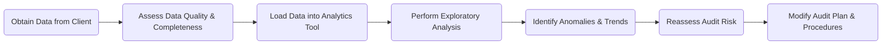

## 7.5 Use of Data Analytics and Emerging Technologies in Audit Planning

Technology continues to reshape the audit profession, providing auditors with new tools that enhance both the scope and precision of audit procedures—especially during the planning phase. The integration of data analytics, robotic process automation (RPA), artificial intelligence (AI), and blockchain technologies allows auditors to identify risks more accurately and tailor their response strategies accordingly. This section explores how data analytics can be employed in the preliminary stages of an audit to uncover anomalies, unusual trends, or potential risk areas. We also examine how emerging technologies can bolster operational efficiency, reduce manual errors, and strengthen audit quality overall.

--------------------------------------------------------------------------------

### 1. Importance of Data Analytics in Audit Planning

#### 1.1 Expanding the Scope Beyond Sampling
Traditionally, audits have relied on sample-based testing. However, data analytics tools allow auditors to evaluate entire populations of financial transactions (e.g., 100% of sales, purchases, or journal entries). By doing so, the auditor can detect outliers or large, unusual transactions that may not appear in a random sample. For instance:

• Identifying spikes in vendor payables that deviate from the normal payment cycle.  
• Reviewing all discounts granted within a certain period to pinpoint transactions that might exceed management’s authorization thresholds.  
• Cross-referencing user access logs with transaction logs for suspicious activities (e.g., a clerk approving his or her own purchase requisitions).

#### 1.2 Early-Phase Risk Identification
Using data analytics during audit planning helps auditors develop a sharper risk assessment. Software applications can quickly highlight large variances, trends over time, or anomalies in transaction patterns. Through this lens, auditors can allocate resources more effectively, focusing on areas carrying higher risk of material misstatement. For example, a large, unexplained spike in sales return credits during a typically slow season might signal an earnings management scheme or systemic control issues in credit approvals.

These analytics-driven insights ensure that the audit plan is more targeted, optimizing both cost and efficiency. Early detection of risk also allows for discussions with management to clarify issues and enhance communication regarding the audit’s scope.

--------------------------------------------------------------------------------

### 2. Key Steps in Using Data Analytics During Planning

Below is a simplified visual workflow illustrating how data analytics integrates into the planning process:

#### 2.1 Obtaining and Validating Client Data
• The initial step in any data-driven approach is to collect relevant data sets from the client (e.g., general ledger transactions, sales records, inventory details).  
• Validating data completeness and accuracy is critical; unclean or missing data can lead to erroneous conclusions (often summarized as “garbage in, garbage out”).  
• Cross-check data with supporting documentation, such as bank statements or system reports, to ensure reliability.

#### 2.2 Exploratory Analysis and Visualization
• Perform initial data analytics to spot unusual transactions, high-risk accounts, or large fluctuations year over year.  
• Visualizations (e.g., histograms, scatter plots, dashboards) aid in intuitively spotting anomalies that merit a deeper dive.  
• Common patterns to investigate include negative inventory balances, repeated round-number adjustments, or frequent manual journal entries near month-end or year-end.

#### 2.3 Identifying Potential Risks
• Once anomalies surface, the auditor reconsiders the client’s inherent, control, and fraud risks.  
• Determine if risks are isolated or systemic, potentially impacting multiple processes or accounts.  
• Document these findings in the audit working papers, noting the rationale behind each flagged risk.

#### 2.4 Adjusting the Audit Plan
• Refine the nature, timing, and extent of further audit procedures based on the identified risks.  
• For example, a flagged area of concern (e.g., suspicious vendor transactions) may require extended tests of controls or expanded substantive procedures.  
• Ensure the engagement team understands the new or evolving risks discovered through data analytics.

--------------------------------------------------------------------------------

### 3. Emerging Technologies in Audit Planning

#### 3.1 Robotic Process Automation (RPA)
RPA utilizes software “bots” to automate repetitive and rules-based tasks. In an audit planning context, RPA can:

• Automate data extraction from client systems, saving time and minimizing transcription errors.  
• Perform rapid reconciliations of large data sets (e.g., reconciling bank statements to the general ledger).  
• Facilitate the initial creation of summary tables or pivot analyses for faster risk scanning.

By speeding up tasks that typically demand substantial human effort, RPA frees up auditors to concentrate on analysis, judgment, and professional skepticism.

#### 3.2 Artificial Intelligence (AI) and Machine Learning
AI-driven tools can detect patterns within vast directories of transactions or documents without explicit instructions. A machine learning model can ingest historical anomalies or known fraudulent activities, thereby “learning” how to spot potential red flags such as:

• Duplicate invoices received from different vendors.  
• Approvals executed outside regular business hours by unusual user IDs.  
• Atypical expense claims that exceed established thresholds.

AI also supports predictive analytics, offering insights into where errors or misstatements are most likely to occur. However, the use of AI raises the concept of AI bias—if the training data set is skewed or incomplete, the AI tool may misread legitimate data as suspicious or fail to catch real anomalies.

#### 3.3 Blockchain Considerations
As more companies adopt blockchain-based systems for transaction recording and verification, auditors may need specialized skills to read and interpret distributed ledger transactions. Key points include:

• Understanding how “blocks” of transactions are chained and validated.  
• Assessing the reliability of consensus protocols (e.g., proof-of-work, proof-of-stake).  
• Verifying the completeness of data on the blockchain and ensuring no unauthorized modifications have occurred.

When blockchain intersects with financial reporting, the next generation of auditors must develop new competencies to evaluate internal controls, privacy, and cybersecurity risks that arise in decentralized environments.

--------------------------------------------------------------------------------

### 4. Auditor Considerations and Best Practices

#### 4.1 Data Completeness and Accuracy
Regardless of advanced analytical tools, flawed or incomplete data can compromise audit results. The auditor must perform sufficient checks to ensure the data set aligns with the entity’s transactional records and includes the relevant period(s).

#### 4.2 Skills and Expertise on the Engagement Team
Audit teams should have—or access—professionals with the following skills:  
• Understanding of database structures and query logic.  
• Familiarity with advanced data visualization and analytics platforms (Power BI, Tableau, ACL, IDEA, Python-based tools, etc.).  
• Ability to interpret AI outputs and detective controls in RPA workflows.

Where internal skill gaps exist, auditors may seek InfoSec specialists, IT consultants, or data scientists to collaborate.

#### 4.3 Evaluating Reliability of Analytical Tools
Before relying on an analytics or AI platform, auditors should gain comfort regarding:  
• Vendor reputation and track record.  
• Accuracy of the tool’s underlying algorithms.  
• Security, confidentiality, and privacy considerations (especially if client data is stored in a cloud solution).

#### 4.4 Addressing AI Bias
AI bias can manifest if a machine learning model is trained on data sets unrepresentative of the broader population. Auditors must:  
• Use diverse, high-quality data during training.  
• Periodically test the model’s predictions vs. actual outcomes.  
• Document procedures for mitigating bias (e.g., employing multiple algorithms, comparing results).

--------------------------------------------------------------------------------

### 5. Practical Example: Vendor Payment Analytics

Consider a mid-sized manufacturing client whose payables run into tens of thousands of invoices annually. Through a data analytics platform, the audit team reviews 100% of payables over the past fiscal year. The tool flags an unusual pattern:

• Certain vendor invoices are consistently paid twice within two-week periods, often in round amounts.  
• The same user credential approves these duplicate payments on weekends.

This red flag prompts the auditor to:  
1. Investigate the vendor’s legitimacy and contract terms.  
2. Perform additional substantive testing on the nature and authenticity of each transaction.  
3. Evaluate controls around system access and payment approvals.  
4. Discuss with management to ensure whether it is an administrative oversight or indicative of fraud.

As a result of these findings, the planned substantive procedures expand; the engagement team also decides to test entity-level controls more thoroughly in the accounts payable process.

--------------------------------------------------------------------------------

### Glossary

• **Data Analytics**: Systematic computational analysis of data sets to discover patterns, correlations, or anomalies.  
• **RPA (Robotic Process Automation)**: Software “bots” that automate repetitive tasks in data extraction, matching, or reconciliations.  
• **AI Bias**: Systematic errors introduced by training data or algorithms that misread patterns, creating misguided outcomes.

--------------------------------------------------------------------------------

### References and Resources

• **Official References**  
  – AICPA Publications on “Audit Data Analytics” and “Emerging Technologies.”  
• **Additional Resources**  
  – The CAQ (Center for Audit Quality) “Audit Innovation” series for best practices in adopting technology.  
  – [ISACA resources](https://www.isaca.org/resources/) on governance over AI/RPA deployments.

--------------------------------------------------------------------------------

## Quiz: Elevate Your Audit Planning Skills with Data Analytics



### Data analytics in the audit planning phase primarily helps auditors:
- [ ] Perform sample-based testing of financial data.  
- [x] Evaluate entire transaction populations to identify unusual items.  
- [ ] Determine final audit opinions.  
- [ ] Bypass assessments of internal controls entirely.

> **Explanation:** Data analytics allows for comprehensive analysis of large data sets. Auditors can spot unusual transactions faster, adjust risk assessments, and focus their efforts more efficiently.

### AI bias occurs when:
- [ ] The machine learning algorithm processed large and valid datasets.  
- [ ] The AI system has zero errors.  
- [ ] The team performing the audit lacks expertise.  
- [x] The training data or model’s design systematically misinterprets patterns.

> **Explanation:** AI bias stems from skewed training data or flawed algorithms that produce incorrect or misleading outcomes.

### An example of an RPA application in audit planning includes:
- [x] Automating reconciliations for large volumes of transactions.  
- [ ] Rendering the final audit opinion.  
- [ ] Managing the client’s payroll processing.  
- [ ] Eliminating the need for the auditor’s professional judgment.

> **Explanation:** RPA is ideally suited for repetitive tasks like data extraction and reconciliations. It complements, rather than replaces, the auditor’s professional judgment.

### When analyzing blockchain transactions during audit planning, auditors must:
- [x] Verify the integrity of the distributed ledger.  
- [ ] Replace substantive procedures with client representations.  
- [ ] Depend solely on the blockchain’s immutability.  
- [ ] Ignore consensus protocols.

> **Explanation:** Auditors need to understand blockchain’s technical aspects (e.g., consensus mechanisms) to verify data completeness and integrity.

### A key advantage of data analytics in identifying fraud risk is:
- [x] The ability to pinpoint anomalies in a full data population.  
- [x] Swift detection of suspicious activities or trends.  
- [ ] Reducing the sample size to zero.  
- [ ] Automatically providing in-depth legal analysis.

> **Explanation:** Data analytics empowers auditors to uncover anomalies promptly. They can review 100% of transactions to detect irregularities such as duplicate payments or transactions approved outside normal control structures.

### A risk of using sophisticated audit tools without ensuring data accuracy is:
- [x] Drawing incorrect conclusions based on flawed data.  
- [ ] Increasing the engagement team’s data literacy.  
- [ ] Streamlining the engagement timeline with no added risk.  
- [ ] Completely eliminating fraud risk.

> **Explanation:** Garbage in, garbage out. If the underlying data is incomplete or inaccurate, any analytics or AI tool will produce unreliable results.

### When employing AI in audit planning, the auditor should:
- [x] Evaluate the model’s predictions against known outcomes.  
- [ ] Eliminate all manual tests of controls.  
- [x] Document how they addressed inherent biases.  
- [ ] Rely solely on the AI for determining material misstatements.

> **Explanation:** AI can inform the planning process but must be regularly tested for accuracy, and potential biases must be documented and addressed.

### One major benefit of combining RPA and data analytics in planning is:
- [x] Speeding up repetitive tasks while allowing deeper data insights.  
- [ ] Replacing all members of the audit team.  
- [ ] Eliminating the need for an engagement letter.  
- [ ] Guaranteeing no material misstatements exist.

> **Explanation:** RPA handles routine tasks, thereby freeing up the auditors’ efforts to dive deeper into data relationships using analytics.

### Before incorporating results from an analytics tool into the audit plan, an auditor should:
- [x] Verify the tool’s accuracy and reliability.  
- [ ] Accept the tool’s results at face value.  
- [ ] Skip testing internal controls.  
- [ ] Delete any anomalies uncovered by the tool.

> **Explanation:** Confirming the accuracy and reliability of an analytics tool is essential before drawing conclusions from its output.

### True or False: AI-based models in audit planning never require re-training or tuning once they are deployed.  
- [ ] True  
- [x] False  

> **Explanation:** AI models periodically require re-training and tuning to maintain or improve accuracy, especially as the client’s data, industry conditions, and business processes evolve.



--------------------------------------------------------------------------------

## For Additional Practice and Deeper Preparation

**[Auditing & Attestation CPA Mock Exams (AUD): Comprehensive Prep](https://www.udemy.com/course/aud-cpa-mock-exams/?referralCode=D064EF7BD4A84FC6403D)**  
• Tackle full-length mock exams designed to mirror real AUD questions—from risk assessment and ethics to internal control and substantive procedures.  
• Refine your exam-day strategies with detailed, step-by-step solutions for every scenario.  
• Explore in-depth rationales that reinforce understanding of higher-level concepts, giving you a decisive edge on test day.  
• Boost confidence and reduce exam anxiety by building mastery of the wide-ranging AUD blueprint.

_Disclaimer: This course is not endorsed by or affiliated with the AICPA, NASBA, or any official CPA Examination authority. All content is created solely for educational and preparatory purposes._
