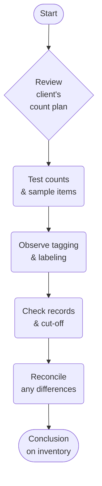

## 10.3 Inventory Observations and Costing Issues

Inventory often represents one of the largest line items in a company’s balance sheet. Auditors must therefore pay particular attention to how that inventory is counted, valued, and disclosed. In this section, we will explore the fundamentals and best practices regarding physical inventory observations, the application of various costing methods, determination of net realizable value or market value, and identifying excess or obsolete inventory. These activities are crucial to ensuring that financial statements accurately reflect the economic reality of the organization's inventory holdings.

--------------------------------------------------------------------------------
## 1. Physical Inventory Observations

### 1.1 Importance of Physical Inventory Observation
Attending a client’s physical inventory count is frequently required by auditing standards (e.g., AU-C Section 501) unless impractical. Observing the count enables the external auditor to:
• Verify the existence and condition of inventory.  
• Assess the effectiveness of the client’s counting procedures.  
• Ensure that management’s cut-off procedures properly include goods in transit or exclude shipments already recognized as sales.  

The auditor’s presence also provides an opportunity to test count accuracy and evaluate how management identifies damaged or obsolete items.

### 1.2 Understanding the Client’s Procedures
Before attending a count, auditors should familiarize themselves with the counting process. This includes reviewing:
1. Written instructions: The client’s standard operating procedures (SOPs) for performing the physical count.  
2. Preparation steps: How items are tagged, recorded, or tracked in inventory systems.  
3. Timing: The chosen date(s) for the physical inventory count and how cut-off is determined for both inbound and outbound shipments.  
4. Roles and responsibilities: Who supervises the counting and who performs the count.  

Accurate, well-documented instructions and a defined oversight process reduce the risk of miscounts or double-counting.

### 1.3 Auditor’s Testing Procedures
Auditors customarily perform the following steps during a physical observation:

• Sampling Items: Select random samples (or stratified samples for higher-value items) and recount them to compare against management’s tally.  
• Verifying Tags: Confirm that tags or count sheets accurately reflect quantities and item descriptions.  
• Observing Count Teams: Check that team members follow established procedures, such as crossing items off a master list once counted.  
• Ensuring Transits Are Properly Handled: Confirm goods in transit are included in or excluded from the count based on shipping terms.  
• Investigating Discrepancies: If auditor tallies deviate significantly from the client’s own count, additional investigation is warranted.  

Below is a simple flowchart that illustrates the typical physical inventory observation process:

### 1.4 Real-World Example
Imagine a manufacturing company that has multiple warehouses. The auditor coordinates with warehouse managers to schedule visits, selecting a representative sample of high-value items (e.g., specialized machinery components) for recount. During the observation, auditors note any inventory items damaged by improper storage. They then verify that these damaged items are recorded at a reduced value or segregated for potential disposal, ensuring accurate valuation.

--------------------------------------------------------------------------------
## 2. Costing and Valuation

### 2.1 Common Inventory Costing Methods

Organizations typically adopt one of the established costing methods below. The method chosen should reflect the nature of the business and must be applied consistently:

1. First-In, First-Out (**FIFO**): Assumes the earliest items purchased or produced are the first ones sold. Ending inventory is valued using the most recent costs, generally approximating current replacement cost.  
2. Last-In, First-Out (**LIFO**): Assumes the latest items purchased are sold first. This method leads to a lower net income during inflationary periods since higher-cost items are recognized sooner. LIFO is permitted under U.S. GAAP but not under IFRS.  
3. Weighted Average (**WA**): Determines an average cost for all items. This can be a simple average or a moving average updated after each purchase.  

Auditors verify not only the calculation of unit costs but also the appropriateness and consistency of applying the chosen costing method across multiple periods.

### 2.2 Lower of Cost or Net Realizable Value (LCNRV) and Lower of Cost or Market (LCM)

Under U.S. GAAP, auditors must evaluate whether inventory is stated at **LCNRV** (or the older **LCM** rule when LIFO/retail inventory methods are used). Essentially, companies may not carry inventory at a value higher than expected selling price minus completion and selling costs.  

Key aspects to evaluate include:

• **Obsolescence Analysis**: If items are outdated or near expiration, their net realizable value may be lower than original cost.  
• **Market Trends**: If sales prices have declined or new models have rendered older inventory obsolete, adjustments may be required.  
• **Historical Turnover Ratios**: Slow-moving items can indicate the need for a valuation allowance.  

A concise table example demonstrates how an auditor might compare cost to net realizable value:

| Item        | Cost per Unit | Estimated Selling Price | Estimated Selling Costs | Net Realizable Value | LCNRV (Lower Value) |
|-------------|---------------|-------------------------|-------------------------|-----------------------|---------------------|
| Widget A    | $10           | $14                    | $3                      | $11                   | $10                 |
| Widget B    | $8            | $7                     | $1                      | $6                    | $6                  |
| Gadget X    | $25           | $28                    | $2                      | $26                   | $25                 |

In this example:
• Widget A: Cost of $10 is lower than NRV of $11, so $10 is used.  
• Widget B: Cost of $8 is higher than NRV of $6, so a write-down to $6 is necessary.  
• Gadget X: Cost of $25 is lower than NRV of $26, so $25 remains the recorded cost.  

--------------------------------------------------------------------------------
## 3. Excess or Obsolete Inventory

### 3.1 Identifying Potentially Obsolete or Excess Goods
Obsolescence poses one of the greatest risks for misstated inventory. Auditors look for indications such as slow turnover, poor sales forecasts, or aging product lines. Specific steps include:

• **Review of Turnover Ratios**: Items that have limited to no movement in the past year are at high risk of obsolescence.  
• **Inspection of Physical Condition**: Detect potential spoilage, damage, or deterioration.  
• **Discussions with Management**: Understand marketing plans, discount strategies, or product discontinuation.  

### 3.2 Evaluating Shelf Life and Expiration
In industries such as pharmaceuticals or perishables, shelf life is critical. Inventory approaching expiry may require write-downs or disposal. Auditors confirm that management has adequately assessed financial impact when shelf life is near or has already passed.

### 3.3 Practical Example
Consider a consumer electronics retailer that updated its smartphone lineup. Previous-generation phones remain unsold. Through analytics, the auditor discovers that more than half of these older models have not sold in six months. The auditor then reviews subsequent sales to confirm if management’s strategy to discount the phones is yielding results. If not, the auditor proposes a valuation allowance for slow-moving inventory.

--------------------------------------------------------------------------------
## 4. Addressing Common Pitfalls

• **Inaccurate Counts**: Overreliance on client-prepared data without sufficient audit sampling can lead to overlooked misstatements.  
• **Incorrect Cost Allocations**: Failing to understand overhead allocation, especially for manufactured goods, can misstate inventory costs.  
• **Measuring Obsolescence**: Not fully investigating slow-moving items or improper reliance on outdated sales forecasts can result in overvaluation.  

--------------------------------------------------------------------------------
## 5. Best Practices in Inventory Auditing

1. **Comprehensive Planning**: Review prior-year findings and perform preliminary analyses to identify high-risk inventory items.  
2. **Maintain Professional Skepticism**: Stay alert to potential manipulation or management bias regarding inventory levels and cost assumptions.  
3. **Leverage Technology**: Use data analytics tools to identify unusual inventory trends, highlight slow-moving SKUs, and pinpoint miscount risks.  
4. **Document Thoroughly**: Keep clear evidence of test counts, price checks, and valuation analyses in working papers.

--------------------------------------------------------------------------------
## 6. References and Further Resources

• **Professional Standard**: AU-C Section 501 “Audit Evidence—Specific Considerations for Selected Items” (AICPA).  
• **Wiley’s CPAexcel on Inventory Audits**: Offers detailed checklists for verifying existence, pricing, and valuation of inventory.  
• **Industry-Specific Manuals**: E.g., for manufacturing processes with extensive work-in-process or overhead allocations, consult specialized AICPA Audit Guides.  

--------------------------------------------------------------------------------
## 7. Quiz: Test Your Knowledge of Inventory Observations and Costing Issues

Below is a quiz designed to help you assess your understanding of physical inventory observation, valuation methods, and identifying obsolete or excess inventory.

## Mastering Inventory Audits: Your Essential Quiz



### Physical observation of inventory is crucial primarily for:
- [x] Verifying the existence and condition of inventory.
- [ ] Determining the precise cost allocation of overhead.
- [ ] Ensuring the efficiency of manufacturing processes.
- [ ] Reviewing post-year-end sales returns only.

> **Explanation:** Physical observation helps auditors confirm that the inventory actually exists, is in saleable condition, and matches the client’s records.

### Which costing method assumes the most recently acquired items are sold first?
- [ ] FIFO
- [x] LIFO
- [ ] Weighted Average
- [ ] Retail Method

> **Explanation:** Under LIFO (Last-In, First-Out), the newest inventory costs are expensed first, affecting income and tax considerations in different economic climates.

### Under U.S. GAAP, inventory must not be carried at a value exceeding:
- [ ] The original purchase price.
- [x] The net realizable value.
- [ ] The replacement cost.
- [ ] The future projected selling price.

> **Explanation:** The lower of cost or net realizable value rule stipulates that companies should not overstate inventory above its expected selling price minus costs to complete and sell.

### FIFO (First-In, First-Out) generally results in:
- [ ] Higher cost correlation with recent market prices in rising cost environments.
- [x] Ending inventory values closer to current replacement costs.
- [ ] Minimizing reported net income during inflationary periods.
- [ ] Obscuring older inventory layers.

> **Explanation:** Under FIFO, the earliest costs are sold first, so inventory on hand typically reflects newer, higher costs, approximating current replacement prices.

### An auditor detects inventory that has not sold in over 12 months. To evaluate for potential obsolescence, the auditor should:
- [x] Consider a write-down or allowance for obsolescence and examine subsequent sales.
- [ ] Automatically remove it from the balance sheet.
- [x] Engage an independent party to revalue the merchandise.
- [ ] Omit it from cut-off testing.

> **Explanation:** Aged inventory that is not moving may need an obsolescence reserve or write-down. The auditor should also consider subsequent sales data to confirm if the item is still marketable.

### The primary objective of test counting during a physical inventory observation is to:
- [x] Provide evidence about the accuracy of the client’s counts.
- [ ] Review the cost allocation for overhead items.
- [ ] Validate the company’s production processes.
- [ ] Identify expired goods only.

> **Explanation:** By re-checking the quantity of selected items, the auditor can confirm whether the client’s physical count procedures are reliable.

### When identifying slow-moving inventory, an important analytical procedure is:
- [x] Calculating inventory turnover ratios.
- [ ] Checking management’s personal expenses.
- [x] Confirming customer credit limits.
- [ ] Verifying intangible asset amortization rates.

> **Explanation:** Turnover ratios show how quickly items sell. A low turnover ratio might indicate slow-moving or obsolete inventory, prompting further investigation.

### In a manufacturing environment, an auditor should ensure overhead assignments are:
- [x] Properly allocated to inventory based on relevant cost drivers such as labor hours or machine hours.
- [ ] Omitted if products remain unsold.
- [ ] Assigned randomly across periods.
- [ ] Allocated solely to finished goods.

> **Explanation:** Correct overhead allocation ensures inventory costs are accurately captured, reflecting production processes and resource usage.

### “Lower of Cost or Market” (LCM) is primarily used when:
- [x] The company uses LIFO or the retail inventory method.
- [ ] The company uses FIFO with no exceptions.
- [ ] The company uses Weighted Average only.
- [ ] The inventory does not require a physical count.

> **Explanation:** Under U.S. GAAP, the LCM concept is an alternative rule specifically applied to inventories accounted for via LIFO or the retail methods.

### Regularly reviewing turnover ratios helps auditors detect:
- [x] Potentially obsolete or slow-moving inventory items.
- [ ] Faster production cycles without errors.
- [ ] Fraud in executive compensation processes.
- [ ] Errors in depreciation of fixed assets.

> **Explanation:** Low turnover ratios often reveal that items have become slow-moving or unsellable, signaling the possibility of overstated inventory.



--------------------------------------------------------------------------------

## For Additional Practice and Deeper Preparation

**[Auditing & Attestation CPA Mock Exams (AUD): Comprehensive Prep](https://www.udemy.com/course/aud-cpa-mock-exams/?referralCode=D064EF7BD4A84FC6403D)**  
• Tackle full-length mock exams designed to mirror real AUD questions—from risk assessment and ethics to internal control and substantive procedures.  
• Refine your exam-day strategies with detailed, step-by-step solutions for every scenario.  
• Explore in-depth rationales that reinforce understanding of higher-level concepts, giving you a decisive edge on test day.  
• Boost confidence and reduce exam anxiety by building mastery of the wide-ranging AUD blueprint.

_Disclaimer: This course is not endorsed by or affiliated with the AICPA, NASBA, or any official CPA Examination authority. All content is created solely for educational and preparatory purposes._
