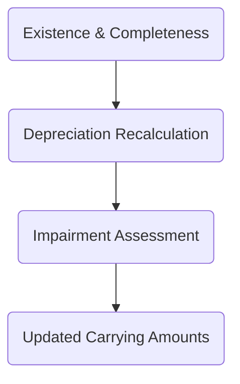

## 10.4 Fixed Assets, Depreciation, and Impairment

Substantive testing for fixed assets typically involves verifying the existence and completeness of capitalized assets, recalculating depreciation to ensure its reasonableness, and evaluating whether assets are impaired. Fixed assets (sometimes called Property, Plant, and Equipment or PP&E) are frequently material balances in the financial statements. A thorough audit approach includes examining documentation of asset acquisition and disposition, reviewing management’s assumptions about useful lives and residual values, and testing for impairment triggers such as technological obsolescence or market declines.

This section provides practical guidance on performing comprehensive audit procedures for fixed assets, covering:  
• Existence and Completeness Testing  
• Depreciation Recalculation  
• Impairment Identification and Assessment  

******************************************************************************

## Existence and Completeness

Verifying the existence and completeness of fixed assets helps ensure that they are validly owned by the entity and that all assets that should be recorded are indeed included in the financial statements.

### 1. Existence Testing

• Physical Inspection: The auditor selects a sample from the fixed asset register and physically inspects the assets. For instance, if the register lists a new piece of machinery, the auditor visits the factory floor to verify that the asset is present, operational, and labeled correctly.  
• Management Assertions: Inquiries with plant managers, property custodians, or department heads can validate that assets are not fictitious or duplicated.  
• Ownership Documentation: Review titles, purchase contracts, and any relevant financing documentation to ensure the entity is the rightful owner.  

Real-World Example:  
• Assume an auditor is engaged by a manufacturing company with a large investment in plant equipment. The auditor selects a sample of newly recorded assets. During a facility walkthrough, the auditor finds that one asset on the fixed asset register cannot be located in any plant area. This discrepancy may suggest the asset is misclassified, stolen, or incorrectly recorded. Additional investigation would follow to reconcile and correct the records as needed.

### 2. Completeness Testing

• Acquisition Tracing: Auditors trace purchase transactions and vouchers for new machinery or capitalized additions to confirm that items have been properly recorded as fixed assets. This typically involves reviewing board approvals, capital project budgets, and vendor invoices. The objective is to prove that no material acquisitions are omitted from the fixed asset register.  
• Capitalization Policies: Evaluate management’s policies for identifying capital expenditures versus repairs and maintenance expenses. A policy that opts for immediate expensing of smaller items rather than capitalization is common to avoid inflating asset balances. However, if incorrectly applied, it may also result in incompleteness of the asset register.  
• Documents Review: Inspect relevant documentation, including the entity’s capitalization thresholds, board meeting minutes authorizing major purchases, and monthly or quarterly reconciliations of the asset register to the general ledger.  

******************************************************************************

## Depreciation Recalculation

Depreciation is the systematic allocation of an asset’s cost over its useful life. Accurate depreciation balances are critical to ensuring that net income, total assets, and equity are properly stated. 

### 1. Validating Useful Lives and Methods

• Useful Lives: Assess the rationale behind management’s estimates. For example, a new production machine might be assigned a 10-year life based on expected technological relevance and wear. The auditor should compare the assigned useful life to industry standards and historical replacement patterns.  
• Methods: Straight-line and double-declining balance are the most common depreciation methods. Confirm the appropriateness of the method chosen based on asset usage patterns. For instance, a rapidly aging technology asset might warrant an accelerated method.  
• Salvage Value (Residual Value): Review the salvage value assumptions for reasonableness. Salvage values should be based on reliable market data or historical disposal trends.  

### 2. Recalculation Procedures

• Sample-Based Recalculation:  
  1. Pick a sample of fixed assets of varying classes (e.g., buildings, machinery, vehicles).  
  2. Obtain historical cost, salvage value, date placed in service, and expected useful life.  
  3. Manually or digitally recalculate depreciation using the applicable method (straight-line, double-declining, sum-of-the-years’-digits, etc.).  
  4. Compare the recalculated depreciation expense to the client’s recorded amounts.  

• Changes in Estimates: If management revises useful lives, salvage values, or methods, ensure the modification follows GAAP or IFRS guidelines. These changes must be properly documented and disclosed if material.  

Real-World Example:  
• A tech company updates its CAD software every three years and discards older versions due to licensing constraints. An auditor recalcutes depreciation for the software using a three-year straight-line approach, confirming that the carrying value was fully written-off at year three.  

******************************************************************************

## Impairment

Impairment occurs when the carrying amount of an asset exceeds its recoverable amount—often driven by technological obsolescence, market declines, or physical damage. Auditors must evaluate whether management has appropriately identified and measured any impairment losses.

### 1. Identifying Impairment Triggers

• Internal and External Indicators: Assets may be impaired if there is evidence of decreased usage, changes in market conditions, legal concerns, or rising repair costs.  
• Technological Obsolescence: For example, a manufacturer invests in robotics while older manual machines become noncompetitive, leading to lower usage and potential impairment.  
• Discontinued Operations: A decision to discontinue a product line could leave specific assets underutilized.  

### 2. Measurement and Valuation

• Management’s Forecasts: If impairment is suspected, management usually projects future cash flows to determine if the asset’s book value is recoverable. The auditor reviews key assumptions such as growth rates, discount rates (where relevant), and salvage values.  
• Fair Value Considerations: When an asset’s recoverability is calculated using fair value techniques, confirm the reliability of external appraisal reports, price indices, or benchmarks used in the analysis.  
• Documentation: Ensure that any recognized impairment loss is reduced from the asset’s carrying amount and properly disclosed in the financial statements.  

Real-World Example:  
• A logistics company invests in specialized trucking technology that becomes obsolete within two years due to advanced software updates. Unexpected losses seep into the company’s operating results. The auditor reviews management’s impairment analysis and verifies if the carrying amount of these assets is written down to an appropriate recoverable amount, based on discounted future cash flows or third-party valuations.

******************************************************************************

**Figure: An overview of the fixed asset audit process.**  
1. Verify that all recorded assets exist and all necessary assets are included (existence and completeness).  
2. Recalculate and confirm reasonable depreciation methods, useful lives, and estimates.  
3. Assess potential impairment triggers and, if necessary, adjust carrying amounts.  

******************************************************************************

## Glossary

• **Book Value (Carrying Value)**: The net amount at which an asset is carried on the balance sheet. It is calculated as the acquisition cost minus accumulated depreciation (and any recognized impairment).  
• **Useful Life**: The estimated duration an asset can generate economic benefits before disposal or obsolescence. Auditors must critically review the justification for determining useful lives.  
• **Impairment Trigger**: An event or change in circumstances suggesting that the carrying amount of an asset may not be fully recoverable, prompting an impairment analysis.

******************************************************************************

## Best Practices, Pitfalls, and Strategies

• **Best Practices**  
  1. Thoroughly understand the client’s operations and assets before selecting samples.  
  2. Compare internal useful life estimates to external benchmarks, ensuring consistency with industry norms.  
  3. Regularly evaluate for impairment indicators, especially in rapidly changing markets or industries heavily reliant on technology.

• **Common Pitfalls**  
  1. Overlooking intangible asset components that may affect the overall useful life of equipment.  
  2. Failing to capture assets that are financed through operating leases or other off-balance sheet structures (if not recorded properly under the accounting framework).  
  3. Neglecting to maintain consistent depreciation policies, causing year-over-year fluctuations that obscure real economic performance.

• **Strategies to Overcome Issues**  
  1. Conduct periodic internal control tests on asset counts, especially in large, decentralized organizations.  
  2. Utilize data analytics to detect anomalies in depreciation schedules, such as unusual salvage values or asset acquisitions that do not match typical monthly patterns.  
  3. Consult valuation experts when impairment triggers are complex or rely on specialized industry knowledge.

******************************************************************************

## References and Resources

• **Official References**  
  – [FASB ASC 360](https://asc.fasb.org/) (Property, Plant, and Equipment): Detailed guidance on accounting for fixed assets, including capitalized costs and impairment testing.  

• **Additional Resources**  
  – Industry-specific valuations (e.g., real estate, oil and gas depletion, technology software capitalization).  
  – PCAOB Staff Guidance on verifying asset impairments and the methods for evaluating management’s fair value estimates.  

******************************************************************************

## Quiz on Auditing Fixed Assets, Depreciation, and Impairment



### Which of the following best illustrates an audit procedure for testing the existence of fixed assets?

- [x] Selecting items from the fixed asset register and physically verifying their presence.
- [ ] Tracing capital expenditures from purchase invoices to the fixed asset register.
- [ ] Examining the salvage value calculations for reasonableness.
- [ ] Comparing book values to net realizable values for potential write-offs.

> **Explanation:** Existence testing commonly involves selecting items from the fixed asset register and physically verifying them on-site.

### When recaclulating depreciation for a sample of fixed assets, which of the following must auditors typically verify?

- [x] Useful life, salvage value, and depreciation method.
- [ ] Location of the asset and whether it is operational.
- [ ] Vendor payment terms and accounts payable records.
- [ ] The total number of assets listed in the company’s facilities manual.

> **Explanation:** Recalculation procedures comprise checking useful lives, salvage values, and the depreciation methods, ensuring recorded depreciation aligns with these details.

### A strong indicator that an asset might be impaired is:

- [x] The market value of the asset’s output has significantly declined.
- [ ] A slight variance in the monthly depreciation expense.
- [ ] An increase in the asset’s net book value due to additional capital improvements.
- [ ] Depreciation is calculated using a straight-line method instead of an accelerated method.

> **Explanation:** A significant decline in market value or utility typically triggers an impairment test.

### Which of the following is a common approach to test the completeness of fixed assets?

- [x] Tracing from purchase invoices and board approvals to entries in the fixed asset register.
- [ ] Comparing recorded assets to industry peer group estimates.
- [ ] Engaging an external valuation specialist to re-value all assets from scratch.
- [ ] Examining prior-year depreciation schedules for anomalies.

> **Explanation:** Tracing acquisitions from source documents (e.g., purchase invoices, board minutes) to the fixed asset register helps ensure all valid assets are recorded.

### Under which circumstances is an impairment test most likely required?

- [x] When there is evidence that the carrying amount of an asset may not be fully recoverable.
- [ ] Each time the client updates its internal control policies.
- [x] When technological advancements rapidly reduce the asset’s utility.
- [ ] Purely after a major restatement of financial statements for unrelated reasons.

> **Explanation:** An impairment test is triggered whenever there’s evidence of diminished recoverable value, including rapid technological shifts.

### Which scenario below represents a potential “Impairment Trigger”?

- [x] Management ceases use of an asset due to extensive technological upgrades.
- [ ] The asset’s depreciation expense remains consistent over many years.
- [ ] The asset is fully depreciated and still generating cash flows.
- [ ] The asset’s salvage value is immaterial.

> **Explanation:** Discontinuing use of an asset due to technological advances suggests it may be impaired, indicating a need for further analysis.

### Which document is most relevant for verifying an asset’s legal ownership?

- [x] Title records or purchase contracts.
- [ ] Depreciation schedule.
- [x] Board meeting minutes.
- [ ] Payroll registers.

> **Explanation:** Legal title documents and purchase contracts confirm that the company has the rights to the asset. Board minutes may also provide approval evidence.

### In testing depreciation expense, which method would an auditor most likely recalculate?

- [x] Straight-line or double-declining balance methods.
- [ ] Current cost accounting, net realizable value approach.
- [ ] Replacement cost approach to appraisal.
- [ ] Payback period for capital budgeting.

> **Explanation:** Depreciation methods in financial statements commonly include straight-line, double-declining balance, or sum-of-the-years’-digits. These form the basis of standard recalculation checks.

### The best reason for comparing an asset’s carrying value to its fair value is:

- [x] To evaluate potential impairment.
- [ ] To finalize the straight-line depreciation rate.
- [ ] To identify any fictitious fixed assets recorded by management.
- [ ] To determine the completeness of intangible assets.

> **Explanation:** Comparing carrying value to fair value is a step in determining impairment losses and ensuring the asset is not overstated on the balance sheet.

### True or False: An entity is required to test for impairment annually, regardless of changes in circumstances.

- [ ] True
- [x] False

> **Explanation:** Under most frameworks (e.g., U.S. GAAP), long-lived assets are tested when indicators of impairment exist, not automatically every year. Certain intangible assets with indefinite lives (like goodwill) may be tested annually.



******************************************************************************

## For Additional Practice and Deeper Preparation

**[Auditing & Attestation CPA Mock Exams (AUD): Comprehensive Prep](https://www.udemy.com/course/aud-cpa-mock-exams/?referralCode=D064EF7BD4A84FC6403D)**  
• Tackle full-length mock exams designed to mirror real AUD questions—from risk assessment and ethics to internal control and substantive procedures.  
• Refine your exam-day strategies with detailed, step-by-step solutions for every scenario.  
• Explore in-depth rationales that reinforce understanding of higher-level concepts, giving you a decisive edge on test day.  
• Boost confidence and reduce exam anxiety by building mastery of the wide-ranging AUD blueprint.

_Disclaimer: This course is not endorsed by or affiliated with the AICPA, NASBA, or any official CPA Examination authority. All content is created solely for educational and preparatory purposes._
