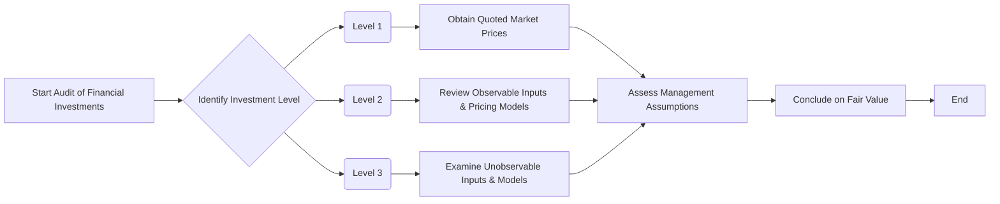

## 10.5 Financial Investments and Fair Value Measurements

Financial investments often constitute a significant portion of an entity’s balance sheet. As such, auditing these assets requires a focused, methodical approach to ensure all positions are appropriately recorded and valued in accordance with applicable reporting frameworks such as U.S. GAAP (FASB ASC 820) or IFRS (IFRS 13). This section explores key considerations for auditors when designing and performing substantive procedures for financial investments and fair value measurements, including inherent risk assessments, valuation support, confirmations, and disclosures.

--------------------------------------------------------------------------------

## 1. Nature of Investments

### 1.1 Different Types of Financial Investments

Investments can vary widely in complexity and risk profile. Common categories include:

• Equity securities and mutual funds listed on active markets.  
• Debt securities such as corporate bonds, government bonds, or mortgage-backed securities.  
• Derivatives (forwards, futures, swaps, options).  
• Private equity or venture capital investments in unlisted entities.  
• Hybrid instruments that may embed multiple features (e.g., convertible bonds).

The inherent risk encountered when auditing financial investments is directly related to factors such as valuation complexity, liquidity, and the reliability of observable market data:

• Level 1: Market-traded securities with readily available quoted prices.  
• Level 2: Instruments with observable inputs other than Level 1 quoted prices, for example, similar securities in active or inactive markets.  
• Level 3: Valuations based on unobservable inputs (e.g., management’s estimates, models, or assumptions).

### 1.2 Inherent Risk for Complex Investments

Complex or illiquid investments (e.g., private equity, certain derivatives) typically present higher inherent risks because their valuation relies heavily on management’s estimates and pricing models. These assets can be subject to management bias or error. Auditors must exercise professional skepticism and carefully examine the rigor of the valuation methods selected, the consistency of assumptions used, and any external valuation reports.

--------------------------------------------------------------------------------

## 2. Confirmation and Valuation

### 2.1 Confirming Positions and Holdings

One of the most fundamental procedures in auditing investments is to confirm the existence and completeness of positions. This often involves:

• Sending confirmations to custodians, brokers, or investment managers to verify quantities and units held at year-end.  
• Reconciling confirmation replies to the client’s underlying records.  
• Testing cut-off to ensure purchases and sales are recorded in the correct reporting period.  

For example, if an entity holds securities through multiple broker accounts, the auditor should send confirmation requests to each broker/custodian to verify year-end positions. Any discrepancies, including timing differences for unsettled trades, must be investigated.

### 2.2 Valuing Market-Traded Securities (Level 1)

For investments classified as Level 1, valuation tends to be straightforward:

• Obtain year-end market quotes from reliable data sources (e.g., Bloomberg, Reuters).  
• Confirm the quotes align with publicly available information from active markets.  
• Recompute the market value of each holding.  
• Verify that the final amounts tie to the client’s trial balance or investment subledger.  

Although less complex, it is essential to verify that last-traded or closing prices are used and tie out with the relevant exchange or recognized pricing service on the balance sheet date.

### 2.3 Evaluating Complex Valuations (Level 2 and Level 3)

Auditing Level 2 and Level 3 investments requires additional diligence:

• Review management’s valuation policies and methodology documentation.  
• Examine assumptions (e.g., discount rates, expected cash flows, comparable market rates) for reasonableness and consistency with market conditions.  
• Review third-party specialist reports or pricing services for reliability and credibility.  
• Inspect the controls around management’s valuation process, including the involvement of qualified professionals (e.g., in-house modeling teams or external valuation experts).  

Below is a simple Mermaid diagram illustrating the flow of key substantive procedures for fair value measurements across different measurement levels:

In practice, Level 2 and Level 3 valuations often use the income approach (e.g., discounted cash flows) or the market approach (comparable transactions, competitor multiples). If management employs a discounted cash flow (“DCF”) model, the auditor might:

• Verify the mathematical accuracy of the model.  
• Recompute key inputs such as present value factors.  
• Compare discount rates, growth assumptions, or volatility inputs to those of similar instruments.

--------------------------------------------------------------------------------

## 3. Disclosures

### 3.1 Fair Value Hierarchy Disclosures

Both U.S. GAAP and IFRS require financial statements to present assets and liabilities measured at fair value under a three-level hierarchy:

• Level 1: Quoted prices (unadjusted) in active markets for identical assets or liabilities.  
• Level 2: Other observable inputs (e.g., quoted prices for similar assets in active markets, or interest rates and yield curves).  
• Level 3: Unobservable inputs based largely on management assumptions.  

Ensuring compliance with these disclosure requirements is critical. The auditor should:

• Verify that the entity’s Level 1, Level 2, and Level 3 classifications are appropriate.  
• Inspect disclosures regarding valuation techniques, significant inputs, and sensitivity analyses for completeness and clarity.  
• Ensure consistency between the disclosures and the underlying audit work on valuation.

### 3.2 Classification Within Applicable Frameworks

Although many entities adopt updated frameworks, classification rules for financial assets may still include references to older categories like trading, available-for-sale (AFS), or held-to-maturity (HTM) under U.S. GAAP. Under IFRS 9, categories such as “amortized cost” and “fair value through profit or loss (FVPL)” are common. Auditors should confirm that investments are correctly classified and that any changes in classification adhere to applicable rules.

--------------------------------------------------------------------------------

## 4. Best Practices and Common Pitfalls

### 4.1 Best Practices

• Leverage specialist expertise: For highly complex valuations (e.g., exotic derivatives or private equity funds), seek guidance from valuation experts or specialized audit teams.  
• Consistency checks: Compare valuation assumptions year-over-year for consistency, investigating any material deviations.  
• Benchmarking: Where possible, benchmark assumptions against industry norms, third-party pricing data, or observable market rates.  
• Strong risk assessment: Rigorously identify Level 2 or Level 3 instruments, as these often carry a higher risk of material misstatement.

### 4.2 Common Pitfalls

• Over-reliance on management’s valuations without adequate corroboration.  
• Failure to properly test the completeness and accuracy of underlying data used in valuation models.  
• Deficient cut-off testing, resulting in misstatements around year-end transactions.  
• Inadequate disclosure around assumptions and methodologies, raising the risk of non-compliance with GAAP or IFRS.

--------------------------------------------------------------------------------

## 5. Practical Example and Case Scenario

Imagine an investment management company that holds a portfolio of Level 3 venture capital investments. Management employs a discounted cash flow model to value these start-up companies, citing future projected revenues for the next five years. The auditor’s responsibilities would include:

1. Verifying the mathematical accuracy of the model.  
2. Evaluating the reasonableness of revenue growth projections.  
3. Assessing discount rates by comparing them to market-based rates for similar companies.  
4. Reviewing management’s sensitivity analyses and understanding potential volatility of key assumptions.  

If the auditor identifies a significant deviation in discount rates used compared to market evidence or notices overly optimistic projections, further investigation is warranted. The auditor might question the reliability of management’s valuations or request additional support or third-party valuation reports.

--------------------------------------------------------------------------------

## 6. Glossary of Key Terms

• Fair Value Hierarchy:  
  • Level 1: Quoted prices in active markets for identical assets.  
  • Level 2: Observable inputs other than quoted prices for identical assets.  
  • Level 3: Unobservable inputs (e.g., management’s own assumptions).  

• Valuation Techniques:  
  • Market Approach: Uses prices and other market information for identical or comparable assets.  
  • Income Approach: Discounts future cash flows or earnings to present value.  
  • Cost Approach: Considers the cost to replace or reproduce the asset.

--------------------------------------------------------------------------------

## 7. References and Resources

### 7.1 Official References

• [FASB ASC 820](https://asc.fasb.org/) – Fair Value Measurement in U.S. GAAP.  
• AU-C Section 540: “Auditing Accounting Estimates, Including Fair Value Measurements and Disclosures.”  
• IFRS 13 – Fair Value Measurement under the International Financial Reporting Standards.

### 7.2 Additional Resources

• AICPA’s “Valuation of Portfolio Company Investments” – Guidance on private equity/venture capital contexts and valuations.  
• Public Company Accounting Oversight Board (PCAOB) standards for auditing fair value estimates and using the work of specialists.

--------------------------------------------------------------------------------

## 8. Conclusion

Auditing financial investments and fair value measurements necessitates a thorough understanding of valuation models, observable vs. unobservable inputs, and the risks of misstatement related to these measurements. By rigorously confirming investment positions, evaluating the appropriateness of the fair value hierarchy, testing management’s assumptions, and verifying disclosures, auditors can provide assurance that financial statements reflect these assets accurately. The complexity of investments, especially Level 3 valuations, demands a robust audit plan and possibly the involvement of specialists. Proper documentation, professional skepticism, and strong auditing judgment are essential to navigate the inherent complexities and ensure compliance with reporting standards.

--------------------------------------------------------------------------------

## Fair Value Assessments and Substantive Testing: Top Quiz for Auditors



### Which of the following describes a Level 1 fair value measurement?

- [ ] A valuation derived entirely from an income approach used by management.  
- [ ] A fair value computed using unobservable inputs due to insufficient market data.  
- [x] A valuation based on quoted prices in active markets for identical assets or liabilities.  
- [ ] A pricing method involving comparable assets with significant adjustments.  

> **Explanation:** Level 1 in the fair value hierarchy relies on unadjusted quoted prices in active markets for identical assets or liabilities, providing the most reliable market-based evidence of fair value.

### Which type of investment typically involves higher inherent risk?

- [ ] Liquid equities listed on major public stock exchanges.  
- [ ] U.S. Treasury bills traded daily in an active market.  
- [x] Illiquid private equity investments requiring valuation models.  
- [ ] Index funds with market-observed daily prices.  

> **Explanation:** Private equity investments or other illiquid financial instruments (Level 3) often require management’s models and assumptions, significantly raising the inherent risk of material misstatement.

### What is the primary purpose of sending confirmations to brokers or custodians during an audit of investments?

- [x] To verify the existence and completeness of securities holdings.  
- [ ] To determine the classification of the securities.  
- [ ] To ensure that overnight sweeps and bank reconciliations have been performed.  
- [ ] To reconcile all operational expenses.  

> **Explanation:** Audit confirmations independently verify the quantity, type, and ownership of securities, addressing concerns over existence and completeness.

### In the fair value hierarchy, which level involves primarily observable inputs, excluding quoted prices for identical assets, such as interest rates or yield curves?

- [ ] Level 1  
- [x] Level 2  
- [ ] Level 3  
- [ ] None of the above  

> **Explanation:** Level 2 fair value measurements use observable inputs like quoted prices for similar assets, interest rates, or yield curves but do not rely on active market prices for the exact same instrument.

### Which valuation approach typically involves discounting future stream of cash flows to arrive at a present value?

- [ ] Market approach  
- [ ] Cost approach  
- [x] Income approach  
- [ ] Historical approach  

> **Explanation:** The income approach uses techniques like discounted cash flow (DCF), converting expected future cash flows or earnings to a single present amount.

### When auditing complex derivatives (e.g., swaps, options), the auditor should:

- [ ] Rely solely on the client’s confirmations from counterparties.  
- [ ] Omit testing the valuation if the contract is standard.  
- [x] Evaluate proprietary models, assumptions, and discount rates for reasonableness.  
- [ ] Assume the risk is low because these are regularly traded instruments.  

> **Explanation:** Complex derivatives often require specialized models, so auditors must carefully evaluate the model’s inputs and assumptions to ensure the fair value is materially accurate.

### Which of the following best describes a common pitfall in auditing fair value measurements?

- [ ] Properly classifying all assets under the correct level of the fair value hierarchy.  
- [ ] Benchmarking management’s discount rates against similar industry data.  
- [x] Relying exclusively on management’s valuations without corroborating evidence.  
- [ ] Using confirmations to verify brokerage statements.  

> **Explanation:** One of the biggest pitfalls is placing sole reliance on management’s valuation calculations without seeking any corroborating information or data to support or challenge those estimates.

### Under IFRS 13, fair value is measured as:

- [ ] Cost plus cost of capital.  
- [x] The price that would be received to sell an asset or paid to transfer a liability in an orderly transaction.  
- [ ] The present value of minimal future cash flows discounted at the risk-free rate only.  
- [ ] The net realizable value, less selling costs.  

> **Explanation:** IFRS 13 defines fair value as an exit price, representing the price that would be received to sell an asset or paid to transfer a liability in an orderly transaction between market participants.

### Which statement is correct regarding disclosures of Level 3 investments?

- [ ] No disclosures are required if the investment is hedged.  
- [x] They must include a description of valuation methods, inputs, and changes in those methods.  
- [ ] They are only required if the investment exceeds 5% of total assets.  
- [ ] They are optional if the auditor relies on a management representation letter.  

> **Explanation:** Fair value standards require an entity to disclose its methods, assumptions, and significant unobservable inputs used for Level 3 measurements, along with any changes during the period.

### True or False: The use of external valuation specialists by management negates the need for the auditor to perform independent valuation testing.

- [ ] True  
- [x] False  

> **Explanation:** While management’s use of specialists may enhance the reliability of valuations, the auditor remains responsible for evaluating the competence of the specialist, the appropriateness of the methods used, and reconciling the valuation outputs with the financial statements.



---

## For Additional Practice and Deeper Preparation

**[Auditing & Attestation CPA Mock Exams (AUD): Comprehensive Prep](https://www.udemy.com/course/aud-cpa-mock-exams/?referralCode=D064EF7BD4A84FC6403D)**  
• Tackle full-length mock exams designed to mirror real AUD questions—from risk assessment and ethics to internal control and substantive procedures.  
• Refine your exam-day strategies with detailed, step-by-step solutions for every scenario.  
• Explore in-depth rationales that reinforce understanding of higher-level concepts, giving you a decisive edge on test day.  
• Boost confidence and reduce exam anxiety by building mastery of the wide-ranging AUD blueprint.

_Disclaimer: This course is not endorsed by or affiliated with the AICPA, NASBA, or any official CPA Examination authority. All content is created solely for educational and preparatory purposes._
