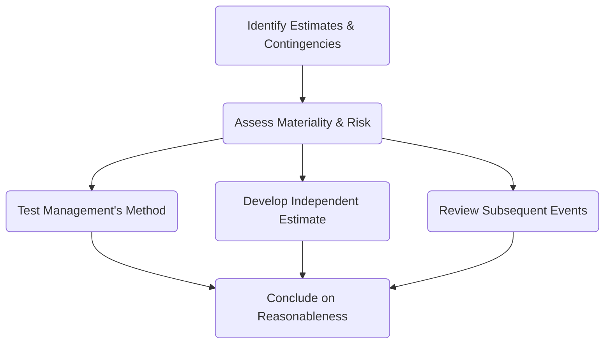

## 11.1 Accounting Estimates, Provisions, and Contingencies

Accounting estimates, provisions, and contingencies permeate virtually all areas of financial reporting—ranging from a simple estimate of useful life for fixed assets to complex loss recognitions involving litigation. For CPA candidates, understanding the audit implications of these items is crucial, as they directly impact the reliability and accuracy of an entity’s financial statements. This section provides a comprehensive look at the nature of accounting estimates, their inherent challenges, and the primary audit approaches used to verify them. We will also explore provisions and contingencies, which frequently test an auditor’s judgment regarding uncertainty, evidence, and regulatory requirements.

-------------------------------------------------------------------------------
## 1. Nature of Accounting Estimates

### 1.1 Purpose and Prevalence
Accounting estimates arise when exact amounts cannot be determined with precision, often due to uncertainty about future events or conditions. Common examples include:

• Allowance for doubtful accounts (estimating future credit losses).  
• Warranty obligations (estimating warranty claims).  
• Pension liabilities (estimating future employee benefits and actuarial assumptions).  
• Fair value measurements (especially for illiquid or complex financial instruments).

These estimates are an integral part of management’s financial reporting responsibilities, enabling stakeholders to see a more realistic financial position under the governing accounting framework (e.g., U.S. GAAP or IFRS).

### 1.2 Management’s Estimation Process
Management typically relies on a combination of historical data, industry trends, expert opinions, and statistical models to arrive at these estimates. This process may include:  
• Assessing past performance or outcomes to predict future behavior (e.g., default rates).  
• Incorporating projected market or economic conditions.  
• Applying discount rates to anticipated cash flows (pension plans or long-term liabilities).  
• Using specialized valuation models (e.g., for complex financial instruments or intangible assets).

Because estimates employ forward-looking assumptions, their accuracy is often difficult to confirm until well after the balance sheet date. Nevertheless, auditors must evaluate whether these estimates are reasonable and fairly presented at the reporting date.

-------------------------------------------------------------------------------
## 2. Common Challenges in Auditing Estimates

### 2.1 Judgmental Inputs
Many accounting estimates require significant judgment, such as expected growth rates, future cost trends, or asset salvage values. Disagreements may arise between management, internal specialists, and auditors regarding the most appropriate assumptions or methodologies. These judgments can be influenced by industry-specific complexities or fast-changing market conditions.

### 2.2 Estimation Uncertainty
Estimation uncertainty refers to the susceptibility of an accounting estimate to an inherent lack of precision. Volatile market conditions, lack of historical data for a new product line, or evolving regulations can magnify this uncertainty. The higher the volatility or novelty, the greater the estimation uncertainty—and the higher the risk of material misstatement.

### 2.3 Evolving Standards and Requirements
Accounting standards for estimates frequently evolve (e.g., implementation of new fair value measurement guidance). Auditors must remain current with authoritative accounting pronouncements (FASB, IASB) and auditing standards (AICPA, PCAOB) to ensure management is applying the appropriate frameworks.

### 2.4 Risk of Management Bias or Manipulation
Given the inherent flexibility in models and assumptions, management might use estimates opportunistically—possibly to smooth earnings or meet financial benchmarks. Auditors, therefore, must apply professional skepticism in reviewing the reasonableness and consistency of underlying assumptions.

-------------------------------------------------------------------------------
## 3. Audit Approaches

Auditing estimates, provisions, and contingencies often involves a multi-pronged approach. The auditor’s objective is to obtain sufficient appropriate audit evidence to determine whether management’s estimates are reasonable in the context of the applicable financial reporting framework (e.g., GAAP). Three core approaches are commonly used, sometimes in combination:

### 3.1 Review and Test Management’s Process
Under this approach, auditors:  
1. Evaluate the design of management’s estimation method and check if it complies with generally accepted accounting principles.  
2. Test the operating effectiveness of internal controls around the estimation process (e.g., approval procedures, data accuracy).  
3. Inspect key data inputs for accuracy and completeness (e.g., historical default rates or external market data).  
4. Recalculate or re-perform relevant computations using management’s assumptions and verify that the calculations are mathematically correct.

#### Example
For an allowance for doubtful accounts, an auditor might:  
• Examine the company’s bad-debt policy and see if it aligns with typical industry practices.  
• Verify the accuracy of data input, such as an aged receivables report.  
• Recalculate the reserve using management’s assumptions for each aging bucket (e.g., 1% for current receivables, 5% for 30-day old receivables, etc.).

### 3.2 Develop an Independent Estimate
In some cases, the auditor may choose to develop an independent estimate to use as a benchmark against management’s figure. This might involve:  
1. Creating a parallel model (e.g., a discounted cash flow model for a security).  
2. Leveraging external market data or third-party sources.  
3. Working with in-house or external specialists (e.g., actuaries for pension obligations, valuation experts for complex instruments) to validate assumptions.

#### Example
If management values an intangible asset, the auditor might construct an alternative valuation scenario using different discount rates or slightly altered growth forecasts and compare the results to management’s recorded estimate.  

### 3.3 Review Subsequent Events
If additional information is available after the balance sheet date but before the audit report date, the auditor can use these “subsequent events” to gauge the reasonableness of prior assumptions. However, the auditor must distinguish between:  

• Adjusting Events: Events that provide evidence of conditions that existed at the balance sheet date (leading to potential adjustments).  
• Non-Adjusting Events: Events that are indicative of conditions arising after the balance sheet date (usually disclosed if material, but not adjusted in the statements).

-------------------------------------------------------------------------------
## 4. Provisions and Contingencies

### 4.1 Definition and Recognition Criteria
A provision is defined as a liability of uncertain timing or amount, such as warranties or environmental cleanup costs. A contingency, on the other hand, can be a potential gain (gain contingency) or a potential loss (loss contingency) arising from uncertainty.  
• Financial reporting frameworks typically require recognition of a provision if:  
  1. There is a present obligation arising from a past event.  
  2. It is probable that an outflow of resources will be required to settle it.  
  3. A reliable estimate of the amount can be made.  
• Loss contingencies that do not meet “probable” and “reasonably estimable” thresholds often require disclosure rather than recognition.  

### 4.2 Common Examples
• Product warranties, manufacturer recalls.  
• Lawsuits or legal claims.  
• Environmental obligations for cleanup activities.  
• Restructuring charges and severance provisions.  

### 4.3 Auditing Provisions and Contingencies
Auditors must exercise professional skepticism to determine whether management has identified all significant provisions and contingencies, and whether the amounts recognized or disclosed are appropriate.

#### 4.3.1 Inquiry and Documentation
• Discuss with management, legal counsel, and those charged with governance to identify potential claims or uncertainties.  
• Review board minutes, legal confirmations, and insurance contracts.  

#### 4.3.2 Evaluating Likelihood and Estimability
• Assess whether the likelihood of outflow (for a loss contingency) is “probable” under GAAP or IFRS, and whether the amount can be reasonably estimated.  
• Consider alternative outcomes and the range of potential losses if uncertainty is high.  

#### 4.3.3 Boundary Between Recognition and Disclosure
• If management determines a loss contingency is probable and can be estimated, the item should be recorded in the financial statements.  
• If it is only “reasonably possible” or lacks reliable estimability, it should be disclosed.  

-------------------------------------------------------------------------------
## 5. Best Practices and Visual Overview

Below is a simplified flowchart illustrating key steps an auditor might take in evaluating accounting estimates, provisions, and contingencies:

1. Identify Estimates & Contingencies: Examine the financial statements and management’s disclosures to locate all relevant estimates (e.g., provisions, fair values, potential loss contingencies).  
2. Assess Materiality & Risk: Determine whether and to what extent these items pose a risk of material misstatement.  
3. Test Management’s Method: Inspect internal controls, verify data inputs, and recalculate.  
4. Develop Independent Estimate: Construct a parallel evaluation or model for comparison.  
5. Review Subsequent Events: Identify any new information that might affect recognized or disclosed amounts.  
6. Conclude on Reasonableness: Aggregate all evidence to form an overall conclusion about whether estimates and contingencies are free from material misstatement.

-------------------------------------------------------------------------------
## 6. Practical Examples and Case Studies

### Example 1: Warranty Provision in a Consumer Electronics Company
A consumer electronics firm has a history of warranty claims on its products. Management estimates the warranty liability at 2% of annual sales. However, the firm launched a new product line with potential design flaws late in the fiscal year. Audit considerations:  
• Validate if 2% still reflects probable future claims or if the new product might require a higher reserve.  
• Review service records and repair data for early warning signs.  
• Confirm if management has updated the estimate for current production issues.

### Example 2: Contingent Liability for Ongoing Litigation
A mining company faces a lawsuit over alleged environmental damages. Management deems the outflow as “reasonably possible” but refuses to record a liability due to uncertainty in the court’s decision. Audit considerations:  
• Communicate with the company’s external legal counsel.  
• Evaluate consistency between counsel’s assessment and management’s recognized or disclosed amounts.  
• Inspect insurance policies to see if coverage mitigates potential losses.

-------------------------------------------------------------------------------
## 7. Glossary

• **Estimation Uncertainty**: The susceptibility of an accounting estimate to an inherent lack of precision.  
• **Provision**: A liability of uncertain timing or amount (e.g., warranties, restructuring).  
• **Subsequent Events**: Events that occur after the balance sheet date but before the issuance of the financial statements.

-------------------------------------------------------------------------------
## 8. References and Resources

### 8.1 Official References
• **AU-C Section 540, “Auditing Accounting Estimates, Including Fair Value Measurements and Disclosures.”**  
  This standard defines the auditor’s responsibilities in evaluating the reasonableness of accounting estimates, requiring rigorous validation of inputs and assumptions.  
• **FASB ASC 450, “Contingencies.”**  
  Guidance on recognition, measurement, and disclosure requirements for contingencies under U.S. GAAP.

### 8.2 Additional Resources
• **AICPA “Audit Guide: Audit Sampling in Testing Estimates.”**  
  Offers insights on how to plan and perform audit procedures related to estimates using sampling techniques.  
• **Industry-Specific Guidance**  
  Certain industries (banking, insurance, oil & gas) have specialized complexities in estimates. Auditors should consult relevant authoritative sources (including IFRS vs. U.S. GAAP differences) to address unique estimation issues.  

-------------------------------------------------------------------------------

## SEO-Optimized Quiz: Accounting Estimates, Provisions, and Contingencies



### Which of the following is a commonly encountered accounting estimate? 
- [x] Allowance for doubtful accounts
- [ ] Operating leases that are fully documented
- [ ] Depletion expense for a fully exhausted mine
- [ ] Fixed asset depreciation for an asset that has zero net book value

> **Explanation:** An allowance for doubtful accounts is a typical accounting estimate because it involves projecting likely uncollectible amounts. Operating leases that are fully documented and a fully exhausted mine’s depletion expense are less uncertain. Once an asset has zero net book value, further estimation is typically unnecessary.

### What does “estimation uncertainty” refer to?
- [x] The inherent susceptibility of an accounting estimate to lack precision
- [ ] The complexity of a company’s IT environment
- [ ] Management’s unwillingness to provide documentation
- [ ] A newly adopted accounting standard

> **Explanation:** Estimation uncertainty describes the inability to precisely measure or predict a future amount due to inherent variability and unknown factors.

### When auditing management’s estimates, which audit approach involves constructing a parallel valuation model?
- [x] Developing an independent estimate
- [ ] Testing internal controls
- [ ] Conducting a dual-purpose test
- [ ] Performing an inventory observation

> **Explanation:** If the auditor “develops an independent estimate,” the auditor creates a separate model or forecast to compare against management’s. Testing internal controls and dual-purpose tests are distinct procedures.

### A provision is recognized in financial statements only if:
- [x] There is a present obligation, outflow is probable, and a reliable estimate can be made
- [ ] The amount is broader than management’s budget
- [ ] The item is immaterial, but management wants to disclose it
- [ ] The outflow is only “reasonably possible”

> **Explanation:** Under most financial reporting frameworks, a provision is recognized when all three criteria are met. If the outcome is only “reasonably possible,” management generally discloses rather than recognizes it.

### Which of the following statements about subsequent events in auditing estimates is correct?
- [x] They can provide evidence regarding the reasonableness of estimates at the balance sheet date.
- [ ] They always lead to adjustments in the financial statements.
- [x] They may require adjustment or disclosure, depending on the type of event.
- [ ] They should be ignored if they occur after the balance sheet date.

> **Explanation:** Subsequent events can clarify the factors existing at balance sheet date but do not always result in adjustments. Their impact depends on whether they are adjusting or non-adjusting events.

### In evaluating a loss contingency:
- [x] The auditor may consult directly with the client’s legal counsel to assess probability and magnitude.
- [ ] The client should never disclose actual settlement offers.
- [ ] The range of possible outcomes is usually irrelevant.
- [ ] No additional documentation is needed if management says it’s immaterial.

> **Explanation:** Loss contingencies often require robust evidence, including discussions with legal counsel about probability and potential outcomes.

### Why is management bias a relevant consideration in auditing estimates?
- [x] Because subjective assumptions can be manipulated to achieve desired financial results
- [ ] Because professional standards prohibit any form of estimation
- [x] Because auditors are responsible for detecting fraud in all circumstances
- [ ] Because bias is always deliberate and unethical

> **Explanation:** Estimates rely on subjective assumptions that, if manipulated, can distort financial results. While not all bias is fraud, it is part of the inherent risk of estimates.

### A consumer electronics firm updating its warranty reserve due to a new product with design flaws is an example of:
- [x] An accounting estimate subject to higher uncertainty
- [ ] A completed transaction that requires a simple reclassification
- [ ] An event that eliminates the need for a warranty liability
- [ ] A non-financial disclosure about internal policies only

> **Explanation:** The existence of new product design issues increases the uncertainty around warranty claims significantly, exemplifying a situation requiring careful revision to the estimate.

### Which action should an auditor take if a contingency is judged “reasonably possible” but not probable?
- [x] Ensure that it is properly disclosed in the financial statements
- [ ] Require that it be recognized as a liability in the financial statements
- [ ] Omit any mention of it to avoid confusion
- [ ] Immediately advise to disclaim an opinion

> **Explanation:** Under GAAP, a “reasonably possible” contingency that cannot be reliably estimated generally calls for disclosure rather than recognition.

### True or False: If a client’s estimate closely matches the auditor’s independent calculation, no further testing is required. 
- [x] True
- [ ] False

> **Explanation:** If the auditor’s independently developed estimate confirms management’s estimate, the auditor often considers additional procedures less critical (though certain minimum requirements may still apply, like final analytical reviews). This indicates that the client’s estimate is likely reasonable.



-------------------------------------------------------------------------------

## For Additional Practice and Deeper Preparation

**[Auditing & Attestation CPA Mock Exams (AUD): Comprehensive Prep](https://www.udemy.com/course/aud-cpa-mock-exams/?referralCode=D064EF7BD4A84FC6403D)**  
• Tackle full-length mock exams designed to mirror real AUD questions—from risk assessment and ethics to internal control and substantive procedures.  
• Refine your exam-day strategies with detailed, step-by-step solutions for every scenario.  
• Explore in-depth rationales that reinforce understanding of higher-level concepts, giving you a decisive edge on test day.  
• Boost confidence and reduce exam anxiety by building mastery of the wide-ranging AUD blueprint.

_Disclaimer: This course is not endorsed by or affiliated with the AICPA, NASBA, or any official CPA Examination authority. All content is created solely for educational and preparatory purposes._
