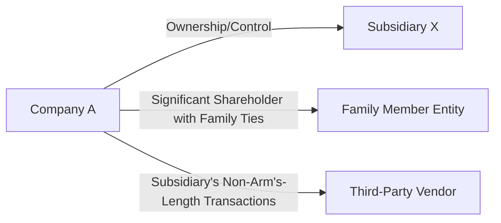

## 11.2 Related Parties: Identification and Disclosure Requirements

Related party transactions often involve a greater degree of risk than other transactions because of the potential for preferential treatment, fraudulent manipulation, or errors in recording and disclosure. This section takes a deep dive into defining related parties, their associated risks, and the strategies auditors employ to identify, evaluate, and disclose these transactions in financial statements.

---

### 1. Definition and Risk
Related parties are individuals or entities that have the ability to influence or be influenced by the entity in question, often as a result of familial, managerial, ownership, or investment relationships. Under U.S. Generally Accepted Accounting Principles (GAAP), specifically FASB ASC 850, and other standards worldwide (e.g., IFRS IAS 24), these parties include:

• Subsidiaries and controlled affiliates.  
• Major shareholders with substantial influence.  
• Directors, executive management, and their families.  
• Special purpose entities or nominee entities established for specific purposes.  

Because related parties may not always transact at arm’s length, there is a heightened fraud risk and potential for misstatement in financial statements. Management might conceal related party relationships or structure transactions to avoid clearly disclosing the economic substance of the arrangements.

---

### 2. Identification Procedures

#### 2.1 Review Corporate Documents and Communications
Auditors should begin by examining the following sources for clues about related party relationships and potential conflicts of interest:
• Board of directors’ meeting minutes.  
• Shareholder meeting minutes.  
• Conflict-of-interest statements signed by directors and senior management.  
• Loan agreements, especially those with unusual terms.  
• Legal counsel communications regarding corporate reorganizations, lawsuits, or mergers.

#### 2.2 Inquiries of Management and Those Charged with Governance
Direct, pointed questioning of management and oversight bodies is also critical for unearthing potential undisclosed relationships:
• Ask about board members’ affiliations with vendors, suppliers, or customers.  
• Investigate any family relationships involving high-ranking officials.  
• Inquire about reorganizations, restructurings, or capital injections that could introduce new related parties.

#### 2.3 Cross-Check Corporate and Regulatory Records
Auditing teams can verify information by comparing it with external databases or regulatory filings:
• Securities and Exchange Commission (SEC) filings that may indicate beneficial ownership.  
• Business or trade registers to confirm ownership details.  
• Corporate bylaws and share registries that specify equity interests and voting rights.  

These procedures help ensure the completeness and accuracy of related party identification, guarding against intentional or unintentional omission.

---

### 3. Substance over Form

One of the central principles in evaluating related party transactions is to look beyond the legal form of an arrangement and focus on its economic substance, often referred to as the “substance over form” principle. This is particularly crucial where:
• Entities are set up under nominee names or shell companies.  
• Management has partial indirect ownership in enterprises supplying goods or services to the company.  
• Transactions are masked through intermediaries.  

Even when documentation or corporate structures seem to distance the parties involved, auditors must remain vigilant to recognize when the substance of a transaction reveals a related party relationship. 

In this simplified diagram, Company A directly owns Subsidiary X. There may also be indirect relationships with a “Family Member Entity” or even a “Third-Party Vendor” that are actually under significant influence (though not immediately obvious). The dotted lines represent potential hidden relationships that require deeper inquiry and confirmation.

---

### 4. Disclosure Review

#### 4.1 Assessing Financial Statement Footnotes
Related party transactions often have specific disclosure requirements, such as:
• The nature of the relationship (e.g., parent-subsidiary, common ownership, family relationship).  
• Description of the transaction (e.g., loans, sales, services).  
• Dollar amounts or other relevant measures.  
• Outstanding balances at period-end, if any.  
• Important terms and conditions, such as interest rates on related party loans.

The objective is to ensure that users of financial statements are able to assess the potential financial effects and risks arising from these relationships. Failure to disclose or under-disclose related party transactions can significantly distort financial results.

#### 4.2 Evaluating Completeness and Clarity
In addition to confirming the presence of necessary disclosures, auditors should evaluate whether those disclosures are:
• Understandable and adequately summarize the relationships and any material risks.  
• Free from misleading information, such as incorrect amounts or incomplete terms.  
• Aligned with the applicable financial reporting framework (FASB ASC 850 in the U.S., IFRS IAS 24 internationally).  

Any discrepancies discovered typically warrant further inquiry, expanded testing, and potential communication with those charged with governance.

---

### 5. Best Practices and Key Considerations

1. Develop a comprehensive related party risk assessment.  
2. Continually update the audit file with new findings from inquiries, board minutes, or regulatory data.  
3. Utilize data analytics to identify anomalies in transactions, vendor listings, and payment records.  
4. Engage specialists or legal counsel if complex structures or foreign jurisdictions are involved.  
5. Ensure all identified related parties are formally documented, with any high-risk transactions subjected to expanded procedures.  

By maintaining professional skepticism and thoroughly corroborating management’s representations, auditors can help ensure that financial statements fairly reflect the full range of related party relationships.

---

### 6. Common Pitfalls and Potential Challenges

• Overreliance on management’s oral representations without obtaining corroborative evidence.  
• Failure to identify less visible arrangements, such as intermediaries or special purpose vehicles.  
• Overlooking family relationships or personal ties that do not appear on official company documents.  
• Insufficient scrutiny of complex structures involving multiple levels of ownership.  

Staying alert to these pitfalls will strengthen the audit approach and reduce the likelihood of material misstatements.

---

### 7. Practical Examples

• Example 1: A Company "Alpha Inc." obtains a loan from "Beta LLC" at a below-market interest rate. Beta LLC is 51% owned by Alpha Inc.’s Chief Financial Officer (CFO). Even though Beta LLC is not legally a subsidiary, the CFO’s controlling interest makes it a related party transaction.  
• Example 2: A family member of a board director owns 40% of a vendor. The prices for goods sold are consistently 15% above market rates, indicating a non-arm’s-length transaction. Such a scenario must be clearly disclosed in the financial statements under the relevant frameworks.  

These real-world scenarios highlight the importance of thorough identification and scrutiny of all entities and individuals that might present a conflict of interest.

---

### 8. References and Resources

#### Official References
• AU-C Section 550: “Related Parties” (AICPA).  
• FASB ASC 850: “Related Party Disclosures” (U.S. GAAP).  
• IFRS IAS 24: “Related Party Disclosures” (International).  

#### Additional Resources
• PCAOB Staff Practice Alert on undisclosed related parties.  
• SEC Filings (e.g., proxy statements, 10-K, 8-K) that may reveal beneficial ownership and financial arrangements.  
• Industry guides on best practices for related party governance and disclosure.

---

## Mastering Related Party Disclosures: Key Concepts Quiz



### In which scenario does management most likely need to disclose a related party transaction?
- [ ] When the supplier has no ownership relationship to the entity
- [x] When the CFO owns a significant stake in the supplier company
- [ ] When a supplier offers competitive, market-based terms
- [ ] When the auditor has no access to board minutes

> **Explanation:** Ownership by a key executive in a supplier creates a related party relationship, triggering additional disclosure.

### Which of the following is a recommended procedure for identifying undisclosed related parties?
- [x] Examining conflict-of-interest statements signed by directors and managers
- [ ] Trusting management's representations without corroboration
- [ ] Ignoring any foreign entity relationships
- [ ] Relying solely on internal audit reports

> **Explanation:** Conflict-of-interest statements help auditors pinpoint potential relationships that might not be disclosed initially.

### What does “substance over form” most closely emphasize in an audit of related parties?
- [x] The economic reality of a transaction rather than its legal structure
- [ ] The legal structure is always the most accurate reflection of the transaction
- [ ] The nominal owners determine all accounting treatment
- [ ] The auditor relies solely on one piece of evidence

> **Explanation:** Substance over form requires evaluating the underlying economic reality, not just the legal presentation.

### Which of the following disclosures is typically required for identified related parties?
- [x] The nature of the relationship and a description of the transactions
- [ ] The transaction can remain undisclosed if under $5,000
- [ ] The auditor’s personal opinion on the reliability of management
- [ ] Only the transaction date, not the arrangements or balances

> **Explanation:** GAAP mandates that the nature and terms of the related party relationship and transactions be disclosed, including amounts involved.

### When could an auditor decide to expand testing or perform additional procedures for related party transactions?
- [x] If management’s explanations about certain transactions are unclear
- [ ] If the transactions have been publicly reported in the press
- [x] If the auditor identifies inconsistencies in corporate records
- [ ] If the deadline for the audit is approaching

> **Explanation:** Unclear or inconsistent findings raise the risk of hidden or misstated relationships, requiring more extensive procedures.

### One key risk with undisclosed related party transactions is that they:
- [x] May distort the true financial performance and position
- [ ] Always boost auditors’ confidence in management
- [ ] Are automatically found in every audit
- [ ] Never require further evidence

> **Explanation:** Undisclosed related party transactions can misrepresent financial statements, skewing users’ perceptions of the entity’s operations and standing.

### Which is the best approach when management claims no significant related party transactions exist?
- [x] Review board minutes, inquire with other senior staff, and cross-check ownership records
- [ ] Accept management’s claims as final and conclusive
- [x] Use data analytics to identify unusual transactions
- [ ] Skip into subsequent audit steps

> **Explanation:** Cross-verifying management’s claims and employing analytics helps ensure no hidden relationships exist.

### What is the typical importance of family relationships under the “related parties” definition?
- [x] They can create influence or control that affects arm’s-length dealings
- [ ] Family relationships are irrelevant if collusion is not suspected
- [ ] It only matters if there’s direct legal ownership
- [ ] Audit standards ignore personal family ties

> **Explanation:** Family ties often result in non-arm’s-length relationships that must be disclosed if material.

### Which statement about disclosures for related party transactions under U.S. GAAP is correct?
- [x] FASB ASC 850 outlines the disclosure requirements
- [ ] There are no specific disclosure requirements for related parties
- [ ] Disclosures are voluntary and at management discretion
- [ ] GAAP prohibits reporting related party transactions

> **Explanation:** ASC 850 provides mandatory guidance for identifying and disclosing related party transactions.

### Does IFRS have a counterpart to U.S. GAAP’s related party requirements?
- [x] True
- [ ] False

> **Explanation:** IFRS IAS 24 outlines similar disclosure requirements for related parties, ensuring consistency in international standards.



---

## For Additional Practice and Deeper Preparation

**[Auditing & Attestation CPA Mock Exams (AUD): Comprehensive Prep](https://www.udemy.com/course/aud-cpa-mock-exams/?referralCode=D064EF7BD4A84FC6403D)**  
• Tackle full-length mock exams designed to mirror real AUD questions—from risk assessment and ethics to internal control and substantive procedures.  
• Refine your exam-day strategies with detailed, step-by-step solutions for every scenario.  
• Explore in-depth rationales that reinforce understanding of higher-level concepts, giving you a decisive edge on test day.  
• Boost confidence and reduce exam anxiety by building mastery of the wide-ranging AUD blueprint.

_Disclaimer: This course is not endorsed by or affiliated with the AICPA, NASBA, or any official CPA Examination authority. All content is created solely for educational and preparatory purposes._
