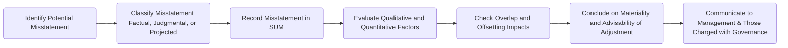

## 12.1 Aggregating Identified Misstatements

In any financial statement audit, a critical component is identifying and evaluating potential misstatements. Once misstatements have been noted—whether through testing, inquiry, or estimates derived from sampling—they must be aggregated to understand their collective impact on the financial statements. This process is fundamental for the auditor in determining whether the financial statements are presented fairly, in all material respects. In this section, we will explore various types of misstatements (factual, judgmental, and projected), discuss how they are summarized in the Schedule of Unadjusted Misstatements (SUM), and examine how auditors handle overlap and offsetting between accounts.

-------------------------------------------------------------------------------
## Understanding Misstatements

Misstatements can arise from errors or fraud. They often result from:*  
• Mathematical mistakes.  
• Misapplication of accounting principles.  
• Oversights or misinterpretations of facts.  
• Management bias or intentional misrepresentation (fraud).

Auditors classify misstatements into three main categories: factual, judgmental, and projected. While these misstatements are distinct, they collectively inform an auditor’s assessment of whether the financial statements are free from material misstatement.

### 1. Factual Misstatements

A factual misstatement is a clear and definite error. It usually has no room for interpretation:  
• Amounts that are recorded incorrectly (e.g., a posting error that places $1,000 in an asset account instead of a liability account).  
• A missing or misapplied transaction that can be objectively measured (e.g., misrecorded sales invoice).  

Because factual misstatements are unequivocal, they are typically straightforward to correct. Management has limited or no basis to dispute a factual misstatement since the error can be demonstrably proven.

### 2. Judgmental Misstatements

Judgmental misstatements arise from differences in estimates, opinions, or assumptions between management and the auditor. Examples include:*  
• Estimating an allowance for doubtful accounts.  
• Valuing illiquid or complex financial instruments.  
• Determining the useful life or salvage value of fixed assets.  

Management might use certain assumptions, whereas the auditor may consider them overly aggressive or too conservative. Identifying a judgmental misstatement often involves communicating with management regarding the rationale behind their estimates, referencing industry standards, and possibly engaging specialists.

### 3. Projected Misstatements

Projected misstatements stem from test samples. Auditors commonly test transactions or account details using a smaller subset of the population to make inferences about the entire population’s potential for error. If the sample results indicate errors, the auditor then “projects” these apparent errors across the population.  
• Example: If an auditor tests 50 invoices in a population of 5,000 and finds a $2,000 combined error, they may estimate an equivalent rate of error extends to all 5,000 invoices, generating a projected misstatement.  

The precision of projected misstatements can vary, and they typically require additional corroborative testing or professional judgment to refine estimates.

-------------------------------------------------------------------------------
## Schedule of Unadjusted Misstatements (SUM)

The Schedule of Unadjusted Misstatements (SUM) plays a central role in aggregating identified misstatements. It serves as a working paper summarizing all misstatements that management has not yet corrected. This allows both auditors and management to evaluate the cumulative impact of these misstatements on the financial statements.

### Components of the SUM

1. Description of the Misstatement  
   - Brief explanation (e.g., incorrect inventory valuation, unrecorded liability, computational error).  

2. Nature (Factual, Judgmental, or Projected)  
   - Clear classification to help evaluate how to address each misstatement.  

3. Account(s) Affected  
   - Helps the audit team see if multiple misstatements affect the same balance, increasing risk.  

4. Amount (Quantitative Importance)  
   - Dollar impact or percentage of base (e.g., percentage of total assets or net income).  

5. Qualitative Factors  
   - Recurrence of the error.  
   - Potential fraudulent intent or management bias.  
   - Impact on regulatory compliance or debt covenants.  

6. Proposed Adjustment or Rationale for Non-Correction  
   - If the auditor (or management) proposes an adjustment, it should be documented.  
   - If management declines to make an adjustment, the rationale should be articulated.

By aggregating misstatements in a central schedule, the auditor can quickly evaluate whether the financial statements might be materially misstated if no corrections are made.

-------------------------------------------------------------------------------
## Overlap and Offsetting of Misstatements

A key consideration in evaluating aggregates of misstatements is whether multiple errors overlap or offset one another.  

• Overlapping Errors:  
  A single account might contain multiple errors that amplify or reduce one another’s impact. For instance, an overstatement of $5,000 and a separate unrelated understatement of $2,000 in an inventory account. Even though the net difference is $3,000, the gross errors might still be significant when considered individually or in the context of account-level risks.

• Offsetting Across Different Accounts:  
  Generally, auditors avoid netting misstatements in different accounts to argue immateriality. For instance, an overstatement in expenses and an understatement in liabilities could “offset” each other superficially. However, offsetting hides the true nature of underlying misstatements. Per auditing standards, each error’s gross impact must typically be measured before concluding on materiality.

> Best Practice:  
> When evaluating misstatements, consider both their individual significance and their aggregated effect on critical financial statement areas. If an error conceals a fraud risk or signals systemic weaknesses, remediation might still be necessary, even if its numerical impact appears small.

-------------------------------------------------------------------------------
## Practical Illustration Using a Mermaid Diagram

Below is a simplified flow diagram of how identified misstatements progress through the aggregation and evaluation process:

• The process begins with the auditor discovering a potential misstatement, determining its nature, and recording it in the SUM.  
• The misstatement is then evaluated for its qualitative and quantitative significance, including overlap and offsetting considerations.  
• Finally, the auditor concludes whether adjustments are necessary and communicates findings to management and those charged with governance.

-------------------------------------------------------------------------------
## Key Considerations and Common Pitfalls

1. Materiality Thresholds:  
   - Even if a misstatement is below the overall planning materiality, it may be significant to a smaller subset of transactions or to certain disclosure requirements.

2. Management Bias and Skepticism:  
   - When management consistently adopts assumptions that reduce reported income or overstate assets, the auditor should investigate a pattern of bias.

3. Recurring Misstatements:  
   - If auditors identify similar errors across multiple periods or repeated misstatements in the same accounts, it might indicate a larger control deficiency.

4. Documentation Quality:  
   - All misstatements should be clearly documented, along with the auditor’s conclusion and management’s response. Insufficient documentation can lead to regulatory scrutiny or an inability to justify the audit opinion.

-------------------------------------------------------------------------------
## References and Resources

### Official References
• AU-C Section 450: “Evaluation of Misstatements Identified During the Audit.”  
  This standard outlines the auditor’s responsibilities for identifying, accumulating, and evaluating misstatements.  
• AICPA Professional Standards:  
  Clarify responsibilities relating to the correction and evaluation of misstatements and highlight the communications required with management and those charged with governance.

### Additional Resources
• AICPA “Audit Risk Alerts”  
  Provide timely information regarding prevalent and emerging misstatement issues encountered by auditors.  
• Firm-Specific Guides on Evaluating Audit Differences  
  Many CPA firms offer in-house or commercial practice guides with examples of best practices for handling misstatements.  

-------------------------------------------------------------------------------
## Glossary

• Factual Misstatement: A proven, definite error for which there is no room for interpretation.  
• Judgmental Misstatement: A misstatement stemming from the use of estimates, assumptions, or interpretations that differ from auditor expectations.  
• Projected Misstatement: An error estimate extrapolated from sample findings to a larger population.  
• Schedule of Unadjusted Misstatements (SUM): A working paper detailing all uncorrected misstatements, aiding in evaluation of cumulative impact.

-------------------------------------------------------------------------------
## SEO-Optimized Quiz: Aggregating Audit Misstatements Quiz



### Which of the following best describes a factual misstatement?  
- [x] A proven, definite error recorded in an incorrect amount.  
- [ ] A discrepancy arising from differing judgments or assumptions.  
- [ ] An error extrapolated from sample results.  
- [ ] An error netted off with an offsetting overstatement in another account.  

> **Explanation:** Factual misstatements are unequivocal, such as incorrect numerical postings or entries.  

### Under auditing standards, how should auditors typically treat offsetting misstatements in different accounts?  
- [ ] They should be netted to simplify materiality calculations.  
- [x] They should be separately aggregated, preventing errors in one account from masking errors in another.  
- [ ] They should always be treated as immaterial if they offset each other completely.  
- [ ] They should be excluded from the Schedule of Unadjusted Misstatements (SUM).  

> **Explanation:** Auditors are advised not to net misstatements in different accounts because doing so could conceal important errors or distort final conclusions.

### When an auditor examines a sample of transactions and uses those results to estimate errors in the total population, they are identifying:  
- [ ] Judgmental misstatements.  
- [x] Projected misstatements.  
- [ ] Estimated factual misstatements.  
- [ ] Deferred misstatements.  

> **Explanation:** Errors found in a sample are “projected” to the entire population, making them projected misstatements.

### Which of the following is commonly documented within the Schedule of Unadjusted Misstatements (SUM)?  
- [x] The nature, amount, and potential impact of each identified error.  
- [ ] Only an aggregation of immaterial and corrected misstatements.  
- [ ] Items considered for netting against unrelated accounts.  
- [ ] The auditor’s communication with third parties about discovered fraud.  

> **Explanation:** The SUM systematically accumulates the nature, amount, and effect of each misstatement not corrected by management.

### How should an auditor address misstatements that arise repeatedly in the same financial statement area?  
- [x] Increase scrutiny of the relevant control systems and investigate potential material weaknesses.  
- [ ] Automatically consider them immaterial since they are similar every year.  
- [x] Inform management and those charged with governance about the recurring issue.  
- [ ] Always reclassify them as an isolated event.  

> **Explanation:** Recurring misstatements can signal significant control deficiencies or systemic issues, requiring additional scrutiny and communication.

### Judgmental misstatements typically involve:  
- [x] Differences between management’s and the auditor’s estimates or assumptions.  
- [ ] Errors that cannot be supported with objective evidence.  
- [ ] Known and measurable errors found in invoices.  
- [ ] Offsetting misstatements in expense and revenue accounts.  

> **Explanation:** Judgmental misstatements arise from significant estimation uncertainties where management’s beliefs differ from accepted benchmarks or the auditor’s independent assessment.

### Which of the following best reflects a reason for including both qualitative and quantitative factors in evaluating misstatements?  
- [x] Some errors, though small in amount, could still trigger defaults on debt covenants.  
- [ ] Qualitative aspects are used only when the materiality limit is higher than net income.  
- [x] Larger errors can often be ignored if they are deemed accidental.  
- [ ] Qualitative factors are irrelevant if the misstatement is below 1% of net assets.  

> **Explanation:** Even minor misstatements can have big repercussions if they affect compliance obligations, user decisions, or indicate potential fraud, necessitating a complete qualitative and quantitative assessment.

### What is the main purpose of the Schedule of Unadjusted Misstatements (SUM)?  
- [ ] To highlight immaterial misstatements the auditor plans to ignore.  
- [ ] To serve as the only documentation needed for the audit’s conclusion.  
- [x] To aggregate all uncorrected misstatements for a comprehensive materiality assessment.  
- [ ] To record all corrected misstatements approved by management.  

> **Explanation:** The SUM is a cornerstone for evaluating if uncorrected misstatements, taken individually or in the aggregate, could be material.

### When multiple errors are identified in a single account, how should the auditor evaluate them?  
- [x] Aggregate them to determine the net effect on that account’s balance and relate it to materiality.  
- [ ] Individually net them with errors in other accounts.  
- [ ] Classify them as immaterial if their net sum is zero.  
- [ ] Include only the largest error in the SUM.  

> **Explanation:** Multiple errors within one account should be collapsed to see if they collectively exceed the threshold for materiality in that particular balance or account.

### True or False: If the total of unadjusted misstatements is below overall financial statement materiality, the auditor need not report them to management or those charged with governance.  
- [ ] True  
- [x] False  

> **Explanation:** Auditors generally communicate all proposed adjustments and unadjusted misstatements to management and potentially to those charged with governance, even if below the main materiality threshold.



-------------------------------------------------------------------------------
## For Additional Practice and Deeper Preparation

**[Auditing & Attestation CPA Mock Exams (AUD): Comprehensive Prep](https://www.udemy.com/course/aud-cpa-mock-exams/?referralCode=D064EF7BD4A84FC6403D)**  
• Tackle full-length mock exams designed to mirror real AUD questions—from risk assessment and ethics to internal control and substantive procedures.  
• Refine your exam-day strategies with detailed, step-by-step solutions for every scenario.  
• Explore in-depth rationales that reinforce understanding of higher-level concepts, giving you a decisive edge on test day.  
• Boost confidence and reduce exam anxiety by building mastery of the wide-ranging AUD blueprint.

_Disclaimer: This course is not endorsed by or affiliated with the AICPA, NASBA, or any official CPA Examination authority. All content is created solely for educational and preparatory purposes._
