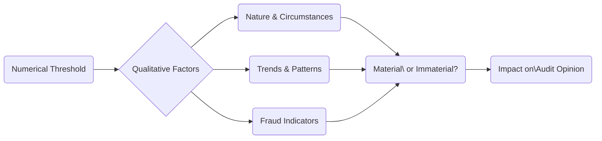

## 12.2 Qualitative Factors Affecting Materiality

In the process of evaluating misstatements detected during an audit, auditors do not rely solely on numerical thresholds to determine whether a misstatement is material. The nature of the misstatement, the context in which it arises, and intentional or unintentional factors all play a critical role in deciding if it could influence the economic decisions of users of the financial statements. This section explores the fundamental qualitative aspects that can affect the auditor’s materiality judgment and, ultimately, the final audit opinion.

--------------------------------------------------------------------------------

### 1. Nature and Circumstances Matter

Quantitative thresholds are an essential starting point when determining materiality, but purely “small” errors can become significant if they relate to certain sensitive areas or carry significant repercussions. The **nature and circumstances** surrounding a misstatement can transform an otherwise minor discrepancy into a major concern:

• **Masking Earnings Trends or Compliance Violations**  
  - Even a seemingly negligible misstatement might hide a breach of environmental regulations or obscure a decline in earnings.  
  - If management manipulates records to avoid showing negative earnings, user decisions (e.g., investor or creditor choices) can be misled.

• **Management Override of Controls**  
  - Auditors must be especially vigilant if senior management has the ability to bypass established controls and override normal accounting processes.  
  - A small misstatement intentionally caused by override may point to unethical behavior that could translate into larger issues.

• **Loan Covenant Requirements**  
  - A trivial error can become critical if it leads to a breach of a contractual debt covenant.  
  - Breach of covenant can trigger immediate repayment demands, debt renegotiation, or rating downgrades, which is vital information for financial statement users.

#### Practical Example: Debt Covenant Breach
Imagine a manufacturing company that has a debt covenant requiring it to maintain a current ratio above 1.2. Auditors discover a $20,000 understatement in current liabilities. Numerically, $20,000 might be small compared to the company’s total liabilities of several million dollars. However, if this $20,000 understatement reduces the current ratio from 1.21 to 1.19, the company is effectively in breach of its loan covenants. Because this outcome can drastically impact the company’s operations and liquidity, the “small” error becomes highly material in qualitative terms.

--------------------------------------------------------------------------------

### 2. Recognizing Trends

Materiality is not confined to a single reporting period. Repeated misstatements—even below the auditor’s quantitative threshold—from one period to another can reflect deeper, systemic challenges:

• **Repetitive Errors, Systemic Weakness**  
  - Persistent small misstatements across different accounts or periods might signal a flawed control environment or improper accounting methods.  
  - Auditors often examine prior-period misstatements for patterns that indicate widespread control deficiencies.

• **Sensitivity in Highly Scrutinized Areas**  
  - Certain accounts or disclosures (e.g., executive compensation, related-party transactions, or emerging ESG metrics) can receive increased attention from regulators, lenders, and shareholders.  
  - A minor error in these areas may raise significant red flags regarding ethics, oversight, or even possible fraud.

• **Effect on Stakeholder Perception**  
  - Stakeholders may overreact to seemingly small discrepancies if they perceive a pattern of misreporting (e.g., consistently rounding up revenues).  
  - Over time, credibility can be lost even if the individual amounts in question were immaterial in a strict numerical sense.

#### Real-World Scenario: Patterns in Employee Expense Reporting
Consider a large corporation with numerous employees submitting expenses for reimbursement. Each individual misstatement—say $50 of personal expenses mistakenly claimed—is small. However, if hundreds of employees repeat the same practice and management has failed to address the issue, it can cumulatively reflect a broader ethical lapse and inadequate monitoring. Hence, these “small” misstatements become a serious qualitative concern.

--------------------------------------------------------------------------------

### 3. Fraud Indicators

Arguably the most critical of qualitative materiality factors involves **fraud indicators**. Auditors are responsible for maintaining professional skepticism, especially where there is:

• **Evidence of Intent**  
  - Any misstatement discovered to be intentional—particularly if it aligns with management bonuses, stock price targets, or other incentives—triggers heightened concern.  
  - Management override or collusion among multiple employees severely undercuts the reliability of internal control.

• **Systematic Bias**  
  - If auditors find recurring understatements or overstatements that systematically benefit the company, it may imply a conscious attempt to manipulate results.  
  - Such patterns can be more material than a single random error because they suggest deeper integrity problems.

• **Link to Situational Pressures**  
  - The presence of extreme performance pressures, upcoming mergers, or other high-stake events can incentivize fraud.  
  - Auditors focus on these risk factors closely when reviewing even minor errors.

#### Fraud Case Study: Executive Incentive Manipulation
A start-up technology company’s executive team receives major stock grants tied to revenue growth milestones. During the audit, an “immaterial” $10,000 revenue misclassification is spotted. On its own, this figure is comparatively small relative to total annual revenue of $50 million. However, upon further investigation, auditors discover an intentional push by the CFO to accelerate revenue recognition just enough to cross a key milestone date. Because this directly affects executives’ compensation, the $10,000 error is now highly material in a qualitative sense.

--------------------------------------------------------------------------------

## Visual Overview of Qualitative Materiality Considerations

Below is a Mermaid diagram summarizing how various qualitative factors interact to influence the overall materiality assessment:

• The diagram shows that while a numerical threshold (A) is a useful starting point, multiple qualitative factors (B) can override or complement purely quantitative assessments.  
• These factors (C, D, E) merge to shape the ultimate conclusion on whether a misstatement is material and how it influences the auditor’s opinion (G).

--------------------------------------------------------------------------------

## Glossary of Key Terms

• **Qualitative Materiality**: Non-quantitative aspects that influence materiality—for instance, the nature of an error or its impact on stakeholders.  
• **Systemic Weakness**: A persistent shortfall in controls or processes that manifests across multiple accounts or periods or reporting cycles.  
• **Debt Covenant**: A loan agreement clause; breaching it can lead to immediate ramifications, such as repaying the loan or renegotiating terms.

--------------------------------------------------------------------------------

## Best Practices and Recommendations

1. **Maintain Rigorous Documentation**  
   - Note each misstatement’s potential impact on stakeholders, even if the amount is below quantitative thresholds.  
   - Document the rationale behind concluding that certain errors are qualitatively material, highlighting key nature and circumstance considerations.

2. **Assess Management’s Integrity and Tone at the Top**  
   - Repeated minor misstatements or overrides may point to deeper ethical or control issues.  
   - Evaluate the control environment thoroughly, especially where management’s motivations or judgments appear biased.

3. **Revisit Analytical Procedures**  
   - Consider whether repeated small errors skew trends or forecast analyses.  
   - Reassess detection risk if the misstatements systematically favor management or align with strong incentives.

4. **Stay Abreast of Regulatory Guidance**  
   - For public company audits, reference SEC Staff Accounting Bulletins (SAB) No. 99 and No. 108, which specifically address the importance of non-quantitative factors in materiality determinations.
   - For a deeper look into fraud risk management, consult the **COSO Fraud Risk Management Guide**.

--------------------------------------------------------------------------------

## References and Resources

• **Official References**  
  - AU-C Section 450: “Evaluation of Misstatements Identified During the Audit” (AICPA).  
  - SEC Staff Accounting Bulletins (SAB) No. 99 and No. 108: Guidance on qualitative and quantitative aspects of materiality.  

• **Additional Resources**  
  - “COSO Fraud Risk Management Guide”: Offers insight into identifying the motivations and potential methods for committing fraud, essential for pinpointing qualitatively material misstatements.  
  - For more background on evaluating control environments, refer to the COSO Internal Control – Integrated Framework discussed in Chapter 5.

--------------------------------------------------------------------------------

## Qualitative Materiality Mastery: A Comprehensive Quiz



### Which of the following circumstances exemplifies a qualitatively material misstatement?

- [x] A small misstatement that triggers a breach of debt covenants.
- [ ] A minor transcription error in one customer’s order.
- [ ] A postage expense misclassification that is under the established threshold.
- [ ] None of the above.

> **Explanation:** Even though the misstatement may be small, if it triggers a debt covenant breach, it has a significant qualitative impact on the financial statements.

### How can repetitive minor misstatements across multiple reporting periods be viewed?

- [x] As indicative of systemic weakness in the control environment.
- [ ] As an anomaly not worth reporting since each is individually minor.
- [ ] As unrelated issues that do not affect materiality judgments.
- [ ] As automatically immaterial because each misstatement is minor.

> **Explanation:** Repetitive small errors can expose systemic control deficiencies and may have material qualitative implications when taken together.

### Why might a small but intentional misstatement be considered highly material?

- [x] Because it suggests management override or fraudulent intent.
- [ ] Because it represents an unintended oversight by staff.
- [ ] Because external auditors provided insufficient supervision.
- [ ] Because it leads to positive earnings rather than negative ones.

> **Explanation:** Even if quantitatively small, an intentional misstatement reveals potential fraudulent or unethical behavior, heightening its importance.

### If a $5,000 misstatement hides a decline in earnings from a profit of $10,000 to a profit of $5,000, how should an auditor view this?

- [x] Potentially material due to masking the true performance trend.
- [ ] Immaterial if it does not break quantitative thresholds.
- [ ] Acceptable if management agrees to disclose the misstatement.
- [ ] Immaterial unless the auditor finds more errors in other accounts.

> **Explanation:** Masking a noticeable drop in earnings is a significant qualitative concern, possibly misleading users about the company’s performance.

### Which of the following best describes how management incentives can create a material misstatement risk?

- [x] Management may introduce small misstatements that help meet compensation targets.
- [ ] The risk of misstatement is automatically low if performance-based bonuses exist.
- [x] Management override cannot be ruled out when bonuses are at stake.
- [ ] Management incentives are irrelevant to the concept of materiality.

> **Explanation:** When management’s earnings or bonuses are tied to financial metrics, there’s a higher susceptibility to manipulate figures—even with small misstatements.

### Why are errors in executive compensation disclosures viewed with heightened scrutiny?

- [x] They carry potential reputational damage and legal implications.
- [ ] They are always mathematically large and surpass materiality thresholds.
- [ ] They invariably result in loan covenant violations.
- [ ] They only matter if they exceed 5% of net income.

> **Explanation:** Executive compensation is highly sensitive, and even a small disclosure error may lead to significant negative public and legal consequences.

### Which statement about repeated minimal errors in tax expense over several quarters is correct?

- [x] They could be indicative of an intentional pattern to smooth earnings.
- [ ] They are unlikely to matter or accumulate over time.
- [x] They often arise from honest mistakes and have no impact on materiality.
- [ ] They are always corrected in the year-end adjusting entries.

> **Explanation:** Repeated minimal errors could be masking consistent efforts to manage reported earnings, making them materially significant from a qualitative perspective.

### How should an auditor respond to an apparently small, intentional misstatement that corrects management’s internal performance measures upward?

- [x] Investigate thoroughly whether this indicates management override or biased reporting.
- [ ] Ignore it because it does not exceed numerical thresholds.
- [ ] Accept it without further inquiry if the CFO provides a memo “justifying” the entry.
- [ ] Classify it as a timing difference rather than a misstatement.

> **Explanation:** Intentional misstatements, regardless of amount, warrant deeper investigation as they raise significant red flags about reliability and integrity.

### When evaluating fraud risk, why might a single $10,000 revenue misstatement in a $50 million revenue company still be qualitatively material?

- [x] Because it could push the auditor to issue an adverse opinion.
- [ ] Because all omissions over $5,000 are automatically material.
- [ ] Because the misstatement has no bearing on lender decisions.
- [x] Because it could reflect management’s intent to meet performance bonuses.

> **Explanation:** Even a single, seemingly insignificant misstatement can be highly material if it reflects fraudulent intent—especially when linked to incentive-driven motives.

### Auditors should always prioritize fraud indicators over strictly quantitative metrics when determining materiality.

- [x] True
- [ ] False

> **Explanation:** Fraud indicators have a strong qualitative impact on materiality and may outweigh numerical thresholds, thus demanding deeper scrutiny.



--------------------------------------------------------------------------------

## For Additional Practice and Deeper Preparation

**[Auditing & Attestation CPA Mock Exams (AUD): Comprehensive Prep](https://www.udemy.com/course/aud-cpa-mock-exams/?referralCode=D064EF7BD4A84FC6403D)**  
• Tackle full-length mock exams designed to mirror real AUD questions—from risk assessment and ethics to internal control and substantive procedures.  
• Refine your exam-day strategies with detailed, step-by-step solutions for every scenario.  
• Explore in-depth rationales that reinforce understanding of higher-level concepts, giving you a decisive edge on test day.  
• Boost confidence and reduce exam anxiety by building mastery of the wide-ranging AUD blueprint.

_Disclaimer: This course is not endorsed by or affiliated with the AICPA, NASBA, or any official CPA Examination authority. All content is created solely for educational and preparatory purposes._
