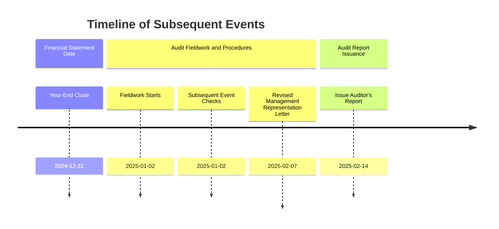

## 12.4 Final Steps Before Drafting the Auditor’s Report

In the final phase of any audit, the engagement team must consolidate and confirm their findings, ensuring that all outstanding questions and procedures are satisfactorily resolved. This crucial juncture precedes the finalization and issuance of the auditor’s report, underscoring the team’s responsibility for verifying completeness, accuracy, and objectivity. The procedures performed at this stage often determine how confidently an auditor can state that the financial statements are free of material misstatement in accordance with the applicable framework.

This section explores three key processes integral to concluding an audit engagement effectively:

• Obtaining written representations from management.  
• Investigating subsequent events that may require adjustment or disclosure.  
• Finalizing documentation through proper archiving and file lockdown.

By following these steps meticulously, auditors uphold the highest standards of professional care and reinforce the credibility of their conclusions.

---

## Written Representations

One of the last steps before the auditor’s report is issued is to obtain a management representation letter. This letter consolidates management’s assertions about the financial statements and the information provided during the audit.

### Purpose of the Management Representation Letter

1. Confirmation of Responsibility:  
   Management takes responsibility for the fair presentation of the financial statements in accordance with the relevant accounting framework (e.g., GAAP, IFRS).

2. Disclosure of All Facts:  
   Management confirms that it has provided the auditor with all known instances of actual or suspected fraud, any possible illegal acts, and any other relevant information.  

3. Integrity and Completeness:  
   The letter signifies that management has disclosed all transactions, events, and conditions affecting the company’s financial position.

### Timing and Dating

• The management representation letter is typically dated on the same date as the audit report. This ensures that, up to the date of the audit report, management reaffirms its commitment to the accuracy and completeness of the financial statements.  
• In certain circumstances—such as obtaining additional evidence after the balance sheet date—the management representation letter date may fall later than initially planned to capture all necessary disclosures.

### Example Scenario

Imagine the audit of a mid-sized manufacturing firm wrapping up on March 15. The auditor has gathered all evidence and is ready to finalize the report. On March 25, the Chief Financial Officer (CFO) uncovers a previously overlooked tax liability from a settlement negotiation. The auditor must then consider this new information before issuing the final report and update the management representation letter to include a reference to this newly identified liability. Eventually, the letter and the audit report would both be dated (or dual-dated, depending on the significance) after addressing this omitted fact.

---

## Subsequent Events

Subsequent events are events or transactions that occur after the balance sheet date but before the issuance of the financial statements and the audit report. Their proper evaluation is paramount to ensure the financial statements reflect all material information.

### Two Types of Subsequent Events

1. Recognized Events:  
   • These events provide additional evidence about conditions existing at the date of the financial statements.  
   • They often require adjustment of the financial statements for accurate representation.  
   • Example: A previously estimated liability (e.g., litigation) that is then resolved at a definitive amount shortly after year-end.

2. Non-Recognized Events:  
   • These events arise after the date of the financial statements and typically do not require an adjustment.  
   • If significant, however, they may require disclosure in the notes to the financial statements to prevent the financial statements from being misleading.  
   • Example: A major business acquisition announced after year-end.

### Procedures to Identify Subsequent Events

Auditors employ several methods to ensure they uncover potential subsequent events:

• Reading Meeting Minutes:  
  – Review minutes from board of directors’ and stockholders’ meetings held after year-end to identify decisions or discussions affecting the financial statements.

• Management Inquiries:  
  – Discuss any post-year-end transactions, lawsuits, changes in capital structure, or operational issues that could have a financial reporting impact.

• Examining Interim Financial Statements:  
  – Evaluate the interim financials prepared after year-end to spot unusual fluctuations or events requiring disclosure or further investigation.

• Legal Representation Letters:  
  – Obtain updated letters from attorneys to ascertain any recent or pending litigations not previously disclosed.

### Timeline Visualization

Below is a Mermaid diagram illustrating how subsequent events fall between the close of the financial reporting period and the issuance of the auditor’s report:

Explanation:  
• The year-end close occurs on December 31.  
• As the audit progresses in early January, the auditor reviews management’s records, holds discussions, and awaits any events that materially affect the financial statements.  
• Just before issuing the final report, the management representation letter might be revisited and updated to reflect new developments.  
• If any material event occurs prior to the February 14 issuance date, it must be accounted for in the financial statements or footnotes.

---

## Archiving and Final Documentation

Robust documentation is a cornerstone of audit quality, providing evidence of the decision-making process and compliance with professional standards. Once the auditor has performed all necessary procedures, the engagement file must be finalized and archived.

### Essentials of Final Documentation

• Completeness:  
  – All workpapers, memos, and correspondence should be in final form, each bearing sign-offs by preparers and reviewers.  
  – Any outstanding review notes must be answered or cleared.

• Proper Indexing and Cross-Referencing:  
  – Workpapers should be logically organized, with references that make it easy to trace from conclusions in the auditor’s report back to the supporting documentation.

• Engagement Quality Review:  
  – Larger firms often require a second partner or independent review by a qualified professional to ensure that significant judgments and conclusions are well-founded.

### Lockdown Period and Regulatory Requirements

Regulations typically require that the audit file be “locked down” within a specified timeframe after issuance of the auditor’s report to prevent unauthorized alterations. For instance, under PCAOB standards, auditors have 45 days (commonly referred to as the lockdown period) to assemble a complete and final set of workpapers. After this period, no edits can be made, and any additions must be documented with detailed justifications and timestamps.

---

## Best Practices and Common Pitfalls

1. Proactive Subsequent Event Monitoring:  
   – Avoid last-minute scrambles by establishing a routine for scanning for subsequent events throughout the engagement.

2. Thorough Management Representation Letters:  
   – Include explicit references to major estimates (e.g., warranties, lawsuits) and any special concerns raised by the auditor.

3. Well-Structured Archiving:  
   – Use standardized naming conventions for workpapers to ensure consistency and facilitate future peer reviews or regulatory inspections.

4. Omtitting Subtle Disclosures:  
   – A common pitfall is underestimating the significance of non-recognized events, which may still require detailed footnote disclosures to ensure transparency.

5. Overlooking Minor Edits Post-Lockdown:  
   – Even minor documentation changes after the lockdown date must be logged and justified.

---

## Practical Example: Partnering with Specialists

When an engagement requires specialists—such as actuaries or valuation experts—the final steps should include verifying that all their conclusions have been integrated properly. The management representation letter should mention the use of specialists, and any subsequent events specifically related to specialized evaluations must be revisited or updated if new assumptions or data arise before the report is issued.

---

## References for Further Exploration

• AU-C Section 580: “Written Representations,” published by the AICPA.  
• AU-C Section 560: “Subsequent Events and Subsequently Discovered Facts,” provides guidance on dealing with events post-balance sheet date.  
• PCAOB Auditing Standard AS 2801, focusing on subsequent events.  
• AICPA resource: “Improving Documentation: Tips and Tools” for a general overview of best practices in archiving and engagement wrap-up.

---

## Final Thoughts

The final steps before drafting and issuing the auditor’s report are vital for ensuring the integrity of the audit. From confirming management’s assertions and hunting down potential subsequent events to ensuring proper documentation, these measures embody the professionalism and diligence expected of external auditors. By adhering to these protocols, the audit team aligns itself with regulatory standards, mitigates potential risks, and upholds the trust placed in the audit process by stakeholders and the public.

---

## Secure Your Knowledge: Final Steps Before Drafting the Audit's Report Quiz



### Before issuing the audit report, the management representation letter is typically dated:
- [ ] Earlier than the date of the engagement letter.
- [ ] One week after the auditor’s report date.
- [x] The same date as the auditor’s report.
- [ ] A date set by regulatory bodies irrespective of audit completion.

> **Explanation:** The standard practice is that the management representation letter aligns with the date of the auditor’s report, ensuring management’s confirmations reflect the final state of affairs at the point of report issuance.

### Which of the following would most likely be classified as a recognized subsequent event?
- [ ] A strike by employees after the year-end.
- [x] Resolution of a lawsuit filed in the prior year that confirmed a liability.
- [ ] A planned issuance of stock for expansion financing.
- [ ] A newly signed rental agreement effective two months after year-end.

> **Explanation:** Recognized events are those that provide additional evidence of conditions existing as of the balance sheet date. The resolution of a previously filed lawsuit meets this criterion as the underlying event (the lawsuit) existed at year-end.

### Under PCAOB standards, how many days do auditors typically have to finalize and lock down their workpapers after issuing the report?
- [ ] 15 days
- [ ] 30 days
- [x] 45 days
- [ ] 60 days

> **Explanation:** According to PCAOB auditing standards, the file must be assembled and locked down within 45 days to prevent unauthorized modifications.

### A management representation letter helps the auditor in:
- [x] Confirming management’s responsibility for the financial statements.
- [ ] Substantiating the fairness of individual account balances.
- [ ] Replacing the need for other forms of audit evidence.
- [ ] Eliminating the need for engagement quality reviews.

> **Explanation:** A management representation letter is an important, but not sole, piece of evidence that reaffirms management’s explicit responsibility for providing accurate and complete financial data.

### Which of the following is a best practice to identify subsequent events?
- [x] Reviewing the minutes of board meetings held after year-end.
- [x] Examining any interim financials prepared after year-end.
- [ ] Ignoring management inquiries to avoid bias.
- [ ] Delaying consideration of subsequent events until the final engagement day.

> **Explanation:** Reading post-year-end board minutes and examining updated financials are among the most reliable ways to identify subsequent events that could affect the financial statements.

### Non-recognized events:
- [ ] Always require an adjustment to the financial statements.
- [x] Typically require disclosure in the footnotes if material.
- [ ] Have no impact on financial statements or disclosures.
- [ ] Only affect interim reviews, not annual audits.

> **Explanation:** Non-recognized events arise after year-end and usually require disclosure if they are material so that users are informed of significant developments even though the actual conditions did not exist at the balance sheet date.

### What is the significance of the lockdown period in the context of final documentation?
- [x] It prevents unauthorized changes to the audit file after a specific deadline.
- [ ] It allows extra time for management to make final edits to financial statements.
- [x] It mandates the archiving format for electronic documents only.
- [ ] It eliminates the need for a second partner review.

> **Explanation:** The lockdown period enforces a cutoff for changes to the working papers, ensuring documents and conclusions remain intact as evidence of how the audit was conducted.

### Which of the following commonly leads to an addendum to the management representation letter?
- [x] Discovery of previously unrecorded liabilities before issuing the audit report.
- [ ] Preliminary unadjusted audit differences identified at planning.
- [ ] Non-critical documentation sign-offs completed after issuance.
- [ ] Receipt of the initial engagement letter.

> **Explanation:** If new material information arises before the report’s issuance—such as a newly discovered liability—a management representation letter may need an addendum or reissuance to reflect these developments.

### Management representation letters typically include which assertions?
- [x] Management’s responsibility for internal control.
- [ ] The final resolved position of every unadjusted difference.
- [ ] Auditor’s independence from the entity.
- [x] Disclosure of all known instances of fraud or suspected fraud.

> **Explanation:** Among other assertions, management representation letters confirm management’s responsibility for internal control and require disclosure of any known or suspected fraud.

### In finalizing audit documentation, it is considered acceptable to make changes after the lockdown date if they are:
- [x] Documented, timestamped, and justified.
- [ ] Minor corrections carried out by junior staff under supervision.
- [ ] Unsupervised changes to test queries that had immaterial outcomes.
- [ ] Changes to align with a new CFO’s perspective on corporate governance issues.

> **Explanation:** Post-lockdown changes to the audit file must be thoroughly documented, showing what changed, why it changed, and who authorized it to maintain the audit trail.



---

## For Additional Practice and Deeper Preparation

**[Auditing & Attestation CPA Mock Exams (AUD): Comprehensive Prep](https://www.udemy.com/course/aud-cpa-mock-exams/?referralCode=D064EF7BD4A84FC6403D)**  
• Tackle full-length mock exams designed to mirror real AUD questions—from risk assessment and ethics to internal control and substantive procedures.  
• Refine your exam-day strategies with detailed, step-by-step solutions for every scenario.  
• Explore in-depth rationales that reinforce understanding of higher-level concepts, giving you a decisive edge on test day.  
• Boost confidence and reduce exam anxiety by building mastery of the wide-ranging AUD blueprint.

_Disclaimer: This course is not endorsed by or affiliated with the AICPA, NASBA, or any official CPA Examination authority. All content is created solely for educational and preparatory purposes._
