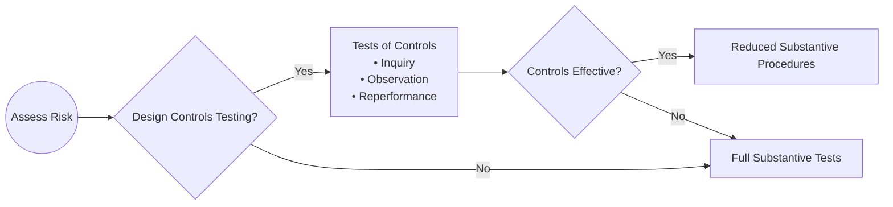

## 8.1 Tests of Controls vs. Substantive Procedures

Performing an effective audit requires a robust strategy for gathering sufficient and appropriate evidence. This involves deciding on an optimal mix of testing internal controls and performing substantive procedures. By balancing these two approaches, auditors can efficiently assess whether the financial statements are free from material misstatements. In this section, we explore the definitions, applications, and considerations of Tests of Controls and Substantive Procedures, along with best practices and illustrative diagrams.

---

### 1. Introduction to Tests of Controls (ToC) and Substantive Procedures
In auditing, the principal goal is to obtain reasonable assurance that the financial statements are not materially misstated. To achieve this, auditors employ two broad categories of procedures:

• Tests of Controls (ToC) – to evaluate how well internal controls function to prevent or detect material misstatements in financial information.  
• Substantive Procedures – to directly test monetary balances and transactions to detect any material errors or fraud that may exist.

The decision to rely on internal controls, perform extensive substantive testing, or a combination of both is influenced by an auditor’s risk assessment, operating environment, and the complexity of the client’s business processes.

---

### 2. Distinction Between Tests of Controls and Substantive Procedures

#### 2.1 Tests of Controls (ToC)
Tests of Controls focus on whether internal controls are designed and operating effectively to prevent or detect misstatements. Examples of Tests of Controls include:

• Inquiry and Observation: Asking personnel about internal control activities and observing the enactment of these activities.  
• Inspection of Documents: Reviewing physical or electronic documents (such as check authorizations) to verify that controls (e.g., proper approvals) have been followed.  
• Reperformance: Re-executing procedures (like reconciliation) to confirm that controls are properly carried out.  

When controls test positively—meaning auditors find them reliable and operating as intended—auditors can reduce the extent of detailed substantive testing, leading to a more efficient audit.

#### 2.2 Substantive Procedures
Substantive Procedures gather direct evidence about the completeness and accuracy of account balances and transaction classes. Substantive procedures typically fall into two categories:

• Tests of Details: Confirming a customer’s accounts receivable balance, verifying acquisition and disposal documentation for fixed assets, or recalculating depreciation to identify potential misstatements.  
• Analytical Procedures: Comparing financial ratios and trends, such as days sales outstanding or inventory turnover, to expected patterns to detect unusual fluctuations that may signify misstatements.

Even when controls are deemed strong, some level of substantive procedures is still required to confirm the validity of financial statement assertions.

---

### 3. When to Test Controls

1. **Reliance Strategy**  
   An auditor may opt to rely on the internal controls if:  
   • The entity has well-designed controls, tested previously with positive results.  
   • The environment is stable, and controls have not changed significantly.  
   • The audit is of a public company, requiring an opinion on internal control effectiveness under Sarbanes-Oxley Act (SOX) Section 404.  

2. **Efficiency**  
   If the auditor finds strong, effective controls, reliance on these controls can help reduce the extent of substantive testing. For instance, if controls surrounding revenue recognition are robust and verified through tests of controls, the auditor may cut back on detailed testing of all revenue transactions.

3. **Regulatory Requirements**  
   For certain audits (e.g., integrated audits of public companies), auditors are obligated to assess internal control effectiveness. In such settings, Tests of Controls aren’t just an optional strategy—they’re part of compliance with regulatory standards.

---

### 4. When to Emphasize Substantive Procedures

1. **Weak Internal Controls**  
   If internal controls are poorly designed or not functioning effectively, the auditor typically increases the scope of substantive testing to gain assurance directly from the underlying transactions and balances.  
   • Example: If purchase authorization controls are bypassed regularly, the auditor may perform detailed transaction testing to ensure that all expenses are legitimate and properly recorded.

2. **Smaller or Less Formal Entities**  
   In smaller organizations, controls may be less formal or undocumented. The auditor cannot easily rely on controls if they are not clearly documented or consistently followed. Consequently, heavier reliance on substantive procedures (like reviewing supporting documents for each transaction) may be necessary.

3. **Elevated Risk**  
   For high-risk areas—like complex financial instruments, management estimates, or related-party transactions—the auditor often leverages substantive procedures more heavily to detect potential misstatements or fraud.

---

### 5. Practical Interaction: Tests of Controls and Substantive Procedures
Both approaches often complement each other. While Tests of Controls yield confidence in processes and reduce the required depth of substantive testing, some degree of substantive testing remains mandatory to validate the final balances. The graphic below provides a conceptual flow of decision-making:

**Diagram Explanation:**
• The auditor starts by assessing the level of risk in each financial statement area.  
• If planning to rely on controls, the auditor designs and performs Tests of Controls.  
• If controls prove effective, the auditor reduces the extent of substantive procedures.  
• When controls are not effective (or not tested), the auditor expands substantive procedures to ensure sufficient coverage.

---

### 6. Best Practices for Balancing Controls and Substantive Work

1. **Risk-Focused Allocation**  
   Tailor the mix of controls testing and substantive procedures to the areas of highest risk. Invest more resources on the riskiest assertions (e.g., existence or valuation for complex financial instruments).

2. **Regular Communication**  
   Speak frequently with the entity’s management and process owners to understand evolving business environments and emerging risks. This helps refine your planned approach to rely on controls wherever feasible.

3. **Use of Technology and Data Analytics**  
   Modern audit technology offers advanced data analytics that enhance both tests of controls and substantive procedures. Automating recalculations and anomaly detection can drive operability and increase coverage.

4. **Iterative Reassessment**  
   Continuously assess whether the nature, timing, and extent of tests remain appropriate. If controls appear less reliable upon further testing, shift resources toward more extensive substantive testing.

---

### 7. Common Pitfalls and Challenges
• **Over-reliance on Controls:** Auditors might prematurely conclude that controls are effective based on limited testing or outdated knowledge.  
• **Generalization of Control Findings:** Even if certain control procedures are tested and found effective, new or undocumented processes might not share those characteristics.  
• **Insufficient Documentation:** Failure to maintain proper documentation of tests performed can undermine the auditor’s ability to draw conclusions.  
• **Human Error or Collusion:** Even well-designed controls can be circumvented by collusion, stressing the importance of corroborative substantive procedures.

---

### 8. Glossary of Key Terms

• **Tests of Controls (ToC):** Procedures (such as inquiry, observation, or reperformance) performed to evaluate the design and operating effectiveness of the client’s internal controls.  
• **Substantive Procedures:** Direct tests of account balances and transactions, broken down into tests of details and analytical procedures.  
• **Reliance Strategy:** An audit approach wherein auditors depend on strong internal controls, reducing the extent of substantive testing required, provided controls are tested and found effective.  
• **Audit Assertions:** Categories used by auditors to organize audit evidence collection (e.g., existence, completeness, valuation).  
• **Performance Materiality:** The level set lower than overall materiality to reduce the chance of undetected misstatements that could be material in aggregate.

---

### 9. Real-World Examples and Case Studies

1. **Case Study: Retail Chain with Strong Controls**  
   A large retail company invests in advanced inventory scanner technology, automating the verification of stock receipts against supplier invoices. After testing the controls surrounding these scanners and finding them robust, auditors reduce inventory test counts. They, however, still perform selected substantive procedures—such as price testing, cost accrual calculations, and year-end cutoff tests—to confirm the accuracy of the reported balances.

2. **Case Study: Small Nonprofit with Minimal Controls**  
   A local nonprofit depends heavily on volunteers, with limited documentation procedures. Since there is no formal segregation of duties, the auditor decides not to rely on controls. Instead, they sample every expense over a certain threshold and inspect all receipts and supporting documents. Additionally, they confirm major donations directly with donors.

---

### 10. References and Resources

• **Official References**  
  – [AU-C Section 330: Performing Audit Procedures in Response to Assessed Risks](https://www.aicpa.org/research/standards/auditattest/clarifiedsas.html)  
  – PCAOB AS 2301: The Auditor’s Responses to the Risks of Material Misstatement  

• **Additional Resources**  
  – AICPA “Audit Guide: Assessing and Responding to Audit Risk in a Financial Statement Audit.”  
  – PCAOB Staff Guidance on Auditing Internal Control over Financial Reporting (ICFR).

---

## Essential Audit Knowledge Quiz: Tests of Controls vs. Substantive Procedures



### An auditor chooses Tests of Controls mainly to:
- [ ] Reduce overall audit risk without any further testing.
- [ ] Have an excuse to avoid any substantive procedures entirely.
- [x] Evaluate the effectiveness of internal controls and potentially reduce substantive tests.
- [ ] Eliminate the need to issue an opinion on financial statements.

> **Explanation:** Tests of Controls are designed to assess whether internal controls are functioning effectively. If controls are reliable, auditors can reduce the extent of substantive testing.

### What is the key difference between Tests of Controls and Substantive Procedures?
- [ ] Both are designed solely to detect fraud in the financial statements.
- [x] Tests of Controls evaluate the operational effectiveness of controls, while Substantive Procedures directly check monetary amounts.
- [ ] Tests of Controls focus only on verifying balances, while Substantive Procedures check for management bias.
- [ ] There is no significant difference; both refer to the same testing methods.

> **Explanation:** Tests of Controls examine how effective controls are in preventing or detecting errors, whereas Substantive Procedures target the actual balances or transactions to identify misstatements.

### When an auditor finds that internal controls are weak, the primary response is to:
- [ ] Completely rely on management representation letters.
- [ ] Immediately conclude that material misstatements are present.
- [x] Increase the extent of substantive testing of account balances and transactions.
- [ ] Skip testing those areas for the rest of the audit.

> **Explanation:** Weak controls imply the auditor must increase direct testing of financial statement amounts to compensate for ineffective controls.

### In smaller entities where formal controls may be minimal or less documented, auditors typically:
- [ ] Default to reliance on a robust control system.
- [ ] Conduct IT-dependent tests of controls.
- [ ] Conclude an immediate adverse opinion.
- [x] Focus more on substantive procedures due to less reliable control structures.

> **Explanation:** Smaller entities often have less formal (or undocumented) controls, so auditors compensate by performing more in-depth substantive testing.

### Which of the following best describes a reliance strategy?
- [ ] Using only substantive analytical procedures for the entire audit.
- [x] Depending on effective controls to reduce the scope of substantive testing.
- [ ] Relying on repeated tests of details without employing internal control checks.
- [ ] Using no formal audit approach and adjusting procedures as the audit progresses.

> **Explanation:** A reliance strategy involves testing controls for effectiveness and, where appropriate, reducing substantive testing if controls are proven reliable.

### Which statement about Tests of Controls is correct?
- [ ] They involve confirming account balances with third parties.
- [ ] They do not require auditor judgment.
- [x] They include inquiries, observations, and reperformance of client processes.
- [ ] They provide direct evidence about monetary amounts in the financial statements.

> **Explanation:** Tests of Controls commonly involve methods such as inquiry, observation, inspection of control-related documents, and reperformance of control procedures.

### When internal controls are found to be highly effective, the auditor:
- [ ] Must focus solely on fraud detection and ignore other risks.
- [ ] Can dispense with procedures that test completeness assertions.
- [x] May reduce the number of detailed tests on balances.
- [ ] Is exempt from following any compliance standards.

> **Explanation:** Effective controls allow the auditor to reduce certain detailed testing; however, some substantive procedures remain necessary to meet auditing standards.

### Substantive Procedures primarily focus on:
- [ ] Gathering evidence about management’s integrity.
- [ ] Verifying the existence of unrecorded intangible assets.
- [ ] Testing the design of internal controls without regard to monetary amounts.
- [x] Directly verifying the amounts and disclosures in the financial statements.

> **Explanation:** Substantive procedures are designed to detect material misstatements in the financial statements by focusing on the factual correctness of reported amounts and disclosures.

### Which of the following is a Test of Controls example?
- [x] Reviewing purchase orders for proper authorization signatures before payment.
- [ ] Comparing this year’s gross margin to prior year’s gross margin for significant variances.
- [ ] Confirming accounts receivable balances directly with customers.
- [ ] Recalculating interest expense on loans.

> **Explanation:** Reviewing purchase orders for approvals tests control design and operation, whereas the others are examples of substantive procedures.

### True or False: Substantive Procedures replace the need for Tests of Controls in every scenario.
- [ ] True
- [x] False

> **Explanation:** While substantive procedures are mandatory to some extent, auditors may want to perform Tests of Controls, especially if an opinion on internal control effectiveness is required or if reliance on controls presents an opportunity to streamline overall testing.



---

## For Additional Practice and Deeper Preparation

**[Auditing & Attestation CPA Mock Exams (AUD): Comprehensive Prep](https://www.udemy.com/course/aud-cpa-mock-exams/?referralCode=D064EF7BD4A84FC6403D)**  
• Tackle full-length mock exams designed to mirror real AUD questions—from risk assessment and ethics to internal control and substantive procedures.  
• Refine your exam-day strategies with detailed, step-by-step solutions for every scenario.  
• Explore in-depth rationales that reinforce understanding of higher-level concepts, giving you a decisive edge on test day.  
• Boost confidence and reduce exam anxiety by building mastery of the wide-ranging AUD blueprint.

_Disclaimer: This course is not endorsed by or affiliated with the AICPA, NASBA, or any official CPA Examination authority. All content is created solely for educational and preparatory purposes._
