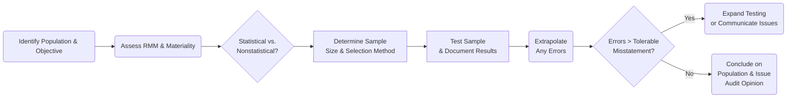

## 8.2 Audit Sampling and Engagement Efficiency

Audit sampling is a critical component of obtaining sufficient appropriate audit evidence. By examining a representative portion of transactions and balances, auditors can draw reasonable conclusions about the entire population without testing every single item. This approach not only controls costs and time but also focuses the engagement effort where it is most impactful. In this section, we will explore the various sampling techniques, evaluate their relative merits and limitations, and offer practical guidance on balancing audit effectiveness with engagement efficiency.

---

## Overview of Audit Sampling

Audit sampling involves selecting and testing fewer than 100% of the items within an account balance or transaction class such that the auditor expects the sample to be representative of the entire population. A properly designed sample helps the auditor draw valid conclusions while recognizing the presence of inherent sampling risk (i.e., the risk that the sample may not accurately reflect the population).

The goal of sampling is twofold:  
1. Gather sufficient appropriate evidence regarding whether material misstatements exist.  
2. Perform testing in an efficient manner, focusing resources where they are most needed and likely to reveal material errors.

---

## Statistical vs. Nonstatistical Sampling

Audit sampling typically falls into two broad categories: statistical and nonstatistical. Each technique comes with its own strengths and potential drawbacks. Choosing between them often depends on the size and risk profile of the population, the auditor’s professional judgment, the complexity of the audit engagement, and the relevant auditing standards.

### 1. Statistical Sampling

In statistical sampling, auditors utilize probabilistic methods for selecting a sample and extrapolating the results to the population. Common forms include:  
• Random Sampling: Every item in the population has an equal chance of being selected.  
• Systematic Sampling: Selecting items using a defined interval, such as choosing every 10th transaction after a random starting point.  
• PPS (Probability-Proportional-to-Size) Sampling: Larger-dollar items in the population have a higher chance of selection.

Statistical sampling offers a quantifiable measure of sampling risk and allows auditors to form conclusions with a known level of confidence. For instance, an auditor might say: “There is only a 5% chance that our conclusion about the population is incorrect given our sample results.”

### 2. Nonstatistical Sampling

Nonstatistical sampling relies on the auditor’s professional judgment rather than formal probabilities. Techniques include:  
• Judgmental Sampling: The auditor cherry-picks items based on certain high-risk characteristics, such as large dollar amounts or unusual transactions.  
• Haphazard Sampling: The auditor selects items without following a structured approach, yet attempts to avoid bias.  

Although nonstatistical sampling does not allow a formal quantification of sampling risk, it can be suitable for smaller populations or lower-risk scenarios. The key is for the auditor to ensure that the sample remains relevant, representative, and free from bias.

---

## Determining Sample Size

One of the most important concerns in audit sampling is deciding on the sample size. Several factors influence this decision:

• Assessed Risk of Material Misstatement (RMM): Higher RMM leads to larger sample sizes.  
• Control Risk Assessment: If internal controls are considered strong, smaller samples may be adequate; if controls are weak, larger samples are necessary to gain sufficient evidence.  
• Materiality Levels: Lower materiality thresholds require more detailed testing, generally increasing sample size.  
• Expected Error Rate: If the auditor expects higher rates of error, the sample must be larger to ensure detection and reliable quantification.

The chosen sample size must be large enough to provide the auditor with reasonable assurance that any material misstatements will be detected, while still preserving operational efficiency.

---

## Projecting Errors and Extrapolation

When misstatements are identified in a sample, the auditor generally extrapolates those errors to estimate the total potential misstatement in the population. This process involves:

1. Identifying the nature of the error (e.g., classification, valuation, occurrence).  
2. Calculating a misstatement ratio or rate based on sample findings.  
3. Projecting that ratio across the untested portion of the population.

If the projected misstatement exceeds the tolerable misstatement (the maximum error the auditor can accept without altering the audit plan), the auditor may:

• Expand the sample and perform additional testing.  
• Inquire further with client management.  
• Adjust the proposed audit opinion if necessary.

This extrapolation step ensures that any detected anomalies, even from a small number of transactions or items, are properly assessed in relation to the overall account balance or transaction class.

---

## Balancing Efficiency and Effectiveness

Audit sampling must strike a balance between thoroughness (effectiveness) and cost (efficiency). Allocating too few resources to testing can risk missing material errors. Conversely, devoting excessive resources can delay the engagement and inflate audit costs without adding proportionate value.

### Engagement Efficiency Considerations

• Leverage Internal Controls: Strong controls might justify smaller sample sizes or targeted testing of specific high-risk areas.  
• Focus on High-Risk Items: Tailor the sampling approach to concentrate on transactions or balances most susceptible to error.  
• Use Data Analytics Tools: Modern analytical platforms can process large data sets quickly, helping identify anomalies and patterns that guide selective testing.

### Diagram: An Overview of the Audit Sampling Decision Process

In this flowchart, the auditor begins by clarifying the audit objective (e.g., testing the completeness of revenue) and identifying the relevant population. After assessing RMM and materiality, the auditor chooses between statistical or nonstatistical sampling methods. The sample size and selection method are then determined. Any detected misstatements are evaluated and projected to the broader population. If the projected errors exceed tolerable misstatement, further testing or communication with the client may be required.

---

## Common Pitfalls and Best Practices

• Pitfall: Relying on nonstatistical sampling without thorough professional judgment can create unrepresentative samples.  
• Pitfall: Setting the sample size without fully considering RMM or materiality can lead to over- or under-auditing.  
• Best Practice: Document the rationale behind sampling choices in audit working papers.  
• Best Practice: Regularly review sampling results to identify patterns of error that may indicate potential control weaknesses.

---

## Glossary

• Statistical Sampling: Uses probabilistic methods for selecting sample items and evaluating results with quantifiable confidence levels.  
• PPS (Probability-Proportional-to-Size) Sampling: Sampling method where larger-dollar items in the population have a higher probability of selection.  
• Extrapolation: Estimating the total population effect of errors found in the sample based on the proportion of errors detected in the sample.  

---

## References and Resources

• Official Reference:  
  – [AU-C Section 530](https://www.aicpa.org/research/standards/auditattest/clarifiedsas.html) – Audit Sampling  

• Additional Resources:  
  – AICPA “Audit Sampling” Guide for in-depth examples and scenarios.  
  – Professional firm methodologies (e.g., Big Four) that offer detailed sampling tools and templates customized for various industries.

---

## 10 Key Concepts in Audit Sampling & Engagement Efficiency Quiz



### An auditor’s sampling approach is aimed primarily at:  
- [ ] Verifying 100% of all transactions.  
- [x] Obtaining sufficient evidence about material misstatements in a cost-effective manner.  
- [ ] Complying with management directives to test specific items.  
- [ ] Eliminating all forms of audit risk entirely.

> **Explanation:** By selecting a representative sample to test, the auditor gathers reasonable assurance about the population while managing time and costs efficiently. Testing 100% of the transactions is impractical, and no audit process can completely eliminate all audit risk.

### In statistical sampling, which factor most directly impacts the precision of the sampling results?  
- [ ] The auditor’s experience.  
- [x] The size of the sample selected.  
- [ ] The cost of the audit engagement.  
- [ ] The seasonality of the client’s business.

> **Explanation:** In statistical sampling, larger samples generally increase confidence in the results because they reduce the margin of error, thus directly improving the precision of conclusions about the population.

### Which best describes Probability-Proportional-to-Size (PPS) sampling?  
- [x] Each dollar of the population has an equal chance of selection, giving larger items a higher probability.  
- [ ] It relies solely on auditor judgment for selecting items.  
- [ ] It focuses equally on high-value and low-value items.  
- [ ] It is forbidden under AICPA standards.

> **Explanation:** PPS sampling assigns a higher chance of selection to larger items because each dollar constitutes a separate “sampling unit.” This increases the likelihood of testing transactions that could be individually material.

### When an auditor projects an error found in a sample to the entire population, this process is known as:  
- [ ] Corroborating evidence analysis.  
- [x] Extrapolation.  
- [ ] Materiality triangulation.  
- [ ] Denial-of-service calculation.

> **Explanation:** Extrapolation is the process of estimating the potential total misstatement in a population based on the errors identified in a sample.

### Which of the following is a valid reason to increase the test sample size?  
- [x] The auditor’s assessment of inherent risk is high.  
- [ ] The auditor has limited audit staff.  
- [x] The control environment is deemed weak.  
- [ ] Management requests a smaller sample.

> **Explanation:** When inherent risk or control risk is high, the auditor should test more items to gain sufficient assurance. Resource constraints and client requests do not override the need for thorough testing.

### Haphazard sampling involves:  
- [ ] Selecting sample items in exact statistical intervals.  
- [ ] Preferring item selection solely based on key financial thresholds.  
- [x] Choosing sample items without a formal pattern but ensuring no intentional bias.  
- [ ] Targeting only the smallest transactions in the ledger.

> **Explanation:** Haphazard sampling is a nonstatistical method where the auditor aims to avoid bias but does not follow a probabilistic or strictly structured selection method.

### An example of an improper application of nonstatistical sampling is when:  
- [x] The auditor repeatedly selects the same high-value items favoring known problem areas, neglecting random coverage.  
- [ ] The auditor generally focuses on high-risk transactions.  
- [x] The final conclusions regarding the population do not account for the risk associated with untested items.  
- [ ] The auditor uses documented professional judgment to determine sample size.

> **Explanation:** Nonstatistical sampling requires that the auditor still maintain objectivity and representativeness. Over-focusing on a narrow subset can reduce the sample’s overall coverage and reliability.

### If a projected misstatement exceeds the auditor’s tolerable misstatement, the auditor should:  
- [ ] Immediately issue an adverse opinion.  
- [x] Perform additional audit procedures or expand the sample.  
- [ ] Effectively reduce the materiality threshold.  
- [ ] Ignore the misstatement if management asserts it is immaterial.

> **Explanation:** When the projected misstatement surpasses tolerable misstatement, the auditor must revisit and possibly expand testing or seek further corroborative evidence to determine whether an audit adjustment or modified opinion is warranted.

### All else being equal, a lower materiality threshold generally:  
- [x] Requires a larger sample size.  
- [ ] Allows the auditor to rely on smaller samples.  
- [ ] Negates the need for audit sampling.  
- [ ] Significantly reduces the cost of the audit engagement.

> **Explanation:** A stricter (lower) materiality threshold means potential misstatements of smaller amounts become more significant, thus usually increasing the auditor’s testing scope and sample size.

### True or False: An auditor can eliminate all sampling risk through strategic sample design.  
- [x] False  
- [ ] True  

> **Explanation:** No matter how detailed or well-structured, sampling inherently carries some risk that the sample may not fully represent the population. This risk cannot be completely eliminated but can be mitigated.



---

## For Additional Practice and Deeper Preparation

**[Auditing & Attestation CPA Mock Exams (AUD): Comprehensive Prep](https://www.udemy.com/course/aud-cpa-mock-exams/?referralCode=D064EF7BD4A84FC6403D)**  
• Tackle full-length mock exams designed to mirror real AUD questions—from risk assessment and ethics to internal control and substantive procedures.  
• Refine your exam-day strategies with detailed, step-by-step solutions for every scenario.  
• Explore in-depth rationales that reinforce understanding of higher-level concepts, giving you a decisive edge on test day.  
• Boost confidence and reduce exam anxiety by building mastery of the wide-ranging AUD blueprint.

_Disclaimer: This course is not endorsed by or affiliated with the AICPA, NASBA, or any official CPA Examination authority. All content is created solely for educational and preparatory purposes._
