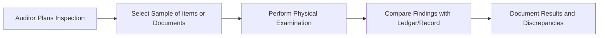

## 8.3 Evidence Collection: Observation, Inquiry, Inspection, Confirmation

Obtaining sufficient, appropriate evidence is at the heart of an effective audit. The auditor has a range of techniques available—each with its strengths, limitations, and best-use scenarios. This section focuses on four foundational methods of evidence gathering:

• Observation  
• Inquiry  
• Inspection  
• Confirmation  

Together, these approaches provide a multifaceted view of a client’s transactions, internal controls, and financial assertions. To meet professional standards and confidently form an opinion on the financial statements, auditors must use and document these methods appropriately, correlating them with the audit strategy and risk assessment covered in previous chapters.

---

## 1. Observation

### 1.1 Rationale and Importance
Observation is a process in which the auditor physically witnesses activities and controls within the client’s environment. This can range from watching an employee prepare checks for payment to attending a client’s inventory count. Observing in real time helps the auditor see whether established protocols are genuinely followed and whether the everyday environment aligns with management’s descriptions.

### 1.2 Key Situations for Observation
• Inventory Count: Auditors often attend inventory counts to ensure correct procedures are followed (e.g., counting, tagging, reconciling).  
• Transaction Processing: Observing how staff process invoices, checks, and other crucial documents to verify segregation of duties and procedural accuracy.  
• Access Controls: Watching the operation of physical or electronic controls (e.g., door locks, restricted system logins).  

### 1.3 Benefits and Limitations
• Benefit: Provides real-time, direct insight into operations.  
• Limitation: The “Hawthorne Effect” can be present—people may alter their behavior if they know an auditor is watching. Thus, processes may appear compliant during observation but might not be consistently followed.  
• Conclusion: Observational evidence is compelling but must usually be supplemented with other forms of evidence, such as inspection or inquiry, to confirm consistent application.

### 1.4 Practical Example and Case Study
Imagine an auditor tasked with verifying the cash disbursement process in a mid-sized manufacturing company. The auditor observes an accounting clerk and a supervisor as they review invoices and sign checks. If the process matches the written control description (two signatures required, invoice matched to purchase orders, etc.), the observation supports the control’s operating effectiveness. However, if the staff is alerted and follows the protocol only because an auditor is present, the observation alone may be insufficient—hence the need to corroborate with subsequent tests of documentation and inquiry.

---

## 2. Inquiry

### 2.1 Fundamental Approach
Inquiry involves asking questions of management, staff, or third parties to gather insights on processes, controls, or significant events. It can uncover useful information related to risk areas, unusual transactions, or possible fraudulent activities.

### 2.2 Best Practices for Inquiries
• Prepare Appropriate Questions: Tailor questions to the role and experience level of the interviewee (e.g., CFO vs. line employee).  
• Corroborate: Since inquiry alone is not highly reliable, cross-check responses with other evidence (inspection, confirmation).  
• Open-Ended Questions: Encourage interviewees to provide detailed answers and uncover information the auditor might not have known to ask about.  

### 2.3 Sources of Inquiry
• Management: Typically offers high-level perspectives on company policies, strategic risks, and financial reporting objectives.  
• Operational Personnel: Provide ground-level insights into how processes truly function (e.g., actual procedures for handling sales returns).  
• Third Parties: Such as attorneys, vendors, or landlords, who can verify contractual matters or other external data.  
• Internal Auditors: If the company has an internal audit department, the external auditor may glean critical risk assessments and test strategies from them.

### 2.4 Practical Example: Discussing Inventory Obsolescence with Management
During an audit of a retailer’s financial statements, the auditor holds discussions with the CFO and warehouse managers about slow-moving or obsolete inventory items. This inquiry helps determine if the allowance for obsolete inventory is sufficient. The auditor then inspects inventory reports, compares them with actual on-hand quantities, and reviews subsequent sales or write-offs to corroborate management’s statements.

---

## 3. Inspection

### 3.1 Definition and Scope
Inspection involves examining records, documents, or tangible assets. This includes everything from invoices and board meeting minutes to inventory and fixed assets. The auditor evaluates the authenticity, completeness, and accuracy of these items.

### 3.2 Reliability Considerations
• External vs. Internal Documents: External records (e.g., third-party statements) are generally more reliable than those generated internally.  
• Original vs. Copy: Original documents hold more weight than photocopies or digital scans (though digital transformations are often used in modern audits).  
• Controls Over Documentation: Consider how documents are created, stored, and maintained. If the client has strong document management procedures, the reliability of internally generated documents increases.

### 3.3 Applications of Inspection
• Verification of Existence: Inspecting physical assets like machinery or inventory helps ensure they truly exist.  
• Occurrence and Accuracy: Examining invoices, contracts, or shipping documents supports the occurrence and accuracy of transactions.  
• Valuation and Allocation: Inspecting cost accumulation documents or fixed asset depreciation schedules helps assess fairness of valuation.

### 3.4 Physical Examination Flow



In this flow, the auditor systematically chooses a set of documents or physical assets, matches them to records in the general ledger or subsidiary ledgers, and logs any discrepancies.

### 3.5 Practical Example: Inspecting Fixed Assets
When auditing a manufacturing company, the external auditor inspects a sample of production equipment, verifying serial numbers, condition, and location. They reconcile this information with the fixed asset register to confirm that reported assets exist and are not overstated.

---

## 4. Confirmation

### 4.1 Purpose and Importance
Confirmation involves obtaining representations or information directly from an independent third party. Because of its direct and external nature, this procedure often provides highly persuasive evidence. Common confirmations include:

• Bank Confirmations: Verifying cash balances, loan balances, or other banking relationships.  
• Accounts Receivable Confirmations: Checking outstanding balances with customers.  
• Legal Confirmations: Communicating with law firms to confirm the status of litigation or claims.

### 4.2 Key Elements of an Effective Confirmation Process
1. Auditor Control: The auditor should design the confirmation, determine sample size, select recipients, mail or email the confirmations, and receive responses independently.  
2. Positive vs. Negative Confirmations:  
   – Positive Confirmation: Requires the recipient to respond whether they agree or disagree with the stated amount.  
   – Negative Confirmation: Requests a response only if the recipient disagrees. Negative confirmations are less reliable because silence is not always a confirmation of agreement.  
3. Alternative Procedures: If a recipient does not respond to a positive confirmation request, the auditor must use alternative tests (e.g., subsequent cash receipts, shipping documents) to verify the balance.

### 4.3 Example: AR Confirmation Workflow

```mermaid
flowchart TD
    A[Select AR Sub-Ledger Items] --> B[Prepare Confirmation Requests]
    B --> C[Obtain Client Approval for Contact Info (Under Auditor Control)]
    C --> D[Send Requests to Customer Addresses/Emails]
    D --> E[Customer Responds Directly to Auditor]
    E --> F[Auditor Reconciles Variances/No Response with Alternative Procedures]
    F --> G[Document Results in Workpapers]
```

In this workflow, note that the control must remain with the auditor. The client’s role is limited to verifying contact details to maintain the integrity of the process.

### 4.4 Challenges and Best Practices
• Non-Response Issues: Negative confirmations might yield numerous non-responses. Positive confirmations that remain unanswered require follow-up or alternative procedures.  
• Fraud Risk: Ensure that addresses and contact names are legitimate and that responses are truly from the intended third parties.  
• Documentation: Properly document all stages of the confirmation process, including mail logs and responses, to comply with professional standards.

---

## 5. Corroboration and Reliability of Evidence

Since each of the above methods—observation, inquiry, inspection, and confirmation—has distinct strengths and weaknesses, **corroboration** is essential. By cross-referencing different evidence types, the auditor can form a more robust conclusion.

• Observation might affirm the presence of a control, but inspection or inquiry is needed to confirm consistent application.  
• Inquiry can reveal anomalies, but documented or external confirmation often provides the “proof.”  
• Inspection of assets ensures existence, while confirmation from a third party adds external validation, especially for intangible elements like receivables or payables.

---

## 6. Glossary

• **Corroboration**: The process of cross-checking one piece of evidence with another type or source for added reliability.  
• **External Confirmation**: Evidence obtained directly from an outside entity, more reliable than internal records.  
• **Physical Examination**: Observing tangible assets (e.g., inventory) to verify their existence, condition, and quantity.

---

## 7. References and Resources

### 7.1 Official References
• [AU-C Section 500](https://www.aicpa.org/research/standards/auditattest/clarifiedsas.html) – Audit Evidence  
• [AU-C Section 505](https://www.aicpa.org/research/standards/auditattest/clarifiedsas.html) – External Confirmations  

### 7.2 Additional Resources
• PCAOB Staff Guidance on External Confirmations: Offers best practices for designing and evaluating confirmation requests, including ways to minimize interception risks.

For more insight on these procedures, refer to Chapter 8.4 (Analytical Procedures and Data Analytics in Testing) for complementary testing methods, and Chapter 8.5 (Working Papers and Documentation of Results) to understand proper documentation techniques that tie evidence together into a coherent audit trail.

---

## Evidence Collection: Observation, Inquiry, Inspection, and Confirmation Quiz



### Which method of evidence gathering involves the auditor physically witnessing a process or activity in real time?

- [x] Observation
- [ ] Inquiry
- [ ] Inspection
- [ ] Confirmation

> **Explanation:** Observation is the procedure where the auditor watches processes or activities to verify that they are executed as described.  

### Which statement about inquiry is correct?

- [ ] Inquiry alone is generally considered highly reliable evidence.
- [x] Inquiry should be corroborated with other evidence, such as inspection or confirmation.
- [ ] Inquiry is always performed under strict auditor control, with no management involvement.
- [ ] Inquiry is never used for obtaining evidence about internal control effectiveness.

> **Explanation:** Inquiry alone is generally not sufficient because it relies on the interviewee’s representations, which must be corroborated with other evidence for reliability.

### In which scenario would inspection of tangible assets typically be used?

- [x] Verifying the existence and condition of a piece of manufacturing equipment.
- [ ] Obtaining a customer’s confirmation of an outstanding receivable balance.
- [ ] Observing an employee performing their daily cash handling procedure.
- [ ] Interviewing company management about events subsequent to year end.

> **Explanation:** Inspection is used to physically examine tangible assets to confirm their presence and assess their condition.

### Which of the following is a best practice for sending external confirmations?

- [ ] Allow management to draft and mail the confirmations.
- [ ] Use negative confirmations for all significant balances.
- [ ] Rely solely on internal email communications for confirmations.
- [x] Maintain control over the confirmation process and address third-party responses directly to the auditor.

> **Explanation:** The auditor should direct the entire confirmation process from preparing the requests to receiving responses independently to ensure reliability.

### What is the main drawback of observation as an evidence-gathering method?

- [x] Subjects may perform procedures differently due to the auditor’s presence.
- [ ] It always leads to errors in the final audit opinion.
- [x] It is the most time-consuming method, rendering it ineffective.
- [ ] It can only be used when no other method is available.

> **Explanation:** People often change their behavior if they know they are being observed, which can diminish the authenticity of the evidence obtained.

### Why are external documents often considered more reliable than internal ones?

- [x] They originate outside the client’s accounting system, reducing the risk of manipulation.
- [ ] They must always be verified through forensic audits.
- [ ] They are never relevant for the accounting records.
- [ ] They automatically guarantee the absence of fraud.

> **Explanation:** Because external documents come from third parties, there is generally a lower chance that these documents have been manipulated by the client.

### When is it acceptable to rely solely on negative confirmations for accounts receivable?

- [ ] If fraud risk is high.
- [ ] Always, as it saves time.
- [x] When the population is composed of a large number of small balances and the assessed risk of material misstatement is low.
- [ ] If management insists on using negative confirmations.

> **Explanation:** Negative confirmations typically provide less reliable evidence, making them suitable only in low-risk situations with many small accounts.

### Which of the following best describes “Corroboration” in an audit context?

- [ ] Reassigning tasks to different audit team members. 
- [x] Using multiple sources or methods of evidence to support a single conclusion.
- [ ] Calculating the same balance repeatedly to confirm it.
- [ ] Having the client's internal audit department sign off on audit results.

> **Explanation:** Corroboration involves cross-checking different evidence sources (e.g., inquiry, inspection) to reinforce the audit’s findings.

### In a confirmation procedure, which of these best practices helps prevent interception or manipulation of confirmation requests?

- [x] Incorporating controls that stipulate all confirmations be mailed and received from the auditor’s address/domain.
- [ ] Disclosing all confirmation details to management before sending them.
- [ ] Sending negative confirmations to all related parties.
- [ ] Only confirming accounts that have zero balances.

> **Explanation:** Keeping management at a distance from both sending and receiving confirmations ensures that the process is not tampered with, thus increasing reliability.

### True or False: Inquiry alone is typically sufficient for obtaining persuasive evidence about a client’s internal controls.

- [ ] True
- [x] False

> **Explanation:** Inquiry is not sufficient on its own; it must be corroborated with additional evidence, such as observations, inspections, or tests of controls.



---

## For Additional Practice and Deeper Preparation

**[Auditing & Attestation CPA Mock Exams (AUD): Comprehensive Prep](https://www.udemy.com/course/aud-cpa-mock-exams/?referralCode=D064EF7BD4A84FC6403D)**  
• Tackle full-length mock exams designed to mirror real AUD questions—from risk assessment and ethics to internal control and substantive procedures.  
• Refine your exam-day strategies with detailed, step-by-step solutions for every scenario.  
• Explore in-depth rationales that reinforce understanding of higher-level concepts, giving you a decisive edge on test day.  
• Boost confidence and reduce exam anxiety by building mastery of the wide-ranging AUD blueprint.

_Disclaimer: This course is not endorsed by or affiliated with the AICPA, NASBA, or any official CPA Examination authority. All content is created solely for educational and preparatory purposes._
