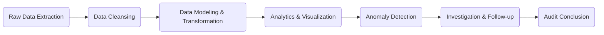

## 8.4 Analytical Procedures and Data Analytics in Testing

Analytical procedures and data analytics are essential tools that help auditors gather sufficient appropriate evidence. These procedures allow auditors to identify unusual relationships, significant fluctuations, or patterns that warrant further investigation. In addition, the advent of modern data analytics tools has expanded the way audits are performed, enabling deeper insights and more focused testing.

Auditors use analytical procedures in both the planning and substantive testing phases. By comparing recorded amounts or ratios with expectations (e.g., budgets, forecasts, or industry norms), they can rapidly highlight inconsistencies. If differences exceed predefined thresholds, auditors perform further procedures to understand whether the discrepancies stem from errors, fraud, or legitimate changes in the business environment.

This section explores the use of analytical procedures and data analytics in designing, executing, and evaluating tests of details and balances.

--------------------------------------------------------------------------------

### 1. Introduction to Analytical Procedures

Analytical procedures involve evaluating financial information by studying plausible relationships among financial and non-financial data. They provide a cost-effective way to detect potential misstatements that may not be evident through transaction testing alone.  
Some common analytical procedures include:  
• Comparing current-year financial statement amounts to prior years.  
• Assessing relationships between financial statement components (e.g., sales to cost of goods sold).  
• Investigating relevant non-financial data (e.g., quantity of units sold, number of employees).  

#### Key Benefits of Analytical Procedures

• Efficiency: They can quickly highlight areas with discrepancies that may require further audit work.  
• Effectiveness: Analytical tests can detect patterns or trends that direct attention toward higher-risk areas.  
• Versatility: They can be applied at every stage of the audit, from planning to final review.  

--------------------------------------------------------------------------------

### 2. Substantive Analytical Procedures

When used as substantive tests, analytical procedures provide direct evidence regarding account balances or classes of transactions. They are particularly useful in evaluating large sets of routine data.

#### 2.1 Types of Substantive Analytical Procedures

1. Ratio Analysis  
   Ratio analysis evaluates relationships between two or more financial statement items and can signal potential misstatements. Common ratios include:  
   • Current ratio (current assets ÷ current liabilities).  
   • Gross margin percentage (gross profit ÷ net sales).  
   • Days sales in accounts receivable (accounts receivable ÷ average daily sales).  

   These ratios can be compared to industry benchmarks or prior periods to highlight unusual fluctuations.

2. Trend Analysis  
   Trend analysis focuses on patterns in data across multiple periods. For example, an auditor might plot sales revenue over several years to see if the current year’s sales appear consistent with the overall trend. Deviations may indicate a material misstatement, changes in accounting methods, or economic factors.

3. Reasonableness Tests  
   Reasonableness tests compare recorded amounts with estimates or independently developed expectations. For instance, the auditor may estimate interest expense based on an entity’s average debt balance and applicable interest rates. If the actual interest expense differs significantly from the expectation, further inquiries or testing may be needed.

--------------------------------------------------------------------------------

### 3. Precision and Reliability

A core objective of analytical procedures is to ensure the auditor’s expectations are sufficiently precise. If the allowable difference between the auditor’s expectation and the recorded amount is too broad, small but material misstatements might go undetected.

• Establishing Tolerable Thresholds: Auditors determine the difference between expected and actual amounts that they can accept without further investigation. This threshold depends on materiality and the inherent risk associated with the balance or transaction class.  
• Reliability of Data: The data used in analytical procedures must be reliable and relevant. If data integrity is questionable, the validity of the analytical procedure is compromised.  
• Reasonable Variation: Even when underlying data is reliable, small variations often exist due to rounding, estimations, or timing issues. The auditor must decide what level of deviation is normal and when further testing is appropriate.

--------------------------------------------------------------------------------

### 4. Data Analytics Tools

Modern audit engagements increasingly incorporate advanced data analytics to go beyond traditional ratio and trend analysis. Data analytics involves using software or specialized platforms to analyze large datasets and reveal patterns, anomalies, and trends.

Common data analytics approaches include:

1. Whole-Population Testing  
   Rather than sampling, auditors can analyze entire data populations. For instance, scanning the entire general ledger (GL) for unusual entries or suspicious activity (e.g., entries made late at night, significant manual adjustments) can expedite fraud detection.

2. Real-Time Matching and Workflow Automation  
   Data analytics platforms can match external records, such as shipping logs, with corresponding sales invoices in real-time. This method quickly identifies unrecorded sales, duplicate invoices, or shipments without proper documentation.

3. Cluster Analysis  
   Cluster analysis groups transactions or accounts with similar characteristics, making anomaly detection more precise. By identifying outlier clusters within vendor data, auditors can pinpoint relationships that deviate from the majority.

#### Example Data Analytics Flowchart

Below is a simplified diagram illustrating the workflow for applying data analytics during an audit:

1. Raw Data Extraction: Obtain complete datasets (e.g., sales, purchases, inventory records).  
2. Data Cleansing: Ensure data is accurate, formatted properly, and ready for analysis.  
3. Data Modeling & Transformation: Structure or summarize data so it can be used in analytics software.  
4. Analytics & Visualization: Deploy automated tools and metrics to uncover trends or outliers.  
5. Anomaly Detection: Identify transactions or balances deviating from established norms.  
6. Investigation & Follow-up: Delve deeper into anomalies to determine if misstatements exist.  
7. Audit Conclusion: Incorporate outcomes into the auditor’s overall assessment.

--------------------------------------------------------------------------------

### 5. Investigation of Variances

Once an auditor identifies unexpected variances or anomalies, further investigation is crucial. A thorough analysis involves:

1. Inquiry and Management Discussions  
   The auditor seeks explanations from management regarding unusual fluctuations.  
2. Examination of Supporting Documentation  
   The explanations must be corroborated with documentary evidence (e.g., invoice copies, shipping logs, bank statements).  
3. Extended Testing  
   If an explanation remains unclear or new risk factors arise, the auditor may expand the test scope to ensure the accuracy of the data.

Management’s explanation alone is generally insufficient without tangible evidence. The auditor must audit the explanation itself by reviewing invoices, confirming calculations, or testing the validity of underlying assumptions.

--------------------------------------------------------------------------------

### 6. Key Terms

• Ratio Analysis: Evaluating the relationships between financial statement amounts (e.g., current ratio, gross margin) to detect irregularities or trends.  
• Precision: The degree of closeness between an auditor’s expectations and the recorded amount; higher precision lowers the allowable threshold for discrepancies.  
• Anomaly Detection: Identifying transactions or entries that deviate significantly from a set norm or average.  

--------------------------------------------------------------------------------

### 7. Practical Examples and Scenarios

1. Interest Expense Reasonableness Test  
   An auditor calculates an entity’s average debt balance and applies an estimated interest rate. If the computed interest expense is $100,000 but the entity recorded $130,000, the difference is investigated. The auditor may uncover:  
   • Changes in loan terms.  
   • Unrecorded accrued interest from prior periods.  
   • Potential misreporting of expenses in the general ledger.

2. Sales Trend Analysis  
   A rapidly growing e-commerce company reports a 40% increase in sales compared to prior year, while the industry average increases only by 10%. The observed variance is explored further to confirm if new marketing strategies or expanded product lines justified the surge, or if revenue is overstated.

3. Full-Population GL Scanning  
   Using a data analytics tool, the auditor analyzes all journal entries looking for unusual postings (e.g., entries made on weekends or near period-end with no clear explanation). Outliers often highlight:  
   • Potential management override of controls.  
   • Errors in classification or distribution among accounts.  

--------------------------------------------------------------------------------

### 8. Best Practices and Pitfalls

• Best Practices:  
  1. Validate the data source: Ensure completeness and accuracy before running analytics.  
  2. Combine multiple analytical methods: Ratio, trend, and reasonableness tests can corroborate each other’s findings.  
  3. Document thoroughly: Record the objectives, data used, procedures performed, and conclusions.  

• Pitfalls:  
  1. Overreliance on inquiry: Relying solely on management’s explanations without additional corroboration can lead to undetected misstatements.  
  2. Inadequate precision: Setting a tolerance level that is too high or using imprecise data can limit efficacy.  
  3. Lack of follow-up: Identifying anomalies without proper investigation undermines the purpose of analytical procedures.

--------------------------------------------------------------------------------

### 9. References and Resources

#### Official References

• [AU-C Section 520 – Analytical Procedures](https://www.aicpa.org/research/standards/auditattest/clarifiedsas.html)  
  This standard outlines the guidance on how auditors should design and perform analytical procedures.

#### Additional Resources

• AICPA “Guide to Audit Data Analytics.”  
• Data analytics software platforms such as IDEA, ACL, or Alteryx that facilitate robust anomaly detection and real-time analysis.

--------------------------------------------------------------------------------

## Analytical Procedures and Data Analytics Proficiency Quiz



### Which of the following best describes the purpose of analytical procedures in an audit?

- [x] To evaluate financial information by studying relationships between data to identify unusual items needing further investigation.
- [ ] To replace the need for detailed testing of account balances.
- [ ] To confirm all transactions through third-party inquiries.
- [ ] To execute final reviews without any supporting documentation.

> **Explanation:** Analytical procedures involve comparing recorded amounts to expectations (trends, ratios, industry norms) to spot anomalies and direct subsequent audit work.

### What is a primary advantage of ratio analysis over simple variance comparisons?

- [x] Ratios allow comparison of relationships between different financial statement items, revealing deeper insights.
- [ ] Ratios are simpler to calculate than variances and never require additional data.
- [ ] Ratio analysis inherently guarantees precise detection of every misstatement.
- [ ] Ratio analysis only applies to cash flow items and not to income statement or balance sheet accounts.

> **Explanation:** By examining relationships between financial statement elements, ratio analysis can highlight more subtle issues that basic variance analysis may overlook.

### In applying substantive analytical procedures, why must the precision of the auditor’s expectation be sufficient?

- [x] So that smaller misstatements, which could still be material, are not overlooked.
- [ ] To ensure the client has time to reconcile any discrepancies before the year-end audit.
- [ ] Because fewer expectations reduce the auditor’s level of review and documentation.
- [ ] To comply with all legal and regulatory deadlines for the audit engagement.

> **Explanation:** If expectations are too broad, significant misstatements may go undetected. High precision strengthens the quality of evidence gathered.

### Which best describes a reasonableness test?

- [x] Comparing recorded amounts with independently developed expectations or estimates.
- [ ] Inspecting documents for signatures and dates only.
- [ ] Confirming balances solely with external third parties.
- [ ] Summarizing monthly receipts without further analysis.

> **Explanation:** A reasonableness test involves calculating an expected amount (e.g., interest expense) and comparing it to the recorded figure. It often highlights potential errors or anomalies for deeper scrutiny.

### Which of the following is a key benefit of using data analytics tools for entire population testing?

- [x] It uncovers outliers in the data that might remain hidden in a sample-based approach.
- [ ] It completely eliminates the need for other audit procedures, such as tests of controls.
- [x] It provides the auditor with more comprehensive coverage and insight into potential irregularities.
- [ ] It always increases the overall cost of the audit.

> **Explanation:** Whole-population testing leverages technology to detect anomalies in all transactions, reducing the risk of undetected misstatements and enriching the auditor’s understanding of the entity’s data.

### What is the first step in a typical data analytics workflow for audit engagements?

- [x] Raw data extraction from the client’s systems.
- [ ] Finalizing the audit report.
- [ ] Drawing conclusions on management override of controls.
- [ ] Issuing a letter to those charged with governance.

> **Explanation:** Before analysis can begin, auditors must gather all relevant datasets, ensuring completeness and accuracy.

### In cluster analysis, what type of transactions are auditors most likely to identify?

- [x] Transactions grouped differently from the majority, which may be unusual or require further attention.
- [ ] Only transactions that perfectly fit the client’s primary operating cycle.
- [x] Both typical transactions and unexpected groupings, revealing anomalies.
- [ ] Transactions sorted alphabetically by vendor name or invoice number.

> **Explanation:** Cluster analysis groups data based on similar characteristics; anomalous records that deviate from these groupings can be signs of potential error or fraud.

### Why is management’s explanation alone typically insufficient when investigating a variance?

- [x] The auditor must corroborate the explanation with evidence such as documentation or external confirmation.
- [ ] Management’s perspective is always out of scope during the audit.
- [ ] Independent sources rarely exist for verifying any variance.
- [ ] Without an explanation, the auditor cannot finalize the findings.

> **Explanation:** Auditors must gather corroborating evidence beyond management’s assertions to ensure the variance is legitimate and not masking a misstatement.

### What occurs if an identified variance exceeds the auditor’s established threshold?

- [x] The auditor conducts further inquiries and examines supporting documentation to substantiate the difference.
- [ ] The audit is automatically qualified.
- [ ] All audit procedures stop until the variance is resolved by management.
- [ ] The auditor immediately issues an adverse opinion on the financial statements.

> **Explanation:** Exceeding the threshold indicates that the difference may be material or indicative of a larger problem; further investigation is therefore required.

### Analytical procedures and data analytics are essential elements of gathering sufficient appropriate evidence.

- [x] True
- [ ] False

> **Explanation:** These methods guide auditors to high-risk areas, enhance the detection of potential misstatements, and bolster the overall reliance on evidence.



--------------------------------------------------------------------------------

## For Additional Practice and Deeper Preparation

**[Auditing & Attestation CPA Mock Exams (AUD): Comprehensive Prep](https://www.udemy.com/course/aud-cpa-mock-exams/?referralCode=D064EF7BD4A84FC6403D)**  
• Tackle full-length mock exams designed to mirror real AUD questions—from risk assessment and ethics to internal control and substantive procedures.  
• Refine your exam-day strategies with detailed, step-by-step solutions for every scenario.  
• Explore in-depth rationales that reinforce understanding of higher-level concepts, giving you a decisive edge on test day.  
• Boost confidence and reduce exam anxiety by building mastery of the wide-ranging AUD blueprint.

_Disclaimer: This course is not endorsed by or affiliated with the AICPA, NASBA, or any official CPA Examination authority. All content is created solely for educational and preparatory purposes._
