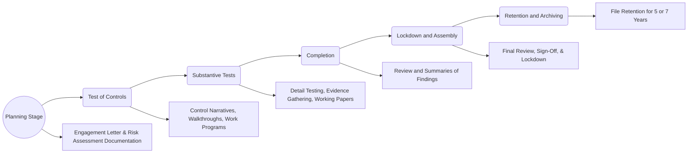

## 8.5 Working Papers and Documentation of Results

Effective audit documentation, often referred to as workpapers, is pivotal in supporting the auditor’s final opinions and conclusions. Properly organized working papers not only demonstrate that the audit was planned and performed in accordance with Generally Accepted Auditing Standards (GAAS) or, when applicable, PCAOB standards, but also serve as a crucial record of the procedures performed and the evidence gathered. This section explores the purpose of audit documentation, the relevant standards, key components, and best practices for workpaper assembly and retention.

---

### 8.5.1 Purpose of Audit Documentation

1. **Proof of Compliance with Auditing Standards**  
   Audit documentation provides clear evidence that the engagement team followed the required professional standards, whether under the AICPA’s GAAS or PCAOB Auditing Standards for public company audits. This proof grants stakeholders confidence in the integrity, rigor, and comprehensiveness of the audit process.

2. **Evidence for the Auditor’s Conclusions**  
   Workpapers compile the detailed testing performed on significant accounts and disclosures, including summaries of findings and any identified misstatements. This documentation substantiates the final opinion on the financial statements, providing a trail of support in case of disputes or regulatory reviews.

3. **Support for Future Audits and Reviews**  
   Proper documentation creates a library of valuable information that auditors can refer to in subsequent audits. When a new engagement team member or a regulator reviews past work, these records help them understand the audit approach, judgments made, and conclusions reached.

4. **Compliance and Legal Protection**  
   In legal and regulatory environments, well-structured and complete documentation underscores the auditor’s diligence and adherence to professional obligations, mitigating legal or regulatory risks.

---

### 8.5.2 Documentation Standards

1. **Clarity and Completeness**  
   According to AICPA AU-C Section 230 (for nonissuers) and PCAOB Auditing Standard AS 1215 (for issuers), workpapers should enable an experienced auditor, with no prior connection to the audit, to understand:
   • The nature, timing, and extent of audit procedures.  
   • The results of audit procedures and the evidence obtained.  
   • The conclusions reached on significant matters, and the reasoned basis for those conclusions.

2. **Use of References, Tick Marks, and Cross-Referencing**  
   • **References:** Each workpaper should be labeled with an identifier (e.g., “A-1,” “B-1,” etc.) and cross-referenced to other relevant workpapers or sections of the audit file.  
   • **Tick Marks:** Auditors use tick marks (symbols with brief notations) consistently to communicate testing details—such as verifying a bank confirmation, agreeing a balance to the general ledger, or tracing a transaction to a supporting document.  
   • **Cross-Referencing:** Detailed cross-referencing ensures the audit file is easy to follow, enabling efficient review and reducing the risk of oversight.

3. **Summaries of Findings and Issues**  
   • **Misstatements:** Document any misstatements or errors discovered, along with the resolution—whether resolved, adjusted, or passed (i.e., not recorded due to immateriality).  
   • **Key Audit Issues:** Highlight significant matters requiring the engagement team’s professional judgment or consultation with experts.

4. **Review Sign-Offs**  
   Signed and dated reviews by senior team members, managers, or engagement partners signify that the work performed was checked for accuracy, completeness, and proper conclusions.

---

### 8.5.3 Assembly and Retention

Audit documentation does not end with identifying and completing necessary procedures. Proper assembly and retention of workpapers are equally critical to maintain compliance and address future inquiries.

1. **Assembly of the Final Audit File**  
   • **Lockdown Period:**  
     - Under AICPA standards, auditors typically have 60 days following the report release date to finalize (or “lock down”) their workpapers.  
     - Under PCAOB standards, the lockdown period is typically 45 days.  
   • **Protecting the Audited File:** Once locked, workpapers cannot be modified except through properly documented addendums or subsequent event memos.

2. **Record Retention Requirements**  
   • **Nonissuers (Private Companies):** AICPA standards generally require a minimum five-year retention period.  
   • **Issuers (Public Companies):** PCAOB standards mandate a minimum seven-year retention period.  
   • **Regulatory Inspections:** During periodic inspections or peer reviews, regulators and professional bodies may request a review of your workpapers within these retention windows.

3. **Electronic vs. Physical Files**  
   • **Electronic Workpapers:**  
     - Often stored in secure audit software or cloud-based platforms with built-in indexing, cross-referencing, and version control.  
     - Require rigorous backup protocols and cybersecurity measures.  
   • **Physical Workpapers:**  
     - Must be securely stored to prevent unauthorized access or deterioration.  
     - Require organized indexing and an effective method for retrieving older engagements.

---

### Diagram: Audit Documentation Workflow

Below is a mermaid diagram illustrating the basic workflow of audit documentation:

**Key Takeaways from the Diagram**  
• Documentation begins at the planning stage (risk assessment and preliminary procedures).  
• Workpapers are heavily employed during tests of controls and substantive testing.  
• Completion involves final reviews, the creation of summaries, and concluding on audit findings.  
• Once locked down, the final file is archived to meet retention requirements.

---

### 8.5.4 Best Practices for Effective Working Papers

1. **Establish a Consistent File Organization**  
   Agree on internal file naming conventions and referencing procedures at the engagement onset.

2. **Leverage Technology**  
   Use electronic document management systems that integrate with major accounting packages and facilitate data analytics, version tracking, and quick referencing.

3. **Review Workpapers Early and Often**  
   Encourage timely reviews at each stage, reducing last-minute issues during final assembly.

4. **Use Summaries Wisely**  
   Summaries should highlight critical findings, significant judgments, and the impact on the overall opinion or conclusion.

5. **Documentation of Conclusions**  
   Clearly articulate how you arrived at key judgments and opinions, especially for complex areas like fair value estimates, revenue recognition, and contingencies.

---

### Glossary

• **Workpapers (Audit Documentation):** The record of procedures performed, relevant evidence obtained, and conclusions reached.  
• **Retention Period:** The length of time for preserving audit documentation in accordance with professional and regulatory requirements.  
• **Lockdown:** The date by which an auditor must finalize and assemble the audit file so that no unauthorized or undocumented changes can be made.

---

### References and Resources

• **Official References**  
  – [AU-C Section 230](https://www.aicpa.org/research/standards/auditattest/clarifiedsas.html) – Audit Documentation (AICPA).  
  – [PCAOB Auditing Standard AS 1215](https://pcaobus.org/oversight/standards/auditing-standards) – Audit Documentation (For issuers).  

• **Additional Resources**  
  – “Audit Documentation Best Practices” by the AICPA, providing real-world examples of effective citing and cross-referencing.  
  – Various practice aids from professional accounting bodies on indexing and cross-referencing in electronic workpaper systems.  

---

## Working Papers and Documentation Quiz



### What is the primary purpose of working papers in an audit engagement?

- [x] To provide evidence that the audit was conducted in compliance with GAAS or PCAOB standards.
- [ ] To maintain client records for internal management purposes.
- [ ] To ensure regulators have access to the company’s financial statements.
- [ ] To eliminate the need for final audit review by the engagement partner.

> **Explanation:** Working papers serve as the foundation for demonstrating that the auditor planned and performed the audit in accordance with professional standards, while supporting the auditor’s conclusions.

### Which of the following best represents a proper characteristic of audit documentation?

- [x] It should allow an experienced auditor with no prior connection to understand the work performed.
- [ ] It should only include key financial statement balances.
- [ ] It should be sealed and only opened during litigation.
- [ ] It should be destroyed immediately after the client’s fiscal year-end.

> **Explanation:** Audit documentation must be sufficiently detailed and clear so that an experienced auditor can comprehend the nature, timing, extent of audit procedures and the findings.

### Under PCAOB standards, how many years must audit documentation generally be retained for issuers (public companies)?

- [ ] 1 year
- [ ] 3 years
- [x] 7 years
- [ ] 10 years

> **Explanation:** PCAOB standards require a seven-year retention period for audit workpapers related to public-company audits.

### What is the purpose of the “lockdown” period in audit documentation?

- [x] To finalize the audit file after the report release date and prevent unauthorized modifications.
- [ ] To ensure auditor independence is not compromised.
- [ ] To allow the client to make final changes to the financial statements.
- [ ] To discard all evidence used in the audit.

> **Explanation:** The lockdown date fixes the audit file so no further changes can be made without proper addendums, preserving the integrity of the audit documentation.

### Which of the following is a best practice for referencing workpapers?

- [x] Consistently labeling workpapers and using cross-references to connect related testing.
- [ ] Relying on memory to recall audits performed.
- [x] Using tick marks in multiple contradictory ways on a single workpaper.
- [ ] Leaving references blank until the final stage.

> **Explanation:** A consistent labeling system and thorough cross-referencing help reviewers follow the auditor’s work efficiently.

### What are tick marks in audit documentation typically used for?

- [x] Symbolic notations indicating specific audit procedures performed on each item tested.
- [ ] To lock the file from further revisions.
- [ ] To serve as official sign-offs for each workpaper.
- [ ] For regulatory authorities to indicate compliance.

> **Explanation:** Tick marks are visual symbols that indicate the nature of the work performed, referencing a legend or key to explain details of testing.

### Which of the following statements is true regarding nonissuer audit documentation under AICPA standards?

- [x] The standard retention period is at least five years.
- [ ] There is no mandated retention period.
- [x] The standard retention period is two years if the client is small.
- [ ] The standard retention period is seven years.

> **Explanation:** For audits of nonissuers, AICPA requires workpapers be kept for a minimum of five years.

### Why is early and continuous review of audit workpapers considered a best practice?

- [x] It helps identify and correct errors or omissions before the final assembly.
- [ ] It allows for immediate archiving on the first day of the audit.
- [ ] It replaces the need for a final review.
- [ ] It assures that no cross-referencing is required.

> **Explanation:** Conducting reviews in real-time or soon after work is completed reduces the risk of undiscovered errors and fosters efficiency.

### In an electronic audit documentation environment, what is a primary advantage over paper-based systems?

- [x] Built-in indexing and advanced cross-referencing capabilities.
- [ ] A complete lack of security risk.
- [ ] The elimination of the need for retention policies.
- [ ] Standard tick marks become unnecessary.

> **Explanation:** Electronic audit management systems enable version control, advanced search, and integrated referencing, streamlining the review process.

### True or False: Once the workpapers are locked down, they can never be modified again.

- [x] True
- [ ] False

> **Explanation:** After lockdown, the audit file is generally sealed; however, any additional information or changes typically must be documented via an addendum to ensure transparency.



---

## For Additional Practice and Deeper Preparation

**[Auditing & Attestation CPA Mock Exams (AUD): Comprehensive Prep](https://www.udemy.com/course/aud-cpa-mock-exams/?referralCode=D064EF7BD4A84FC6403D)**  
• Tackle full-length mock exams designed to mirror real AUD questions—from risk assessment and ethics to internal control and substantive procedures.  
• Refine your exam-day strategies with detailed, step-by-step solutions for every scenario.  
• Explore in-depth rationales that reinforce understanding of higher-level concepts, giving you a decisive edge on test day.  
• Boost confidence and reduce exam anxiety by building mastery of the wide-ranging AUD blueprint.

_Disclaimer: This course is not endorsed by or affiliated with the AICPA, NASBA, or any official CPA Examination authority. All content is created solely for educational and preparatory purposes._
