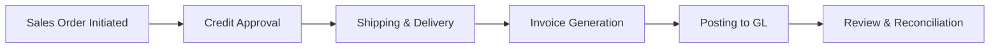

## 9.1 Performing Walkthroughs, Reperformance, and Inspection

Thorough testing of internal controls involves a range of procedures that enable auditors to gain assurance about the design and operating effectiveness of a client’s control environment. Walkthroughs, reperformance, and inspection are three cornerstone techniques used to validate whether each control is functioning as intended. When applied strategically, these methods provide valuable insights into potential weaknesses or areas that require further attention.

This section explores each of these procedures in detail, offering a step-by-step approach, illustrative examples, best practices, and common pitfalls. Whether you’re testing manual controls, automated controls, or hybrid processes, mastering these techniques is essential to ensuring an audit’s quality and reliability.

---

## The Importance of Control Testing

Before diving into the specifics of walkthroughs, reperformance, and inspection, it’s worth reiterating why control testing is integral to the overall audit strategy. As discussed in previous chapters (see Chapter 5: Internal Control Concepts and Frameworks and Chapter 9: Internal Control Testing and Evaluation overview), auditors rely on internal controls to mitigate risk and ensure financial statement integrity. Testing these controls helps:

• Identify areas where the possibility of misstatement is higher.  
• Evaluate whether reliance on homegrown or automated systems is justified.  
• Provide the foundation for assessing the risk of material misstatement at the assertion level.  
• Offer valuable insights to management on the effectiveness and efficiency of existing controls.  

When auditors can rely on these controls, they may reduce the amount of substantive testing required, creating efficiencies in the audit process.

---

## Walkthroughs

### Definition and Purpose

A walkthrough involves selecting a single transaction (or a small subset of transactions) within a specific process (e.g., sales, purchasing, payroll) and tracing it from inception to conclusion. This end-to-end review typically covers the following checkpoints:

• How the transaction is initiated (e.g., sales order placed, purchase order released).  
• Any supporting documentation required (e.g., invoices, contracts).  
• Authorization and approval points.  
• Record-keeping within the accounting system.  
• Reconciliations, adjustments, and ultimate recording in the general ledger.

Walkthroughs validate both the design effectiveness and⁠—if performed thoroughly⁠—the operating effectiveness of the controls. Often, an auditor will start using walkthroughs during the planning phase to gain a comprehensive understanding of processes and identify potential gaps.

### Process

1. Select a Transaction: Pick a representative sample transaction (or sometimes two or three) from the process you are evaluating.  
2. Document Blueprint: Obtain the client’s narrative or flowchart describing the process, if available.  
3. Trace the Transaction: Follow the transaction step-by-step, observing and verifying each control activity in action.  
4. Inquire and Observe: Ask questions of employees performing each step, and observe how tasks are accomplished (e.g., check that an approval signature is present).  
5. Confirm Accuracy: Compare recorded data with source documents to ensure accuracy and proper authorization.  
6. Evaluate Gaps: Identify any control breakdowns, missing approvals, or misalignment with policy.  

### Example Walkthrough Scenario

Imagine you are auditing a manufacturing company’s sales cycle. You might:

• Pick a random sales order from the system.  
• Confirm it was initiated by an authorized sales representative.  
• Check the credit approval step to see if it aligns with company policy.  
• Observe if the necessary shipping documents are attached to confirm the product was dispatched to the customer.  
• Confirm the invoice was generated and matched against the shipping information, then posted to the client’s general ledger.  

Below is a simple Mermaid diagram illustrating a high-level flow for a sales order walkthrough:

### Best Practices and Pitfalls

• **Keep It Representative**: Select transactions that truly represent normal, infrequent, and large/unusual items if they exist.  
• **Balance Inquiry With Evidence**: In addition to talking with staff, always check the underlying documentation.  
• **Watch for Automation**: If part of the process is automated, verify IT controls are also functioning as described.  
• **Pitfall**: Over-relying on staff explanations without verifying documentary or system-based evidence.  

---

## Reperformance

### Definition and Purpose

Reperformance is the process of the auditor manually re-executing or re-calculating a control procedure to determine whether it produces the same result that the client obtained. This is especially crucial for calculation-based or system-based controls, such as discount calculations, interest accruals, or the matching of purchase orders.

### Process

1. Identify the Control: Pinpoint the specific control to be tested (e.g., an automated discount calculation in an invoicing system).  
2. Gather Inputs: Obtain the necessary inputs used by the control, such as rate tables or discount thresholds.  
3. Manually (or Using Audit Software) Recompute the Result: Calculate the expected outcome independently.  
4. Compare Results: Evaluate any discrepancy between the auditor’s result and the client’s recorded result.  
5. Investigate Variances: If material differences exist, determine if this indicates a control failure or an input error (e.g., incorrect discount rate or data entry).  

### Example Reperformance Scenario

If you are auditing the accounts payable process, you may re-perform the three-way match calculation:

• Take the purchase order, receiving report, and vendor invoice.  
• Verify that the quantities match, that the purchase price aligns with the purchase order, and that the totals are properly reflected in the invoice.  
• Compare your manually calculated total with what was recorded in the system.  

### Best Practices and Pitfalls

• **Proper Inputs**: Ensure the raw data, parameter tables, or systems you use mirror the actual environment.  
• **Tools and Technology**: Consider using data analytics tools to rapidly re-calculate millions of records.  
• **Pitfall**: Assuming a minor discrepancy is trivial. Even minor computational differences might signal a larger control or configuration issue.  

---

## Inspection

### Definition and Purpose

Inspection, in the context of control testing, involves examining documents, records, or assets for evidence that a control was performed. This may include looking for a manager’s authorization signature, a date stamp on a bank reconciliation, or verifying system audit logs showing that a scheduled job was successfully executed.

### Process

1. Identify the Evidence: Determine which documents or logs (physical or electronic) you need to examine.  
2. Inspect for Indications of Control Execution: Look for approval signatures, time stamps, or system event logs.  
3. Corroborate with Other Evidence: If needed, verify that the person who signed off had the authority and that the date/time is consistent with policy.  
4. Assess Completeness: Confirm whether the documentation or record inspection covers all relevant control steps.  

### Example Inspection Scenario

– **Automated Control**: Suppose your client’s accounting software logs each user login, including attempts to override system approvals. You might inspect these logs to confirm only authorized individuals accessed the override function, and no unauthorized changes were made.  
– **Manual Control**: If the company policy requires manager approvals for purchases over $5,000, you might inspect purchase orders to verify each had the required signature and date.

### Best Practices and Pitfalls

• **Sufficiency of Document Population**: Review enough documents to draw a reasonable conclusion about control performance.  
• **Consider Sampling**: If the volume is large, employ a sampling strategy (see Chapter 8: Audit Sampling and Engagement Efficiency).  
• **Pitfall**: Stopping after finding one or two documents that seem correct. Thorough inspection demands a representative set of evidence to confirm consistent control operation.  

---

## Combining and Optimizing Testing Approaches

In practice, walkthroughs, reperformance, and inspection rarely function in isolation. Auditors often use a combination of these methods for robust control testing. For instance, you might start with a walkthrough to understand the process, then use reperformance to test recurrent or high-risk calculations. Inspection can then round out these methods by verifying the consistent application of manual controls.  

When deciding on the mix of procedures, consider:  
• The overall risk of material misstatement.  
• The nature and complexity of the control.  
• The existence of automated versus manual steps.  
• Any identified control deficiencies from previous audits.  

---

## Additional Considerations for IT Controls

As organizations increasingly rely on automation, testing IT general controls (ITGCs) and application controls can be paramount. While the principles of walkthroughs, reperformance, and inspection apply to IT controls, auditors may need specialized skill sets—for instance, knowledge of operating systems, databases, or cybersecurity measures. Commonly, inspection of system configurations, access logs, and security reports is critical to evaluate whether an automated control truly operates as intended.

---

## References and Resources

• **Official References**  
  – [AU-C Section 330](https://www.aicpa.org/research/standards/auditattest/clarifiedsas.html) – Performing Audit Procedures in Response to Assessed Risks.  

• **Additional Resources**  
  – “Practical Approaches to Testing Automated Controls” from AICPA.  
  – The Institute of Internal Auditors (IIA) resources for internal audit approaches.  
  – Chapter 8: “Audit Sampling and Engagement Efficiency” for guidance on representative sampling techniques.  

---

## Mastering Walkthroughs, Reperformance, and Inspection Quiz



### Walkthroughs are best described as:
- [x] Tracing a transaction from inception to recording to verify that each control has been applied.  
- [ ] Selecting multiple transactions for thorough testing to verify all transactions in a period.  
- [ ] Recalculating the client’s computations for accuracy.  
- [ ] Observing management at board meetings to ensure governance.  

> **Explanation:** Walkthroughs involve selecting one or a small number of transactions and following their path through the system to confirm that each control is working as described.

### Which of the following statements about reperformance is most accurate?
- [ ] It is only used for IT controls.  
- [x] It involves manually replicating a client’s control procedure to verify the outcome.  
- [ ] It is mainly a qualitative approach relying on staff interviews.  
- [ ] It can only be performed using specialized audit software.  

> **Explanation:** Reperformance requires the auditor to replicate a procedure to confirm the results match the client’s, demonstrating the control’s effectiveness.

### During a walkthrough of the payroll cycle, which of the following would the auditor most likely verify?
- [x] Authorization of timecards and matching them to the personnel department’s records.  
- [ ] The total number of checks issued in the prior month.  
- [ ] The depreciation calculation used for a fixed-asset write-down.  
- [ ] The net interest earned from short-term investments.  

> **Explanation:** The most relevant control to verify in a payroll walkthrough is ensuring each timecard is authorized and reconciled.

### Inspection typically:
- [ ] Involves recasting the client’s financial statements.  
- [x] Refers to examining documents for evidence that a control was carried out.  
- [ ] Entails making inquiries of senior management regarding control design.  
- [ ] Focuses on detecting fraud exclusively in treasury operations.  

> **Explanation:** Inspection, in a control-testing context, focuses on verifying documentary evidence—such as signatures or timestamps—that demonstrate control operation.

### If an auditor re-performs a three-way match between a purchase order, receiving report, and invoice, the auditor is primarily testing:
- [x] A manual control.  
- [ ] A governance control.  
- [x] A process control preventing errors in expense recognition.  
- [ ] A control unrelated to financial reporting.  

> **Explanation:** The three-way match controls expense recognition and authorization; it may be manual or partly automated, but the essence of the test is verifying the process control is working to detect errors.

### A walkthrough can serve as a test of operating effectiveness if:
- [x] It is comprehensive and the auditor directly observes each control activity.  
- [ ] Management states it is fully operational for all transactions.  
- [ ] The internal audit department performed it last year.  
- [ ] The client’s software automatically flags errors.  

> **Explanation:** A well-documented, substantive walkthrough that observes each control in real time can also validate operating effectiveness.

### Which of the following is crucial when performing inspection in an electronic environment?
- [x] Reviewing system-generated audit logs or configuration settings.  
- [ ] Reviewing only printed copies of invoices.  
- [x] Confirming the IT environment has a disaster recovery plan.  
- [ ] Interviewing every user on the system’s layout.  

> **Explanation:** When controls are automated, it’s often necessary to inspect electronic logs, reports, and configuration settings to confirm controls are operating as intended.

### One of the main advantages of reperformance over observation is:
- [x] The auditor independently executes the control, reducing reliance on client demonstrations.  
- [ ] The auditor relies on the client’s prior-year test results.  
- [ ] It eliminates the need for audit documentation.  
- [ ] It ensures no additional substantive testing is needed.  

> **Explanation:** Reperformance allows the auditor to verify the outcome of a control directly, providing more robust evidence of effectiveness.

### When selecting documents for inspection of approvals, an auditor should:
- [x] Use a sampling method that reflects the overall risk associated with the transaction class.  
- [ ] Only inspect documents from the first week of each quarter.  
- [ ] Rely on the client’s internal audit samples.  
- [ ] Check only the largest transactions, ignoring smaller ones.  

> **Explanation:** A risk-based or statistically appropriate sampling approach ensures the auditor can draw valid conclusions about control effectiveness across the population.

### True or False: A single walkthrough, by itself, always provides sufficient evidence to conclude on the operating effectiveness of a control.
- [x] False  
- [ ] True  

> **Explanation:** While a walkthrough can provide strong evidence, especially if comprehensive, relying solely on one walkthrough is generally insufficient to conclude on operating effectiveness for all transactions over the entire period.



---

## For Additional Practice and Deeper Preparation

**[Auditing & Attestation CPA Mock Exams (AUD): Comprehensive Prep](https://www.udemy.com/course/aud-cpa-mock-exams/?referralCode=D064EF7BD4A84FC6403D)**  
• Tackle full-length mock exams designed to mirror real AUD questions—from risk assessment and ethics to internal control and substantive procedures.  
• Refine your exam-day strategies with detailed, step-by-step solutions for every scenario.  
• Explore in-depth rationales that reinforce understanding of higher-level concepts, giving you a decisive edge on test day.  
• Boost confidence and reduce exam anxiety by building mastery of the wide-ranging AUD blueprint.

_Disclaimer: This course is not endorsed by or affiliated with the AICPA, NASBA, or any official CPA Examination authority. All content is created solely for educational and preparatory purposes._
