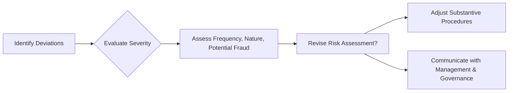

## 9.2 Assessing Deviations and Impact on Risk Assessment

As part of testing and evaluating internal controls (discussed in Chapter 9), auditors often encounter instances where controls do not operate as intended. These lapses are called "deviations." Understanding how to identify, investigate, classify, and respond to deviations is essential to refining the overall audit strategy. This section explores the significance of control deviations, how auditors weigh their severity, and how deviations ultimately shape the assessment of audit risk.

---

## Identifying Deviations

A “deviation” arises when a control procedure is not performed or is improperly executed. At the most basic level, if a process requires dual authorization but only one signature is observed, this is a clear deviation. Deviations can take many forms:

• Missing approvals or insufficient documentation.  
• Incomplete data fields during transaction processing.  
• Manual overrides of key system controls.  
• Evidence that certain control steps are consistently skipped (e.g., no timely reconciliations).  

These deviations can be isolated or occur repeatedly. An isolated instance might reflect a minor oversight, whereas multiple deviations in a small sample may indicate systemic weaknesses. Regardless of scope, each identified deviation compels the auditor to question whether the tested control is truly effective.

### Practical Example: Missing Purchase Order Signature

Consider an auditor reviewing a sample of 30 purchase orders (POs) to test proper authorization. Suppose the auditor discovers three POs missing the required signature of the approving manager. This shortfall indicates some level of control deficiency. The auditor must investigate whether this is a frequent occurrence, who is responsible, and whether any fundamental process or training gap exists.

---

## Evaluating Severity

The severity of a deviation is shaped by both its qualitative and quantitative characteristics. Certain deviations may appear minor at first glance yet signal deeper control challenges when combined with additional evidence.

1. **Quantitative Factors (Frequency and Volume)**  
   – A single missing authorization in 30 transactions might be less concerning than five missing authorizations within the same sample size.  
   – High frequency or large error amounts suggest a higher level of control risk.

2. **Qualitative Factors (Nature and Circumstances)**  
   – Deviations involving management overrides can suggest a serious ethical or cultural concern.  
   – Repeated system overrides or consistent “workarounds” to bypass controls indicate potential pervasive issues.  
   – One instance of missing “review” in a large dataset might indicate a simple oversight, but multiple repeated lapses may reflect a systemic training or monitoring deficiency.

3. **Potential Impact on Financial Statements**  
   – If the deviated control is designed to prevent material misstatements in high-risk areas (e.g., revenue recognition), even a single failure could be significant.  
   – Conversely, if the control relates to a relatively low-risk process, a deviation may be less material.

#### Clerical vs. Systemic Failures

It is critical to discern whether the deviation is an isolated error due to human oversight or an inherent flaw in the control system. For instance, discovering one incorrectly recorded sales transaction could be clerical; however, if multiple employees have bypassed the sales approval step to speed up shipments at month-end, the issue is systemic and signals a broader compliance or cultural problem within the organization.

---

## Nature of Deviations

### 1. Clerical and Training Errors

Some deviations arise because employees do not follow instructions accurately or are insufficiently trained. For instance, staff might not understand the importance of uploading all required supporting documents into the system. Such issues often point to a need for additional training or improved documentation.

### 2. IT Malfunctions

In certain cases, software errors lead to incorrect or incomplete data capture. If a system fails to require a password re-entry for high-value transactions, the control is effectively circumvented. Identifying such an IT-related deviation triggers both deeper IT testing and potential remediation steps by the client’s IT department.

### 3. Management Override or Misconduct

These deviations are the most concerning. When management personnel override established controls—for instance, bypassing an approval process for personal gain—the potential for fraud elevates. Such overriding signals a breakdown in the control environment and often warrants significant additional audit work, including extended substantive testing.

---

## Impact on Risk Assessment

Auditing standards emphasize that risk assessment is an ongoing process. When deviations surface or their severity increases, the auditor must re-evaluate and potentially revise the planned approach.

1. **Revising the Audit Plan**  
   – The auditor may need to increase the extent of substantive testing if controls appear less reliable than initially anticipated.  
   – The timing of testing may change: More interim testing or year-end testing might be required.  
   – Testing might expand to additional locations or business units if the deviation is suspected to be widespread.

2. **Discussing With Management and Governance**  
   – Material or pervasive control failures often require communication with senior management and those charged with governance (such as the audit committee).  
   – These discussions may prompt management to reinforce training, adjust control procedures, or implement technology solutions.

3. **Entity-Level Impact**  
   – Certain deviations could reflect a broader organizational issue, such as a weak control environment or lax tone at the top.  
   – Auditors should consider how these deficiencies may affect other aspects of financial reporting, raising the overall assessment of engagement risk.

### Mermaid Diagram: Iterative Risk Assessment with Deviations

Below is a simple mermaid diagram illustrating how control deviations feed into the iterative risk assessment process:

As shown, the process is not a one-time event. Any time deviations are discovered, the auditor evaluates them and decides if risk assessments need updating. This may lead to expanded testing, changes in audit approach, and more rigorous communication protocols.

---

## Glossary

• **Deviation**: An instance where the expected control procedure was not performed, was bypassed, or did not operate as designed.  
• **Systemic Failure**: A control deficiency indicating widespread issues, potentially affecting numerous transactions or departments.  
• **Isolated Failure**: A situation in which a small number of deviations appear unique or infrequent.  
• **Iteration of Risk Assessment**: The recognition that reevaluating risk is a continuous activity that evolves as new evidence emerges during the audit.

---

## References and Resources

### Official References
• [AU-C Section 265](https://www.aicpa.org/research/standards/auditattest/clarifiedsas.html) – Communicating Internal Control Related Matters Identified in an Audit.

### Additional Resources
• PCAOB inspection reports often highlight frequent control shortcomings related to authorization, documentation, and IT controls. Reviewing these reports can help auditors anticipate common pitfalls and develop robust testing strategies.

---

## SEO-Optimized Quiz: Internal Control Deviations and Audit Risk Assessment



### Which of the following best defines a "deviation" in the context of an audit?

- [ ] Any issue during testing that does not align with management’s budget.
- [ ] A typographical error in the auditor’s working papers.
- [x] An instance where the expected control procedure was not performed as designed.
- [ ] The use of an unapproved method for financial reporting.

> **Explanation:** A “deviation” occurs when the expected control—such as requiring specific approvals—was bypassed or did not operate as intended.

### If several deviations of a key control occur frequently in a small sample, which of the following actions is most appropriate?

- [ ] Conclude that the control is probably effective because the sample was too small.
- [x] Reassess the control’s effectiveness and consider increasing substantive testing.
- [ ] Immediately discontinue the audit.
- [ ] Ignore the deviations and complete the same planned procedures.

> **Explanation:** Frequent deviations in a small sample indicate a potentially systemic control deficiency. The auditor should re-evaluate risk and potentially expand substantive procedures.

### Why might a single instance of a missing authorization carry more significance in a higher-risk transaction area?

- [x] Because even an isolated deviation can lead to a material misstatement when inherent risk is high.
- [ ] Because missing authorizations only matter in low-risk areas.
- [ ] Because external auditors seldom test such transactions.
- [ ] Because internal controls are stronger for low-risk accounts.

> **Explanation:** When a control deviation occurs in a high-risk or material area, the potential impact on the financial statements increases, hence the deviation's importance escalates.

### When an auditor notices repeated management overrides of established controls, what is the primary concern?

- [ ] Clerical errors in a manual process.
- [x] Possible fraud or severe weakness in the control environment.
- [ ] A recovered system malfunction.
- [ ] Overstated compliance with training documentation.

> **Explanation:** Management override is particularly concerning because it may indicate the potential for fraud or serious weaknesses in the control culture of the organization.

### What would be the most likely outcome if an auditor’s tests of controls reveal multiple deviations in the approvals for a high-volume purchasing cycle?

- [x] The auditor may decide to expand substantive testing procedures.
- [ ] The auditor will automatically issue a disclaimer of opinion.
- [x] The auditor will likely communicate the findings to management and possibly those charged with governance.
- [ ] The auditor must re-perform all transactions in the entire cycle.

> **Explanation:** Multiple deviations suggest that reliance on the control is questionable, prompting increased substantive work and immediate communication with management or governance. A disclaimer of opinion is not automatic unless pervasive, severe limitations on the scope of the audit exist.

### What is a key consideration when deciding whether a deviation is isolated or systemic?

- [ ] The management letter from the previous period.
- [x] Whether the problem recurs frequently and relates to process-level or entity-level controls.
- [ ] That the auditor does not need to reassess materiality if it is a one-time event.
- [ ] The budget for control development set by management.

> **Explanation:** Distinguishing between an isolated lapse versus a widespread pattern involves examining recurrence, breadth of impact, and the control environment at both the process and entity levels.

### When management is informed of a material deviation, which of the following next steps might the auditor recommend?

- [ ] Immediately replace the entire management team.
- [x] Implement targeted training, additional oversight controls, or IT system upgrades.
- [x] Perform an in-depth investigation into the cause of the deviation.
- [ ] Finalize the report without any further adjustments or disclosures.

> **Explanation:** Material deviations often point to deeper issues in the control framework. Management may need to adopt corrective actions—be it training, additional oversight, or technology fixes—to remediate the control weakness.

### Which statement is most accurate about "risk assessment" during an audit?

- [x] It is an iterative process, and findings such as control deviations can change planned audit procedures.
- [ ] It is performed only once at the beginning of an audit.
- [ ] It does not factor in new evidence discovered during testing.
- [ ] It is unnecessary if controls were deemed effective in the prior year.

> **Explanation:** Risk assessment is continuous and responsive to new evidence. Deviations, fraud indicators, or unexpected findings prompt reassessment of inherent and control risks throughout the audit.

### Which of the following is an example of a clerical deviation?

- [x] A staff member who forgets to record a signature on a purchase requisition form.
- [ ] Repeated, purposeful override of system controls by senior management.
- [ ] Unexplained large adjustments to revenue at quarter-end.
- [ ] An intentional misstatement of closing inventory.

> **Explanation:** Clerical deviations often relate to minor oversights or user errors, such as forgetting a signature. Intentional, repeated override or large misstatements typically indicate more serious issues, often linked to fraud or systemic failures.

### A high rate of control deviations in crucial areas generally leads to which outcome?

- [x] True
- [ ] False

> **Explanation:** A high rate of crucial control deviations generally compels the auditor to increase substantive testing, expand the sample, and possibly modify the audit approach. It indicates reduced reliance on controls and heightened overall risk.



---

## For Additional Practice and Deeper Preparation

**[Auditing & Attestation CPA Mock Exams (AUD): Comprehensive Prep](https://www.udemy.com/course/aud-cpa-mock-exams/?referralCode=D064EF7BD4A84FC6403D)**  
• Tackle full-length mock exams designed to mirror real AUD questions—from risk assessment and ethics to internal control and substantive procedures.  
• Refine your exam-day strategies with detailed, step-by-step solutions for every scenario.  
• Explore in-depth rationales that reinforce understanding of higher-level concepts, giving you a decisive edge on test day.  
• Boost confidence and reduce exam anxiety by building mastery of the wide-ranging AUD blueprint.

_Disclaimer: This course is not endorsed by or affiliated with the AICPA, NASBA, or any official CPA Examination authority. All content is created solely for educational and preparatory purposes._
