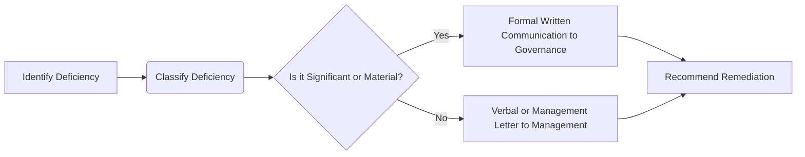

## 9.3 Communicating Deficiencies to Management and Those Charged with Governance

The process of communicating deficiencies in internal control is a critical element of an audit engagement. When areas of control risk are identified—ranging in severity from minor process weaknesses to major flaws indicating the risk of material misstatement—external auditors must formally communicate these findings to both management and those charged with governance (e.g., the board of directors or the audit committee). This communication is essential for ensuring that decision-makers can take responsibility for rectifying issues and strengthening the overall control environment.

This section explores the various categories of control deficiencies, the auditor’s responsibility in classifying and reporting them, and strategies for effective communication and remediation recommendations.

---

## Classifying Control Issues

Internal control deficiencies are categorized based on their severity and potential impact on financial reporting. Understanding these classifications helps the auditor determine the appropriate urgency and form of communication.

### Deficiency in Internal Control

A deficiency in internal control arises when a control is either not designed or not operating effectively to achieve its intended objective. Such deficiencies can result in misstatements if they are not addressed promptly. However, not all deficiencies carry the same level of severity; they vary depending on the magnitude of the financial impact and the likelihood of material misstatement.

• Design deficiency: Occurs when a control is missing or not designed to meet its objective.  
• Operating deficiency: Exists when a properly designed control fails to operate as intended or is performed by an individual lacking the necessary authority or qualifications.

### Significant Deficiency

A significant deficiency is one that is less severe than a material weakness but significant enough to merit attention by those charged with governance. It indicates that the deficiency could adversely affect the entity’s ability to report financial data reliably, though it might not be probable or severe enough to lead to a material misstatement on its own. Nevertheless, auditors must highlight these issues to governance so that they can be addressed before they escalate.

### Material Weakness

A material weakness is the most severe classification of internal control deficiency. It creates a reasonable possibility that a material misstatement of the entity’s financial statements will not be prevented or detected and corrected on a timely basis. The presence of one or more material weaknesses requires a serious conversation with those charged with governance, as it significantly undermines confidence in the accuracy and reliability of the financial statements.

---

## Timing and Form of Communication

Auditors are required to keep both management and those charged with governance informed about the internal control issues identified during the audit. Formal guidelines such as [AU-C Section 265](https://www.aicpa.org/research/standards/auditattest/clarifiedsas.html) and [PCAOB AS 1305](https://pcaobus.org/oversight/standards/auditing-standards) stipulate how and when these communications should occur.

• Written vs. oral communication:  
  – Significant deficiencies and material weaknesses must be communicated in writing.  
  – Less critical issues, such as minor operational improvements, can be relayed orally or through a management letter.

• Timeliness:  
  – Auditors typically provide a written communication on significant deficiencies and material weaknesses by or on the audit report date.  
  – Prompt communication fosters timely corrective actions.

### Formal Written Reports

For significant deficiencies and material weaknesses, formal written communication is not optional. These communications often take the form of a letter addressed to management and those charged with governance, outlining:

1. A description of the issue, including when and how it was identified.  
2. The potential implications for financial reporting.  
3. Recommendations for strengthening the controls.  

### Management Letters

A management letter is a commonly used tool for communicating less severe or operational issues that do not qualify as a significant deficiency or a material weakness. Management letters can detail process enhancements, resource allocations, or best-practice tips aimed at bolstering the control environment. Importantly, management letters do not serve as substitutes for the mandatory written reports disclosing significant or material issues.

---

## Recommendations for Remediation

Auditors are in a unique position to provide best-practice advice, informed by their knowledge of the organization and by industry benchmarks. While the auditor’s scope does not include designing or implementing controls, offering suggestions can help management and governance address identified deficiencies effectively.

• Supervisory Reviews: More frequent and thorough reviews by supervisors or managers can mitigate risks where control duties are delegated to less experienced staff.  
• Software Upgrades and Automation: Investing in reliable, integrated systems can reduce manual tasks prone to human error.  
• Policy and Process Changes: Clearly documented and enforced policies create a stable framework to guide employees.  
• Training and Development: Continual staff education ensures that controls are implemented consistently and with a proper understanding of their objectives.

> Note: Although auditors are encouraged to provide remediation suggestions, it remains the responsibility of management and governance to decide and execute the optimal course of action.

---

## Practical Example: A Case Study on Remediation

Suppose an auditor identifies that monthly account reconciliations in the accounts payable department are consistently performed late or sometimes skipped altogether. The deficiency is assessed as a potential significant deficiency because it increases the risk that vendor overpayments or fraudulent transactions could go undetected.

1. Classification:  
   – The deficiency is not necessarily a material weakness yet, but it could escalate if left unaddressed.  
2. Communication:  
   – The auditor writes up the issue in a formal letter to management and those charged with governance, stressing the importance of timely reconciliations.  
3. Recommendation:  
   – The auditor suggests implementing an automated tool that triggers alerts for incomplete reconciliations and sets stricter supervisory checks.  
4. Remediation:  
   – Management institutes a new policy requiring reconciliation sign-off by the 10th of each month, and sets up weekly alerts in the accounting software.

Through this proactive approach, the entity strengthens its accounts payable process and reduces the risk of misstatements linked to missed or delayed reconciliations.

---

## Visual Overview: Deficiency Identification and Communication Process

Below is a Mermaid.js diagram illustrating a high-level overview of how auditors typically identify, classify, and communicate control deficiencies:

1. Identify Deficiency: Occurs during testing of internal controls and walkthroughs.  
2. Classify Deficiency: The auditor evaluates severity (significant deficiency or material weakness).  
3. Communicate Deficiency: Critical issues warrant a formal written approach; minor findings may only require verbal or management letter communication.  
4. Recommend Remediation: Although implementing solutions is management’s responsibility, auditors provide best-practice insights.

---

## Best Practices, Common Pitfalls, and Strategies for Success

• Best Practices:  
  – Adopt a clear, consistent procedure for evaluating the severity of each deficiency identified.  
  – Maintain open lines of communication with management, ensuring they understand the significance of each issue early in the audit process.  
  – Provide a balanced tone in formal communications by highlighting both strengths and areas for improvement.

• Common Pitfalls:  
  – Delaying communication, only to issue findings at the end of the audit. This can lead to rushed responses and partial fixes.  
  – Overlooking the importance of describing the root causes and potential impacts in written reports. Vague descriptions diminish the clarity and urgency required for remediation.  
  – Confusing “suggestions” with “requirements.” Auditors should make it clear that the entity itself is ultimately responsible for determining its response.

• Strategies to Overcome Challenges:  
  – Leverage continuous auditing technologies and data analytics to pinpoint control issues in real time.  
  – Regularly revisit and update the deficiency classification framework to account for evolving business risks.  
  – Encourage collaborative discussions among the audit committee, management, and the internal audit function to expedite sustainable solutions.

---

## Glossary

• Significant Deficiency: A control deficiency with potential to affect financial reporting but not to the extent of a material weakness.  
• Material Weakness: A grave control deficiency in which there's a reasonable possibility that a material misstatement of the financials may go undetected or uncorrected.  
• Management Letter: An informal letter to management containing recommendations for improvements in areas that do not warrant a formal written communication to those charged with governance.

---

## References and Resources

• **Official References**  
  – [AU-C Section 265](https://www.aicpa.org/research/standards/auditattest/clarifiedsas.html): Communicating Internal Control Related Matters Identified in an Audit.  
  – [PCAOB AS 1305](https://pcaobus.org/oversight/standards/auditing-standards): Communications About Control Deficiencies in an Audit of Financial Statements.

• **Additional Resources**  
  – **COSO “Internal Control—Integrated Framework”**: Leading framework illustrating best practices for designing effective system controls.  
  – **The Institute of Internal Auditors (IIA)**: Offers practice advisories on effective communication with boards and audit committees, providing deeper insights into governance oversight.

---

## SEO-Optimized Quiz: Mastering Internal Control Deficiency Communication



### In auditing, which deficiency classification creates a reasonable possibility that a material misstatement will not be detected?

- [ ] Deficiency in Internal Control
- [ ] Significant Deficiency
- [x] Material Weakness
- [ ] Control Exception

> **Explanation:** A material weakness arises when there is a reasonable possibility that a material misstatement will not be prevented or detected and corrected in a timely manner.

### What is the primary purpose of a management letter?

- [ ] To replace the need for written reports on material weaknesses 
- [ ] To communicate critical material weaknesses directly to the audit committee
- [x] To provide suggestions for minor control or operational improvements
- [ ] To bypass the responsibility of formal communication with management

> **Explanation:** A management letter is intended to convey less severe issues and operational insights. Material weaknesses and significant deficiencies must still be reported formally.

### According to AU-C Section 265, how should significant deficiencies be communicated?

- [x] In writing to those charged with governance
- [ ] Verbally to department heads
- [ ] Through an external press release
- [ ] Orally in an informal exit meeting 

> **Explanation:** Significant deficiencies and material weaknesses must be communicated in writing to those charged with governance according to auditing standards.

### What is the auditor’s responsibility when recommending remediation for identified deficiencies?

- [ ] The auditor must design and implement new controls.
- [x] The auditor may offer best practice suggestions but should not design the controls.
- [ ] The auditor must enforce recommendations with upper management.
- [ ] The auditor has no responsibility to discuss remediation.

> **Explanation:** The auditor should not assume management's responsibility for designing controls. They can offer suggestions based on best practices but it remains management’s duty to adopt and implement the changes.

### Which of the following is an example of a supervisory remediation suggestion?

- [ ] Reducing the number of team members involved in a process
- [ ] Eliminating monthly reconciliations to save time
- [x] Increasing the frequency and thoroughness of managerial reviews
- [ ] Relying exclusively on manual data entry

> **Explanation:** Supervisory reviews by qualified personnel help ensure that controls are properly executed, making them a common and effective remediation strategy.

### What is a key reason written communication of material weaknesses should be timely?

- [ ] It offers management a chance to challenge the auditors.
- [x] It helps prevent or correct misstatements before the audit report is released.
- [ ] It ensures that minor deficiencies are publicized quickly.
- [ ] It is required by the SEC for all deficiencies.

> **Explanation:** Timely communication allows management to address critical issues promptly, preventing or correcting misstatements that could otherwise remain undetected until after the audit report.

### Which statement correctly describes a deficiency in internal control?

- [ ] It must always be reported in the auditor’s opinion.
- [x] It occurs when a control fails in either design or operation, leading to a potential misstatement.
- [ ] It only affects operational efficiency, not financial reporting.
- [ ] It cannot escalate into a significant deficiency or material weakness.

> **Explanation:** A deficiency in internal control arises from flaws in either the design or operation, potentially leading to misstatements. Depending on severity, it may be reported as a significant deficiency or material weakness.

### Why do auditors classify deficiencies rather than grouping them all together?

- [ ] To reduce the need for communication
- [ ] To avoid providing management with corrective recommendations
- [x] To indicate the severity and potential impact on financial statements
- [ ] To comply with client preferences

> **Explanation:** Classification ensures that the most severe issues, such as significant deficiencies or material weaknesses, receive the appropriate level of attention and regulatory compliance.

### Which of the following is a typical element included in formal written communication for significant deficiencies?

- [x] Description of the issue and its potential impact
- [ ] Personal criticisms of management’s competency
- [ ] Detailed operational tactics on how to fix issues
- [ ] Confidential non-audit business information

> **Explanation:** Formal written communication generally outlines the nature of the deficiency, its potential effects, and may suggest possible improvements, but remains respectful and within defined audit scopes.

### True or False: A material weakness must always be communicated orally before issuing the final audit report.

- [ ] True
- [x] False

> **Explanation:** Material weaknesses must be communicated in writing, and auditing standards require that such matters be communicated on a timely basis in a formal written report.



---

## For Additional Practice and Deeper Preparation

**[Auditing & Attestation CPA Mock Exams (AUD): Comprehensive Prep](https://www.udemy.com/course/aud-cpa-mock-exams/?referralCode=D064EF7BD4A84FC6403D)**  
• Tackle full-length mock exams designed to mirror real AUD questions—from risk assessment and ethics to internal control and substantive procedures.  
• Refine your exam-day strategies with detailed, step-by-step solutions for every scenario.  
• Explore in-depth rationales that reinforce understanding of higher-level concepts, giving you a decisive edge on test day.  
• Boost confidence and reduce exam anxiety by building mastery of the wide-ranging AUD blueprint.

_Disclaimer: This course is not endorsed by or affiliated with the AICPA, NASBA, or any official CPA Examination authority. All content is created solely for educational and preparatory purposes._
