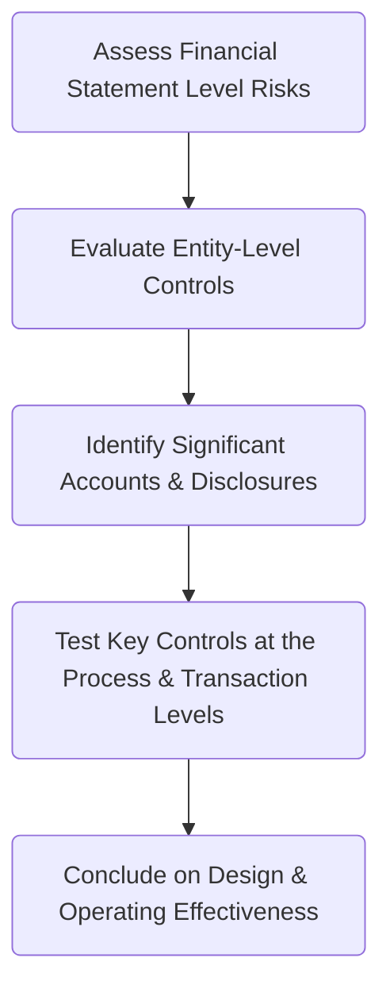

## 9.4 Testing Internal Control Over Financial Reporting in Public Companies (Integrated Audits)

Modern public companies in the United States operate under stringent regulations designed to safeguard investors and stakeholders. A central component of these safeguards is the requirement to test and evaluate Internal Control Over Financial Reporting (ICFR). This requirement is mandated under Section 404 of the Sarbanes-Oxley Act (SOX), which compels both management and the external auditor to evaluate the effectiveness of a company’s internal controls. In this section, we explore:

• The essential provisions of SOX Section 404 and the requirements placed upon management and auditors.  
• The top-down approach to testing ICFR.  
• Differentiating between the design effectiveness and the operating effectiveness of controls.  
• Types of opinions that can result from an integrated audit of financial statements and ICFR.

By understanding how controls are designed, implemented, and tested, auditors can ensure that a public company’s financial reporting is reliable and free from material misstatements—bolstering trust in the capital markets.

---

### Sarbanes-Oxley Act (SOX) Section 404

The Sarbanes-Oxley Act of 2002 was enacted to increase the accountability of corporate executives and enhance the reliability of financial reporting. Section 404 has two primary parts:

1. Management’s Responsibility:  
   • Management must establish, maintain, and assess the effectiveness of the company’s ICFR.  
   • Management must include in its annual report an assessment of the effectiveness of the company’s internal controls.  

2. Auditor’s Responsibility:  
   • The external auditor must perform an integrated audit of both the financial statements and ICFR.  
   • Following this audit, the external auditor issues opinions on:
     - The fairness of the financial statements.
     - The effectiveness of ICFR.

#### Importance of SOX Section 404

• Enhances transparency: By defining and documenting internal controls, management provides stakeholders with greater assurance that financial statements are accurate.  
• Reduces fraud risk: Transparent processes discourage manipulation of financial data and enable early detection of irregularities.  
• Improves governance: Strong internal controls foster an environment that emphasizes accountability and proper oversight.

---

### The Top-Down Approach to Testing Internal Control

An integrated audit requires a systematic and efficient method to identify, test, and evaluate controls over financial reporting. The **top-down approach** is widely adopted because it offers a clear pathway from the broader entity-level controls down to specific transaction-level controls.

1. **Assess Financial Statement-Level Risks**  
   The process begins by identifying goals and risks at the overall financial statement level. These include integrity of revenue recognition processes, valuation of assets, liabilities, and broader fraud risks.

2. **Evaluate Entity-Level Controls**  
   Entity-level controls set the tone for a robust control environment. Key areas include:  
   • Board of directors’ oversight and governance structures.  
   • Management’s philosophy and operating style—particularly regarding risk appetite.  
   • Organizational and ethical culture.  
   • Policies and procedures that pervade the organization.  

3. **Identify Significant Accounts and Disclosures**  
   Accounts and disclosures with higher risk of material misstatement due to complexity or volatile transactions are flagged as significant. Examples include:  
   • Revenue and receivables.  
   • Estimates like allowance for doubtful accounts or valuation of intangible assets.  
   • Derivatives and hedging activities.  
   • Complex tax provisions.  

4. **Test Key Controls at the Process and Transaction Levels**  
   Once significant accounts are identified, the auditor drills down into process-specific and transaction-level controls. Common processes include:  
   • Sales and collection cycle.  
   • Purchasing and payables cycle.  
   • Payroll and human resource cycle.  
   • Financial close and reporting cycle.  

5. **Conclude on Design and Operating Effectiveness**  
   Based on test results, the auditor assesses whether entity-level and transaction-level controls are properly designed and effectively operating. Deficiencies identified at any level may require further investigation or expansion of testing to determine if they represent significant control weaknesses.

---

### Design vs. Operating Effectiveness

Once auditors have identified key controls, they must distinguish between **design effectiveness** and **operating effectiveness**:

1. **Design Effectiveness**  
   • Focuses on whether the control, if operating as intended, would prevent or detect material misstatements on a timely basis.  
   • For example, a control that requires two levels of approval for transactions over a certain threshold is effectively designed if that threshold is chosen appropriately, procedures are clearly documented, and responsible personnel are well-trained.

2. **Operating Effectiveness**  
   • Examines whether the control is functioning as intended in daily operations over the period of reliance.  
   • Continuing the prior example, an auditor would sample relevant transactions to see if dual approvals were consistently obtained and documented. If employees circumvented or ignored this procedure, the control would fail the operating effectiveness test.

#### Balancing Both Aspects

• A control might be well-designed but poorly executed, failing the operating effectiveness test.  
• Conversely, a control may be executed consistently but is inherently poorly designed to detect errors.  
• Both design and operating effectiveness must be present for a control to be considered effective.

---

### Reporting on Internal Control

The external auditor’s opinion on internal controls crystallizes the overall assessment of whether a public company’s controls are effective. Under an integrated audit, different outcomes may arise:

1. **Unqualified Opinion (Clean Opinion)**  
   • Issued if no material weaknesses are identified.  
   • Implies that, in the auditor’s judgment, the internal controls are effective overall.

2. **Adverse Opinion**  
   • Issued if one or more material weaknesses exist, meaning there is a reasonable possibility that a material misstatement will not be prevented or detected on a timely basis.  
   • An adverse opinion on ICFR often requires significant remediation by management.

3. **Disclaimer of Opinion**  
   • Results when the auditor cannot obtain sufficient appropriate evidence about ICFR.  
   • Often occurs if audit procedures are limited, documentation is incomplete, or the scope of the auditor’s work is restricted.

> Note: It is possible (though uncommon) to receive an adverse opinion on internal control while simultaneously receiving an unqualified opinion on the financial statements, and vice versa. This is because the financial statements may still be free from material misstatement in the period under audit despite weaknesses in controls.

---

### Practical Example: A Step-by-Step Overview

Below is a simplified scenario illustrating an integrated audit approach under SOX Section 404:

1. **Risk Assessment**  
   • The external auditor notes that the company has rapid turnover in the accounting department. This increases the risk of errors in financial statement preparation.

2. **Entity-Level Controls**  
   • The auditor evaluates board oversight, whistleblower programs, and the company’s formal code of ethics. Findings: While there is a code of ethics, training is not mandatory, posing a risk that employees are unaware of these requirements.

3. **Significant Accounts**  
   • Sales revenue is identified as a significant area due to high volume and complexity of contracts.  

4. **Testing Controls**  
   • Verified that management has a policy requiring formal contract review and periodic reconciliation of subsidiary ledgers to the general ledger.  
   • Sampled transactions to ensure all approved contracts were recorded accurately, and matching sales invoices were posted with the correct amounts.

5. **Design vs. Operating Effectiveness**  
   • Design: The policies require appropriate signatures and cross-checks.  
   • Operating: In practice, some departments did not follow reconciliation procedures consistently. This deficiency needed further evaluation to determine severity.

6. **Reporting**  
   • Management addressed the deficiency, ensuring monthly reconciliations were performed and cross-referenced with signed approvals.  
   • After re-testing, the auditor concluded the deficiency was resolved and did not rise to the level of a material weakness.

---

### Common Pitfalls and Best Practices

• **Pitfalls**  
  - Underestimating entity-level controls: Overreliance on granular controls can miss broad, organization-wide issues.  
  - Lack of documentation: Insufficient evidence of the operation of controls can trigger disclaimers of opinion.  
  - Incomplete remediation tracking: Failing to follow up on known deficiencies can lead to repeat material weaknesses.

• **Best Practices**  
  - Encourage a strong “tone at the top,” emphasizing ethical behavior and robust controls.  
  - Standardize procedures across business units to enhance consistency and clarity of control steps.  
  - Use data analytics to monitor transactions in real time, providing early detection of anomalies.  
  - Integrate remediation plans with real deadlines and responsibilities, ensuring timely closure of identified deficiencies.

---

### Glossary

• **Integrated Audit**: A concurrent audit of both a company’s financial statements and internal controls.  
• **Material Weakness**: A deficiency such that there is a reasonable possibility a material misstatement of the financial statements will not be prevented or detected in a timely manner.  
• **Top-Down Approach**: A method of testing that starts with entity-level controls, then drills into the processes and transaction-level details.  
• **Design Effectiveness**: Whether a control is capable of preventing or detecting material misstatement if it operates as intended.  
• **Operating Effectiveness**: Whether a control actually functions as intended over the relevant period.

---

### References and Resources

• **Official References**  
  - [PCAOB Auditing Standard AS 2201: An Audit of Internal Control Over Financial Reporting That Is Integrated with An Audit of Financial Statements](https://pcaobus.org/oversight/standards/auditing-standards)  
  - Sarbanes-Oxley Act Sections 302 and 404  

• **Additional Resources**  
  - Commentaries by Big Four accounting firms on integrated audits under SOX.  
  - Industry-specific guides on implementing and testing internal controls in high-complexity environments.

---

## Test Your Knowledge: Integrated Audits and SOX 404 Requirements



### Under Sarbanes-Oxley Section 404, which two types of opinions does the external auditor issue in an integrated audit?

- [x] One on the financial statements and one on the effectiveness of internal controls 
- [ ] One on fraud risk and one on revenue recognition 
- [ ] One on internal controls and one on compliance with government grants 
- [ ] One on the design of controls and one on corporate governance 

> **Explanation:** In an integrated audit, the external auditor provides opinions on both the financial statements and the effectiveness of the entity’s internal controls over financial reporting.

### Which statement best describes the top-down approach in testing internal controls?

- [x] The auditor starts with an evaluation of entity-level controls before focusing on significant accounts 
- [ ] The auditor begins by testing each transaction independently 
- [ ] The auditor tests journal entries before understanding entity-level controls 
- [ ] The auditor only focuses on specific transactions that are individually material 

> **Explanation:** The top-down approach emphasizes starting at the entity-level, determining where the highest risks lie, and then targeting significant accounts and transaction-level controls accordingly.

### What is the primary difference between design effectiveness and operating effectiveness?

- [x] Design effectiveness considers whether a control is capable of preventing or detecting material misstatement; operating effectiveness checks if the control actually works 
- [ ] Both terms refer to the same thing and can be used interchangeably 
- [ ] Design effectiveness revolves around testing a control multiple times; operating effectiveness requires just one test 
- [ ] Design effectiveness is concerned with process efficiency; operating effectiveness is concerned with cost-efficiency 

> **Explanation:** Design effectiveness looks at whether the control is properly designed to address a risk. Operating effectiveness then validates if the control is functioning as intended over a period of time.

### Which of the following would most likely result in an adverse opinion on ICFR?

- [x] A material weakness that remains unremediated by year-end 
- [ ] A minor control deficiency that doesn’t affect financial statement accuracy 
- [ ] A lack of entity-level controls in a small sales division 
- [ ] Partial documentation of control procedures that are otherwise operating effectively 

> **Explanation:** An adverse opinion on ICFR is issued when there is at least one material weakness. This means there is a reasonable possibility that a material misstatement could occur and go undetected.

### If an auditor cannot obtain sufficient evidence regarding the effectiveness of internal controls, the auditor should issue a:

- [x] Disclaimer of opinion 
- [ ] Unqualified opinion 
- [ ] Qualified opinion 
- [ ] No formal opinion is required 

> **Explanation:** When the auditor is restricted from obtaining enough evidence to form an opinion on the effectiveness of ICFR, the appropriate response is to issue a disclaimer of opinion.

### In what scenario might a public company receive an adverse opinion on internal control but an unqualified opinion on its financial statements?

- [x] When a known material weakness that could result in misstatements exists, yet actual misstatements are not present in the financial statements 
- [ ] Whenever the internal audit function is outsourced 
- [ ] If the company has a history of unethical management but no errors in the financials 
- [ ] If no control deficiencies exist, but the financial statements have errors 

> **Explanation:** A material weakness refers to the potential for a material misstatement; however, the actual financial statements under audit may still be free from material misstatements, thus leading to an unqualified opinion on the financials but an adverse opinion on ICFR.

### Which of the following best describes the focus of entity-level controls?

- [x] Overall tone at the top, governance, and company-wide policies affecting all processes 
- [ ] Detailed procedures for a single account or transaction cycle 
- [ ] Automated controls used in a single department 
- [ ] Physical access controls for inventory locations only 

> **Explanation:** Entity-level controls encompass higher-level activities such as governance structures, ethical culture, and policies that affect the entire organization.

### Which of the following is a key benefit of using the top-down approach for ICFR testing?

- [x] It ensures that critical, overarching controls are evaluated before drilling down into transactional details 
- [ ] It focuses more on clerical tasks than conceptual analysis 
- [ ] It only verifies controls that have immaterial impacts on the financial statements 
- [ ] It completely bypasses entity-level controls to save time 

> **Explanation:** By starting with entity-level controls and proceeding downward, the top-down approach captures high-risk areas and ensures the most impactful controls receive sufficient scrutiny.

### What is a primary aim of management’s annual evaluation of ICFR under SOX?

- [x] To assert whether controls are operating effectively and disclose any material weaknesses 
- [ ] To replace the external auditor’s assessment 
- [ ] To produce monthly financial statements for all stakeholders 
- [ ] To delegate full control documentation and testing to the internal audit department 

> **Explanation:** Management is required to evaluate and report on internal control effectiveness, disclosing material weaknesses if present. This does not negate the external auditor’s independent assessment.

### True or False: A significant deficiency carries the same severity and consequences as a material weakness for ICFR reporting.

- [ ] True 
- [x] False 

> **Explanation:** While both significant deficiencies and material weaknesses are deficiencies in ICFR, a material weakness is more severe, indicating a reasonable possibility that a material misstatement will not be prevented or detected.



---

## For Additional Practice and Deeper Preparation

**[Auditing & Attestation CPA Mock Exams (AUD): Comprehensive Prep](https://www.udemy.com/course/aud-cpa-mock-exams/?referralCode=D064EF7BD4A84FC6403D)**  
• Tackle full-length mock exams designed to mirror real AUD questions—from risk assessment and ethics to internal control and substantive procedures.  
• Refine your exam-day strategies with detailed, step-by-step solutions for every scenario.  
• Explore in-depth rationales that reinforce understanding of higher-level concepts, giving you a decisive edge on test day.  
• Boost confidence and reduce exam anxiety by building mastery of the wide-ranging AUD blueprint.

_Disclaimer: This course is not endorsed by or affiliated with the AICPA, NASBA, or any official CPA Examination authority. All content is created solely for educational and preparatory purposes._
