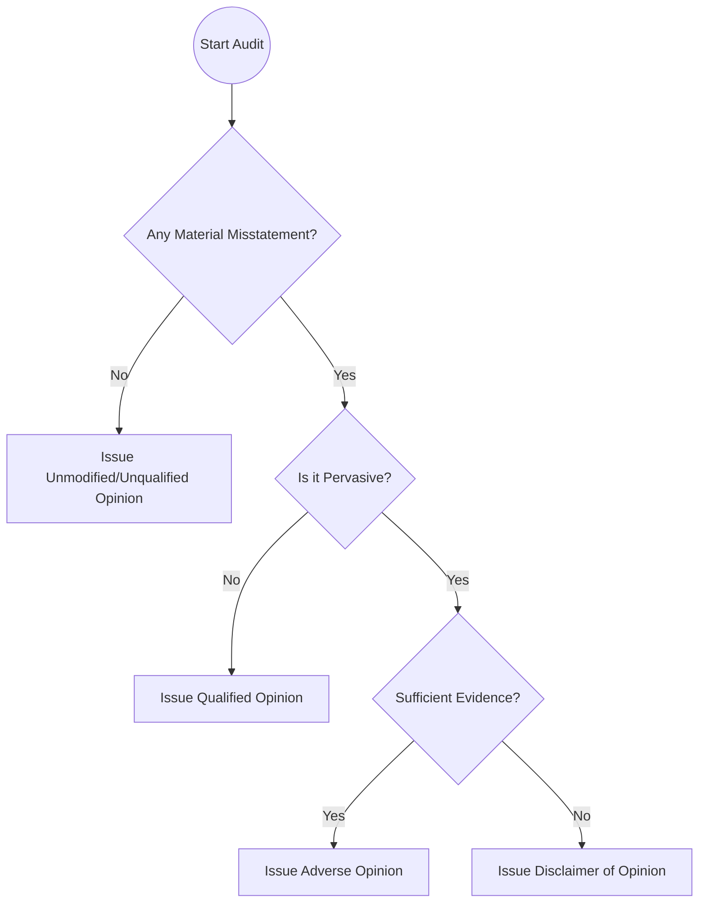

## 13.1 Types of Opinions: Unmodified/Unqualified, Qualified, Adverse, Disclaimer

An audit opinion is the culmination of the auditor’s work—signaling the results of the engagement and the auditor’s assessment of the financial statements’ fairness. The U.S. Generally Accepted Auditing Standards (GAAS), as documented in the AICPA’s AU-C sections for nonissuers or PCAOB standards for issuers (public companies), define the precise language and conditions for each type of opinion. The four main types are:  
1. Unmodified (nonissuers) or Unqualified (issuers)  
2. Qualified  
3. Adverse  
4. Disclaimer of Opinion  

In this section, we explore these four opinions in detail, explain the audit circumstances that prompt each type, and illustrate how an auditor’s professional judgment and evidentiary findings lead to the final report.

-------------------------------------------------------------------------------

### 1. Unmodified (Nonissuers) / Unqualified (Issuers)

The Unmodified (nonissuer) or Unqualified (issuer) opinion is commonly referred to as the “clean” opinion. It indicates that the financial statements are presented fairly, in all material respects, in accordance with the applicable financial reporting framework (most often U.S. GAAP, IFRS, or another recognized framework).

• When Issued:  
  – No known material misstatements.  
  – No significant scope limitations.  
  – Policies and disclosures materially conform to the applicable framework.  

• Characteristics:  
  – A clear statement that the financial statements are free from material misstatement.  
  – Standard wording as required by AU-C Section 700 (nonissuers) or PCAOB AS 3101 (issuers).  
  – Accompanied by key audit matters or critical audit matters (CAMs) in certain jurisdictions or for listed companies, when applicable.  

• Example Scenario:  
  – An auditor completes a thorough review of a nonpublic manufacturing client’s accounting records, inventory systems, and financial reporting. The financial statements prove to be accurate, with no significant departures from GAAP. The auditor issues an unmodified opinion to confirm the statements present fairly, in all material respects, the financial position and results of operations.  

-------------------------------------------------------------------------------

### 2. Qualified Opinion

A qualified opinion is appropriate when a material misstatement exists (or there is a material scope limitation), but the issue does not rise to the level of being pervasive to the overall financial statements. Pervasive misstatements, discussed later, are those that affect multiple areas of the statements or prevent the financial statements as a whole from being fairly presented.

• When Issued:  
  – The auditor concludes that a material misstatement or scope limitation is present but is confined to a single account or a few disclosures.  
  – The rest of the financial statements are fairly presented in accordance with the applicable framework.  

• Characteristics:  
  – Wording in the audit report explains the basis for the qualification (e.g., disagreement with management over how a single account is recognized).  
  – The opinion paragraph states that except for the effects of the specific matter in question, the financial statements are fairly presented.  

• Common Examples:  
  1. The client refuses to adjust inventory for a significant disposable part that is no longer salable. The amount is material, but the rest of the statements are fair.  
  2. The auditor is barred from observing inventory counts at one remote warehouse. The rest of the procedures are performed without issue.  

• Impact on Users:  
  – Investors, regulators, and lenders recognize that while there is a material deviation in one area, the rest of the financial statements are reliable for decision-making.  

-------------------------------------------------------------------------------

### 3. Adverse Opinion

An adverse opinion is the most severe form of misstatement-based opinion. It indicates that the financial statements as a whole are materially misstated and not reliable.

• When Issued:  
  – The misstatements identified are both material and pervasive.  
  – Management refuses to alter the statements to correct the fundamental departure from the applicable framework.  

• Characteristics:  
  – The report explicitly states that the financial statements “do not present fairly,” per GAAP or the specified framework.  
  – Expands upon the basis for the conclusion and refers to the specific nature of the widespread misstatements.  

• Example Scenario:  
  1. Management refuses to consolidate a significant subsidiary in direct violation of GAAP, impacting revenue, assets, and liabilities substantially.  
  2. The financial statements misstate or omit entire categories of transactions, inflating earnings and distorting the business’s true financial position.  

• Consequences:  
  – An adverse opinion severely undermines the entity’s credibility.  
  – Potentially triggers regulatory inquiries, lender defaults on debt covenants, or withdrawal of investors.  

-------------------------------------------------------------------------------

### 4. Disclaimer of Opinion

The auditor issues a disclaimer of opinion when they cannot obtain sufficient appropriate audit evidence to form any kind of opinion, and the unresolved matters are both material and pervasive. Instead of saying the financial statements are presented fairly or not, the auditor states that no opinion can be expressed.

• When Issued:  
  – Scope limitations prevent the auditor from gathering adequate evidence for major areas (e.g., missing documents, locked systems, inability to perform confirmations, or severe restrictions).  
  – Significant client-imposed limitations hamper the audit process from start to finish.  

• Characteristics:  
  – The audit report declares that the auditor does not express an opinion on the financial statements.  
  – The basis for the disclaimer is thoroughly explained in a separate paragraph.  

• Example Scenario:  
  – A company undergoing extensive litigation conceals critical legal and financial documents from the auditor, making it impossible to verify liabilities. The magnitude of this unknown risk is so large that the auditor disclaims any opinion.  

• Implications:  
  – Stakeholders often view a disclaimer as a red flag.  
  – The entity’s governance or management is seen as uncooperative or lacking controls, leading to potentially serious reputational damage.  

-------------------------------------------------------------------------------

### Material vs. Material and Pervasive

A key distinction that determines whether an auditor issues a qualified opinion, an adverse opinion, or a disclaimer of opinion is whether the matter is “material but not pervasive” or “material and pervasive.”

• Material but Not Pervasive  
  – The misstatement or limitation is significant enough to affect users’ decisions, but only in a confined area of the financial statements.  
  – Likely to lead to a qualified opinion.  

• Material and Pervasive  
  – The misstatement or limitation affects many accounts and disclosures or undermines the overall reliability of the financial statements.  
  – Leads to adverse or disclaimer opinions, depending on whether there is a known misstatement or an inability to obtain evidence.  

-------------------------------------------------------------------------------

### Glossary
• **Materiality**: The magnitude of omission or misstatement that could influence the judgment of a reasonable person relying on the financial statements.  
• **Pervasive**: Widespread impact on the financial statements, such that the misstatement or limitation undermines the reliability of the statements as a whole.  
• **Scope Limitation**: Instances where the auditor cannot gather adequate evidence to support an opinion, often leading to qualified or disclaimer of opinion depending on severity.  

-------------------------------------------------------------------------------

### Visual Overview: Determining Audit Opinions

Below is a Mermaid diagram illustrating the decision process in choosing the appropriate audit opinion.

Explanation of Decision Points:  
• B: Establishes whether material misstatements exist. If none, an unmodified/unqualified opinion is issued.  
• D: Assesses whether the misstatements are pervasive or isolated to specific accounts or disclosures.  
• F: Evaluates whether the auditor was able to obtain sufficient evidence to quantify or fully assess the misstatements.

-------------------------------------------------------------------------------

### Practical Examples and Considerations

• A small retail chain may unknowingly record consignment inventory as its own. If the total misstatement is not widespread, the auditor might only qualify the opinion.  
• A manufacturing entity might hide environmental liability claims and refuse to provide documentation. Such concealment, if pervasive, leads either to an adverse opinion (if proven material misstatements exist) or a disclaimer (if evidence is impossible to obtain).  

-------------------------------------------------------------------------------

### Best Practices and Common Pitfalls
• **Maintain Clear Documentation**: Thoroughly document the basis for your opinion. This becomes critical should a future third party (regulators, courts) question the auditor’s judgment.  
• **Engage in Early Communication**: Discuss issues with management and those charged with governance as soon as possible to address potential scope limitations or material misstatements.  
• **Stay Informed on Reporting Standards**: The specific language in the audit opinion can vary between PCAOB standards for issuers and AICPA standards for nonissuers. Understanding these differences is crucial.  
• **Watch Out for Management Bias**: Qualified or adverse opinions often arise when management refuses to adjust material misstatements. Properly evaluate management’s rationale and consider the possibility of fraud.  
• **Be Transparent About Limitations**: If the auditor chooses to disclaim an opinion, the nature of the limitation should be clearly communicated so users understand the severity of the uncertainties or missing information.

-------------------------------------------------------------------------------

### References and Resources
• **Official References**  
  – AU-C Section 700: “Forming an Opinion and Reporting on Financial Statements” (nonissuers)  
  – PCAOB AS 3101: “The Auditor’s Report on an Audit of Financial Statements When the Auditor Expresses an Unqualified Opinion” (issuers)  
• **Additional Resources**  
  – AICPA Illustrative Reports: A resource library with diverse examples of audit reports, including each type of opinion.  
  – “Reporting on GAAP Departures: Practice Pointers” (Journal of Accountancy): A discussion of best practices for explaining departures from GAAP.  

-------------------------------------------------------------------------------

## Test Your Knowledge: Audit Opinions and Reporting Quiz



### An unmodified (nonissuer) or unqualified (issuer) opinion is often referred to as:
- [x] A “clean” opinion indicating that the financial statements are fairly presented.
- [ ] A limited scope opinion issued due to partial evidence.
- [ ] An adverse opinion indicating pervasive misstatements.
- [ ] A disclaimer of opinion indicating no conclusion can be made.

> **Explanation:** The unmodified/unqualified opinion is commonly called the “clean” opinion because it reflects no known material misstatements and a general state of compliance with reporting standards.

### Which scenario best describes a situation that would likely lead to a qualified opinion?
- [x] The auditor was unable to verify the inventory balance of a single remote warehouse, which is material but not pervasive.
- [ ] Management refused to allow any examination of significant revenue transactions, making the impact unknown and pervasive.
- [ ] Financial statements are fairly presented in all material respects without exceptions.
- [ ] The auditor lacks any evidence to form an opinion on multiple major accounts.

> **Explanation:** A qualified opinion is generally issued when there is a material but not pervasive misstatement or a material but isolated scope limitation. Inability to verify a single warehouse’s inventory may warrant a qualified opinion.

### Out of the four major types of audit opinions, which one states that the financial statements “do not present fairly” under the reporting framework?
- [ ] Unmodified
- [ ] Qualified
- [x] Adverse
- [ ] Disclaimer

> **Explanation:** An adverse opinion explicitly states that the financial statements “do not present fairly” due to material and pervasive misstatements.

### When might an auditor disclaim an opinion on a set of financial statements?
- [x] When the auditor cannot obtain sufficient appropriate evidence, and the possible effects are both material and pervasive.
- [ ] When the financial statements only have minor errors.
- [ ] When the auditor disagrees over the application of accounting principles, but only in one area.
- [ ] When management adheres fully to GAAP without exception.

> **Explanation:** Disclaimer of opinion arises when there is a significant scope limitation or another circumstance prohibiting the auditor from obtaining enough evidence, and the magnitude of the unknowns is pervasive.

### What does “pervasive” typically indicate in the context of material misstatements?
- [x] The misstatement affects multiple accounts or disclosures and undermines the overall reliability of the financial statements.
- [ ] No material effect on the financial statements.
- [x] The misstatement is confined to one account only.
- [ ] The financial statements can still be relied upon for major decisions.

> **Explanation:** “Pervasive” means that the departure or misstatement affects a broad spectrum of the financial statements, making them unreliable as a whole.

### If a financial statement departure affects multiple key accounts and management refuses to correct the errors, which type of opinion is most likely if the auditor can sufficiently prove the misstatements?
- [x] Adverse
- [ ] Unmodified
- [ ] Qualified
- [ ] Disclaimer

> **Explanation:** Where material misstatements are pervasive and management refuses to correct them, and the auditor has enough evidence to conclude these misstatements exist, an adverse opinion is appropriate.

### A disclaimer of opinion primarily differs from an adverse opinion in which of the following ways?
- [x] A disclaimer is due to a lack of sufficient evidence, while an adverse opinion is due to known misstatements.
- [ ] A disclaimer involves known material misstatements that are pervasive.
- [x] An adverse opinion requires no material issues.
- [ ] They are the same opinions under different names for public vs. private companies.

> **Explanation:** An adverse opinion is rendered when the auditor uncovers material and pervasive misstatements but has enough evidence to form that conclusion. A disclaimer is given when the auditor lacks the necessary evidence to form an opinion at all.

### Which of the following best describes a qualified opinion?
- [x] An opinion stating that financial statements are fairly presented except for a particular material matter.
- [ ] An endorsement that all accounts are completely accurate.
- [ ] A finding that the financial statements are pervasively misstated.
- [ ] No opinion is being expressed regarding the financial statements.

> **Explanation:** A qualified opinion indicates that “except for” the identified issue, the financial statements are fairly presented.

### What is the major consequence of obtaining an adverse opinion?
- [x] The financial statements are deemed unreliable, potentially prompting regulatory action or affecting stakeholder confidence.
- [ ] A limited endorsement for a specific area only.
- [ ] The financial statements are presumed to be fairly presented.
- [ ] The auditor expresses that there was inadequate evidence to form an opinion.

> **Explanation:** An adverse opinion is a clear negative conclusion about the financial statements’ reliability, commonly resulting in serious consequences for the entity’s credibility and stakeholder trust.

### True or False: An auditor should issue a disclaimer of opinion when the statements are determined to be pervasively misstated.
- [ ] True
- [x] False

> **Explanation:** If the auditor determines that the statements are pervasively misstated, and they have sufficient evidence to confirm this finding, an adverse opinion is appropriate. A disclaimer is issued when the auditor cannot obtain enough evidence to form any conclusion.



-------------------------------------------------------------------------------

## For Additional Practice and Deeper Preparation

**[Auditing & Attestation CPA Mock Exams (AUD): Comprehensive Prep](https://www.udemy.com/course/aud-cpa-mock-exams/?referralCode=D064EF7BD4A84FC6403D)**  
• Tackle full-length mock exams designed to mirror real AUD questions—from risk assessment and ethics to internal control and substantive procedures.  
• Refine your exam-day strategies with detailed, step-by-step solutions for every scenario.  
• Explore in-depth rationales that reinforce understanding of higher-level concepts, giving you a decisive edge on test day.  
• Boost confidence and reduce exam anxiety by building mastery of the wide-ranging AUD blueprint.

_Disclaimer: This course is not endorsed by or affiliated with the AICPA, NASBA, or any official CPA Examination authority. All content is created solely for educational and preparatory purposes._
