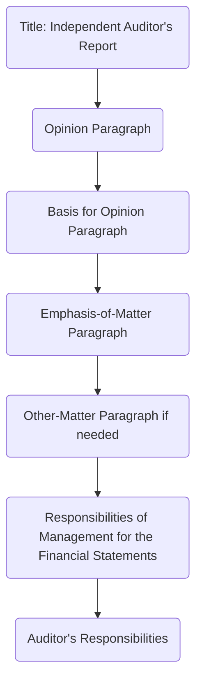

## 13.2 Emphasis-of-Matter and Other-Matter (Explanatory) Paragraphs

An auditor’s report is the primary vehicle through which an external auditor communicates the nature and outcome of their audit to the various stakeholders of an entity’s financial statements. While the opinion paragraph and the basis for opinion paragraph establish the auditor’s conclusion and the professional standards followed, certain circumstances call for additional paragraphs to highlight or clarify significant matters. These additional paragraphs are generally referred to as Emphasis-of-Matter (EOM) and Other-Matter paragraphs for nonissuers, and Explanatory paragraphs for issuers.

Emphasis-of-Matter (EOM) paragraphs and Other-Matter (OM) paragraphs are powerful tools that auditors use to direct the user’s attention to important issues. They do not, however, modify the opinion itself; rather, they complement it, ensuring greater clarity in communication. This section explores the fundamental principles, uses, and best practices associated with Emphasis-of-Matter and Other-Matter (Explanatory) paragraphs under both AICPA (for nonissuers) and PCAOB (for issuers) standards.

--------------------------------------------------------------------------------
## 1. Understanding Emphasis-of-Matter (EOM) Paragraphs

### 1.1 Definition and Purpose
Under AICPA auditing standards for nonissuers (private companies, not publicly traded), an Emphasis-of-Matter (EOM) paragraph is a separately identified section in the auditor’s report used when the auditor considers it necessary to draw users’ attention to a matter presented or disclosed in the financial statements. This matter is fundamental to the users’ understanding of those financial statements. Importantly, it does not change the auditor’s opinion; the opinion remains unmodified (unqualified).

Common reasons for an Emphasis-of-Matter paragraph include:
• A significant doubt about the entity’s ability to continue as a going concern.  
• Major subsequent events that influence the financial statements’ interpretation.  
• A change in accounting principle that has a material effect on the financial statements.  
• Uncertainties relating to significant litigations or regulatory rulings disclosed in the notes.  

### 1.2 Key Characteristics
1. Placement: Typically inserted immediately after the Opinion paragraph (and after the Basis for Opinion paragraph, if applicable).  
2. Heading: Clearly labeled “Emphasis of Matter,” indicating the specific issue to which it refers.  
3. Clear Reference: The paragraph explicitly references the relevant footnote(s) or sections of the financial statements where further details of the matter are provided.  

### 1.3 Impact on the Opinion
EOM paragraphs do not modify the auditor’s opinion. Indeed, you can have an unmodified (clean) opinion while still drawing attention to a significant matter. Consider the following illustration for a nonissuer’s report structure:

In this diagram, the Emphasis-of-Matter paragraph (D) follows directly after the Basis for Opinion paragraph (C), thereby logically communicating the critical issue without undermining or altering the opinion.

--------------------------------------------------------------------------------
## 2. Other-Matter (OM) Paragraphs for Nonissuers

### 2.1 Definition and Purpose
While an Emphasis-of-Matter paragraph highlights an issue already presented in the financial statements, an Other-Matter (OM) paragraph draws attention to a matter not disclosed or presented in the financial statements but deemed relevant to users’ understanding of the audit or the auditor’s responsibilities.

Examples include:
• Servicing of restricted-use reports (e.g., the audit report is intended solely for specific parties).  
• Explaining why a predecessor auditor’s report is not reissued or referenced.  
• Clarifications regarding additional information that the auditor has performed limited procedures upon (e.g., supplementary information).  
• Disclaimers on required supplementary information (RSI) that the entity failed to provide or adequately prepare.  

### 2.2 Placement and Content
Given that an Other-Matter paragraph covers matters beyond the scope of the financial statements, it is typically placed after any Emphasis-of-Matter paragraph and before management and auditor responsibilities language (for clarity, some variations may occur under differing auditing standards). The paragraph should have an appropriate heading, such as “Other Matter,” to properly distinguish it.

--------------------------------------------------------------------------------
## 3. Explanatory Paragraphs for Issuers

### 3.1 The PCAOB Approach
When auditing public companies (issuers), PCAOB standards refer to Emphasis-of-Matter and Other-Matter paragraphs collectively as “Explanatory paragraphs.” They serve substantially the same purpose: to highlight significant matters or provide clarity on additional issues related to the financial statements or the audit process.

### 3.2 Common Situations for Explanatory Paragraphs
Under PCAOB AS 3101, some frequently encountered circumstances calling for an Explanatory paragraph include:
• Substantial doubt about the entity’s ability to continue as a going concern.  
• Change in accounting principle or a restatement of previously issued financial statements.  
• Material prior-period adjustments or error corrections.  
• Reference to the report of other auditors in a group audit.  
• Lack of consistent application of GAAP.  
• Identification of material weaknesses in internal control over financial reporting (if required to be disclosed alongside the financial statements).  

In issuer audits, an Explanatory paragraph usually follows the Opinion on the Financial Statements and the Basis for Opinion section. Heading conventions might differ slightly, often simply titled “Explanatory Paragraph” or bearing a descriptor that references the specific issue (e.g., “Going Concern,” “Change in Accounting Principle”).

--------------------------------------------------------------------------------
## 4. Detailed Examples and Case Studies

### 4.1 Going Concern Uncertainty
One of the most common triggers for an Emphasis-of-Matter/Explanatory paragraph is a going concern issue. Suppose Company ABC’s financial statements contain a note explaining significant doubts about the company’s ability to sustain operations over the next year due to recurring losses. In this case, the auditor includes an Emphasis-of-Matter or Explanatory paragraph immediately after the Opinion paragraph.

Here’s how the essential components might read in a simplified example for a nonissuer:

“…We draw attention to Note X in the financial statements, which indicates that the Company incurred significant net losses during the year ended December 31, 20XX and, as of that date, the Company’s current liabilities exceeded its current assets. These events or conditions, along with other matters as set forth in Note X, indicate the existence of a material uncertainty that may cast significant doubt upon the Company’s ability to continue as a going concern. Our opinion is not modified in respect of this matter…”

### 4.2 Change in Accounting Principle
Assume Company XYZ changes from First In, First Out (FIFO) to Weighted Average method of inventory valuation, and that this change has a material impact on the financial statements. The inclusion of an Emphasis-of-Matter/Explanatory paragraph underscores this shift to users, making it clear that all comparative periods may not be directly comparable without such context. In a nonissuer report, an Emphasis-of-Matter paragraph might read:

“…As discussed in Note X to the financial statements, the Company has elected to change its method of inventory valuation from the FIFO method to the Weighted Average method. We draw attention to this matter since it has a material effect on the comparability of the financial statements. Our opinion is not modified in respect of this matter…”

--------------------------------------------------------------------------------
## 5. Best Practices for Writing and Placing Additional Paragraphs

1. Use Clear, Concise Wording: Whether it is an Emphasis-of-Matter, Other-Matter, or Explanatory paragraph, clarity is paramount.  
2. Reference Relevant Notes: Provide a direct reference to the footnotes or disclosures where users can obtain more detail.  
3. Follow Placement Guidelines: Typically, these paragraphs appear right after the Opinion and Basis for Opinion paragraphs to ensure readers do not miss crucial details.  
4. Distinguish Between Matters: If an item is already disclosed in the financial statements, prefer an Emphasis-of-Matter paragraph. If it is not disclosed, or it involves the audit context rather than the statements themselves, use an Other Matter (nonissuers) or Explanatory Paragraph (issuers).  
5. Do Not Overuse: Overuse diminishes the impact of highlighting truly material issues. Reserve these paragraphs for matters that indeed warrant extra emphasis or clarity.  

--------------------------------------------------------------------------------
## 6. Summary of Key Differences and Similarities
While “Emphasis-of-Matter” and “Other-Matter” paragraphs in AICPA standards (for nonissuers) or “Explanatory Paragraphs” in PCAOB standards (for issuers) differ by nomenclature and some specific requirements, the underlying principle remains the same: direct financial statement users’ attention to critical or unusual aspects without altering the overall audit opinion.

Below is a high-level table summarizing these differences:

| Aspect                              | Nonissuers (AICPA)                 | Issuers (PCAOB)             |
|-------------------------------------|------------------------------------|-----------------------------|
| Applicable Standards                | AU-C 706 (EOM, OM Paragraphs)      | AS 3101 (Explanatory)       |
| Name of Additional Paragraphs       | EOM Paragraph / Other-Matter       | Explanatory Paragraph       |
| Focus of EOM                        | Matter disclosed in FS, fundamental to understanding | Same (not called “EOM,” but included in Explanatory) |
| Focus of Other/Explanatory Matter   | Additional matters not presented in FS, or disclaimers on RSI etc. | Same, combined usage under “Explanatory” |
| Common Situations                   | Going concern, changes in accounting principle, major subsequent events, uncertain outcomes | Going concern, restatements, changes in principle, referencing other auditors |
| Placement                           | Immediately after Opinion/Basis    | Typically follows Opinion/Basis for Opinion |

--------------------------------------------------------------------------------
## 7. References and Resources

• AU-C Section 706: Emphasis-of-Matter Paragraphs and Other-Matter Paragraphs in the Independent Auditor’s Report.  
• PCAOB AS 3101: The Auditor’s Report on an Audit of Financial Statements.  

Additional Resources:  
• AICPA “Audit Report Examples”: Illustrations of Emphasis-of-Matter paragraphs for going concern, changes in accounting principles, etc.  
• Official PCAOB Staff Guidance: Clarifications for Explanatory paragraphs in issuer audit reports.

--------------------------------------------------------------------------------

## Mastering Emphasis-of-Matter and Other-Matter Paragraphs: A Comprehensive Quiz



### In which scenario(s) would an Emphasis-of-Matter (EOM) paragraph for a nonissuer most likely be appropriate?

- [x] When there is a significant uncertainty about an entity’s ability to continue as a going concern.  
- [ ] When internal control deficiencies are discovered that are not disclosed in the notes.  
- [ ] When the auditor issues a qualified opinion due to GAAP departure.  
- [ ] When a company has thoroughly documented its internal control policies.  

> **Explanation:** An EOM paragraph highlights an important matter disclosed in the financial statements, such as a going concern uncertainty, without modifying the opinion.

### Which paragraph is commonly used to highlight a crucially important matter not discussed or disclosed within the financial statements?

- [ ] Emphasis-of-Matter paragraph  
- [x] Other-Matter paragraph  
- [ ] Basis for Opinion paragraph  
- [ ] Auditor’s Responsibilities paragraph  

> **Explanation:** Other-Matter paragraphs (under nonissuer standards) are used to discuss information outside the financial statements but relevant to users (e.g., restricted use).

### Under PCAOB standards, what is the name given to additional paragraphs that serve a similar function as EOM and OM paragraphs under AICPA standards?

- [ ] Qualified paragraphs  
- [ ] Disclaimer paragraphs  
- [x] Explanatory paragraphs  
- [ ] Withholding paragraphs  

> **Explanation:** In issuer audits, PCAOB uses “Explanatory paragraphs” in place of EOM/OM paragraphs found in nonissuer audits.

### Which of the following is typically the correct position for an Emphasis-of-Matter paragraph in an auditor’s report for a nonissuer?

- [ ] At the very end of the audit report  
- [ ] Before the Opinion paragraph  
- [x] Immediately after the Opinion and Basis for Opinion paragraphs  
- [ ] Inserted in the Management’s Discussion and Analysis section  

> **Explanation:** Generally, an EOM paragraph is placed directly after the Opinion paragraph (and after any Basis for Opinion paragraph) to maintain clear visibility.

### Which statement best describes the effect of an Emphasis-of-Matter paragraph on the auditor’s opinion?

- [ ] It upgrades a qualified opinion to an unmodified opinion.  
- [x] It does not modify the opinion itself.  
- [ ] It automatically lowers an opinion from unmodified to qualified.  
- [ ] It expresses uncertainty without referencing the footnotes.  

> **Explanation:** An EOM paragraph highlights specific matters but does not alter or modify the auditor’s opinion.

### For a nonissuer, which type of paragraph would be used to indicate that the predecessor auditor’s report is not being reissued or referenced for comparative information?

- [ ] Going Concern paragraph  
- [ ] Emphasis-of-Matter paragraph  
- [x] Other-Matter paragraph  
- [ ] Basis for Opinion paragraph  

> **Explanation:** This is typically addressed through an Other-Matter paragraph because it concerns the auditing process and reference to prior period statements.

### In a public company audit, which standard governs the inclusion of “Explanatory paragraphs” related to issues like going concern and changes in accounting principles?

- [ ] AU-C Section 706  
- [x] PCAOB AS 3101  
- [ ] GAO Yellow Book  
- [ ] SSARS Section 70  

> **Explanation:** PCAOB AS 3101 specifically covers how and when to include Explanatory paragraphs in the auditor’s report for issuers.

### When the auditor references a significant subsequent event that is adequately disclosed in the financial statements, which paragraph type is used for a nonissuer?

- [ ] Other-Matter paragraph  
- [x] Emphasis-of-Matter paragraph  
- [ ] Basis for Opinion paragraph  
- [ ] Disclaimer of Opinion paragraph  

> **Explanation:** Emphasis-of-Matter paragraphs highlight matters already disclosed in the financial statements, such as major subsequent events.

### A large, publicly held entity changed its accounting method for revenue recognition, requiring significant note disclosures. Which type of paragraph will the auditor most likely include in the report under PCAOB standards?

- [ ] Other-Matter paragraph  
- [ ] Emphasis-of-Matter paragraph  
- [x] Explanatory paragraph  
- [ ] Disclaimer paragraph  

> **Explanation:** Under PCAOB standards for issuers, significant changes in accounting principles typically are addressed with an Explanatory paragraph.

### An Emphasis-of-Matter paragraph for a nonissuer should be used:

- [x] Only when the matter is presented in the financial statements and is fundamental to users’ understanding.  
- [ ] To modify the nature of the audit opinion.  
- [ ] To highlight an issue discovered in a separate review engagement.  
- [ ] Whenever the auditor believes a significant deficiency exists.  

> **Explanation:** An EOM paragraph points out material matters disclosed in the financial statements that are essential for users to understand, without modifying the opinion.



--------------------------------------------------------------------------------

## For Additional Practice and Deeper Preparation

**[Auditing & Attestation CPA Mock Exams (AUD): Comprehensive Prep](https://www.udemy.com/course/aud-cpa-mock-exams/?referralCode=D064EF7BD4A84FC6403D)**  
• Tackle full-length mock exams designed to mirror real AUD questions—from risk assessment and ethics to internal control and substantive procedures.  
• Refine your exam-day strategies with detailed, step-by-step solutions for every scenario.  
• Explore in-depth rationales that reinforce understanding of higher-level concepts, giving you a decisive edge on test day.  
• Boost confidence and reduce exam anxiety by building mastery of the wide-ranging AUD blueprint.

_Disclaimer: This course is not endorsed by or affiliated with the AICPA, NASBA, or any official CPA Examination authority. All content is created solely for educational and preparatory purposes._
