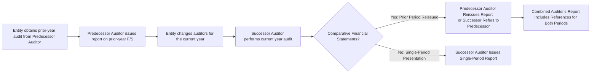

## 13.3 Comparative Financial Statements, Predecessor Auditors

Comparative financial statements present data for multiple reporting periods side by side, often two or three years. The primary reason organizations include comparative financial statements is to help users—investors, creditors, regulators, and other stakeholders—identify trends, analyze year-over-year changes, and evaluate consistency in financial reporting. From an auditing perspective, comparative reporting raises unique considerations regarding prior-year audit opinions and changes in auditors between successive reporting periods.

In this section, we will discuss:
• Key concepts of comparative financial statements and the auditor’s role.  
• References to prior-period audits when the same auditor performed both engagements.  
• Proper handling of changes in accounting principles or disclosures that affect comparability.  
• The process of reissuing or referring to predecessor auditor’s reports.  
• Handling situations where prior periods were unaudited, reviewed, or compiled.  
• Best practices for clear communication in the auditor’s report about differing levels of service.

--------------------------------------------------------------------------------

## 1. Comparative Financial Statements: Core Principles

When presenting comparative financial statements, each period displayed in the financial statements is subject to an audit opinion (if audited) or another form of assurance (e.g., review or compilation). For consistency, the auditor’s responsibility typically extends to all periods shown, thereby offering users a consistent view across multiple years or reporting periods.

### 1.1 Auditor’s Responsibility Across Multiple Periods
• The continuing auditor: If the same auditor has audited the entity’s financial statements for all periods presented, the auditor should express an opinion covering each period.  
• The successor auditor: If there has been a change in auditors between comparative periods, additional procedures and disclosures are required to clarify the nature of the prior engagements and any limitations that might exist.

### 1.2 Impact of Changes in Accounting Principles
Changes in accounting principles or their application sometimes cause the financial statements of one period to differ significantly from another. According to AU-C Section 708, the auditor must verify that:
• The change is accounted for according to the applicable financial reporting framework (e.g., Generally Accepted Accounting Principles, or GAAP).  
• The disclosures regarding the change are adequate.  
• The change’s effect on comparability is appropriately addressed in the auditor’s report.  

If the change materially affects comparability, the auditor may include an emphasis-of-matter (AICPA standards) or explanatory (PCAOB standards) paragraph to draw attention to it and highlight why the statements are not directly comparable across periods.  

--------------------------------------------------------------------------------

## 2. Reissuing or Referring to the Predecessor Auditor’s Report

When an entity transitions from one auditor (the predecessor) to another (the successor), the prior-year financial statements originally audited by the predecessor could still be presented for comparative purposes. In these cases, regulatory and professional standards provide two approaches:

### 2.1 Predecessor Reissue of Prior Report
The predecessor auditor may reissue their report on the prior year’s financial statements if they:
1. Reacquire the engagement file and evaluate whether all necessary documentation is in place.  
2. Perform limited procedures, such as reading the current year financial statements and comparing them to the prior year.  
3. Confirm whether management has appropriately disclosed or accounted for events or transactions that might affect the previous opinion.

If the predecessor auditor is satisfied that no new information has arisen that would materially affect their prior year opinion, they may reissue their report to accompany the comparative financial statements.

### 2.2 Successor Auditor References the Predecessor’s Opinion
If the predecessor will not or cannot reissue their report, the successor auditor must address that the prior year was audited by someone else. In these circumstances, the successor auditor’s report clarifies:
• That the prior period financial statements were audited by a different auditing firm.  
• The date of the predecessor’s report and the type of opinion expressed (e.g., unqualified/unmodified, qualified, adverse).  
• If substantially different reasons for a modified opinion existed in the prior period, an explanation may be added.  

This reference helps users understand that the successor auditor is not providing assurance on the prior period statements; instead, it is acknowledging the work performed by another auditing firm.

--------------------------------------------------------------------------------

## 3. Handling Unaudited, Reviewed, or Compiled Periods

Comparative reporting often includes prior periods that were not audited but merely reviewed or compiled—or, in some cases, not subjected to any level of assurance work:

• If the prior period was reviewed or compiled, the auditor indicates the level of service performed and any modifications or disclaimers in that prior report.  
• If the prior period was not subjected to any form of assurance, the auditor explicitly states that no opinion or assurance is provided on those statements.  

These clarifications ensure that financial statement users do not infer a higher level of assurance than was actually provided for earlier periods.

--------------------------------------------------------------------------------

## 4. Dual Dating of the Auditor’s Report

Sometimes a significant event (e.g., legal claim settlement, discovery of fraud, or other subsequent event) arises after the original report date. If the predecessor auditor or successor auditor chooses to reflect that event in their reports, they may “dual date” the report. By dual dating, the auditor limits responsibility to events up to the original date, with an exception for the specific matter reported on the later date. This technique focuses accountability without requiring the auditor to extend overall responsibility to a more extensive time period.

--------------------------------------------------------------------------------

## 5. Illustrative Flowchart: Successor and Predecessor Auditor Roles

Below is a Mermaid.js diagram showing a typical sequence of events when a new auditor succeeds the predecessor in a comparative reporting scenario:

As shown in the diagram:
1. The predecessor auditor issues the prior year’s report.  
2. The entity changes auditing firms.  
3. The new (successor) auditor completes the current-year audit.  
4. For comparative statements, the predecessor may reissue, or the successor references the predecessor’s opinion.  
5. A combined or comparative report is prepared if multiple years are presented.

--------------------------------------------------------------------------------

## 6. Additional Considerations

### 6.1 Consistency vs. Comparability
• Consistency: Ensuring the same accounting principles and methods are used from one period to the next.  
• Comparability: Evaluating whether the information is measureably consistent across periods and adequately explained if changes occur.

### 6.2 Communication with Those Charged with Governance
Prior to finalizing the audit report, the auditor should discuss any unusual prior year findings, disclaimers from the predecessor, and changes in accounting methods with the audit committee or those charged with governance. This promotes transparency and fosters a better understanding of any issues impacting the comparative statements.

### 6.3 Regulatory Considerations
For public companies (issuers), the PCAOB sets requirements that may differ slightly from AICPA standards for non-issuers (private companies). Additionally, the SEC mandates that registration statements often include multiple years of audited financial statements. Filings must therefore clearly present and reference the predecessor auditor’s opinion where applicable.

--------------------------------------------------------------------------------

## 7. Glossary of Key Terms

• **Predecessor Auditor**: The auditor who completed the prior engagement but is no longer the external auditor.  
• **Dual Dating**: When significant events occur after the initial audit report date, auditors may assign a later date for those specific events, keeping the original date for the rest of the report.  
• **Comparative Report**: An auditor’s report addressing more than one reporting period side by side, allowing stakeholders to compare results across multiple years.

--------------------------------------------------------------------------------

## 8. Best Practices and Common Pitfalls

1. **Frequent Communication**: Coordination between successor and predecessor auditors is crucial. Successor auditors should query the predecessor about known issues or outstanding matters.  
2. **Documentation**: Meticulous documentation of the reissuance or referencing process protects both auditors and fosters clarity for third parties.  
3. **Timely Interim Procedures**: If reissuing a prior report, the predecessor must perform certain limited procedures to ensure no new material information arises that could affect their opinion.  
4. **Transparency in Reporting**: Clearly labeling unaudited, reviewed, or compiled prior periods as such prevents misinterpretation by stakeholders who might assume a prior audit was performed.

--------------------------------------------------------------------------------

## 9. References and Resources

### 9.1 Official References  
• **AU-C Section 700**: “Forming an Opinion and Reporting on Financial Statements” – outlines general guidance on reporting responsibilities.  
• **AU-C Section 708**: “Consistency of Financial Statements” – details the importance of consistency and the auditor’s obligation to address changes.

### 9.2 Additional Resources  
• **SEC Guidance** for registrants: Presents detailed instructions on including multiple-year audited financial statements within regulatory filings.  
• **AICPA Practice Aids** on “Successor and Predecessor Auditor Communications”: Offers practical advice for ensuring a smooth transition between auditing firms.

--------------------------------------------------------------------------------

## Quiz: Comparative Financial Statements & Predecessor Auditor Knowledge



### Which statement best describes how changes in accounting principles impact the comparative presentation of financial statements?

- [ ] They have no impact if the auditor does not reissue a prior report.  
- [x] They may require an emphasis-of-matter paragraph to highlight consistency issues.  
- [ ] They eliminate the need for comparative reporting entirely.  
- [ ] They are addressed only in an accompanying footnote without any paragraph references.  

> **Explanation:** AU-C Section 708 advises that material changes in accounting principles or their application may necessitate an emphasis-of-matter paragraph in the auditor’s report to call attention to the changes and their effect on comparability.

### If a predecessor auditor decides not to reissue their report, how should the successor auditor handle the prior period’s audit opinion?

- [x] The successor auditor states that another auditor performed the audit, noting the date and type of opinion issued.  
- [ ] The successor auditor disclaims any opinion on the prior financial statements.  
- [ ] The current auditor must recreate the prior auditor’s working papers to reaffirm the opinion.  
- [ ] The successor auditor completely omits any reference to the prior auditor’s work.  

> **Explanation:** When a predecessor auditor does not reissue their report, the successor auditor refers to the predecessor auditor’s prior opinion, including the date and type of opinion, to maintain transparency in comparative statements.

### If the prior period’s financial statements were only compiled, the successor auditor should:

- [ ] Issue a single combined report covering both periods under full audit standards.  
- [x] Clarify that the previous period was compiled and disclaim an audit opinion on that period.  
- [ ] Refuse to audit the current period due to lack of appropriate prior period information.  
- [ ] Automatically qualify the opinion on the compiled period.  

> **Explanation:** The successor auditor must clearly disclose that the prior period was compiled, indicating no audit opinion was provided on that period and that the current audit only covers the present year’s financial statements.

### Dual dating in an auditor’s report is used when:

- [ ] An entity changes auditors between periods.  
- [x] A significant event occurs after the original audit report date, and the auditor wants to limit responsibility to that event.  
- [ ] The auditor needs to change the financial statement date retroactively.  
- [ ] Management requests an extended date for additional disclosures.  

> **Explanation:** Dual dating is an approach that limits the auditor’s responsibility to the original report date except for the specific subsequent event that occurs after that date.

### Which of the following best describes a predecessor auditor’s requirement before reissuing a prior report?

- [ ] They must audit the new financial period again.  
- [ ] They have no requirement beyond verbally agreeing with the successor auditor.  
- [ ] They must sign a new engagement letter but do not need to perform any procedures.  
- [x] They must perform limited procedures (e.g., read current financials) to ensure the prior opinion remains valid.  

> **Explanation:** Before reissuing an audit report, the predecessor auditor typically reviews current year financial statements and obtains certain representations to confirm the prior period’s opinion is still appropriate.

### What is the primary goal of comparative financial statements?

- [x] To help users detect trends and compare performance across multiple periods.  
- [ ] To reduce an auditor’s workload by combining multiple audits.  
- [ ] To ensure no changes are made in accounting principles over the years.  
- [ ] To encourage frequent changes in auditors for each reporting period.  

> **Explanation:** Comparative financial statements provide stakeholders a side-by-side view of an entity’s financial performance and position over successive periods, enhancing transparency and trend analysis.

### Which situation commonly leads to an emphasis-of-matter or explanatory paragraph?

- [x] A material accounting principle change from the prior year.  
- [ ] A minor disclosure omission in a footnote.  
- [ ] An increase in the client’s internal audit staff.  
- [ ] A routine transaction treated consistently in both periods.  

> **Explanation:** Emphasis-of-matter or explanatory paragraphs are used to highlight material issues that may affect the comparability or understanding of the financial statements, such as a significant change in accounting principles.

### How should an auditor handle prior year statements that were unaudited but included for comparative purposes?

- [x] Clearly state that no opinion is provided on the unaudited period.  
- [ ] Provide an adverse opinion.  
- [ ] Issue a qualified opinion for all statements.  
- [ ] Issue a combined opinion applying to both audited and unaudited periods.  

> **Explanation:** Prior period financials that were not audited must be labeled appropriately, noting that no audit opinion is issued for those comparative periods.

### How can a successor auditor obtain information about significant issues identified by a predecessor auditor?

- [x] By reviewing relevant portions of the predecessor’s engagement documentation, with client permission.  
- [ ] By issuing a subpoena to the predecessor auditor.  
- [ ] By excluding comparative statements from the current report.  
- [ ] Such information is not required and is outside the scope of an audit.  

> **Explanation:** With client permission, the successor auditor typically reviews the predecessor auditor’s documentation and discusses any significant findings to better plan and perform the current audit.

### Auditors typically include an explanatory or emphasis-of-matter paragraph in comparative reports when there is a lack of consistent application of accounting principles.

- [x] True  
- [ ] False  

> **Explanation:** Consistency is crucial in financial statement presentation. When there is a material lack of consistent application (e.g., a change in principle), further disclosure in the auditor’s report draws attention to that issue.



--------------------------------------------------------------------------------

## For Additional Practice and Deeper Preparation

**[Auditing & Attestation CPA Mock Exams (AUD): Comprehensive Prep](https://www.udemy.com/course/aud-cpa-mock-exams/?referralCode=D064EF7BD4A84FC6403D)**  
• Tackle full-length mock exams designed to mirror real AUD questions—from risk assessment and ethics to internal control and substantive procedures.  
• Refine your exam-day strategies with detailed, step-by-step solutions for every scenario.  
• Explore in-depth rationales that reinforce understanding of higher-level concepts, giving you a decisive edge on test day.  
• Boost confidence and reduce exam anxiety by building mastery of the wide-ranging AUD blueprint.

_Disclaimer: This course is not endorsed by or affiliated with the AICPA, NASBA, or any official CPA Examination authority. All content is created solely for educational and preparatory purposes._
