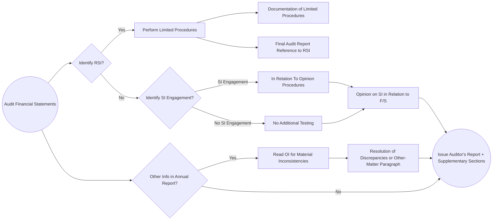

## 13.4 Supplementary and Other Information in Documents Containing Audited F/S

In the context of an audit, financial information typically revolves around a set of general-purpose financial statements prepared according to an applicable financial reporting framework (e.g., GAAP, IFRS, GASB standards). However, many organizations present additional materials—ranging from required supplementary information (RSI) to various forms of other information (OI)—alongside these audited statements. Understanding how these materials fit within the auditor’s scope, and what responsibilities auditors have concerning them, is vital for CPA candidates and practitioners alike. This section provides a thorough exploration of the requirements for dealing with supplementary and other information, as well as recommended protocols for handling them effectively.

--------------------------------------------------------------------------------

### 1. Understanding Required Supplementary Information (RSI)

#### 1.1 Definition and Purpose of RSI
Certain accounting standards boards or regulatory bodies mandate that organizations present specific schedules or data in conjunction with their audited financial statements. This data, known as Required Supplementary Information (RSI), is essential to providing context or additional disclosures relevant to users. Examples include:  
• Pension or other post-employment benefit schedules under Governmental Accounting Standards Board (GASB) statements for governmental entities.  
• Management’s Discussion and Analysis (MD&A) for certain entities (including those reporting under the SEC or GASB frameworks).

RSI is not part of the basic financial statements but is required for a complete presentation under a given set of standards. Because it is outside the basic financial statements, auditors do not provide an opinion on RSI unless specifically engaged or legally required to do so.

#### 1.2 Auditor’s Responsibilities for RSI
Auditors are required to perform limited procedures on RSI; these procedures often involve:  
1. Inquiring of management about methods of preparing the information and assumptions used.  
2. Comparing the RSI to the audited financial statements for consistency.  
3. Considering whether the RSI appears to be measured and presented within applicable guidelines.  

Auditors are not expected to obtain the same level of assurance on RSI as on the primary financial statements. Thus, the audit opinion does not extend to RSI, unless an additional engagement is undertaken.

#### 1.3 Reporting on RSI
Typically, the auditor’s report will reference RSI to clarify that:  
• The RSI is included, but it is not part of the audited financial statements.  
• The auditor performed certain limited procedures but does not express an opinion or provide assurance on RSI.  

However, where an applicable legal or regulatory requirement dictates providing an opinion on RSI, the auditor would extend testing procedures and offer the required assurance. In such instances, the nature of the engagement must be agreed on upfront through an engagement letter or addendum.

--------------------------------------------------------------------------------

### 2. Other Information (OI)

#### 2.1 Nature of Other Information
Beyond RSI, additional material may appear in an annual report or other document containing audited financial statements. Called Other Information (OI), this might include:  
• CEO and management letters.  
• Operational highlights and achievements.  
• Non-GAAP performance metrics.  
• Sustainability or corporate social responsibility statements (if not part of the officially audited sections under a recognized ESG framework).  

Unlike RSI, which is mandated, OI is generally discretionary. The applicable framework does not require these materials, but they may be presented to provide contextual or qualitative insights.

#### 2.2 Auditor’s Responsibilities and Procedures for OI
Under AU-C Section 720, the auditor reads the OI to identify any material inconsistencies or misstatements of fact relative to the audited financial statements. Steps often include:  
1. Reading the document in its entirety.  
2. Comparing figures and statements to the audited financial data.  
3. Investigating any discrepancies or questionable statements.  
4. Consulting with management to resolve potential inaccuracies.

The aim is not to audit the OI but to ensure it does not undermine or contradict the information for which the auditor is providing an opinion. If inconsistent data or misleading statements are not addressed by management, the auditor may add an “Other-Matter” paragraph or, in extreme cases, withdraw from the engagement.

#### 2.3 Common Pitfalls with OI
• Including non-GAAP measures that suggest different results than those in the audited financial statements.  
• Presenting prospective or forward-looking data without clarifying its inherent uncertainties.  
• Omission of disclaimers where partial or unaudited information is present.

--------------------------------------------------------------------------------

### 3. Supplementary Information in Relation to the Financial Statements as a Whole

#### 3.1 Defining Supplementary Information (SI)
Supplementary Information (SI) in this context refers to data or schedules that are not part of the basic financial statements yet accompany them for additional analysis or disclosures. Examples include:  
• Schedules of expenditures of federal awards in a Single Audit.  
• Detailed breakdowns of expenses, revenue, or debt instruments.  
• Additional segment information or condensed statements.

#### 3.2 In Relation To Opinion
When engaged to provide an “in relation to” opinion, the auditor performs sufficient procedures to conclude whether the supplementary information is fairly stated relative to the audited financial statements as a whole. This can occur in a variety of cases:  
• An organization’s lenders require an independent auditor’s acknowledgment that the schedules are consistent with the underlying audited statements.  
• Certain governmental or regulatory oversight bodies mandate it (e.g., federal grant reporting in the U.S.).

These additional procedures might involve:  
1. Reconciling totals in the SI with respective accounts in the audited financial statements.  
2. Testing, on a sample basis, any new transactions or disclosures not otherwise tested in the main audit.  
3. Evaluating presentation and disclosure consistency.

#### 3.3 Reporting on Supplementary Information
If the auditor is specifically engaged to express an opinion on SI, the auditor’s report typically includes a separate section or paragraph addressing management’s responsibility for the SI and the auditor’s procedures. The wording clarifies that the opinion is solely on the SI “in relation to” the basic financial statements and not on the SI in isolation.

--------------------------------------------------------------------------------

### 4. Putting It All Together: Interaction and Workflow

The following Mermaid diagram visually represents a high-level workflow of how auditors deal with RSI, OI, and SI:

Explanation of the diagram:  
• The process begins with the **Audit of the Financial Statements** (Node A).  
• Auditors check whether **RSI** exists (Node B). If yes, they perform **limited procedures** (Node C) and document them (Node E).  
• They also determine if an **in relation to** opinion on **SI** is part of the engagement (Node D).  
• If so, they perform **supplementary testing** (Node F) and express an opinion on SI (Node I).  
• The final auditor’s report references RSI, SI, and includes any notes on OI.  
• Simultaneously, the auditor monitors for **Other Information** (Node K) and addresses any inconsistencies (Nodes L, M).  

--------------------------------------------------------------------------------

### 5. Best Practices and Common Challenges

1. **Early Identification**  
   Assess whether RSI or SI requirements apply at the planning stage. Clarify in the engagement letter how these materials will be handled.

2. **Clear Communication**  
   Discuss with management whether they plan to issue additional schedules or an annual report. Agree on the scope of procedures for any SI “in relation to” opinion and set expectations for the OI review.

3. **Documentation**  
   Meticulously document limited procedures for RSI and how any OI inconsistencies were resolved. For SI engagements, maintain a clear audit trail demonstrating how data in SI ties back to the audited statements.

4. **Managing Changes**  
   Often, these materials are prepared concurrently with the audited statements. Any last-minute changes to the financial statements may ripple through RSI, OI, and SI. An agile process and consistent communication can mitigate risks of mismatch or inconsistency.

5. **Professional Judgment**  
   Judgment is key in deciding when discrepancies in OI are material enough to warrant an emphasis paragraph or other matter. The auditor must weigh actual vs. perceived misstatements.

6. **Regulatory Awareness**  
   Stay informed of updates to AU-C Sections 720 and 730, along with any relevant IRS, SEC, PCAOB, or GASB requirements. Changes in accounting frameworks may alter what is considered RSI or OI.

--------------------------------------------------------------------------------

### 6. References and Further Resources

• **AU-C Section 730:** Addresses the auditor’s responsibilities regarding Required Supplementary Information.  
• **AU-C Section 720:** Covers auditor’s responsibilities for Other Information in documents containing audited financial statements.  
• **Government Accounting Standards Board (GASB)** for public sector entities, with guidelines on pension disclosures and other RSI.  
• **SEC Guidance for MD&A** in publicly traded companies.  
• **Firm Resources** on best practices for disclaimers and disclaiming opinions on RSI, SI.

For deeper reading and authoritative guidance:  
• The AICPA Audit Guide on “Government Auditing Standards and Single Audits” (for RSI such as budgetary comparisons).  
• PCAOB Auditing Standards (AS 2701, AS 2710) for certain SEC filers covering supplementary and other information in filings.  
• GASB Comprehensive Annual Financial Report (CAFR) guidelines for local/state governments.

--------------------------------------------------------------------------------

## Test Your Knowledge of Supplementary and Other Information



### In which category do schedules required by certain accounting standards (e.g., pensions, MD&A) belong?

- [x] Required Supplementary Information (RSI)
- [ ] Other Information (OI)
- [ ] Supplementary Information (SI)
- [ ] Basic Financial Statements

> **Explanation:** Schedules mandated by accounting standards or regulatory bodies, such as pension schedules, are deemed Required Supplementary Information (RSI).  

### What is the auditor’s typical responsibility when dealing with RSI?

- [ ] Providing a full audit opinion on the RSI
- [x] Performing limited procedures and stating that no opinion is expressed unless specifically engaged
- [ ] Ignoring RSI since it is not part of the basic financial statements
- [ ] Issuing an adverse opinion if the RSI is incomplete

> **Explanation:** Under AU-C Section 730, the auditor performs only limited procedures on RSI and ordinarily does not express an opinion unless required to do so or specifically engaged.  

### Which of the following best describes Other Information (OI) in annual reports?

- [ ] It is mandated by the reporting framework
- [x] It is not mandated, but includes voluntary disclosures (e.g., CEO reports, non-GAAP info)
- [ ] It requires audit procedures identical to those of basic financial statements
- [ ] It includes only forward-looking projections

> **Explanation:** Other Information comprises discretionary content added along with the audited statements, such as management letters or voluntary metrics, and requires the auditor to read and identify significant inconsistencies but not to audit it.  

### If the auditor identifies a material misstatement of fact in Other Information and management refuses to correct it, what is the most likely course of action?

- [x] Add an other-matter paragraph or withdraw from the engagement
- [ ] Ignore the inconsistency since it is not part of the audited financials
- [ ] Issue an adverse opinion on the financial statements
- [ ] Amend the financial statements independently

> **Explanation:** AU-C Section 720 allows the auditor to modify the auditor’s report, potentially adding an other-matter paragraph, or in extreme cases, withdrawing from the engagement if management refuses to remedy significant inconsistencies.  

### Which statement regarding an “in relation to” opinion on Supplementary Information is correct?

- [x] It requires additional procedures to verify that the SI is fairly stated relative to the audited financials
- [ ] It is automatically provided with no further testing
- [x] It provides assurance on the SI but only as it ties in to the basic financial statements as a whole
- [ ] It constitutes a separate audit engagement requiring additional engagement letters

> **Explanation:** An “in relation to” opinion on SI involves verifying that the supplementary information is fairly presented in relation to the entire set of audited financial statements. This demands specific testing but remains within the broader scope of the financial statement audit.  

### Which of the following best describes the auditor’s main responsibility for Other Information (OI)?

- [x] Read the information to identify material inconsistencies or misstatements
- [ ] Audit it in accordance with GAAS
- [ ] Confirm its accuracy with third-party confirmations
- [ ] Provide a limited assurance report on OI

> **Explanation:** The auditor's primary responsibility for OI is to read it and determine whether there are any inconsistencies with the audited financial statements, but not to audit it or provide assurance on it.  

### If OI contains non-GAAP metrics that appear to mislead users when compared to the audited financial statements, how should the auditor respond?

- [x] Discuss with management and consider an other-matter paragraph if unresolved
- [ ] Automatically disclaim an opinion on the OI
- [x] Withdraw from the engagement immediately
- [ ] Ignore the discrepancy; OI is unaudited

> **Explanation:** The auditor should discuss the misleading metrics with management. If management does not resolve the issue, the auditor may add an other-matter paragraph to the audit report or, in severe cases, withdraw from the engagement.  

### Limited procedures on RSI typically include which of the following?

- [x] Inquiry of management about assumptions and comparing RSI to audited statements
- [ ] Confirmations from banks and creditors regarding RSI balances
- [ ] Testing internal controls over RSI compilation
- [ ] Providing a standalone opinion on RSI

> **Explanation:** By performing limited procedures, the auditor primarily inquires about the preparation and compares RSI to audited financial data. More rigorous procedures or obtaining a standalone opinion would require an expanded engagement.  

### Which of the following is an example of Supplementary Information (SI)?

- [x] A detailed schedule of expenditures of federal awards in a Single Audit
- [ ] A forward-looking CEO letter describing future goals
- [ ] A mandatory footnote required by GAAP
- [ ] MD&A required by the SEC

> **Explanation:** The schedule of federal award expenditures is often considered SI, especially in a Single Audit. MD&A required by the SEC is generally RSI, while the CEO letter is OI.  

### The auditor’s reference to RSI in the audit report usually states:

- [x] True
- [ ] False

> **Explanation:** The auditor’s report on RSI commonly points out that RSI is not part of the audited financial statements and that limited procedures were performed, providing no opinion unless obligated or specifically engaged to do so.  



--------------------------------------------------------------------------------

## For Additional Practice and Deeper Preparation

**[Auditing & Attestation CPA Mock Exams (AUD): Comprehensive Prep](https://www.udemy.com/course/aud-cpa-mock-exams/?referralCode=D064EF7BD4A84FC6403D)**  
• Tackle full-length mock exams designed to mirror real AUD questions—from risk assessment and ethics to internal control and substantive procedures.  
• Refine your exam-day strategies with detailed, step-by-step solutions for every scenario.  
• Explore in-depth rationales that reinforce understanding of higher-level concepts, giving you a decisive edge on test day.  
• Boost confidence and reduce exam anxiety by building mastery of the wide-ranging AUD blueprint.

_Disclaimer: This course is not endorsed by or affiliated with the AICPA, NASBA, or any official CPA Examination authority. All content is created solely for educational and preparatory purposes._
