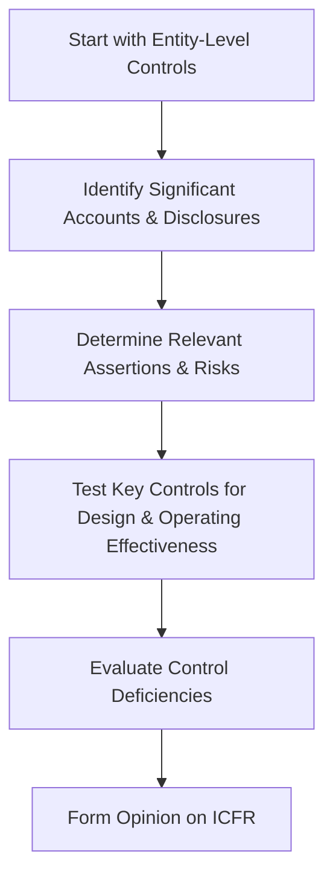

## 14.1 PCAOB Requirements for Issuers (Public Companies)

Public companies—also referred to as issuers—operate under a robust auditing and reporting framework mandated by the Sarbanes-Oxley Act of 2002 (SOX) and overseen by the Public Company Accounting Oversight Board (PCAOB). One of the most critical mandates is the reporting on Internal Control Over Financial Reporting (ICFR). In this section, we will explore the essential components of PCAOB requirements, focusing on integrated audits of both financial statements and ICFR. We will discuss key aspects of SOX Section 404, PCAOB Auditing Standard AS 2201, and how the external auditor’s reporting obligations apply in practice.

--------------------------------------------------------------------------------

### 1. Overview of Sarbanes-Oxley Section 404

Passed in response to corporate scandals in the early 2000s, the Sarbanes-Oxley Act aims to restore public trust by enhancing the transparency and accountability of public companies. Section 404 of SOX imposes specific obligations on both management and external auditors regarding ICFR:

1. Management’s Responsibility:  
   • Management must assess, at least annually, the effectiveness of the company’s ICFR.  
   • This assessment includes the design and operating effectiveness of internal controls intended to prevent or detect material misstatements in the financial statements.  
   • This evaluation must be documented, and management must provide a written assertion about their findings in the annual report.

2. Auditor’s Responsibility:  
   • Public company auditors must express an opinion on whether management’s assessment of ICFR is fairly stated.  
   • Auditors also opine on whether the issuer’s ICFR is operating effectively to deliver reliable financial statements.  

From the users’ perspective—investors, regulators, and other stakeholders—this requirement bolsters confidence in both financial reporting and the quality of the corporate governance framework.

--------------------------------------------------------------------------------

### 2. PCAOB Auditing Standard AS 2201: Integrated Audits

PCAOB Auditing Standard (AS) 2201, “An Audit of Internal Control Over Financial Reporting That Is Integrated with An Audit of Financial Statements,” governs how auditors carry out integrated audits for public companies. In an integrated audit, the financial statement audit and the ICFR audit are performed concurrently, leveraging insights from each to form two distinct opinions:

1. Opinion on the Financial Statements:  
   • Ensures that the financial statements are presented fairly, in all material respects, according to the applicable financial reporting framework (e.g., U.S. GAAP).

2. Opinion on ICFR Effectiveness:  
   • Evaluates whether the internal control structure is effective in preventing or detecting material misstatements, based on criteria established in frameworks such as COSO (Committee of Sponsoring Organizations of the Treadway Commission).

#### 2.1 The Top-Down Approach

AS 2201 prescribes a top-down approach for evaluating ICFR. This approach begins at the entity level and then drills down to specific processes, accounts, and disclosures:

• Identify Entity-Level Controls: Controls that have a “pervasive” effect on the company’s ability to produce reliable financial statements. For example, the effectiveness of the Board of Directors or the audit committee’s oversight, corporate codes of conduct, and the integrity of management.  

• Select Significant Accounts and Disclosures: Based on factors such as materiality, susceptibility to misstatement, and volume of transactions.  

• Evaluate and Test Key Controls: Determine where the greatest risk of material misstatement exists. Key controls around areas with a higher likelihood of error or fraud are prioritized for testing.  

• Assess Control Design and Operating Effectiveness: Document whether controls are properly designed and determine if they operate effectively to prevent or detect errors or fraud in financial reporting.

The following diagram illustrates the top-down approach:

By starting at the top (entity-wide controls and governance) and moving to the bottom (account-specific controls), auditors can efficiently narrow their focus to controls that matter the most.

--------------------------------------------------------------------------------

### 3. Reporting on ICFR in an Integrated Audit

At the completion of fieldwork, the external auditor is required to issue two distinct opinions:

1. Opinion on the Financial Statements (the “Financial Opinion”)  
2. Opinion on ICFR (the “ICFR Opinion”)  

#### 3.1 Single Report vs. Separate Reports

The PCAOB standards allow the auditor to present both opinions in a combined report or in separate reports. Regardless of the format, the opinions themselves must be clearly identifiable. A common approach is to present the opinion on the financial statements in the first section, followed by a section detailing the auditor’s opinion on ICFR.

#### 3.2 Material Weakness and Its Impact on the Auditor’s Report

A material weakness once found in ICFR requires the auditor to issue an adverse opinion on ICFR—even if no material misstatements have been identified in the financial statements. However, the financial statements themselves may still receive an unqualified (“clean”) opinion. Since a material weakness indicates a reasonable possibility that a material misstatement could occur, it is critical information for users who rely on the reliability of the company’s financial reporting process.

#### 3.3 Additional Considerations

• Communication of Deficiencies:  
  – A significant deficiency is one that is not severe enough to be classified as a material weakness, but still important to bring to the attention of management and those charged with governance.  
  – Material weaknesses must be disclosed publicly in management’s “Assessment of ICFR” and addressed in the external auditor’s report.  

• Timing:  
  – The auditor’s ICFR reporting must be included with the company’s annual financial statements, typically in the Form 10-K filing.  

--------------------------------------------------------------------------------

### 4. Practical Examples and Case Studies

1. **Case of a Material Weakness in Revenue Recognition**  
   Suppose a large technology firm fails to properly implement controls over revenue recognition for complex customer contracts. When the external auditor performs walkthroughs of the accounting process, they discover incomplete documentation and instances where contract terms are improperly classified. This deficiency could lead to a material misstatement in revenue, which is typically a highly significant account.  
   
   • Management’s Assessment: The firm’s management concluded that the deficiency did not rise to a material weakness.  
   • Auditor’s Assessment: During testing, the external auditor noted repeated failures to capture relevant contract terms correctly, classifying the deficiency as a material weakness.  
   • Outcome: The auditor issues an adverse opinion on ICFR, signaling that controls are ineffective, while the financial statements might still receive an unqualified opinion if no material misstatement ultimately occurred.

2. **Case of an Effective Remediation Effort**  
   A manufacturing enterprise identified a significant deficiency in its inventory control processes. Inventory counts frequently did not reconcile with general ledger balances because management lacked an effective oversight function. The company responded by hiring additional accounting staff, improving supervision, and implementing periodic surprise inventory checks.  
   
   • Management’s Assessment: By year-end, management documented the redesigned control procedures and tested their effectiveness.  
   • Auditor’s Assessment: The external auditor confirmed that the new control measures performed reliably to prevent miscounting.  
   • Outcome: Management’s improved procedures resulted in the successful remediation of the significant deficiency, leading to a clean (unqualified) opinion on both the financial statements and ICFR.

--------------------------------------------------------------------------------

### 5. Glossary of Key Terms

• **Integrated Audit**: An audit that combines the financial statement audit with the auditor’s evaluation and testing of ICFR.  

• **Material Weakness**: A deficiency, or combination of deficiencies, in internal controls such that there is a reasonable possibility that a material misstatement would not be prevented or detected on a timely basis.  

• **Significant Deficiency**: A control deficiency that is less severe than a material weakness, yet warrants the attention of those responsible for oversight of the entity’s financial reporting.

--------------------------------------------------------------------------------

### 6. References and Resources

#### 6.1 Official References

• **PCAOB AS 2201**: “An Audit of Internal Control Over Financial Reporting That Is Integrated with An Audit of Financial Statements” (pcaobus.org).  
• **Sarbanes-Oxley Act of 2002, Sections 302 and 404**. Read the full legislative text for a deeper understanding of management and auditor requirements.

#### 6.2 Additional Resources

• **SEC Guidance**: Interpretive guidance for management’s assessment of internal control (Release Nos. 33-8810, 34-55929). This document provides a framework to help management perform an effective evaluation of ICFR.  
• **Journal of Accountancy**: Articles on “Implementing AS 2201” offer practical insights and real-life examples.  

--------------------------------------------------------------------------------

## SEO-Optimized PCAOB Internal Control Quiz: Test Your Knowledge of Issuer Requirements



### Which section of the Sarbanes-Oxley Act mandates an annual management assessment of ICFR effectiveness?

- [ ] Section 302
- [x] Section 404
- [ ] Section 401
- [ ] Section 409

> **Explanation:** Section 404 of the Sarbanes-Oxley Act requires management to assess the effectiveness of internal control over financial reporting and includes a corresponding obligation for the external auditor.

### Which PCAOB Auditing Standard governs integrated audits for issuers?

- [ ] AS 2101
- [ ] AS 2110
- [ ] AS 2301
- [x] AS 2201

> **Explanation:** PCAOB Auditing Standard AS 2201 provides guidance on performing an integrated audit of the financial statements and ICFR.

### In an integrated audit, the external auditor issues how many distinct opinions?

- [x] Two (one on the financial statements and one on ICFR)
- [ ] One (combined opinion)
- [ ] Three (on financial statements, internal audits, and ICFR)
- [ ] None of the above

> **Explanation:** Under PCAOB requirements, the auditor must provide an opinion on the financial statements and a separate opinion on the effectiveness of ICFR.

### What does a “top-down approach” in AS 2201 refer to?

- [ ] Testing peripheral controls first
- [ ] Focusing solely on transaction-level controls
- [x] Starting from entity-level controls and moving to significant accounts
- [ ] Analyzing audit fields from lowest significance to highest

> **Explanation:** The top-down approach begins with an evaluation of entity-level controls, then identifies significant accounts and disclosures, relevant assertions, and key controls to be tested.

### If the auditor identifies a material weakness in ICFR, what type of opinion is required for ICFR?

- [x] Adverse
- [ ] Unqualified
- [ ] Disclaimer of opinion
- [ ] Qualified

> **Explanation:** A material weakness in ICFR requires an adverse opinion on ICFR. The financial statement opinion can still be unqualified if no material misstatement is identified there.

### Which entity is primarily responsible for remediating identified control deficiencies?

- [x] Management of the issuer
- [ ] The external auditors
- [ ] The PCAOB
- [ ] The internal audit function alone

> **Explanation:** Management has ultimate responsibility for designing, implementing, and remediating internal controls.

### A significant deficiency is:

- [ ] As severe as a material weakness
- [ ] Legally required to be disclosed to the public
- [x] Less severe than a material weakness yet must be reported to those in governance
- [ ] A deficiency that is insignificant

> **Explanation:** A significant deficiency is important enough to be brought to the attention of those responsible for oversight, but it is not as severe as a material weakness and does not require an adverse opinion.

### Which of the following best describes "integrated audit"?

- [ ] A separate audit of financial statements and one for operations
- [x] A concurrent audit of both the financial statements and ICFR
- [ ] A consulting engagement on operational efficiencies
- [ ] Testing only entity-level controls

> **Explanation:** In an integrated audit, the external auditor performs procedures that simultaneously satisfy the objectives of both the financial statement audit and the evaluation of ICFR effectiveness.

### What is the main focus of the auditor when using the top-down approach?

- [x] Identifying the highest risk accounts and key controls at the entity and account levels
- [ ] Checking the severity of minor control issues
- [ ] Avoiding any process reviews
- [ ] Relying only on management’s representations

> **Explanation:** The top-down approach narrows testing to areas that present the greatest risk of material misstatement, starting from entity-level controls and moving to specific accounts.

### True or False: Discovery of a material weakness in ICFR automatically means the financial statement opinion is also adverse.

- [ ] True
- [x] False

> **Explanation:** A material weakness in ICFR requires an adverse opinion on internal controls, but the financial statements may still receive an unqualified opinion if no material misstatement is identified.



--------------------------------------------------------------------------------

## For Additional Practice and Deeper Preparation

**[Auditing & Attestation CPA Mock Exams (AUD): Comprehensive Prep](https://www.udemy.com/course/aud-cpa-mock-exams/?referralCode=D064EF7BD4A84FC6403D)**  
• Tackle full-length mock exams designed to mirror real AUD questions—from risk assessment and ethics to internal control and substantive procedures.  
• Refine your exam-day strategies with detailed, step-by-step solutions for every scenario.  
• Explore in-depth rationales that reinforce understanding of higher-level concepts, giving you a decisive edge on test day.  
• Boost confidence and reduce exam anxiety by building mastery of the wide-ranging AUD blueprint.

_Disclaimer: This course is not endorsed by or affiliated with the AICPA, NASBA, or any official CPA Examination authority. All content is created solely for educational and preparatory purposes._
